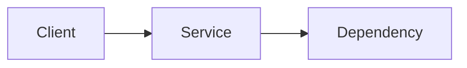
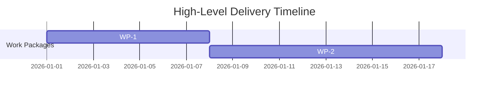

# ADR-YYYYMMDD-slug: Decision Title

## Metadata
- Status: draft
- Date: YYYY-MM-DD
- Owners:
- Related spec path:
- ADR product context sign-off: pending
- ADR technical decision sign-off: pending

---

## Product Context Layer
<!-- This section is authored by the Product Owner. -->

### Business Objective and Requirement Summary
- Business objective:
- Functional requirements summary:
- Non-functional requirements summary:
- Desired timeline:

### Decision Drivers
- Driver 1:
- Driver 2:

---

## Technical Decision Layer
<!-- Agent draft — pending architect review -->
> **Agent draft**: the sections below were generated by the coding assistant from
> codebase analysis. The recommended option and consequences are proposals only.
> This notice is removed when the architect gives `ADR technical decision sign-off`.

### Options Considered
- Option A:
- Option B:

### Recommended Option
- Selected option:
- Rationale:

### Rejected Options
- Rejected option 1:
- Rejection rationale:

### Affected Capabilities and Components
- Capability impact:
- Component impact:

### Architecture Diagrams
<!-- Agent: select the Mermaid diagram type(s) that best illuminate the work item.
     Diagram type selection heuristics:
       Sequence diagram  → HTTP request flows across services or components
       ER diagram        → data models and entity relationships
       User Journey      → user-facing business flows and step sequences
       Flowchart         → data flows, decision branches, script control flow
       State diagram     → lifecycle state machines (orders, sessions, jobs)
       C4 / class        → component or module structure
     Use multiple diagrams when the work item spans multiple concerns.
     Add a one-sentence caption per diagram: what it shows and why this type was chosen.
     If no diagram adds clarity for this work item, replace the block below with:
       "No diagram required — [one-line rationale]."
-->

**[Caption: what this diagram shows and why this diagram type was chosen]**

### High-Level Work Packages and Timeline (Mermaid Gantt)

### External Dependencies
- Dependency 1:
- Dependency 2:

### Risks and Mitigations
- Risk 1:
- Mitigation 1:

### Validation and Observability Expectations
- Validation requirements:
- Logging/metrics/tracing requirements:
