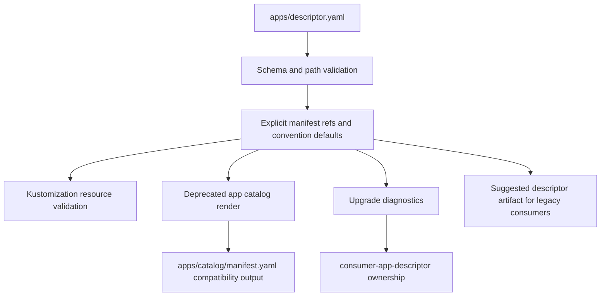

# ADR: Consumer App Descriptor for Generated Repositories

- **Date**: 2026-04-27
- **Status**: proposed
- **Work item**: 2026-04-27-consumer-app-descriptor
- **Source**: parked proposal under `v1.7.0 upgrade findings (pipeline correctness gaps)`

## Context

Issues #206, #207, #208, and #203/#204 removed the immediate failure modes found during the v1.7.0 consumer upgrade:

- hardcoded seed workload names were removed from the required contract path list;
- `base/apps/` prune behavior was guarded;
- workload assertions derive from kustomization resources;
- kustomization-referenced overlay files are protected from destructive prune.

Those fixes prevent known upgrade damage, but blueprint tooling still lacks one authoritative consumer-owned app metadata source. App names, team ownership, ports, health checks, app catalog records, GitOps manifests, and upgrade diagnostics are spread across generated files.

## Decision

Add `apps/descriptor.yaml` as a consumer-seeded file. New consumers receive a baseline descriptor during `blueprint-init-repo`; generated consumers own the file after init.

The descriptor records app and component metadata, including owner team, workload kind, service ports, health checks, and explicit manifest refs. Blueprint tooling provides convention defaults when manifest refs are absent:

- `infra/gitops/platform/base/apps/{component-id}-deployment.yaml`
- `infra/gitops/platform/base/apps/{component-id}-service.yaml`

Validation checks the descriptor schema, path safety, manifest presence, and `infra/gitops/platform/base/apps/kustomization.yaml` resource membership. App catalog bootstrap uses the descriptor to render `deliveryTopology.workloads` and `runtimeDeliveryContract.gitopsWorkloads` only as a deprecated generated compatibility artifact for two blueprint minor releases. Upgrade diagnostics report matching paths as `consumer-app-descriptor`.

Existing generated consumers that do not yet have `apps/descriptor.yaml` receive warning-only diagnostics during the migration window. Upgrade tooling writes `artifacts/blueprint/app_descriptor.suggested.yaml` as a human-readable and agent-editable starting point, but does not automatically write the descriptor into the consumer working tree.

Caption: `apps/descriptor.yaml` is the consumer-owned declaration; blueprint-managed compatibility outputs and diagnostics derive from it.

## Alternatives Considered

**Option A - `apps/descriptor.yaml` descriptor.** Selected. It keeps consumer declarations under the app-owned tree, separates source input from generated catalog output, and gives upgrade tooling one stable input.

**Option B - Extend `apps/catalog/manifest.yaml` as the editable descriptor.** Rejected for this work item. The catalog manifest is generated by `apps-bootstrap` and also contains version/runtime output, so using it as the source input creates edit/render conflicts.

**Option C - Remove `apps/catalog/manifest.yaml` immediately.** Rejected for this work item. The file is referenced by smoke, version audit, docs, and generated-consumer expectations. Immediate removal creates broad migration risk.

**Option D - Keep kustomization as the only app source.** Rejected. Kustomization gives manifest filenames but does not carry team, service port, health check, or ownership metadata.

## Consequences

- Positive: generated consumers get one app metadata file to maintain under the app-owned tree.
- Positive: blueprint validation can produce app-aware diagnostics instead of path-only messages.
- Positive: app catalog rendering and GitOps validation use the same app list.
- Positive: explicit manifest refs avoid reintroducing hardcoded naming constraints.
- Risk: existing consumers lack `apps/descriptor.yaml` until adoption; implementation keeps a two-minor-release warning fallback.
- Risk: `apps/catalog/manifest.yaml` remains temporarily duplicated as compatibility output.

## Follow-Ups

- Remove deprecated `apps/catalog/manifest.yaml` compatibility output after two blueprint minor releases.
- Remove deprecated `_is_consumer_owned_workload()` bridge after two blueprint minor releases or once descriptor coverage becomes mandatory, whichever is later.
