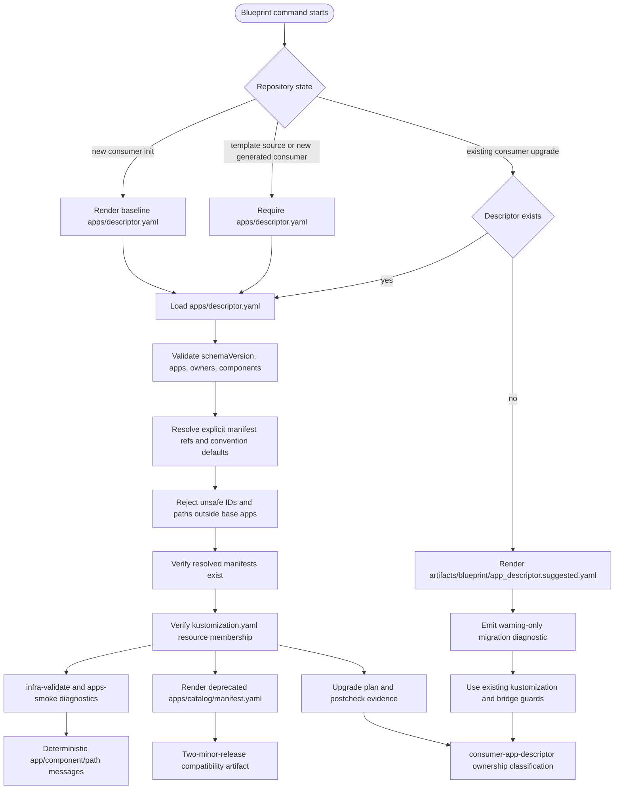

# ADR: Consumer App Descriptor for Generated Repositories

- **Date**: 2026-04-27
- **Status**: proposed
- **Work item**: 2026-04-27-consumer-app-descriptor
- **Source**: parked proposal under `v1.7.0 upgrade findings (pipeline correctness gaps)`

## Context

Issues #206, #207, #208, and #203/#204 removed the immediate failure modes found during the v1.7.0 consumer upgrade:

- hardcoded seed workload names were removed from the required contract path list;
- `base/apps/` prune behavior was guarded;
- workload assertions derive from kustomization resources;
- kustomization-referenced overlay files are protected from destructive prune.

Those fixes prevent known upgrade damage, but blueprint tooling still lacks one authoritative consumer-owned app metadata source. App names, team ownership, ports, health checks, app catalog records, GitOps manifests, and upgrade diagnostics are spread across generated files.

## Decision

Add `apps/descriptor.yaml` as a consumer-seeded file. New consumers receive a baseline descriptor during `blueprint-init-repo`; generated consumers own the file after init.

The descriptor records app and component metadata, including owner team, workload kind, service ports, health checks, and explicit manifest refs. It is intentionally not a Kubernetes manifest abstraction. Kubernetes remains in the GitOps manifests; the descriptor records the metadata blueprint tooling needs to validate, render compatibility outputs, and explain upgrade behavior.

The initial descriptor shape is:

```yaml
schemaVersion: blueprint.stackit.dev/v1
apps:
  - id: backend-api
    owner:
      team: platform
    components:
      - id: backend-api
        kind: api
        manifests:
          deployment: infra/gitops/platform/base/apps/backend-api-deployment.yaml
          service: infra/gitops/platform/base/apps/backend-api-service.yaml
        service:
          port: 8080
        health:
          path: /health
  - id: touchpoints-web
    owner:
      team: platform
    components:
      - id: touchpoints-web
        kind: web
        manifests:
          deployment: infra/gitops/platform/base/apps/touchpoints-web-deployment.yaml
          service: infra/gitops/platform/base/apps/touchpoints-web-service.yaml
        service:
          port: 3000
        health:
          path: /
```

Each app can contain multiple components, such as `api`, `worker`, and `web`. Component IDs are the ownership and validation unit because manifests, ports, workload kinds, and health checks vary per deployable component.

Blueprint tooling resolves component manifests in this order:

1. Use explicit `components[].manifests.*` paths when present.
2. Fill absent deployment and service refs from convention defaults:
   - `infra/gitops/platform/base/apps/{component-id}-deployment.yaml`
   - `infra/gitops/platform/base/apps/{component-id}-service.yaml`
3. Reject absolute paths, parent traversal, shell metacharacters, and paths outside `infra/gitops/platform/base/apps/`.
4. Verify each resolved manifest exists and each manifest filename is listed in `infra/gitops/platform/base/apps/kustomization.yaml`.

Descriptor data feeds four blueprint-owned consumers:

- contract validation reports schema, path, existence, and kustomization membership failures;
- app catalog bootstrap renders deprecated `apps/catalog/manifest.yaml` compatibility output;
- upgrade planning and postcheck classify matching manifests as `consumer-app-descriptor`;
- missing-descriptor migration writes `artifacts/blueprint/app_descriptor.suggested.yaml` for human and agent review.

`apps/catalog/manifest.yaml` stays generated. It remains a compatibility artifact for two blueprint minor releases so existing app catalog smoke, audit, and documentation flows can migrate without turning the generated catalog into the editable source. `_is_consumer_owned_workload()` remains a deprecated bridge guard for the same migration period, or until descriptor coverage becomes mandatory, whichever is later.

### Descriptor Flow



Caption: `apps/descriptor.yaml` is the canonical consumer-owned app metadata source; blueprint-managed validators, compatibility outputs, and upgrade diagnostics derive from the resolved descriptor graph.

### Command Behavior

| Command or path | Descriptor behavior |
|---|---|
| `make blueprint-init-repo` | Seeds `apps/descriptor.yaml` for new generated consumers. |
| `make infra-validate` | Hard-fails invalid descriptors in template-source and new generated-consumer paths. |
| `make apps-bootstrap` | Renders deprecated `apps/catalog/manifest.yaml` from descriptor records. |
| `make apps-smoke` | Uses descriptor-derived app/runtime delivery metadata for smoke assertions. |
| `make blueprint-upgrade-consumer` | Warns existing consumers when the descriptor is absent and writes a suggested descriptor artifact. |
| `make blueprint-upgrade-consumer-postcheck` | Reports descriptor-owned manifests as `consumer-app-descriptor` and keeps fallback guards during migration. |

### Failure Modes

- Invalid schema: fail with app and component context.
- Unsafe ID or path: fail before filesystem access escapes the allowed app manifest tree.
- Missing manifest: fail with the resolved path and descriptor component ID.
- Missing kustomization resource: fail with the manifest filename and expected `kustomization.yaml` path.
- Missing descriptor in existing consumer migration: warn and generate `artifacts/blueprint/app_descriptor.suggested.yaml`; do not write `apps/descriptor.yaml` automatically.
- Missing descriptor in template-source or new generated-consumer paths: fail so the new contract cannot drift at source.

## Alternatives Considered

**Option A - `apps/descriptor.yaml` descriptor.** Selected. It keeps consumer declarations under the app-owned tree, separates source input from generated catalog output, and gives upgrade tooling one stable input.

**Option B - Extend `apps/catalog/manifest.yaml` as the editable descriptor.** Rejected for this work item. The catalog manifest is generated by `apps-bootstrap` and also contains version/runtime output, so using it as the source input creates edit/render conflicts.

**Option C - Remove `apps/catalog/manifest.yaml` immediately.** Rejected for this work item. The file is referenced by smoke, version audit, docs, and generated-consumer expectations. Immediate removal creates broad migration risk.

**Option D - Keep kustomization as the only app source.** Rejected. Kustomization gives manifest filenames but does not carry team, service port, health check, or ownership metadata.

## Consequences

- Positive: generated consumers get one app metadata file to maintain under the app-owned tree.
- Positive: blueprint validation can produce app-aware diagnostics instead of path-only messages.
- Positive: app catalog rendering and GitOps validation use the same app list.
- Positive: explicit manifest refs avoid reintroducing hardcoded naming constraints.
- Risk: existing consumers lack `apps/descriptor.yaml` until adoption; implementation keeps a two-minor-release warning fallback.
- Risk: `apps/catalog/manifest.yaml` remains temporarily duplicated as compatibility output.

## Follow-Ups

- Remove deprecated `apps/catalog/manifest.yaml` compatibility output after two blueprint minor releases.
- Remove deprecated `_is_consumer_owned_workload()` bridge after two blueprint minor releases or once descriptor coverage becomes mandatory, whichever is later.
