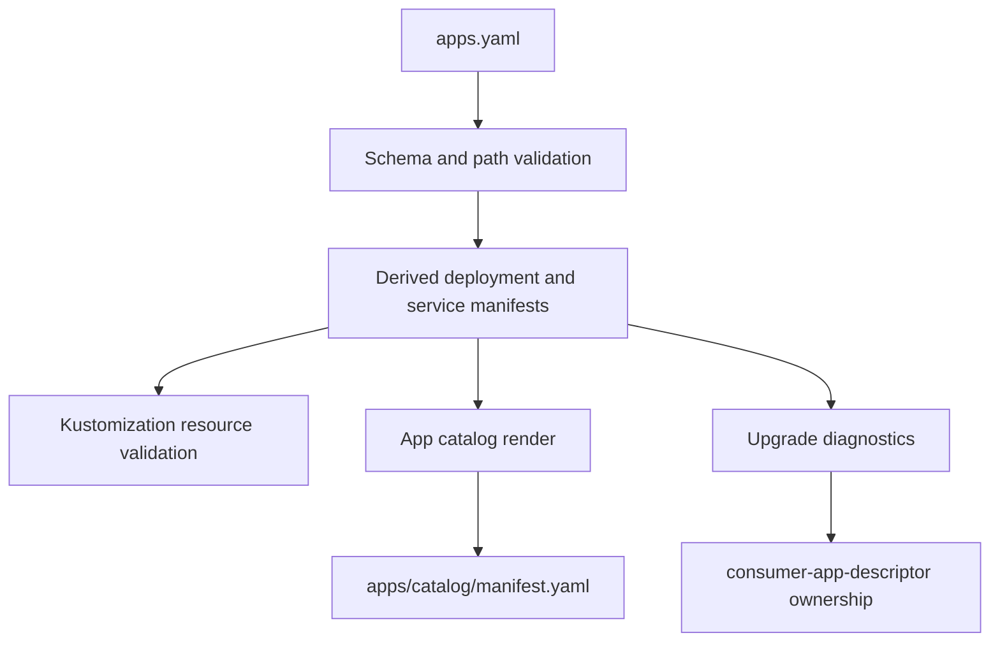

# ADR: Consumer App Descriptor for Generated Repositories

- **Date**: 2026-04-27
- **Status**: proposed
- **Work item**: 2026-04-27-consumer-app-descriptor
- **Source**: parked proposal under `v1.7.0 upgrade findings (pipeline correctness gaps)`

## Context

Issues #206, #207, #208, and #203/#204 removed the immediate failure modes found during the v1.7.0 consumer upgrade:

- hardcoded seed workload names were removed from the required contract path list;
- `base/apps/` prune behavior was guarded;
- workload assertions derive from kustomization resources;
- kustomization-referenced overlay files are protected from destructive prune.

Those fixes prevent known upgrade damage, but blueprint tooling still lacks one authoritative consumer-owned app metadata source. App names, team ownership, ports, health checks, app catalog records, GitOps manifests, and upgrade diagnostics are spread across generated files.

## Decision

Add a root-level `apps.yaml` descriptor as a consumer-seeded file. New consumers receive a baseline descriptor during `blueprint-init-repo`; generated consumers own the file after init.

The descriptor records app metadata. Blueprint tooling derives convention-based GitOps manifest paths from each app name:

- `infra/gitops/platform/base/apps/{name}-deployment.yaml`
- `infra/gitops/platform/base/apps/{name}-service.yaml`

Validation checks the descriptor schema, path safety, manifest presence, and `infra/gitops/platform/base/apps/kustomization.yaml` resource membership. App catalog bootstrap uses the descriptor to render `deliveryTopology.workloads` and `runtimeDeliveryContract.gitopsWorkloads`. Upgrade diagnostics report matching paths as `consumer-app-descriptor`.

Caption: `apps.yaml` is the consumer-owned declaration; blueprint-managed outputs and diagnostics derive from it.

## Alternatives Considered

**Option A - Root-level `apps.yaml` descriptor.** Selected. It keeps consumer declarations separate from generated catalog output and gives upgrade tooling one stable input.

**Option B - Extend `apps/catalog/manifest.yaml` as the editable descriptor.** Rejected for this work item. The catalog manifest is generated by `apps-bootstrap` and also contains version/runtime output, so using it as the source input creates edit/render conflicts.

**Option C - Keep kustomization as the only app source.** Rejected. Kustomization gives manifest filenames but does not carry team, service port, health check, or ownership metadata.

## Consequences

- Positive: generated consumers get one app metadata file to maintain.
- Positive: blueprint validation can produce app-aware diagnostics instead of path-only messages.
- Positive: app catalog rendering and GitOps validation use the same app list.
- Risk: first version supports only `{name}-deployment.yaml` and `{name}-service.yaml` manifest names.
- Risk: existing consumers lack `apps.yaml` until adoption; implementation keeps a one-cycle warning fallback.

## Follow-Ups

- Add custom manifest filename fields after convention-based descriptor adoption is validated.
- Revisit the `_is_consumer_owned_workload()` bridge after descriptor-driven validation is active in generated consumers.
