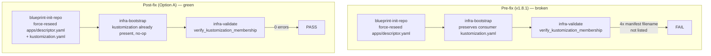

# ADR: Issue #230 — Restore descriptor↔kustomization lockstep across `blueprint-init-repo` force-reseed

- **Status**: approved
- **ADR technical decision sign-off**: approved
- **Date**: 2026-04-28
- **Issues**: #230 (follow-up to #217 / PR #228)
- **Work item**: `specs/2026-04-28-issue-230-init-descriptor-kustomization-sync/`

## Context

PR #228 (issue #217) added a descriptor↔kustomization cross-check assertion to
`scripts/lib/blueprint/template_smoke_assertions.py` and tightened
`validate_app_descriptor` → `verify_kustomization_membership`
(`scripts/lib/blueprint/app_descriptor.py:292`). Both pieces correctly detect
when descriptor manifest filenames are not listed in
`infra/gitops/platform/base/apps/kustomization.yaml`.

However, the underlying init-seeding mismatch reported in issue #217 was not
fixed in PR #228. As a result, in v1.8.1:

1. `blueprint-init-repo` (with `BLUEPRINT_INIT_FORCE=true`) force-reseeds
   `apps/descriptor.yaml` from
   `scripts/templates/consumer/init/apps/descriptor.yaml.tmpl` (which
   references `backend-api`/`touchpoints-web` manifests). This is wired through
   `scripts/lib/blueprint/init_repo_contract.py:seed_consumer_owned_files` and
   driven by the `consumer_seeded` list in `blueprint/contract.yaml`.
2. `make infra-bootstrap` then runs and seeds
   `infra/gitops/platform/base/apps/kustomization.yaml` via
   `ensure_file_from_template`, which has create-if-missing semantics
   (`scripts/lib/blueprint/bootstrap_templates.sh:52` →
   `scripts/lib/shell/bootstrap.sh:34`). A consumer's existing kustomization
   (e.g. listing `marketplace-*`/`backoffice-*` manifests) is therefore
   preserved.
3. `make infra-validate` then fails with 4 `manifest filename not listed`
   errors because the force-reseeded descriptor and the preserved
   kustomization disagree.

Effect: every consumer upgrading from v1.8.0 to v1.8.1 hits the failure;
`make blueprint-template-smoke` (which executes the same
init → bootstrap → validate sequence in a temp repo) is broken; CI lane
`quality-ci-generated-consumer-smoke` fails; `blueprint-upgrade-consumer-postcheck`
and `blueprint-upgrade-fresh-env-gate` are blocked. There is no consumer-side
workaround.

The validator and smoke assertion are correct — they are what surfaces the
defect. The fix MUST live upstream in the seed pairing logic so that the
post-init on-disk state satisfies the cross-check by construction.

## Decision

APPROVED — Architecture sign-off recorded on PR #231 (2026-04-28).

**Option A — extend `blueprint-init-repo` to force-reseed
`infra/gitops/platform/base/apps/kustomization.yaml` in lockstep with
`apps/descriptor.yaml`.**

Concretely:

1. Add `infra/gitops/platform/base/apps/kustomization.yaml` to the
   `consumer_seeded` list in `blueprint/contract.yaml` (or to a dedicated
   `init_force_paired` list if the team prefers explicit semantics for the
   pairing). This is a contract change, not a behaviour-only change, so the
   force-init blast radius remains contract-declared and drift-checked by
   `infra-validate`.
2. Add a consumer-init template at
   `scripts/templates/consumer/init/infra/gitops/platform/base/apps/kustomization.yaml.tmpl`
   that mirrors the bootstrap template at
   `scripts/templates/infra/bootstrap/infra/gitops/platform/base/apps/kustomization.yaml`.
   PR #228's `template_smoke_assertions.py` cross-check already enforces that
   the consumer-init descriptor template and the bootstrap kustomization
   template stay in sync; this ADR extends that invariant to also include the
   new consumer-init kustomization template.
3. `seed_consumer_owned_files`
   (`scripts/lib/blueprint/init_repo_contract.py:133`) then naturally reseeds
   the kustomization on force, in lockstep with the descriptor, with no new
   helper layer.

Alternatives considered (full analysis in the work-item `spec.md`
§ Normative Option Decision):

| Option | Description | Verdict |
|---|---|---|
| A | Init force-resets kustomization in lockstep with descriptor | **Recommended** — most direct; preserves the demo-app baseline that source-mode smoke relies on; contract surface is explicit |
| B | Empty descriptor template (`apps: []`); validator short-circuits | Defer — long-term-cleaner but requires onboarding-doc rewrite and source-mode smoke updates; better as a v1.9 proposal |
| C | `infra-bootstrap` reseeds kustomization conditional on init flag | Reject — couples bootstrap behaviour to init flags, violating the existing `infra-bootstrap` create-if-missing contract |

## Consequences

- The consumer-seeded scope grows by one file
  (`infra/gitops/platform/base/apps/kustomization.yaml`). Force-init now
  overwrites that file as part of the demo-app baseline reseed; the release
  notes MUST call this out explicitly.
- The descriptor↔kustomization invariant is closed at the seed-pair level,
  not just at the validator level. Future template edits MUST keep all three
  files (consumer-init descriptor template, consumer-init kustomization
  template, bootstrap kustomization template) filename-consistent. A new unit
  test (AC-004) asserts this invariant against `blueprint/contract.yaml`.
- Consumers MUST take no action beyond running the standard
  `make blueprint-upgrade-consumer && make blueprint-upgrade-consumer-postcheck`
  upgrade sequence (NFR-OPS-001).
- Rollback is a single-commit revert of the contract + init code change; the
  validator and smoke assertion stay intact and the failure mode reverts to
  the pre-fix v1.8.1 baseline (postcheck fails with 4 membership errors).

## Diagrams

### Init → bootstrap → validate sequence (pre-fix vs. post-fix)

Caption: under Option A, `blueprint-init-repo` reseeds both the descriptor
and the kustomization in the same step, so `infra-bootstrap`'s
create-if-missing semantics for the kustomization become a no-op and the
downstream `verify_kustomization_membership` cross-check passes by
construction.

## References

- Issue: https://github.com/sbonoc/stackit-platform-blueprint/issues/230
- Prior ADR: `docs/blueprint/architecture/decisions/ADR-2026-04-27-issue-217-template-descriptor-kustomization-sync.md`
- Prior PR: https://github.com/sbonoc/stackit-platform-blueprint/pull/228
- Init seeding code: `scripts/lib/blueprint/init_repo_contract.py:seed_consumer_owned_files`
- Bootstrap create-if-missing: `scripts/lib/blueprint/bootstrap_templates.sh:ensure_file_from_template`, `scripts/lib/shell/bootstrap.sh:ensure_file_with_content`
- Validator: `scripts/lib/blueprint/app_descriptor.py:verify_kustomization_membership`
- Cross-check assertion: `scripts/lib/blueprint/template_smoke_assertions.py:_assert_descriptor_kustomization_agreement`
