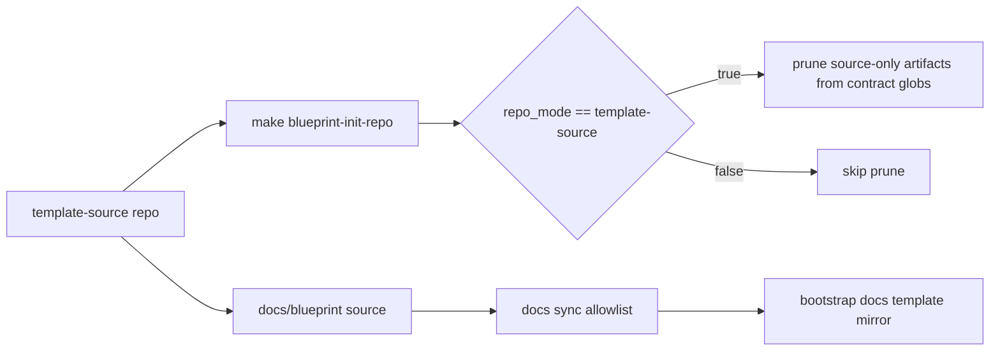
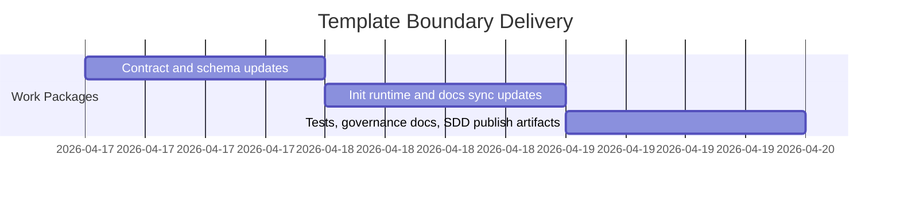

# ADR-20260417-blueprint-consumer-template-boundaries: Keep blueprint-maintainer SDD history out of generated-consumer templates

## Metadata
- Status: approved
- Date: 2026-04-17
- Owners: sbonoc
- Related spec path: specs/2026-04-17-blueprint-consumer-template-boundaries/

## Business Objective and Requirement Summary
- Business objective: generated-consumer repositories must receive only consumer-relevant scaffolding while blueprint-maintainer SDD history remains in the blueprint source repository.
- Functional requirements summary:
  - define contract-driven source-artifact prune patterns for initial template-source to generated-consumer transition.
  - enforce initial-mode-only pruning in init runtime behavior.
  - constrain blueprint docs template sync to a consumer-facing allowlist.
- Non-functional requirements summary:
  - enforce deterministic prune scope and diagnostics.
  - preserve consumer-owned artifacts on re-run paths.
  - keep governance ownership documentation aligned with contract behavior.
- Desired timeline: immediate in current baseline.

## Decision Drivers
- Driver 1: generated-consumer templates include blueprint-maintainer artifacts that duplicate internal SDD/ADR history.
- Driver 2: ownership boundaries must be executable in contract and validated in CI.

## Options Considered
- Option A: contract-driven source-artifact prune globs on initial mode transition and explicit blueprint docs allowlist sync.
- Option B: continue full docs mirror and retain source-only artifacts in generated templates.

## Recommended Option
- Selected option: Option A
- Rationale: Option A enforces deterministic ownership boundaries and reduces generated-consumer noise without changing consumer-owned docs/platform surfaces.

## Rejected Options
- Rejected option 1: Option B
- Rejection rationale: Option B keeps blueprint-source history duplicated in generated repositories and weakens ownership boundaries.

## Affected Capabilities and Components
- Capability impact:
  - consumer-init transition behavior
  - blueprint docs template synchronization boundaries
  - governance ownership documentation
- Component impact:
  - `blueprint/contract.yaml`
  - `scripts/templates/blueprint/bootstrap/blueprint/contract.yaml`
  - `scripts/lib/blueprint/contract_schema.py`
  - `scripts/lib/blueprint/init_repo_contract.py`
  - `scripts/lib/docs/sync_blueprint_template_docs.py`
  - `docs/blueprint/governance/ownership_matrix.md`

## Architecture Diagram (Mermaid)

## High-Level Work Packages and Timeline (Mermaid Gantt)

## External Dependencies
- Dependency 1: existing init-repo execution path and contract parser behavior.
- Dependency 2: existing docs sync/check make targets and CI quality lanes.

## Risks and Mitigations
- Risk 1: prune globs remove unintended files.
- Mitigation 1: keep globs contract-bounded and gated to initial mode transition with direct tests.
- Risk 2: allowlist drift excludes required consumer-facing docs.
- Mitigation 2: enforce missing-allowlist-source failure and docs-sync checks in CI.

## Validation and Observability Expectations
- Validation requirements:
  - `make quality-hooks-run`
  - `make infra-validate`
  - `make quality-hardening-review`
  - `make quality-docs-sync-all`
  - `make quality-docs-check-changed`
  - `make docs-build`
  - `make docs-smoke`
- Logging/metrics/tracing requirements:
  - deterministic command output from existing quality gates and test assertions.
