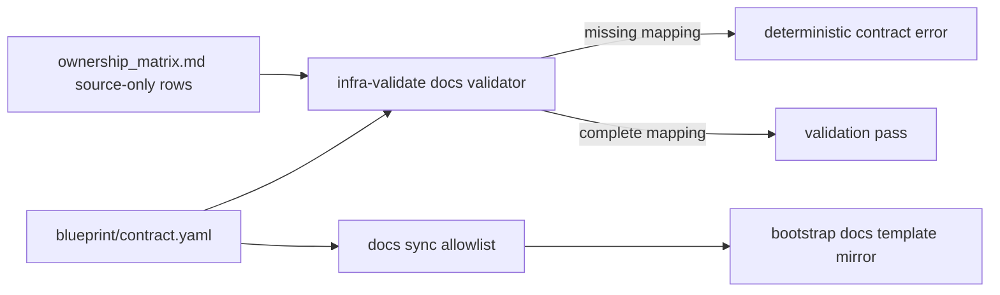
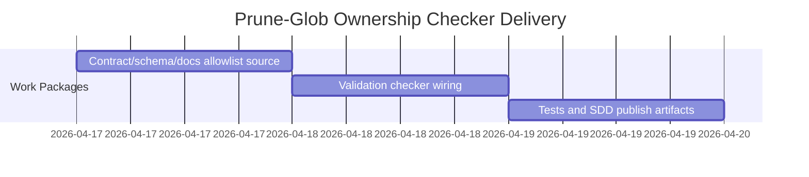

# ADR-20260417-prune-glob-ownership-check: Enforce prune-glob ownership documentation parity

## Metadata
- Status: approved
- Date: 2026-04-17
- Owners: sbonoc
- Related spec path: specs/2026-04-17-prune-glob-ownership-check/

## Business Objective and Requirement Summary
- Business objective: make source-artifact prune ownership governance executable by validating contract-to-doc parity.
- Functional requirements summary:
  - contract-driven docs template allowlist source.
  - validation check that prune globs are documented in source-only ownership rows.
  - preserve docs mirror integrity for linked governance docs.
- Non-functional requirements summary:
  - deterministic validation diagnostics.
  - secure prune behavior against path traversal/symlink escape.
- Desired timeline: immediate follow-up after template-boundary PR merge.

## Decision Drivers
- Driver 1: deferred governance gap from prior PR required enforcement, not only guidance.
- Driver 2: ownership matrix drift should fail early in `infra-validate` before consumer init workflows.

## Options Considered
- Option A: strict contract-to-doc checker in validation lane with exact pattern documentation.
- Option B: no checker, rely on manual review and narrative docs updates.

## Recommended Option
- Selected option: Option A
- Rationale: Option A provides deterministic guardrails and prevents silent drift.

## Rejected Options
- Rejected option 1: Option B
- Rejection rationale: manual alignment is non-deterministic and easy to regress.

## Affected Capabilities and Components
- Capability impact:
  - docs sync ownership governance
  - contract validation reliability
  - init prune safety posture
- Component impact:
  - `scripts/lib/blueprint/contract_validators/docs_sync.py`
  - `scripts/bin/blueprint/validate_contract.py`
  - `scripts/lib/blueprint/init_repo_contract.py`
  - `scripts/lib/blueprint/init_repo_io.py`
  - `docs/blueprint/governance/ownership_matrix.md`

## Architecture Diagram (Mermaid)

## High-Level Work Packages and Timeline (Mermaid Gantt)

## External Dependencies
- Dependency 1: existing contract-schema loader and docs validator delegation boundaries.
- Dependency 2: existing ownership matrix documentation conventions.

## Risks and Mitigations
- Risk 1: docs checker can be brittle if markdown table format changes significantly.
- Mitigation 1: keep parser narrow and maintain stable ownership matrix table structure.
- Risk 2: exact pattern string matching may require explicit docs updates on every glob change.
- Mitigation 2: enforce same-change policy and include regression tests.

## Validation and Observability Expectations
- Validation requirements:
  - `python3 -m unittest tests.blueprint.test_quality_contracts.QualityContractsTests.test_prune_globs_must_be_documented_in_ownership_matrix_source_only_rows`
  - `make quality-docs-check-blueprint-template-sync`
  - `make quality-sdd-check`
  - `make quality-hardening-review`
  - `make infra-validate`
- Logging/metrics/tracing requirements:
  - explicit `infra-validate` error messages naming missing prune-glob mapping and ownership matrix path.
