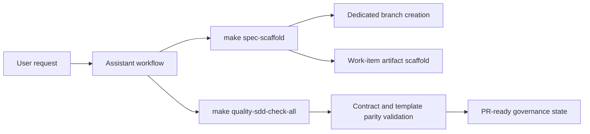
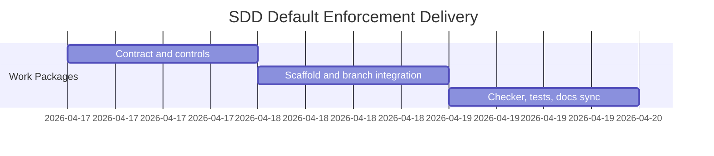

# ADR-20260417-sdd-default-enforcement: Enforce strict-default SDD and dedicated work-item branch creation

## Metadata
- Status: approved
- Date: 2026-04-17
- Owners: sbonoc
- Related spec path: specs/2026-04-17-sdd-strict-default-branching/

## Business Objective and Requirement Summary
- Business objective: ensure assistant-driven changes follow deterministic SDD lifecycle expectations and isolate each work item on dedicated non-default branches.
- Functional requirements summary:
  - enforce SDD default behavior unless explicit user opt-out.
  - enforce dedicated-branch creation during work-item scaffold with explicit override/opt-out controls.
- Non-functional requirements summary:
  - deterministic policy enforcement and diagnostics.
  - contract/template/tooling synchronization checks in quality gates.
- Desired timeline: immediate rollout in current blueprint baseline.

## Decision Drivers
- Driver 1: inconsistent SDD execution and branch discipline across assistant interactions creates governance drift.
- Driver 2: policy expectations must be executable and machine-validated, not documentation-only.

## Options Considered
- Option A: strict-default SDD + dedicated branch auto-creation + explicit opt-out + checker enforcement.
- Option B: documentation guidance only with manual discipline.

## Recommended Option
- Selected option: Option A
- Rationale: Option A yields deterministic behavior and prevents silent drift in future assistant and template workflows.

## Rejected Options
- Rejected option 1: Option B
- Rejection rationale: advisory-only policies cannot guarantee consistent execution under automation.

## Affected Capabilities and Components
- Capability impact:
  - SDD governance policy execution
  - work-item bootstrap ergonomics
  - assistant interoperability consistency
- Component impact:
  - `blueprint/contract.yaml`
  - `scripts/bin/blueprint/spec_scaffold.py`
  - `scripts/bin/quality/check_sdd_assets.py`
  - `make/blueprint.generated.mk`
  - `.spec-kit/control-catalog.yaml`

## Architecture Diagram (Mermaid)

## High-Level Work Packages and Timeline (Mermaid Gantt)

## External Dependencies
- Dependency 1: git CLI branch operations in local workspace.
- Dependency 2: existing make + pytest + quality hook infrastructure.

## Risks and Mitigations
- Risk 1: stricter defaults can increase friction for intentional same-branch workflows.
- Mitigation 1: explicit branch override and explicit opt-out are retained.
- Risk 2: future contract/template drift can regress behavior.
- Mitigation 2: enforce branch-contract parity in SDD quality checks and tests.

## Validation and Observability Expectations
- Validation requirements:
  - `make quality-sdd-check-all`
  - `make infra-validate`
  - `make quality-hooks-run`
  - `pytest tests/blueprint/test_spec_scaffold.py tests/infra/test_sdd_asset_checker.py`
- Logging/metrics/tracing requirements:
  - scaffold and checker MUST emit deterministic messages sufficient for operator diagnosis.
