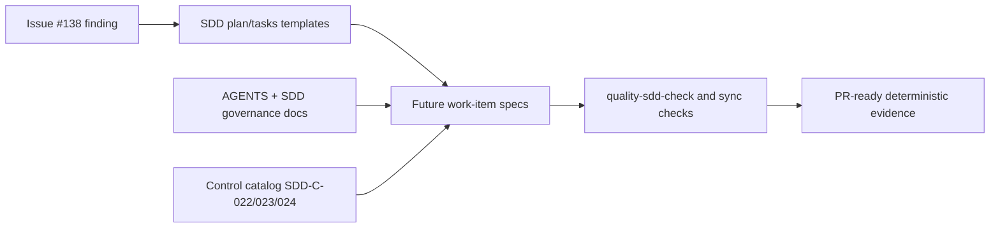
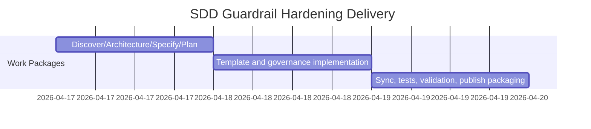

# ADR-20260417-sdd-local-smoke-positive-path-guardrails: Enforce positive-path and local-smoke SDD guardrails

## Metadata
- Status: approved
- Date: 2026-04-17
- Owners: sbonoc
- Related spec path: specs/2026-04-17-sdd-local-smoke-positive-path-guardrails/

## Business Objective and Requirement Summary
- Business objective: prevent filter/transform regressions from passing pre-PR workflows with weak evidence by enforcing deterministic SDD guardrails.
- Functional requirements summary:
  - template-level positive-path filter/payload-transform test gate.
  - template-level local smoke publish gate for HTTP/filter/new-endpoint scope.
  - explicit task-level evidence requirements plus red->green finding translation requirement.
  - control-catalog controls for stable, assistant-agnostic enforcement language.
- Non-functional requirements summary:
  - deterministic evidence format in `pr_context.md`.
  - deterministic sync of canonical and mirrored template/governance assets.
- Desired timeline: immediate P0 delivery for Issue #138.

## Decision Drivers
- Driver 1: observed defect class where empty-result-only tests allowed broken filter behavior to pass until manual smoke.
- Driver 2: SDD templates must guide both Codex and Claude Code consistently without reviewer memory dependence.

## Options Considered
- Option A: enforce positive-path/local-smoke/red->green gates in SDD templates, governance docs, and control catalog.
- Option B: add issue-level guidance only and rely on PR review discipline.

## Recommended Option
- Selected option: Option A
- Rationale: Option A makes the policy reusable, deterministic, and assistant-agnostic across future work items.

## Rejected Options
- Rejected option 1: Option B
- Rejection rationale: manual review-only guidance is not deterministic and can regress silently.

## Affected Capabilities and Components
- Capability impact:
  - SDD template quality and pre-PR evidence rigor.
  - cross-assistant interoperability contract.
  - control-catalog policy completeness.
- Component impact:
  - `.spec-kit/templates/{blueprint,consumer}/plan.md`
  - `.spec-kit/templates/{blueprint,consumer}/tasks.md`
  - `AGENTS.md`
  - `scripts/templates/consumer/init/AGENTS.md.tmpl`
  - `docs/blueprint/governance/spec_driven_development.md`
  - `docs/blueprint/governance/assistant_compatibility.md`
  - `CLAUDE.md`
  - `.spec-kit/control-catalog.{yaml,md}`

## Architecture Diagram (Mermaid)

## High-Level Work Packages and Timeline (Mermaid Gantt)

## External Dependencies
- Dependency 1: existing SDD sync scripts for consumer-init and blueprint docs mirrors.
- Dependency 2: existing quality targets (`quality-sdd-check`, docs sync checks, `infra-validate`).

## Risks and Mitigations
- Risk 1: stricter policy increases contributor workload for HTTP/filter work.
- Mitigation 1: encode concise reusable template text and deterministic evidence schema.
- Risk 2: mirror drift between canonical templates/docs and bootstrap/consumer-init copies.
- Mitigation 2: run sync scripts and drift checks in the same change.

## Validation and Observability Expectations
- Validation requirements:
  - `python3 -m unittest tests.blueprint.test_quality_contracts.QualityContractsTests.test_sdd_plan_and_tasks_templates_include_local_smoke_and_positive_path_gates tests.blueprint.test_quality_contracts.QualityContractsTests.test_sdd_control_catalog_includes_local_smoke_and_positive_path_controls`
  - `python3 scripts/lib/spec_kit/sync_consumer_init_sdd_assets.py --check`
  - `python3 scripts/lib/docs/sync_blueprint_template_docs.py --check`
  - `make quality-sdd-check`
  - `make quality-sdd-check-all`
  - `make quality-docs-check-blueprint-template-sync`
  - `make infra-validate`
- Logging/metrics/tracing requirements:
  - no runtime telemetry changes; observability impact is deterministic publish evidence in `pr_context.md` and command-trace artifacts.
