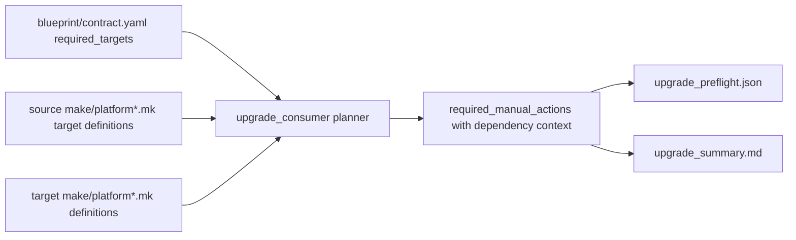
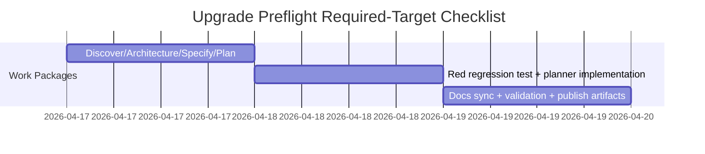

# ADR-20260417-upgrade-preflight-required-make-target-checklist: Enforce preflight checklist coverage for missing required consumer-owned Make targets

## Metadata
- Status: approved
- Date: 2026-04-17
- Owners: sbonoc
- Related spec path: specs/2026-04-17-upgrade-preflight-required-make-target-checklist/

## Business Objective and Requirement Summary
- Business objective: surface missing required consumer-owned Make targets during upgrade preflight instead of late validation stages.
- Functional requirements summary:
  - detect all contract-required missing consumer-owned targets from source platform make surfaces.
  - include deterministic dependency context even when no known invoker reference exists.
  - include explicit location guidance for where missing targets must be defined.
- Non-functional requirements summary:
  - preserve deterministic report structures and existing placeholder safeguards.
  - avoid schema-breaking changes or new privileged operations.
- Desired timeline: P0 Issue #102 implementation in current sprint.

## Decision Drivers
- Driver 1: generated-consumer upgrades currently fail late when required consumer-owned targets are absent.
- Driver 2: operators need deterministic, early remediation guidance in preflight artifacts.

## Options Considered
- Option A: keep invoker-reference-only detection (status quo).
- Option B: include contract-fallback missing-target detection for source-defined required consumer-owned targets.

## Recommended Option
- Selected option: Option B
- Rationale: Option B converts late-stage failures into actionable preflight checklist items and aligns with upgrade ergonomics expectations.

## Rejected Options
- Rejected option 1: Option A
- Rejection rationale: misses newly introduced required targets that are not yet referenced by known invoker paths.

## Affected Capabilities and Components
- Capability impact:
  - upgrade preflight completeness for consumer-owned Make target readiness.
  - deterministic remediation guidance in manual-action diagnostics.
- Component impact:
  - `scripts/lib/blueprint/upgrade_consumer.py`
  - `tests/blueprint/test_upgrade_consumer.py`
  - `docs/platform/consumer/quickstart.md`
  - `docs/platform/consumer/troubleshooting.md`

## Architecture Diagram (Mermaid)

## High-Level Work Packages and Timeline (Mermaid Gantt)

## External Dependencies
- Dependency 1: `blueprint/contract.yaml` required-target and ownership metadata.
- Dependency 2: existing upgrade report/preflight consumers (`upgrade_preflight.py`, readiness doctor, summary parser flows).

## Risks and Mitigations
- Risk 1: manual-action count increases for legacy repos with broad make-target drift.
- Mitigation 1: include exact target names, deterministic locations, and canonical follow-up command.
- Risk 2: docs template drift after consumer docs update.
- Mitigation 2: run docs sync check and keep mirrored template docs in sync.

## Validation and Observability Expectations
- Validation requirements:
  - `python3 -m unittest tests.blueprint.test_upgrade_consumer`
  - `python3 -m unittest tests.blueprint.test_upgrade_preflight`
  - `python3 scripts/lib/docs/sync_blueprint_template_docs.py --check`
  - `make quality-hooks-fast`
- Logging/metrics/tracing requirements:
  - no runtime telemetry additions; required-manual-action reporting remains deterministic and machine-readable.
