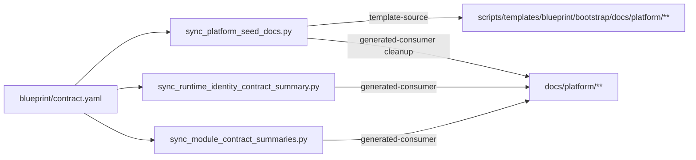
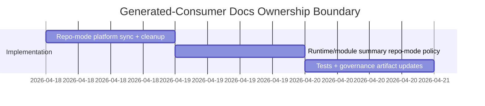

# ADR-20260418-generated-consumer-platform-docs-ownership-boundary: Repo-Mode-Aware Platform Docs Ownership

## Metadata
- Status: approved
- Date: 2026-04-18
- Owners: @sbonoc
- Related spec path: `specs/2026-04-18-docs-ownership-boundary-generated-consumer/spec.md`

## Business Objective and Requirement Summary
- Business objective: generated-consumer repositories MUST keep `docs/platform/**` consumer-owned after seeding, without reverse mirroring into template docs.
- Functional requirements summary:
  - enforce repo-mode-aware sync/check behavior for platform docs
  - clean generated-consumer template orphans outside contract-declared seed files
  - apply the same ownership policy to runtime-identity and module summary generators
- Non-functional requirements summary:
  - deterministic, repository-scoped cleanup operations
  - idempotent behavior with explicit diagnostics in check mode
- Desired timeline: immediate rollout in current upgrade/bootstrap workflow.

## Decision Drivers
- Existing reverse mirroring duplicates consumer docs in template paths and creates noisy drift failures.
- Upgrade/bootstrap workflows already execute docs sync entrypoints; ownership policy must be enforced there.
- Contract-defined seed files already exist and can serve as deterministic template allowlist.

## Options Considered
- Option A: keep bidirectional source/template synchronization for `docs/platform/**` in all repo modes.
- Option B: keep strict sync only in `template-source`, switch generated-consumer to one-way ownership with orphan cleanup.

## Recommended Option
- Selected option: Option B
- Rationale: Option B preserves deterministic blueprint template maintenance while preventing generated-consumer duplication and drift coupling.

## Rejected Options
- Rejected option 1: Option A
- Rejection rationale: bidirectional sync in generated-consumer mode continues to duplicate consumer-owned docs and violates ownership boundaries.

## Affected Capabilities and Components
- Capability impact:
  - docs ownership boundary enforcement for generated-consumer repositories
  - upgrade/bootstrap cleanup of template docs orphans
- Component impact:
  - `scripts/lib/docs/sync_platform_seed_docs.py`
  - `scripts/lib/docs/sync_runtime_identity_contract_summary.py`
  - `scripts/lib/docs/sync_module_contract_summaries.py`
  - tests under `tests/blueprint/` and `tests/docs/`

## Architecture Diagram (Mermaid)

## High-Level Work Packages and Timeline (Mermaid Gantt)

## External Dependencies
- `blueprint/contract.yaml` docs contract (`platform_docs.root`, `template_root`, `required_seed_files`)
- existing docs quality targets and bootstrap execution flow

## Risks and Mitigations
- Risk 1: cleanup logic removes required seed template files.
- Mitigation 1: classify orphans only outside `required_seed_files`.
- Risk 2: generated-consumer checks still fail due hidden template-coupled generators.
- Mitigation 2: apply repo-mode policy to all platform-doc-touching generators and add regression tests.

## Validation and Observability Expectations
- Validation requirements:
  - `python3 -m unittest tests.blueprint.test_quality_contracts`
  - `python3 -m unittest tests.docs.test_docs_generation`
  - `python3 -m unittest tests.docs.test_orchestrate_sync`
  - `make infra-validate`
  - `make quality-hooks-fast`
- Logging/metrics/tracing requirements:
  - docs sync/check scripts MUST print deterministic orphan/diff diagnostics in `--check` mode
  - sync mode MUST emit deterministic created/updated/removed change summaries
