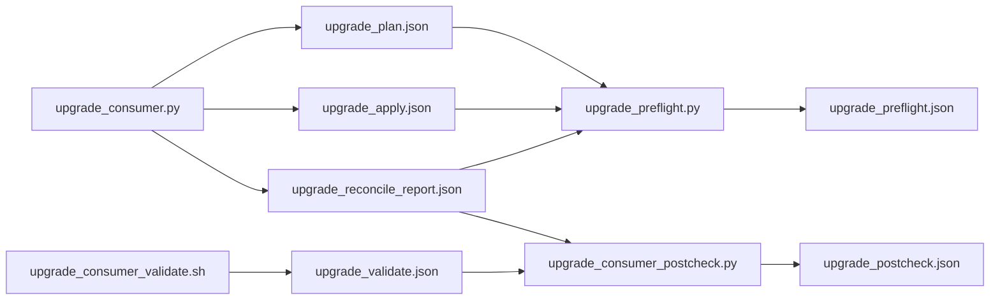
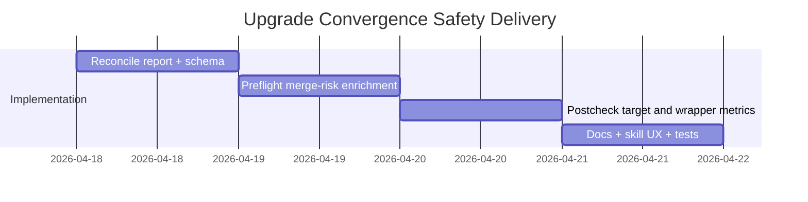

# ADR-20260418-upgrade-convergence-postcheck-gate: Ownership-Aware Upgrade Reconcile Report And Postcheck Gate

## Metadata
- Status: approved
- Date: 2026-04-18
- Owners: @sbonoc
- Related spec path: `specs/2026-04-18-upgrade-convergence-postcheck-gate/spec.md`

## Business Objective and Requirement Summary
- Business objective: make generated-consumer upgrade convergence deterministic and machine-verifiable before merge.
- Functional requirements summary:
  - emit ownership-aware upgrade reconcile report with required bucket contract
  - extend preflight with bucketed merge-risk classification and deterministic remediation hints
  - add dedicated postcheck gate that fails on unresolved convergence blockers
  - update upgrade skill UX with explicit safe-to-continue vs blocked contract
- Non-functional requirements summary:
  - repository-scoped path safety
  - deterministic ordering and machine-readable reports
  - explicit metrics and diagnostics for reconciliation and postcheck outcomes
- Desired timeline: immediate rollout in current upgrade flow.

## Decision Drivers
- Manual merge triage must be explicit and ownership-aware, not inferred from generic logs.
- Preflight, apply, and post-validation signals must converge into one deterministic gate contract.
- Skill-driven upgrade execution needs explicit machine-readable stop/go conditions.

## Options Considered
- Option A: keep only `required_manual_actions` and current validate checks.
- Option B: add reconcile report buckets + preflight risk classification + dedicated postcheck target.

## Recommended Option
- Selected option: Option B
- Rationale: Option B creates a deterministic upgrade convergence contract across all stages while preserving current safety defaults.

## Rejected Options
- Rejected option 1: Option A
- Rejection rationale: Option A does not provide clear ownership-aware bucket triage or deterministic post-upgrade convergence checks.

## Affected Capabilities and Components
- Capability impact:
  - generated-consumer upgrade convergence safety
  - operator preflight/apply/postcheck diagnostics
  - Codex/Claude upgrade skill execution contract
- Component impact:
  - `scripts/lib/blueprint/upgrade_consumer.py`
  - `scripts/lib/blueprint/upgrade_preflight.py`
  - `scripts/lib/blueprint/upgrade_report_metrics.py`
  - `scripts/bin/blueprint/upgrade_consumer.sh`
  - `scripts/bin/blueprint/upgrade_consumer_preflight.sh`
  - `scripts/bin/blueprint/upgrade_consumer_postcheck.sh` (new)
  - `scripts/lib/blueprint/upgrade_consumer_postcheck.py` (new)
  - `scripts/lib/blueprint/upgrade_reconcile_report.py` (new)
  - `make/blueprint.generated.mk` (+ template counterpart)
  - `blueprint/contract.yaml` (+ template counterpart)

## Architecture Diagram (Mermaid)

## High-Level Work Packages and Timeline (Mermaid Gantt)

## External Dependencies
- `blueprint/contract.yaml` repo-mode and ownership rules.
- existing upgrade plan/apply/validate wrappers and CI quality lanes.

## Risks and Mitigations
- Risk 1: mismatch between reconcile bucketing and preflight risk classification.
- Mitigation 1: centralize reconcile classification logic and test both report producers.
- Risk 2: stricter postcheck may surface legacy fixture drift as failures.
- Mitigation 2: add generated-consumer/template-source fixture coverage for pass/fail scenarios.

## Validation and Observability Expectations
- Validation requirements:
  - `python3 -m unittest tests.blueprint.test_upgrade_consumer`
  - `python3 -m unittest tests.blueprint.test_upgrade_preflight`
  - `python3 -m unittest tests.blueprint.test_upgrade_consumer_wrapper`
  - `python3 -m unittest tests.blueprint.test_upgrade_postcheck`
  - `python3 -m unittest tests.blueprint.test_quality_contracts`
  - `make infra-validate`
  - `make quality-hooks-fast`
- Logging/metrics/tracing requirements:
  - emit reconcile bucket count metrics and blocked status in upgrade wrapper
  - emit postcheck status/blocked reason counters in postcheck wrapper
  - include deterministic next-command hints in preflight and postcheck reports
