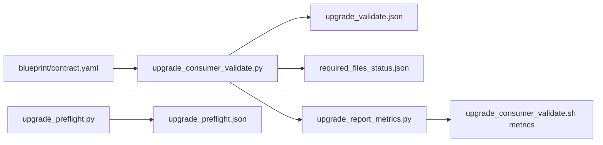
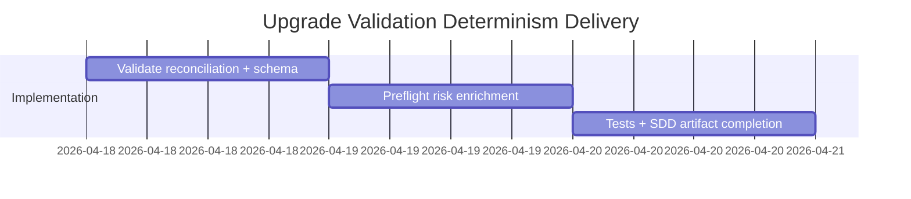

# ADR-20260418-upgrade-validation-required-file-reconciliation: Deterministic Upgrade Required-File Reconciliation

## Metadata
- Status: approved
- Date: 2026-04-18
- Owners: @sbonoc
- Related spec path: `specs/2026-04-18-upgrade-validation-required-file-reconciliation/spec.md`

## Business Objective and Requirement Summary
- Business objective: prevent false-green upgrade validation outcomes when required blueprint surfaces are missing or partially reconciled.
- Functional requirements summary:
  - repo-mode-aware required-file reconciliation artifact and hard-fail behavior
  - coupled generated-reference validation for core targets and contract metadata docs
  - preflight required-surface risk reporting before apply
- Non-functional requirements summary:
  - repo-scoped path safety
  - deterministic ordering and machine-readable diagnostics
  - observable summary counters for CI metrics
- Desired timeline: immediate adoption in current upgrade validation path.

## Decision Drivers
- Consumer upgrade reliability requires explicit contracts, not implicit file assumptions.
- Generated-consumer mode MUST avoid source-only false positives.
- Operators need deterministic remediation hints to recover missing required surfaces quickly.

## Options Considered
- Option A: keep current target-only validation and rely on indirect failures.
- Option B: add explicit required-file reconciliation and coupled generated-reference checks in validate/preflight artifacts.

## Recommended Option
- Selected option: Option B
- Rationale: Option B provides deterministic blocking behavior with actionable diagnostics while keeping existing ownership boundaries intact.

## Rejected Options
- Rejected option 1: Option A
- Rejection rationale: target-only checks do not guarantee required file presence and can miss partial upgrade drift.

## Affected Capabilities and Components
- Capability impact:
  - consumer upgrade validation determinism
  - upgrade preflight operator guidance
- Component impact:
  - `scripts/lib/blueprint/upgrade_consumer_validate.py`
  - `scripts/lib/blueprint/upgrade_preflight.py`
  - `scripts/lib/blueprint/upgrade_report_metrics.py`
  - `scripts/bin/blueprint/upgrade_consumer_validate.sh`
  - `scripts/lib/blueprint/schemas/upgrade_validate.schema.json`

## Architecture Diagram (Mermaid)

## High-Level Work Packages and Timeline (Mermaid Gantt)

## External Dependencies
- `blueprint/contract.yaml` structure and ownership classes.
- Existing validate/preflight wrapper contracts and make targets.

## Risks and Mitigations
- Risk 1: fixture failures if required-file checks are not repo-mode-aware.
- Mitigation 1: add explicit generated-consumer/template-source gating tests.
- Risk 2: downstream report consumers expecting old schema only.
- Mitigation 2: keep existing fields stable and add deterministic new fields in one schema update.

## Validation and Observability Expectations
- Validation requirements:
  - `python3 -m unittest tests.blueprint.test_upgrade_consumer tests.blueprint.test_upgrade_preflight`
  - `python3 -m unittest tests.blueprint.test_upgrade_consumer_wrapper`
  - `python3 -m unittest tests.blueprint.test_quality_contracts`
  - `make infra-validate`
  - `make quality-hooks-fast`
- Logging/metrics/tracing requirements:
  - emit required-file/generate-reference counters through wrapper metrics
  - include path-level remediation diagnostics in validate stderr and report payloads
