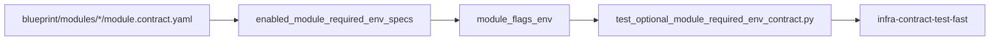
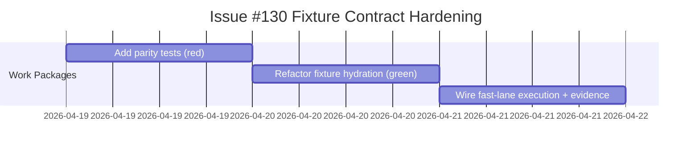

# ADR-20260419-issue-130-optional-module-required-env-fixture-parity: Optional-Module Required Env Fixture Parity In Fast Contract Lane

## Metadata
- Status: approved
- Date: 2026-04-19
- Owners: @sbonoc
- Related spec path: `specs/2026-04-19-issue-130-required-env-fixture-parity/spec.md`

## Business Objective and Requirement Summary
- Business objective: enforce deterministic parity between optional-module `required_env` contracts and test fixture defaults to eliminate late CI regressions.
- Functional requirements summary:
  - hydrate required env defaults for enabled optional modules through canonical resolver logic
  - add deterministic parity tests for module contract required env coverage
  - execute parity test in `infra-contract-test-fast`
- Non-functional requirements summary:
  - deterministic sorted diagnostics
  - no real secret dependence
  - fail-fast CI lane integration
- Desired timeline: immediate in current fast contract lane.

## Decision Drivers
- Optional-module contracts evolve frequently and fixture helpers can drift.
- Drift detection is most valuable in fast, deterministic lanes before broader optional-module flows.
- One canonical default source reduces duplicated per-module fixture logic.

## Options Considered
- Option A: keep manual helper branches and rely on existing optional-module behavior tests.
- Option B: centralize fixture hydration on canonical required-env resolver and add explicit parity tests in fast lane.

## Recommended Option
- Selected option: Option B
- Rationale: Option B detects drift earlier, removes duplicated helper branches, and keeps remediation explicit.

## Rejected Options
- Rejected option 1: Option A
- Rejection rationale: Option A allows contract/default drift to survive until slower behavior tests.

## Affected Capabilities and Components
- Capability impact:
  - fast infra contract drift detection
  - optional-module fixture determinism in tests
- Component impact:
  - `tests/_shared/helpers.py`
  - `tests/infra/test_optional_module_required_env_contract.py` (new)
  - `scripts/bin/infra/contract_test_fast.sh`

## Architecture Diagram (Mermaid)

## High-Level Work Packages and Timeline (Mermaid Gantt)

## External Dependencies
- `scripts/lib/blueprint/init_repo_env.py` default required-env catalog.
- `scripts/lib/blueprint/init_repo_contract.py` optional-module metadata.

## Risks and Mitigations
- Risk 1: newly added module flags diverge from helper parameter mapping.
- Mitigation 1: parity test enforces module-to-parameter coverage.
- Risk 2: default map entries become empty for new `required_env` keys.
- Mitigation 2: parity test asserts non-empty values for each required env.

## Validation and Observability Expectations
- Validation requirements:
  - `pytest -q tests/infra/test_optional_module_required_env_contract.py`
  - `make infra-contract-test-fast`
  - `make quality-hooks-fast`
- Logging/metrics/tracing requirements:
  - deterministic parity diagnostics in pytest failure output
  - no new runtime metrics required for this scope
