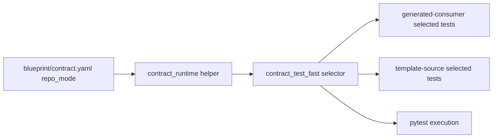
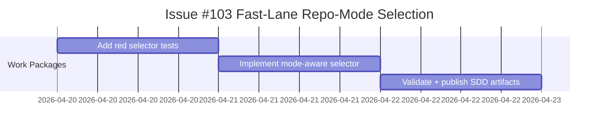

# ADR-20260420-issue-103-generated-consumer-fast-contract-repo-mode-selection: Repo-Mode-Aware Fast Contract Test Selection

## Metadata
- Status: approved
- Date: 2026-04-20
- Owners: @sbonoc
- Related spec path: `specs/2026-04-20-issue-103-generated-consumer-contract-fastlane/spec.md`

## Business Objective and Requirement Summary
- Business objective: remove generated-consumer false failures in `infra-contract-test-fast` while preserving strict template-source fast-lane guarantees.
- Functional requirements summary:
  - select fast-lane tests by contract repo mode
  - skip template-source-only tests in generated-consumer mode
  - fail-fast on missing selected required tests in template-source mode
- Non-functional requirements summary:
  - deterministic selection logs/metrics
  - no secret contract changes
  - deterministic selected test order
- Desired timeline: immediate for current upgrade-regression backlog slice.

## Decision Drivers
- generated-consumer upgrades can legitimately lack template-source-only tests.
- fast-lane failures must represent real contract regressions, not mode mismatch.
- template-source lane still needs strict coverage and missing-path fail-fast behavior.

## Options Considered
- Option A: execute whichever test paths currently exist on disk.
- Option B: explicit repo-mode test-set selection with strict selected-path existence checks.

## Recommended Option
- Selected option: Option B
- Rationale: Option B gives deterministic behavior, preserves template-source strictness, and avoids generated-consumer false negatives.

## Rejected Options
- Rejected option 1: Option A
- Rejection rationale: silent path omission can hide missing required template-source tests and weakens fast-lane guarantees.

## Affected Capabilities and Components
- Capability impact:
  - repo-mode-correct `infra-contract-test-fast` behavior
  - deterministic diagnostics for selected/skipped test groups
- Component impact:
  - `scripts/bin/infra/contract_test_fast.sh`
  - `tests/infra/test_tooling_contracts.py`

## Architecture Diagram (Mermaid)

## High-Level Work Packages and Timeline (Mermaid Gantt)

## External Dependencies
- `scripts/lib/blueprint/contract_runtime.sh`
- `blueprint/contract.yaml` (`repo_mode`, `mode_from`, `mode_to`)

## Risks and Mitigations
- Risk 1: incorrect skip scope could reduce coverage.
- Mitigation 1: skip list is explicit and validated via dedicated tooling contract tests.
- Risk 2: missing selected paths may surface late.
- Mitigation 2: selected-path existence checks fail before invoking pytest.

## Validation and Observability Expectations
- Validation requirements:
  - `python3 -m unittest tests.infra.test_tooling_contracts.ToolingContractsTests.test_contract_test_fast_includes_template_source_only_tests_in_template_source_mode tests.infra.test_tooling_contracts.ToolingContractsTests.test_contract_test_fast_skips_template_source_only_tests_in_generated_consumer_mode tests.infra.test_tooling_contracts.ToolingContractsTests.test_contract_test_fast_fails_fast_when_template_source_required_test_is_missing -v`
  - `make infra-contract-test-fast`
  - `make infra-validate`
  - `make quality-hooks-fast`
- Logging/metrics/tracing requirements:
  - emit `infra_contract_test_fast_test_selection_total` for selected and skipped groups with `repo_mode` labels.
