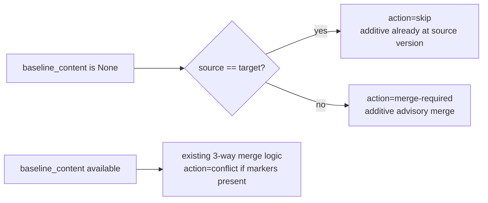
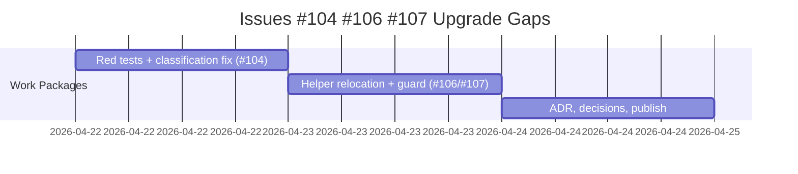

# ADR-20260422-issue-104-106-107-upgrade-additive-file-helper-gaps: Additive-File Conflict Reclassification and Platform Helper Namespace Correction

## Metadata
- Status: approved
- Date: 2026-04-22
- Owners: @sbonoc
- Related spec path: `specs/2026-04-22-issue-104-106-107-upgrade-additive-file-helper-gaps/spec.md`

## Business Objective and Requirement Summary
- Business objective: eliminate false conflict signals in generated-consumer upgrade preflight for additive blueprint-required files, and ensure all Python helpers required by distributed platform scripts are present in upgraded generated-consumer repos.
- Functional requirements summary:
  - baseline-absent additive files where source==target MUST be classified as `skip`, not `conflict`
  - baseline-absent additive files where source!=target MUST be classified as `merge-required`, not `conflict`
  - `scripts/lib/platform/apps/runtime_workload_helpers.py` and `scripts/lib/platform/auth/argocd_repo_credentials_json.py` MUST be relocated to `scripts/lib/infra/` so upgrade distributes them
  - fast quality lane MUST guard against future missing-Python-helper regressions in `scripts/bin/platform/**`
- Non-functional requirements summary:
  - classification fix is backward-compatible (fewer conflicts, never more)
  - upgrade entry schema unchanged; reclassified entries use existing `merge-required` schema
  - no secret or auth surface exposure introduced
- Desired timeline: immediate for current upgrade-regression backlog slice.

## Decision Drivers
- `action=conflict` for a baseline-absent file is semantically incorrect: there is no 3-way merge conflict without a common ancestor.
- Operators should be able to distinguish truly unresolvable conflicts from advisory additive-merge notices.
- Python utility helpers in `scripts/lib/platform/` (a protected/consumer-editable root) are never distributed by the upgrade engine; placing them in `scripts/lib/infra/` (a blueprint-managed root) fixes distribution automatically with no contract change.

## Options Considered

### Classification fix (#104)
- Option A: reclassify baseline-absent files based on source-vs-target content comparison (skip if same, merge-required if different).
- Option B: introduce a new `action=additive-conflict` value and a dedicated JSON schema entry.

### Helper distribution (#106/#107)
- Option A: relocate helpers from `scripts/lib/platform/` to `scripts/lib/infra/` (blueprint-managed root; automatic upgrade distribution).
- Option B: add helpers to `required_files` in `contract.yaml` (upgrade distributes, but contradicts platform-editable semantics).

## Recommended Option
- Selected option: Classification Option A; Distribution Option A
- Rationale:
  - Classification Option A reuses the existing `merge-required` action (no schema change, no new action enum) and is cleanest semantically.
  - Distribution Option A is zero-contract-change: `scripts/lib/infra/` is already a `blueprint_managed_roots` entry; files placed there automatically enter the upgrade candidate set.
  - Both choices minimize blast radius and are backward-compatible.

## Rejected Options
- Classification Option B rejected: a new action value requires JSON schema change, downstream consumers of the upgrade plan JSON, and documentation updates — disproportionate complexity for a classification nuance.
- Distribution Option B rejected: adding helpers to `required_files` while their directory root is `platform_editable_roots` creates a contract inconsistency that would require a separate governance decision.

## Affected Capabilities and Components
- Capability impact:
  - upgrade preflight `conflict_count` no longer includes baseline-absent additive files
  - upgraded generated-consumer repos receive `scripts/lib/infra/runtime_workload_helpers.py` and `scripts/lib/infra/argocd_repo_credentials_json.py` automatically
  - fast quality lane (`quality-infra-shell-source-graph-check`) guards against future missing-helper regressions
- Component impact:
  - `scripts/lib/blueprint/upgrade_consumer.py` (`_classify_entries`)
  - `scripts/lib/infra/runtime_workload_helpers.py` (new location)
  - `scripts/lib/infra/argocd_repo_credentials_json.py` (new location)
  - `scripts/bin/platform/apps/smoke.sh` (path update)
  - `scripts/bin/platform/auth/reconcile_argocd_repo_credentials.sh` (path update)
  - `scripts/bin/quality/check_infra_shell_source_graph.py` (extended guard)

## Architecture Diagram (Mermaid)

## High-Level Work Packages and Timeline (Mermaid Gantt)

## External Dependencies
- `scripts/lib/blueprint/upgrade_consumer.py` (`_classify_entries`, `resolve_baseline_content`)
- `scripts/lib/blueprint/upgrade_reconcile_report.py` (existing `consumer_owned_manual_review` bucket handles `merge-required` entries correctly; no change)
- `blueprint/contract.yaml` `script_contract.blueprint_managed_roots` (already includes `scripts/lib/infra/`)

## Risks and Mitigations
- Risk 1: stale `scripts/lib/platform/` helper copies persist in upgraded consumer repos.
- Mitigation 1: document in PR description that old copies are safe to delete after upgrade.
- Risk 2: guard false-positives in `check_infra_shell_source_graph.py`.
- Mitigation 2: scope guard to `python3 "$ROOT_DIR/scripts/lib/..."` pattern; exclude comment lines and explicit conditional-existence checks.

## Validation and Observability Expectations
- Validation requirements:
  - `python3 -m pytest tests/blueprint/ -q -k "additive"` (new classification tests)
  - `python3 -m pytest tests/infra/test_tooling_contracts.py -q -k "platform_helper"` (new guard tests)
  - `make infra-contract-test-fast`
  - `make quality-infra-shell-source-graph-check`
  - `make quality-hooks-fast`
  - `make infra-validate`
- Logging/metrics/tracing requirements:
  - upgrade entries for reclassified paths emit `action=skip` or `action=merge-required` with `baseline_content_available=false` and explicit `reason` field; existing upgrade metrics automatically reflect the reclassification
