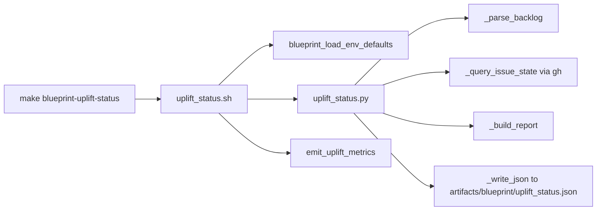
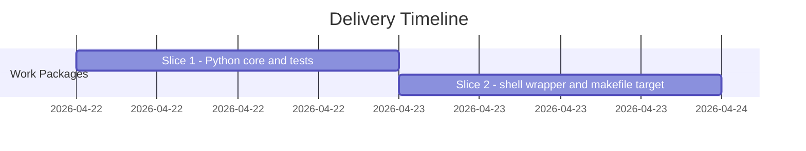

# ADR-20260422-issue-131-blueprint-uplift-status: Blueprint-native uplift convergence status command

## Metadata
- Status: approved
- Date: 2026-04-22
- Owners: bonos
- Related spec path: specs/2026-04-22-issue-131-blueprint-uplift-status/spec.md

## Business Objective and Requirement Summary
- Business objective: Standardize blueprint uplift convergence tracking across generated-consumer repos so convergence debt is visible and actionable without per-consumer reimplementation.
- Functional requirements summary: A Python core (`uplift_status.py`) parses `AGENTS.backlog.md` for unchecked Markdown issue links, queries each referenced upstream blueprint issue state via `gh`, classifies issues as required/aligned/none, writes a JSON artifact, and exits non-zero in strict mode when action is required. A thin shell wrapper delivers the command as `make blueprint-uplift-status`.
- Non-functional requirements summary: all file reads are in-process Python; `gh` is invoked with explicit `--repo` to prevent ambient credential scope widening; missing backlog is non-fatal; `log_metric` lines emitted for all aggregate fields.
- Desired timeline: 2026-04-22.

## Decision Drivers
- Driver 1: generated-consumer repos have no blueprint-native signal for when tracked upstream issues close and convergence actions become required.
- Driver 2: per-consumer implementations diverge on parsing criteria, classification logic, and metric emission — centralizing in the blueprint eliminates that drift.

## Options Considered
- Option A: Python core invoked by a thin shell wrapper, following the `upgrade_readiness_doctor.sh`/`.py` pattern already established in the blueprint.
- Option B: Pure shell script using `gh` and `grep`/`awk` for backlog parsing.

## Recommended Option
- Selected option: Option A (Python core + shell wrapper)
- Rationale: Python provides reliable regex-based Markdown link parsing, structured JSON artifact output, and pure-function testability without fragile shell string manipulation. The shell wrapper provides the same env-var/metrics/strict-mode wiring as existing blueprint commands.

## Rejected Options
- Rejected option 1: Option B (pure shell).
- Rejection rationale: Markdown link parsing with `grep`/`awk` is fragile for multi-link lines and indented content; pure-function unit testing of classification logic is not practical in shell.

## Affected Capabilities and Components
- Capability impact: generated-consumer repos gain a first-class blueprint-managed convergence status command after the next upgrade cycle.
- Component impact: `scripts/lib/blueprint/uplift_status.py` (new); `scripts/bin/blueprint/uplift_status.sh` (new); `make/blueprint.generated.mk` and template gain `blueprint-uplift-status`; `tests/blueprint/test_uplift_status.py` (new, 27 tests).

## Architecture Diagram (Mermaid)

## High-Level Work Packages and Timeline (Mermaid Gantt)

## External Dependencies
- Dependency 1: `gh` CLI must be available in the generated-consumer environment; absence is handled gracefully as `query_failures` increments.

## Risks and Mitigations
- Risk 1: `BLUEPRINT_UPLIFT_REPO` misconfigured in `blueprint/repo.init.env` causes all queries to fail.
- Mitigation 1: shell wrapper validates the resolved value is non-empty and contains `/`; `query_failures` count surfaces the problem in the artifact and metrics.

## Validation and Observability Expectations
- Validation requirements: 27 tests in `tests/blueprint/test_uplift_status.py`; `make quality-hooks-fast` on the SDD branch exercises the live path.
- Logging/metrics/tracing requirements: `log_metric` lines for `tracked_total`, per-state counts, `action_required_count`, `query_failures`; JSON artifact at `artifacts/blueprint/uplift_status.json`.
