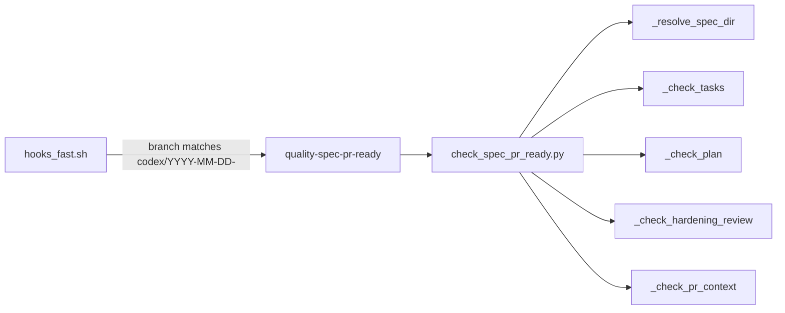
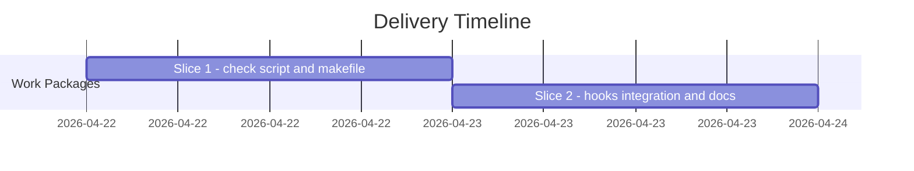

# ADR-20260422-quality-spec-pr-ready-publish-gate: Standalone publish-gate validator for SDD publish artifacts

## Metadata
- Status: approved
- Date: 2026-04-22
- Owners: bonos
- Related spec path: specs/2026-04-22-quality-spec-pr-ready-publish-gate/spec.md

## Business Objective and Requirement Summary
- Business objective: prevent SDD publish-gate files (plan.md, tasks.md, hardening_review.md, pr_context.md) from shipping with unfilled scaffold placeholders, which currently reach PRs undetected because the existing `quality-sdd-check` gate covers only the five readiness-gate files.
- Functional requirements summary: a new script resolves the active spec directory from SPEC_SLUG env var or git branch, validates each of the four publish-gate files for scaffold placeholders, and exits non-zero on any violation with a file-and-line-specific error message.
- Non-functional requirements summary: all file reads are in-process Python; zero cost on non-SDD branches; each violation is self-describing; missing spec dir exits non-zero with a clear diagnostic.
- Desired timeline: 2026-04-22 (same sprint as the triggering incident).

## Decision Drivers
- Driver 1: the issue-118-137 work item shipped all-placeholder plan.md, tasks.md, hardening_review.md, and pr_context.md, demonstrating a structural gap in the quality gate suite.
- Driver 2: `quality-sdd-check` cannot be extended to cover publish-gate files without entangling readiness-gate validation (which runs in all contexts) with publish-gate validation (which is SDD-branch-specific and has zero relevance on non-SDD branches).

## Options Considered
- Option A: standalone script `scripts/bin/quality/check_spec_pr_ready.py` with a dedicated `quality-spec-pr-ready` make target, wired into `hooks_fast.sh` with a branch-pattern guard.
- Option B: extend `check_sdd_assets.py` to also validate publish-gate files.

## Recommended Option
- Selected option: Option A (standalone script)
- Rationale: Option B couples readiness-gate and publish-gate concerns in a single script and would add SDD-branch-specific logic to a check that runs on all branches. Option A preserves single-responsibility, allows selective invocation, and follows the existing pattern of the quality script suite.

## Rejected Options
- Rejected option 1: Option B — extend `check_sdd_assets.py`.
- Rejection rationale: `check_sdd_assets.py` runs on all branches and all contexts; publish-gate validation is only meaningful on SDD work-item branches and should not add cost or confusion elsewhere.

## Affected Capabilities and Components
- Capability impact: SDD publish-gate validation is now machine-enforced; authors cannot open a PR with scaffold-placeholder publish artifacts undetected when running `hooks_fast.sh` on an SDD branch.
- Component impact: `scripts/bin/quality/check_spec_pr_ready.py` (new); `make/blueprint.generated.mk` and its template gain `quality-spec-pr-ready`; `hooks_fast.sh` gains a branch-pattern conditional block.

## Architecture Diagram (Mermaid)

## High-Level Work Packages and Timeline (Mermaid Gantt)

## External Dependencies
- Dependency 1: `.spec-kit/templates/blueprint/` scaffold templates define the placeholder labels known to `check_spec_pr_ready.py`; template changes MUST trigger an allowlist update.

## Risks and Mitigations
- Risk 1: static label allowlist in `check_spec_pr_ready.py` drifts from scaffold templates.
- Mitigation 1: per-label negative-path tests in `test_spec_pr_ready.py` catch drift at test time; template changes MUST update the test and allowlist together.

## Validation and Observability Expectations
- Validation requirements: 39 tests in `tests/blueprint/test_spec_pr_ready.py`; `make quality-hooks-fast` on the SDD branch exercises the live path.
- Logging/metrics/tracing requirements: violations printed to stdout with `[quality-spec-pr-ready] file:line: message` prefix; exit code is the only machine-readable signal.
