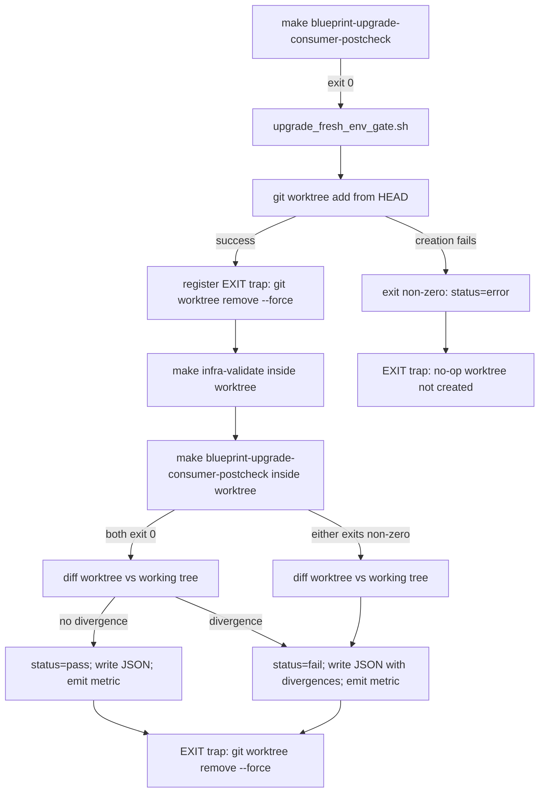
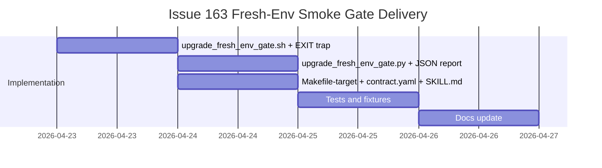

# ADR-20260423-issue-163-fresh-env-smoke-gate: Fresh-environment simulation in upgrade smoke gate via temporary git worktree

## Metadata
- Status: approved
- Date: 2026-04-23
- Owners: sbonoc
- Related spec path: specs/2026-04-23-issue-163-fresh-env-smoke-gate/spec.md

## Business Objective and Requirement Summary
- Business objective: Eliminate the systematic class of CI-only upgrade failures caused by files that persist in the developer's working tree but are absent in CI's clean checkout, by surfacing CI-equivalent behavior during the local upgrade run before the PR is opened.
- Functional requirements summary:
  - Create a temporary git worktree from the upgrade branch HEAD after `make blueprint-upgrade-consumer-postcheck` exits 0.
  - Run `make infra-validate` and `make blueprint-upgrade-consumer-postcheck` inside the worktree with the parent shell environment.
  - Exit non-zero if either target fails; diff worktree file state vs working tree and include diagnostic divergence list in the report.
  - Register an EXIT trap to unconditionally remove the worktree via `git worktree remove --force`.
  - Fail hard if worktree creation fails; never declare the upgrade complete in that case.
  - Write `artifacts/blueprint/fresh_env_gate.json` as the canonical CI/CD artifact.
- Non-functional requirements summary:
  - Security: worktree created from committed HEAD only; no uncommitted content executed.
  - Observability: JSON artifact with `status`, `worktree_path`, `targets_run`, `divergences`, `error`, `exit_code`; metric `blueprint_upgrade_fresh_env_gate_status_total`.
  - Reliability: gate is idempotent and must not mutate the working tree; EXIT trap ensures unconditional cleanup.
  - Operability: failure output identifies diverging files, failing target, and exit code.

## Decision Drivers
- Driver 1: CI starts from a clean checkout; the developer's working tree accumulates files created by `ensure_file_with_content` and `ensure_infra_template_file` across runs. This creates an invisible divergence class — upgrades that pass locally but fail in CI.
- Driver 2: The existing postcheck gate (`blueprint-upgrade-consumer-postcheck`) validates the post-apply state of the working tree but does not simulate a clean starting state.
- Driver 3: Git worktrees are already a precondition of the upgrade flow (clean commit state required) and provide a native, low-cost mechanism for clean-checkout simulation without cloning the repo.

## Options Considered
- Option A: Run the post-upgrade smoke check (`make infra-validate` + `make blueprint-upgrade-consumer-postcheck`) inside a temporary git worktree created from the upgrade branch HEAD. Worktree starts clean. Discard after check.
- Option B: For each file managed by `ensure_file_with_content` and `ensure_infra_template_file`, temporarily rename or hide the file, run bootstrap, and verify the outcome.

## Recommended Option
- Selected option: Option A
- Rationale: Option A creates a self-contained environment that faithfully reproduces CI's clean-checkout state without requiring a separately maintained manifest of bootstrap-managed files. The worktree approach imposes no additional preconditions beyond those already required by the upgrade flow. Option B requires a manifest that can diverge from actual bootstrap behavior as tooling evolves, is more invasive to the working tree, and is harder to keep correct under refactoring.

## Rejected Options
- Rejected option 1: Option B
- Rejection rationale: The manifest maintenance burden grows with the number of bootstrap-managed files. Any gap in the manifest produces a silent false negative. Option B is also more invasive — temporarily hiding files risks leaving the working tree in a corrupted state if the gate is interrupted.

## Affected Capabilities and Components
- Capability impact:
  - Consumer upgrade smoke gate (additive: new terminal step after `blueprint-upgrade-consumer-postcheck`)
  - Upgrade CI e2e lane (Phase 2 extension of #169)
- Component impact:
  - `scripts/bin/blueprint/upgrade_fresh_env_gate.sh` (new)
  - `scripts/lib/blueprint/upgrade_fresh_env_gate.py` (new)
  - `make/blueprint.generated.mk` (new `blueprint-upgrade-fresh-env-gate` target)
  - `make/blueprint.generated.mk` template counterpart in `scripts/templates/`
  - `blueprint/contract.yaml` (new required make target)
  - `.agents/skills/blueprint-consumer-upgrade/SKILL.md` (command sequence updated)
  - `tests/blueprint/test_upgrade_fresh_env_gate.py` (new)
  - `docs/blueprint/` upgrade skill reference docs (updated)

## Architecture Diagram (Mermaid)

## High-Level Work Packages and Timeline (Mermaid Gantt)

## External Dependencies
- Dependency 1: `git worktree` support in the consumer repo environment (already required by upgrade flow).
- Dependency 2: `python3` on PATH (already required by existing postcheck).
- Dependency 3: `make blueprint-upgrade-consumer-postcheck` exits 0 before gate is invoked (existing contract).

## Risks and Mitigations
- Risk 1: Worktree creation adds overhead proportional to target execution time in a clean environment.
- Mitigation 1: No time budget enforced for MVP; consistent with existing postcheck contract. A configurable timeout can be added in a follow-up if users report friction.
- Risk 2: `make blueprint-upgrade-consumer-postcheck` inside the worktree writes artifact files to the worktree's `artifacts/` directory; if EXIT trap fails, these persist.
- Mitigation 2: EXIT trap uses `--force` flag. Orphaned worktree metadata is cleaned by `git worktree prune`.
- Risk 3: Gate simulates file-system starting state only, not the full CI environment (CI-specific env vars, different PATH).
- Mitigation 3: Explicitly scoped to file-system divergence, which is the stated failure class. Full CI environment simulation is out of scope for MVP.

## Validation and Observability Expectations
- Validation requirements:
  - `pytest tests/blueprint/test_upgrade_fresh_env_gate.py`
  - `make infra-validate`
  - `make quality-hooks-fast`
  - `make quality-sdd-check`
- Logging/metrics/tracing requirements:
  - `blueprint_upgrade_fresh_env_gate_status_total{status=pass|fail|error}` emitted by shell wrapper via `log_metric`.
  - `artifacts/blueprint/fresh_env_gate.json` with fields `status`, `worktree_path`, `targets_run`, `divergences`, `error`, `exit_code`.
  - Inline stdout progress emitted during gate execution.
