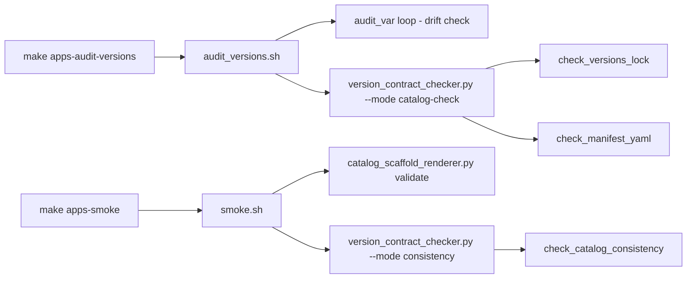
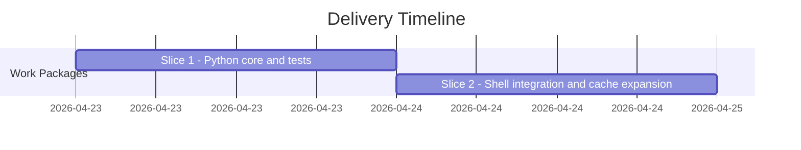

# ADR-20260423-issue-56-app-version-contract-checks: App catalog version contract checks

## Metadata
- Status: approved
- Date: 2026-04-23
- Owners: bonos
- Related spec path: specs/2026-04-23-issue-56-app-version-contract-checks/spec.md

## Business Objective and Requirement Summary
- Business objective: Prevent generated-consumer repos from silently passing `make apps-audit-versions` while their catalog artifacts (`versions.lock`, `manifest.yaml`) reflect stale pinned versions.
- Functional requirements summary: A new Python checker (`version_contract_checker.py`) verifies catalog artifact consistency. `audit_versions.sh` calls it in `catalog-check` mode (shell vars vs. catalog files); `smoke.sh` calls it in `consistency` mode (lock vs. manifest). `audit_versions_cached.sh` fingerprint is expanded to include catalog files.
- Non-functional requirements summary: pure file I/O, no PyYAML dependency, no subprocess calls; text-based regex matching against known manifest schema; graceful skip when catalog files absent.
- Desired timeline: 2026-04-23.

## Decision Drivers
- Driver 1: Generated-consumer repos can add deps to `versions.sh` while catalog artifacts stay stale — the current audit does not detect this gap.
- Driver 2: `apps-smoke` validates manifest structure but not version pin values — catalog artifacts can be internally inconsistent without detection.

## Options Considered
- Option A: New Python core `version_contract_checker.py` with two modes (`catalog-check`, `consistency`), invoked from shell scripts via `run_cmd python3`.
- Option B: Inline bash checks using `grep`/`awk` directly in `audit_versions.sh`.

## Recommended Option
- Selected option: Option A (Python core)
- Rationale: Python provides deterministic regex matching, pure-function testability (~22 unit tests), and structured per-check result reporting without fragile shell string manipulation. Follows the established `catalog_scaffold_renderer.py` / `uplift_status.py` pattern.

## Rejected Options
- Rejected option 1: Option B (pure shell).
- Rejection rationale: YAML key extraction with `grep`/`awk` is fragile; per-check unit testing of classification logic is not practical in shell; error reporting for multi-key mismatches is verbose to implement correctly in bash.

## Affected Capabilities and Components
- Capability impact: `apps-audit-versions` and `apps-smoke` now detect stale catalog artifacts; `apps-audit-versions-cached` cache invalidates when catalog files change.
- Component impact: `scripts/lib/platform/apps/version_contract_checker.py` (new); `scripts/bin/platform/apps/audit_versions.sh`, `audit_versions_cached.sh`, `smoke.sh` (extended); `tests/infra/test_version_contract_checker.py` (new, 22 tests).

## Architecture Diagram (Mermaid)

## High-Level Work Packages and Timeline (Mermaid Gantt)

## External Dependencies
- None: all checks are local file reads; no external APIs or network calls required.

## Risks and Mitigations
- Risk 1: text-based manifest matching produces false negatives if the manifest format changes.
- Mitigation 1: the manifest is machine-generated from a fixed template; format changes require a template change that would also require updating the checker — both are in the same PR surface.

## Validation and Observability Expectations
- Validation requirements: 22 tests in `tests/infra/test_version_contract_checker.py`; `make quality-hooks-fast` green.
- Logging/metrics/tracing requirements: `apps_version_contract_check_total` metric with status label; `contract_checks` and `contract_failures` labels added to `apps_version_audit_summary_total`.
