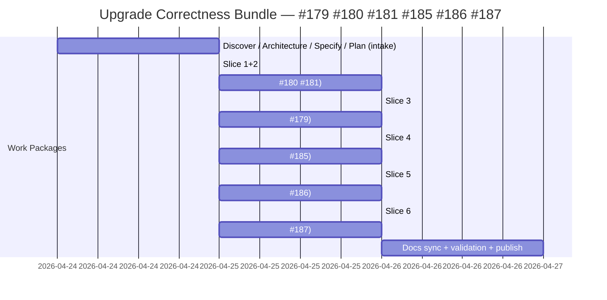

# ADR-20260424-upgrade-correctness-bundle-179-180-181-185-186-187: Fix six behavioral correctness bugs in blueprint upgrade tooling and CI renderer

## Metadata
- Status: proposed
- Date: 2026-04-24
- Owners: sbonoc
- Related spec path: specs/2026-04-24-issue-179-180-181-185-186-187-upgrade-correctness/

## Business Objective and Requirement Summary
- Business objective: eliminate six behavioral correctness bugs in the blueprint upgrade tooling and CI workflow renderer that cause consumers to be permanently blocked by stale data, receive false-positive validation failures, silently miss new blueprint files during upgrade, and inherit over-privileged GITHUB_TOKEN access in generated CI workflows.
- Functional requirements summary:
  - `upgrade_reconcile_report`: derive `conflicts_unresolved` from active working-tree merge markers only; exclude auto-merged and manually resolved files; eliminate double-counting.
  - `upgrade_shell_behavioral_check`: skip case-label `|` alternation tokens and array literal bare-words as call sites; extend `_EXCLUDED_TOKENS` to cover `tar`, `pnpm`, and all thirteen blueprint bootstrap-chain runtime functions.
  - `upgrade_consumer` planner: audit the full blueprint source tree for files not reachable via `required_files`, `init_managed`, `conditional_scaffold_paths`, or `blueprint_managed_roots`; emit WARNING per uncovered file; record `uncovered_source_files_count` in plan report JSON; fail the validate gate when count > 0.
  - `upgrade_fresh_env_gate`: implement file-level checksum comparison between clean-worktree and working-tree `artifacts/blueprint/` output; record divergences in `fresh_env_gate.json`; fail the gate when divergences are non-empty even if exit codes are both 0.
  - `render_ci_workflow`: add `permissions: contents: read` at the workflow level in generated `ci.yml`, before `jobs:`.
- Non-functional requirements summary:
  - generated CI workflows MUST enforce least-privilege GITHUB_TOKEN posture.
  - gate artifacts MUST record structured divergence/count fields for automated CI parsing.
  - gate failures MUST emit human-readable stderr diagnostics.
- Desired timeline: P1/P2 bugs filed 2026-04-24; fix in current sprint.

## Decision Drivers
- Driver 1: four P1 bugs (#179, #180, #185, #186) cause consumers to be permanently blocked or to receive incorrect upgrade outputs; they must be resolved before the next consumer release cycle.
- Driver 2: #180 and #181 affect the same Python module and are most efficiently fixed together per AGENTS.backlog.md guidance.
- Driver 3: #187 is a security regression (GITHUB_TOKEN over-privilege in generated CI) that warrants bundling with the correctness fixes rather than waiting for a separate security-only PR.
- Driver 4: all six fixes touch disjoint files, enabling parallel delivery slices within a single PR.

## Options Considered
- Option A: Fix all six bugs in one bundled work item (one branch, one Draft PR, six delivery slices).
- Option B: Fix each bug in a separate work item (five branches, five Draft PRs).

## Recommended Option
- Selected option: Option A
- Rationale: the six bugs share the same consumer-upgrade-flow scope and the same triggering consumer PR (sbonoc/dhe-marketplace#40). A single PR reduces lifecycle overhead while the disjoint file scope keeps review complexity manageable. AGENTS.backlog.md already groups #180+#181 as one item; extending the bundle to all six is consistent.

## Rejected Options
- Rejected option 1: Option B (separate work items per bug)
- Rejection rationale: five separate branches and PRs for disjoint script-level fixes generates disproportionate lifecycle overhead for the value delivered; the shared scope justifies bundling.

## Affected Capabilities and Components
- Capability impact:
  - upgrade conflict resolution state reporting (reconcile report correctness).
  - post-merge shell behavioral validation (false-positive elimination + exclusion coverage).
  - upgrade plan completeness auditing (source tree coverage enforcement).
  - fresh-environment CI equivalence verification (file-level divergence detection).
  - generated consumer CI workflow security posture (least-privilege GITHUB_TOKEN).
- Component impact:
  - `scripts/lib/blueprint/upgrade_reconcile_report.py`
  - `scripts/lib/blueprint/upgrade_shell_behavioral_check.py`
  - `scripts/lib/blueprint/upgrade_consumer.py`
  - `scripts/lib/blueprint/upgrade_consumer_validate.py`
  - `scripts/bin/blueprint/upgrade_fresh_env_gate.sh`
  - `scripts/lib/quality/render_ci_workflow.py`
  - `tests/blueprint/test_upgrade_reconcile_report.py` (new)
  - `tests/blueprint/test_upgrade_shell_behavioral_check.py` (extended)
  - `tests/blueprint/test_upgrade_consumer.py` (extended)
  - `tests/blueprint/test_upgrade_fresh_env_gate.py` (extended)
  - `tests/blueprint/test_quality_contracts.py` (extended)

## Architecture Diagram (Mermaid)

```mermaid
flowchart TD
  subgraph "Upgrade Gate Chain (corrected)"
    A[upgrade_consumer.py<br/>planner] -->|plan report JSON<br/>+ uncovered_source_files_count| B[upgrade_consumer_validate<br/>validate gate]
    B -->|gate pass| C[upgrade_consumer apply]
    C -->|apply results| D[upgrade_reconcile_report.py<br/>conflict state = active markers only]
    D -->|reconcile report JSON| E[upgrade_shell_behavioral_check.py<br/>false-positive-free]
    E -->|behavioral_check.json| F[upgrade_consumer_postcheck<br/>postcheck gate]
    C -->|clean worktree run| G[upgrade_fresh_env_gate.sh<br/>file-level divergence check]
    G -->|fresh_env_gate.json<br/>divergences array| F
  end
  subgraph "CI Renderer (corrected)"
    H[render_ci_workflow.py] -->|ci.yml with<br/>permissions: contents: read| I[consumer .github/workflows/ci.yml]
  end
```

## High-Level Work Packages and Timeline (Mermaid Gantt)

## External Dependencies
- Dependency 1: `blueprint/contract.yaml` — provides `required_files`, `init_managed`, `conditional_scaffold_paths`, `blueprint_managed_roots`, `source_only` for the planner completeness audit.
- Dependency 2: existing upgrade artifact schemas (`fresh_env_gate.json`, plan report JSON, reconcile report JSON) — must remain backward-compatible after new fields are added.
- Dependency 3: upgrade CI e2e job (#169) — will automatically exercise corrected gate chain on each future release.

## Risks and Mitigations
- Risk 1: planner completeness audit may discover currently uncovered blueprint source files causing immediate gate failure post-merge. Mitigation: run audit in Slice 4 against the current source tree and resolve all coverage gaps before merging.
- Risk 2: divergence detection may flag non-deterministic artifacts (e.g. timestamps). Mitigation: scope comparison to stable paths under `artifacts/blueprint/`; document exceptions if needed.
- Risk 3: extending `_EXCLUDED_TOKENS` may suppress genuine future unresolved-symbol findings for identically named tokens in non-blueprint contexts. Mitigation: all added tokens are blueprint-infrastructure names guaranteed in scope via the bootstrap chain; risk is low.

## Validation and Observability Expectations
- Validation requirements:
  - `python3 -m pytest tests/blueprint/test_upgrade_shell_behavioral_check.py`
  - `python3 -m pytest tests/blueprint/test_upgrade_reconcile_report.py`
  - `python3 -m pytest tests/blueprint/test_upgrade_consumer.py`
  - `python3 -m pytest tests/blueprint/test_upgrade_fresh_env_gate.py`
  - `python3 -m pytest tests/blueprint/test_quality_contracts.py`
  - `make quality-hooks-fast`
  - `make infra-contract-test-fast`
- Logging/metrics/tracing requirements:
  - no new runtime telemetry; gate artifacts gain `divergences` array and `uncovered_source_files_count` field (both additive); all gate failures emit human-readable stderr diagnostics.
