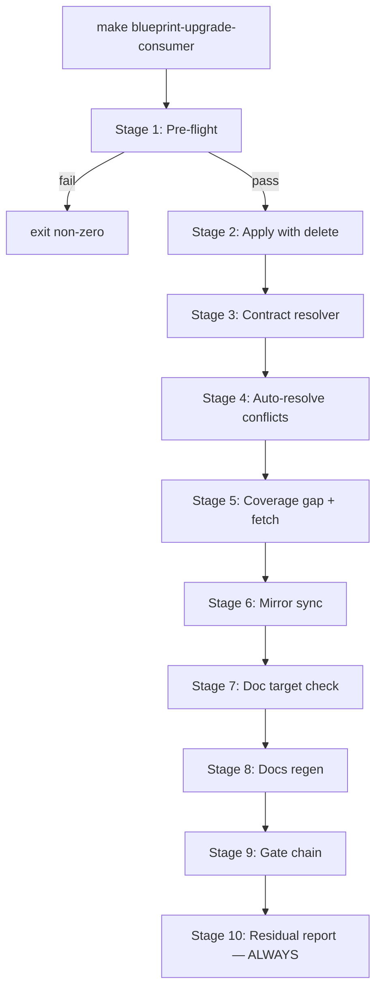

# ADR-20260425-scripted-upgrade-pipeline: Replace blueprint-consumer-upgrade runbook with a deterministic 10-stage scripted pipeline

## Metadata
- Status: proposed
- Date: 2026-04-25
- Owners: sbonoc
- Related spec path: specs/2026-04-25-scripted-upgrade-pipeline/

## Business Objective and Requirement Summary
- Business objective: collapse the `blueprint-consumer-upgrade` skill's ~30 open-interpretation decision points into a single deterministic make target (`make blueprint-upgrade-consumer`) that a consumer operator runs once, reads one residual report, and commits — with no free-form investigation required.
- Functional requirements summary:
  - Pre-flight gate verifies clean working tree, valid `BLUEPRINT_UPGRADE_REF`, and parseable `blueprint/contract.yaml` with `repo_mode: generated-consumer` before any mutation.
  - Contract resolver (`resolve_contract_upgrade.py`) preserves consumer identity fields (`name`, `repo_mode`, `description`), merges `required_files` additively, and drops prune globs that match existing consumer paths — emitting a structured JSON decision report.
  - Coverage gap detector fetches contract-referenced files absent from disk after apply using only local git operations against the already-cloned source repository (no HTTP).
  - Bootstrap template mirror sync overwrites `scripts/templates/blueprint/bootstrap/<path>` for every workspace file changed by Stages 2–5.
  - Make target validator scans new/changed markdown for `make <target>` references and verifies each target appears in a `.PHONY` declaration; emits warnings without aborting.
  - Residual report is always emitted to `artifacts/blueprint/upgrade-residual.md`, even on partial failure; every item includes a prescribed action.
  - Existing individual make targets (`blueprint-upgrade-consumer-apply`, etc.) remain unchanged and independently callable.
- Non-functional requirements summary:
  - No external HTTP fetches at any stage.
  - Idempotent: running twice on a clean working tree after a successful first run produces no changes and exits 0.
  - No consumer-specific logic in pipeline scripts; all consumer configuration read at runtime from `blueprint/contract.yaml`.
  - Stage-labeled structured progress lines emitted to stdout before and after each stage.
- Desired timeline: P2 work item; build on completed Phase 1–3 correctness foundation (Issues #160, #162, #163, #166, #169, #179–187 all done).

## Decision Drivers
- Driver 1: ten observed failure modes (F-001–F-010) during a real v1.0.0→v1.6.0 upgrade required unguided agent judgment; scripting these failure modes eliminates the need for open-interpretation runbook steps.
- Driver 2: the Phase 1–3 correctness foundation (planner audit, fresh-env gate, behavioral check, reconcile report) is now stable — Phase 4 can layer the single-command UX on top of a proven baseline without correctness risk.
- Driver 3: the contract resolver must be deterministic and testable in isolation; embedding merge rules in a runbook does not provide automated regression protection.
- Driver 4: the residual report must always be produced (even on failure) so operators know exactly what remains after a partial pipeline run.

## Options Considered
- Option A: Replace the runbook with a fully scripted 10-stage pipeline entry target (`make blueprint-upgrade-consumer`) that chains existing and new scripts, preserving all individual targets.
- Option B: Enhance the existing runbook with more detailed guidance and automated checks for each decision point without introducing a new orchestrating script.

## Recommended Option
- Selected option: Option A
- Rationale: Option B still requires an agent to execute and interpret guidance at each decision point; the observed failure modes (F-001–F-010) are caused by ambiguous rules, not insufficient guidance. A scripted pipeline removes the agent from the decision loop entirely for the common path. Option A also produces structured artifacts (decision JSON, residual report) that serve as automated regression anchors.

## Rejected Options
- Rejected option 1: Option B (enhanced runbook without scripted orchestrator)
- Rejection rationale: runbook improvements cannot provide the determinism, idempotency, or automated regression protection that scripted stages offer; they also cannot guarantee the residual report is always produced on partial failure.

## Affected Capabilities and Components
- Capability impact:
  - Consumer upgrade UX: single command replaces ~30-step runbook.
  - Contract conflict resolution: deterministic resolver replaces open-interpretation "take source" instruction.
  - Coverage gap detection: automated file fetch replaces manual raw-URL curl.
  - Bootstrap mirror sync: automated sync replaces undetected drift (F-004).
  - Doc target validation: pre-gate check replaces late gate-chain discovery (F-006).
  - Residual report: always-produced structured report replaces manual status assessment (F-010).
- Component impact:
  - `scripts/bin/blueprint/upgrade_consumer.sh` (new entry wrapper)
  - `scripts/lib/blueprint/resolve_contract_upgrade.py` (new)
  - `scripts/lib/blueprint/upgrade_coverage_fetch.py` (new)
  - `scripts/lib/blueprint/upgrade_mirror_sync.py` (new)
  - `scripts/lib/blueprint/upgrade_doc_target_check.py` (new)
  - `scripts/lib/blueprint/upgrade_residual_report.py` (new)
  - `make/blueprint.mk` (new `blueprint-upgrade-consumer` target)
  - `.agents/skills/blueprint-consumer-upgrade/SKILL.md` (reduced to 6-step flow)
  - `tests/blueprint/test_upgrade_pipeline.py` (new unit + integration tests)
  - `artifacts/blueprint/contract_resolve_decisions.json` (new output artifact)
  - `artifacts/blueprint/upgrade-residual.md` (new output artifact)

## Architecture Diagram (Mermaid)

## External Dependencies
- Dependency 1: `blueprint/contract.yaml` — provides `name`, `repo_mode`, `required_files`, `source_artifact_prune_globs_on_init`, `template_sync_allowlist`, `template_sync_prune_targets` read at runtime by Stages 1, 3, 5, 6, 7.
- Dependency 2: upgrade engine conflict JSON (`artifacts/blueprint/upgrade_apply.json`) — consumed by Stage 3 contract resolver.
- Dependency 3: local `BLUEPRINT_UPGRADE_SOURCE` git clone — consumed by Stage 5 for `git show` file retrieval; validated in Stage 1.
- Dependency 4: existing `blueprint-upgrade-consumer-apply`, `infra-validate`, `quality-hooks-run`, `quality-docs-sync-generated-reference` make targets — all invoked by pipeline wrapper.
- Dependency 5: Phase 1–3 correctness foundation (#160, #162, #163, #166, #169, #179–187) — must be merged before this Phase 4 work item to ensure the underlying gates are reliable.

## Risks and Mitigations
- Risk 1: contract resolver must handle all known conflict JSON shapes. Mitigation: fixture-driven unit tests against representative conflict JSON samples (AC-002).
- Risk 2: Stage 5 file fetch depends on the locally cloned source repository being at the correct ref. Mitigation: Stage 1 pre-flight validates `BLUEPRINT_UPGRADE_REF` resolves in `BLUEPRINT_UPGRADE_SOURCE` before any mutation.
- Risk 3: Q-2 (ALLOW_DELETE default) is unresolved pending user decision; the pipeline default value is a pending open question in spec.md. Mitigation: the flag is overridable by the caller; the pipeline can ship with either default without behavior change to individual targets.

## Validation and Observability Expectations
- Validation requirements:
  - `python3 -m pytest tests/blueprint/test_upgrade_pipeline.py`
  - `python3 -m pytest tests/blueprint/test_upgrade_consumer.py` (no regression)
  - `make quality-hooks-fast`
  - `make infra-contract-test-fast`
- Logging/metrics/tracing requirements:
  - Stage-labeled structured progress lines emitted to stdout before and after each stage (NFR-OBS-001).
  - Per-stage JSON artifacts: `contract_resolve_decisions.json`, `upgrade-residual.md`.
  - All gate failures emit human-readable stderr diagnostics including the specific sub-check and file(s) involved (FR-014).
