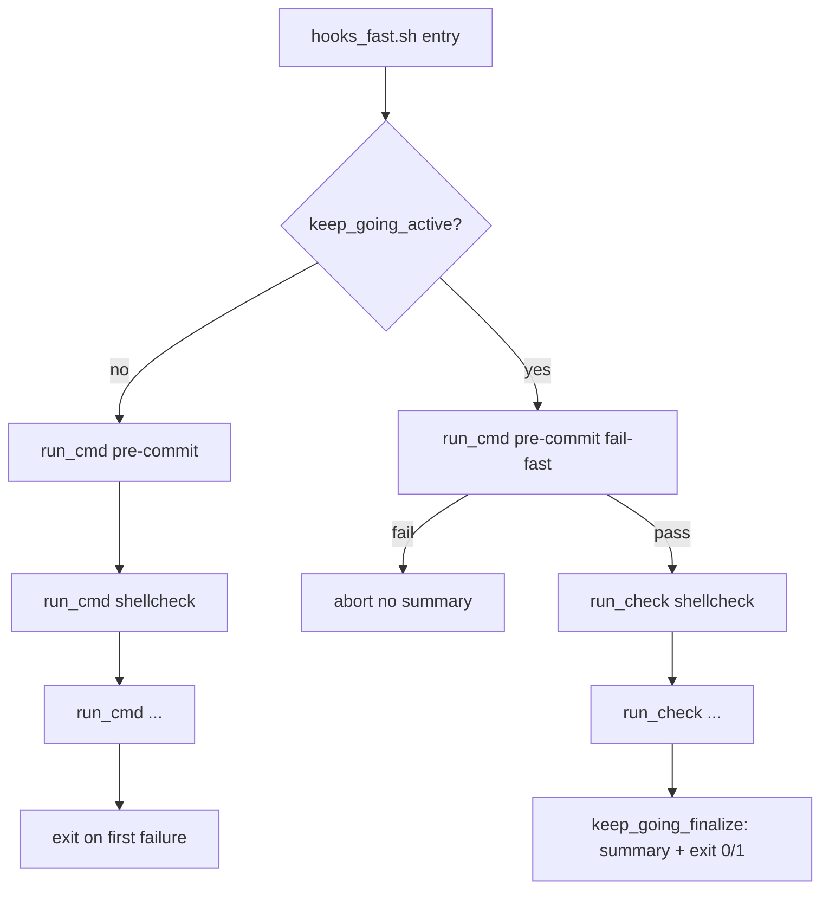
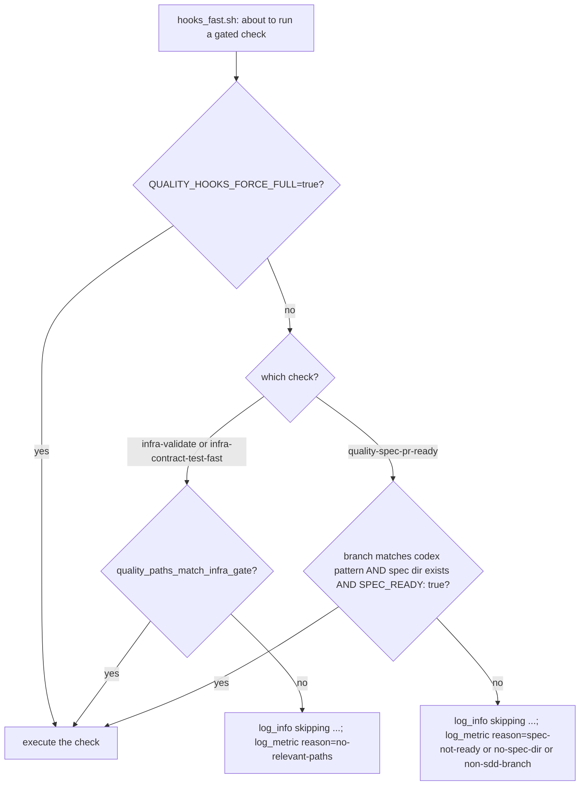

# ADR: Quality Hooks Inner-Loop Verification Ergonomics — Keep-Going, Path-Gating, Phase-Gating, Dedup, Per-Slice Gate Clarification, and Agent-Agnostic Propagation

- **Status:** approved
- **ADR technical decision sign-off:** approved
- **Date:** 2026-04-28
- **Issues:** (none assigned yet)
- **Work item:** `specs/2026-04-28-quality-hooks-keep-going-mode/`

## Context

`scripts/bin/quality/hooks_fast.sh`, `hooks_strict.sh`, and `hooks_run.sh` invoke
each underlying check via `run_cmd` under `set -euo pipefail`. This is correct
CI / pre-commit semantic — but on this repo it imposes ~107 s per `hooks_fast`
invocation and four independent inefficiencies for the agent inner loop.

**Measured baseline (this repo, this branch):** `time make quality-hooks-fast`
total ~107 s. Decomposition: pre-commit ~3.5 s, shellcheck ~5–10 s, every other
quality-* check &lt;1 s, `infra-validate` ~9 s, `infra-contract-test-fast` ~69 s.

The four inefficiencies:

1. **Fail-fast multiplication.** With N independent failures present in the
   working tree, the gate runs N+1 times: each surfaced failure is fixed in
   isolation, the gate is re-run, the next failure surfaces, etc. On observed
   mid-size SDD specs N is typically 2–4, multiplying gate runtime and agent
   token consumption by 3–5×.
2. **Unconditional infra cost.** `infra-validate` (~9 s) and
   `infra-contract-test-fast` (~69 s) run on every invocation regardless of
   whether the changeset can affect any infra contract. Together they are
   ~73 % of `hooks_fast` runtime and provide zero signal on docs / spec /
   agent-skill / governance changes.
3. **Phase-mismatch failure.** `quality-spec-pr-ready` runs as soon as the
   branch matches `codex/<date>-<slug>` and a spec dir exists, even at intake
   time when publish artifacts (`hardening_review.md`, `pr_context.md`) are by
   design scaffold until Step 7. The gate fails-by-design and blocks any clean
   `make quality-hooks-fast` run during Steps 1–6.
4. **Duplicate execution.** Pre-commit's local hooks already run
   `quality-docs-lint` (always) and `quality-test-pyramid` (on test-file
   changes). `hooks_fast.sh` then runs both again as separate `run_cmd` calls.
   The `bash -n` pre-commit hook is also a strict subset of the shellcheck
   step, but it is near-instant and acceptable.

The Step 5 implementation skill compounds (1) by leading agents to use
`quality-hooks-fast` per slice when SDD only requires `make test-unit-all`
per slice. The "Reproducible pre-commit failures" subsection naming
`quality-hooks-fast` is the clearest in-skill reference; agents pattern-match
on it and reach for the heavy gate every iteration.

We want a single coherent change that addresses all four axes without changing
the production CI semantic.

## Decision

### 1. Add a `--keep-going` flag and `QUALITY_HOOKS_KEEP_GOING=true` env var

All three quality-hooks shell entry points accept `--keep-going` and treat
`QUALITY_HOOKS_KEEP_GOING=true` as equivalent. Either trigger activates
keep-going mode for that invocation. Default invocation (no flag, env var
unset or anything other than `true`) preserves byte-identical fail-fast
behavior for non-gated checks.

The env var exists alongside the flag because make recipes, agent harnesses,
and CI overrides are easier to wire via env propagation than via positional
flag forwarding through three layers of indirection.

Aggregation lives in `scripts/lib/shell/keep_going.sh`. Each entry script
chooses between `run_cmd <cmd>` (default — unchanged) and
`run_check <name> -- <cmd>` (keep-going) via an `if keep_going_active` guard.
The default path remains a verbatim `run_cmd` call so byte-identical default
behavior is provable by inspection.

### 2. Path-gate `infra-validate` and `infra-contract-test-fast` in `hooks_fast.sh`

Both checks are the dominant runtime cost (~78 of 107 s) and are unaffected
by changes outside a small set of paths. `hooks_fast.sh` computes the changed
path set once near script start (union of merge-base-vs-main diff and
working-tree diff) and runs each of the two checks if and only if at least
one changed path matches the gating set:

```
infra/
blueprint/contract.yaml
scripts/lib/blueprint/
scripts/bin/blueprint/
scripts/templates/blueprint/
make/
apps/
pyproject.toml
requirements*.txt
```

When gated out, the script emits a `quality_hooks_skip_total` metric with
labels `phase=fast`, `check=<name>`, `reason=no-relevant-paths`, plus a
`log_info` line `skipping <name>: no-relevant-paths`. The env var
`QUALITY_HOOKS_FORCE_FULL=true` overrides skipping and forces both checks to
run regardless. When git is unavailable or merge-base resolution fails, the
script behaves as if `QUALITY_HOOKS_FORCE_FULL=true` (fail-safe: run).

CI runs the full bundle unconditionally (no `QUALITY_HOOKS_FORCE_FULL` needed
because CI does not invoke `hooks_fast.sh` directly with these gates active —
its full-coverage gate is `quality-ci-fast` / `quality-ci-strict` which run
everything). The path-gate optimisation is a local-developer / agent
inner-loop benefit only.

### 3. Phase-gate `quality-spec-pr-ready` on `SPEC_READY: true`

The existing branch-pattern guard in `hooks_fast.sh` is augmented with a
`SPEC_READY: true` predicate. The `quality-spec-pr-ready` check runs only
when:

- The current branch matches `codex/<date>-<slug>`, AND
- The resolved spec directory exists, AND
- The spec's `spec.md` contains the literal line `- SPEC_READY: true`

Otherwise the script skips the check with a `quality_hooks_skip_total`
metric (`reason=spec-not-ready` / `no-spec-dir` / `non-sdd-branch`).
`QUALITY_HOOKS_FORCE_FULL=true` overrides skipping.

Step 7 (PR Packager) explicitly invokes `make quality-spec-pr-ready`, so
the publish-gate check still runs at the right time. The phase-gate change
removes the false-positive failure at intake without weakening the
publish-time enforcement.

### 4. Dedup `quality-docs-lint` and `quality-test-pyramid` from `hooks_fast.sh`

The two `run_cmd make ... quality-docs-lint` and
`run_cmd make ... quality-test-pyramid` calls in `hooks_fast.sh` are deleted.
Both checks remain covered by pre-commit local hooks declared in
`.pre-commit-config.yaml` (`quality-docs-lint` always-run; `quality-test-pyramid`
triggered on staged `tests/**.py`).

The existing `command -v pre-commit` fallback branch in `hooks_fast.sh` is
reframed to emit a `log_warn` directing the user to install pre-commit.
Without pre-commit, docs-lint and test-pyramid coverage genuinely degrades —
this is a real prerequisite, not a silent skip.

### 5. Step 5 implementation skill — per-slice gate vs pre-PR gate

`.agents/skills/blueprint-sdd-step05-implement/SKILL.md` is updated to add an
explicit normative directive:

- The per-slice gate is `make test-unit-all` (or the lane-specific runner
  derived from the spec's Implementation Stack Profile).
- `make quality-hooks-fast` is the slice-batch / pre-PR gate. It runs at the
  boundary between slices and again before publishing — not after every code
  edit.

The "Reproducible pre-commit failures" subsection is reframed so
`quality-hooks-fast` is referenced only in the pre-PR context, not as an
inner-loop signal.

### 6. Cross-skill propagation and agent-agnostic env propagation

The five decisions above only deliver value if every skill (and every agent
operating in the repo) actually uses the new flags and respects the per-slice
vs pre-PR distinction. We propagate via three coordinated mechanisms.

**A. AGENTS.md canonical normative subsection (FR-015).**

`AGENTS.md` gains a new subsection `Quality Hooks — Inner-Loop and Pre-PR
Usage` declaring the per-slice gate, the pre-PR gate, the env vars, the
gating semantics, and the agent env-mandate (`MUST` set
`QUALITY_HOOKS_KEEP_GOING=true` for the session). AGENTS.md is the canonical
agent-agnostic policy source — Claude (via CLAUDE.md delegation), Codex (via
OpenAI agent conventions), and any other agent that adheres to AGENTS.md
inherit the policy automatically. The consumer-init template
`scripts/templates/consumer/init/AGENTS.md.tmpl` mirrors the subsection so
generated consumers inherit the same policy.

This is the single source of truth. Skills do not restate policy.

**B. Six skill cross-links (FR-016).**

Skills that explicitly invoke `quality-hooks-*` (`blueprint-sdd-step04-plan-slicer`,
`blueprint-sdd-step05-implement`, `blueprint-sdd-step07-pr-packager`,
`blueprint-consumer-upgrade`, `blueprint-consumer-ops`, plus reference
checklists) gain a one-line cross-link to the AGENTS.md subsection. The
canonical line is:

> Quality-hooks usage policy (per-slice vs pre-PR gate, keep-going env,
> force-full): see AGENTS.md § Quality Hooks — Inner-Loop and Pre-PR Usage.

A contract test asserts the line is present and that no skill restates the
policy in body text (preventing drift if AGENTS.md changes later).

Step 5's SKILL.md additionally carries the per-slice / pre-PR framing in body
text (FR-014) because it is the skill agents most heavily pattern-match for
inner-loop work; the cross-link is added on top.

**C. Agent-agnostic env propagation kit (FR-017).**

We do not want every agent to have to remember to set the env var. Two
mechanisms ship in-repo:

- `.envrc` at the repo root exports `QUALITY_HOOKS_KEEP_GOING=true` for any
  shell that has direnv loaded. This is the universal mechanism — it covers
  humans, Codex (which inherits the parent shell environment), Cursor,
  Aider, and any future agent that runs commands through the developer's
  shell.
- `.claude/settings.json` env block sets `QUALITY_HOOKS_KEEP_GOING=true` for
  Claude Code sessions specifically, where direnv may not be loaded.

For agents whose harness loads neither (and where the user has not configured
direnv), the AGENTS.md subsection explicitly instructs the agent to export
the var once at session start before invoking any `quality-hooks-*` make
target. This is the fallback for agent harnesses without project-local env
support.

Neither file sets `QUALITY_HOOKS_FORCE_FULL`. Force-full is a deliberate
per-invocation override (e.g. the user wants to verify a contract change ran
the full bundle); defaulting it on would defeat the path-gate optimisation.

**Why not bake the agent default into the script itself?**

We could detect "running in an agent context" via env vars like
`CLAUDE_CODE_AGENT` or `OPENAI_CODEX` and flip the default automatically.
Rejected because (a) the detection is brittle and the env-var names are not
stable across agent versions; (b) it hides a behaviour change in the script
itself, which is harder to discover and reason about than an explicit
`.envrc` / settings.json file; (c) it would diverge default behaviour across
contexts, which complicates the "default is fail-fast for CI / humans"
invariant.

### Pre-commit fail-fast remains in all modes

`hooks_fast.sh` runs pre-commit first, fail-fast, even when keep-going is
active. If pre-commit reports failure, `hooks_fast.sh` aborts before any
downstream check executes. Rationale: pre-commit can rewrite files, and
aggregating downstream checks against a mutated tree would produce results
that do not correspond to the original input.

`hooks_run.sh` invokes `hooks_strict.sh` after `hooks_fast.sh` only when the
fast phase's pre-commit step succeeded; under keep-going, if downstream fast
checks failed (pre-commit passed but later checks failed), strict still runs.

### Summary block is plain text with a stable marker

A literal marker line `===== quality-hooks keep-going summary =====` opens
the block. Each check is one line: name, status (`PASS`/`FAIL`), runtime in
seconds. The block ends with EXACTLY ONE OF `===== all checks passed =====`
or `===== N check(s) failed =====`. JSON output is deferred.

## Alternatives Considered

**Option B — `make -k` over per-check make targets (rejected)**

Decompose every check into its own make target and use `make -k` (keep-going)
at the top level. Rely on make's existing aggregation semantics; express
gating via make conditionals.

Rejected because:

- Requires re-architecting all current shell-driven check invocations into
  make targets and changing the dispatch model.
- `make -k` aggregates exit codes but does not produce a structured
  per-check summary block, does not capture per-check output for tail
  re-emission, and offers no mechanism for the pre-commit fail-fast
  invariant inside an otherwise keep-going run.
- Conditional checks (the new path-gate, the new phase-gate, the existing
  branch-pattern-gated and repo-mode-gated checks) would need conditional
  logic at the make level, which is awkward and harder to test.
- Increases blast radius — every CI invocation of `make` would have to
  remain `-k`-free or risk silently aggregating failures in production.

**Option C — replace `run_cmd` with an aggregating wrapper unconditionally
(rejected)**

Single code path; everything aggregates by default. Rejected because CI and
human pre-commit invocations rely on fail-fast for correctness and runtime.
Changing default semantics is an explicit non-goal.

**Option D — parallel execution of independent checks (deferred)**

Run aggregated checks concurrently. Deferred: aggregation is the prerequisite,
parallelism is a separate optimization with its own risks (file-handle limits,
log interleaving, resource contention) and can build on this foundation later.

**Option E — separate `quality-hooks-touch` lightweight target (rejected for v1)**

Add a third make target with only the cheap checks (pre-commit + sdd-check +
docs-check-changed) for inner-loop dev. With path-gating (decision 2) and
dedup (decision 4), default `make quality-hooks-fast` on docs/spec-only
commits drops to under 15 s — a separate target adds maintenance surface for
marginal gain. Revisit only if measured runtime is still insufficient after
this work item ships.

**Option F — remove `bash -n` from pre-commit (rejected)**

Pre-commit's `bash -n` hook is a strict subset of shellcheck. Removing it
would not measurably speed anything up — it is near-instant and provides
per-file feedback during the pre-commit auto-fix pass.

**Option G — analogous path-gating for `hooks_strict.sh` (rejected for this work item)**

The strict checks (`infra-audit-version`, `apps-audit-versions`,
`blueprint-template-smoke`) are run pre-push and pre-PR, not in the agent
inner loop, so the cost-vs-correctness tradeoff is different. May be revisited
as a separate work item if pre-push wait time becomes a problem.

## Consequences

- New helper files `scripts/lib/shell/keep_going.sh` and
  `scripts/lib/shell/quality_gating.sh`; modified `hooks_fast.sh`,
  `hooks_strict.sh`, `hooks_run.sh` to source them and dispatch accordingly.
- Two execution paths in each entry script (default fail-fast and keep-going).
  The default `run_cmd` lines are preserved verbatim where applicable.
- New env vars: `QUALITY_HOOKS_KEEP_GOING` (`true` enables keep-going),
  `QUALITY_HOOKS_KEEP_GOING_TAIL_LINES` (positive integer, default 40), and
  `QUALITY_HOOKS_FORCE_FULL` (`true` overrides path-gate and phase-gate skips).
- New observability: end-of-run `quality_hooks_keep_going_total` metric in
  keep-going mode; per-skip `quality_hooks_skip_total` metric in default mode
  whenever a path-gate or phase-gate fires.
- Recipe doc-comments in `make/blueprint.generated.mk` (and the bootstrap
  template) updated to mention the env vars; no recipe code change required
  because make exports the calling environment.
- `hooks_fast.sh` no longer invokes `quality-docs-lint` or
  `quality-test-pyramid` directly; pre-commit is the single source of these
  checks. The existing pre-commit-missing fallback emits a `log_warn`.
- `quality-spec-pr-ready` no longer runs at intake time on `codex/*` branches
  with `SPEC_READY: false`; it remains explicitly invoked by Step 7 (PR
  Packager) and runs unconditionally there.
- Step 5 SKILL.md gains a normative per-slice / pre-PR gate directive; agents
  are expected to use `make test-unit-all` per slice and `make quality-hooks-fast`
  only at the slice-batch boundary or pre-PR.
- Measured target on docs/spec-only commits: `make quality-hooks-fast` drops
  from ~107 s to under 15 s. Combined with keep-going aggregation, the
  expected agent inner-loop verification cost drops by an order of magnitude
  for typical SDD slice work.
- Failure-cascade caveat documented: aggregated reports can include derived
  failures from a single root cause; the agent is instructed to fix the
  earliest-reported failure first and re-run, rather than mass-applying fixes.
- Path-gate false-skip risk: deliberately conservative gating set; CI always
  runs the full bundle; `QUALITY_HOOKS_FORCE_FULL=true` provides explicit
  override for verification.


_Default fail-fast vs keep-going aggregation dispatch in `hooks_fast.sh`._


_Path-gate (infra checks) and phase-gate (publish-readiness check) dispatch in `hooks_fast.sh`._
