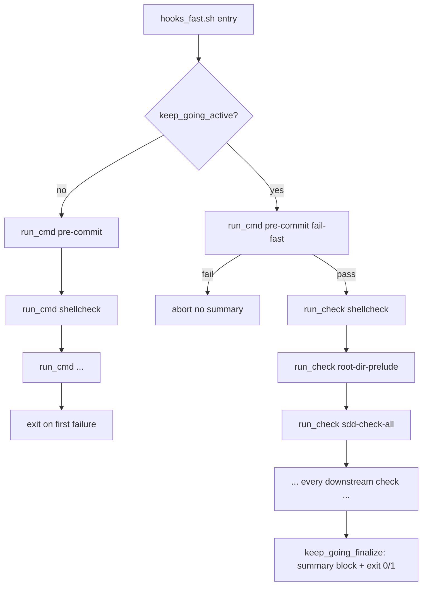

# ADR: Quality Hooks Keep-Going Mode for Agent Inner Loops

- **Status:** proposed
- **ADR technical decision sign-off:** pending
- **Date:** 2026-04-28
- **Issues:** (none assigned yet)
- **Work item:** `specs/2026-04-28-quality-hooks-keep-going-mode/`

## Context

`scripts/bin/quality/hooks_fast.sh`, `hooks_strict.sh`, and `hooks_run.sh` invoke
each underlying check via `run_cmd` under `set -euo pipefail`. The first
non-zero exit aborts the script. This is the correct CI / pre-commit semantic
because:

1. Pre-commit (`pre-commit run --all-files`) can mutate files via auto-fix
   hooks. Subsequent checks observing the post-mutation tree would produce
   results that no longer correspond to the original input.
2. A single root cause can cascade into many derived failures; aborting at
   the first failure keeps the signal high and avoids fix-the-cascade work.
3. Failing fast minimises CI runtime when the tree is broken.

For agent inner loops, however, the same semantic is expensive. With N
independent failures present in the working tree, the gate runs N+1 times:
each surfaced failure is fixed in isolation, the gate is re-run, the next
failure surfaces, etc. On observed mid-size SDD specs N is typically 2–4,
which translates to a 3–5× multiplication of gate runtime and a comparable
increase in token consumption for the agent.

We want an opt-in mode that aggregates failures from independent downstream
checks and reports them together — without changing the default fail-fast
behavior used by CI and human pre-commit invocations.

## Decision

### Add a `--keep-going` flag and `QUALITY_HOOKS_KEEP_GOING=true` env var

All three quality-hooks shell entry points (`hooks_fast.sh`, `hooks_strict.sh`,
`hooks_run.sh`) accept `--keep-going` and treat the env var
`QUALITY_HOOKS_KEEP_GOING=true` as equivalent. Either trigger activates
keep-going mode for that invocation. Default invocation (no flag, env var
unset or anything other than `true`) preserves byte-identical fail-fast
behavior.

The env var exists alongside the flag because make recipes, agent harnesses,
and CI overrides are easier to wire via env propagation than via positional
flag forwarding through three layers of indirection.

### Aggregation lives in `scripts/lib/shell/keep_going.sh`

A new shell helper exposes a small functional surface:

- `keep_going_active` — returns 0 when keep-going is enabled.
- `keep_going_init` — sets up the parallel result arrays and a temp-dir for
  per-check captures; composes its cleanup with the existing
  `start_script_metric_trap` EXIT trap.
- `run_check <name> -- <cmd...>` — executes the command with stdout+stderr
  captured to a temp file, records the exit code and runtime, on failure
  re-emits the configured tail (`QUALITY_HOOKS_KEEP_GOING_TAIL_LINES`,
  default 40) to stderr immediately so the failure is visible in scrollback.
- `keep_going_finalize` — prints the summary block, returns 0 if every
  check passed and 1 otherwise.

Each entry script chooses between `run_cmd <cmd>` (default — unchanged) and
`run_check <name> -- <cmd>` (keep-going) via an `if keep_going_active` guard.
The default path remains a verbatim `run_cmd` call so byte-identical default
behavior is provable by inspection.

### Pre-commit remains fail-fast in all modes

`hooks_fast.sh` runs pre-commit first, fail-fast, even when keep-going is
active. If pre-commit reports failure, `hooks_fast.sh` aborts before any
downstream check executes. Rationale: pre-commit can rewrite files, and
aggregating downstream checks against a mutated tree would produce results
that do not correspond to the original input. The user / agent must re-stage
the mutated files and re-run.

`hooks_run.sh` invokes `hooks_strict.sh` after `hooks_fast.sh` only when the
fast phase's pre-commit step succeeded; if downstream fast checks failed
under keep-going (i.e. pre-commit passed but later checks failed), strict
still runs — the whole point of keep-going is to surface every issue.

### Summary block is plain text with a stable marker

A literal marker line `===== quality-hooks keep-going summary =====` opens
the block. Each check is one line: name, status (`PASS`/`FAIL`), runtime in
seconds. The block ends with either `===== all checks passed =====` or
`===== N check(s) failed =====`. JSON output is deferred to a future
iteration if agent harness integration requires it.

## Alternatives Considered

**Option B — `make -k` over per-check make targets (rejected)**

Decompose every check into its own make target and use `make -k` (keep-going)
at the top level. Rely on make's existing aggregation semantics.

Rejected because:

- Requires re-architecting all current shell-driven check invocations into
  make targets and changing the dispatch model.
- `make -k` aggregates exit codes but does not produce a structured
  per-check summary block, does not capture per-check output for tail
  re-emission, and offers no mechanism for the pre-commit fail-fast
  invariant inside an otherwise keep-going run.
- Conditional checks (branch-pattern-gated `quality-spec-pr-ready`,
  repo-mode-gated `quality-ci-check-sync`, `blueprint-template-smoke`)
  would need conditional logic at the make level, which is awkward.
- Increases blast radius — every CI invocation of `make` would have to
  remain `-k`-free or risk silently aggregating failures in production.

**Option C — replace `run_cmd` with an aggregating wrapper unconditionally
(rejected)**

Single code path; everything aggregates by default. Rejected because CI and
human pre-commit invocations rely on fail-fast for correctness and runtime.
Changing default semantics is an explicit non-goal (see spec Explicit
Exclusions).

**Option D — parallel execution of independent checks (deferred)**

Run aggregated checks concurrently. Deferred: aggregation is the prerequisite,
parallelism is a separate optimization with its own risks (file-handle limits,
log interleaving, resource contention with shellcheck/pre-commit) and can
build on this foundation later.

## Consequences

- New helper file `scripts/lib/shell/keep_going.sh`; modified
  `hooks_fast.sh`, `hooks_strict.sh`, `hooks_run.sh` to source it and
  branch on `keep_going_active`.
- Two execution paths in each entry script (default fail-fast and keep-going).
  The default `run_cmd` lines are preserved verbatim; the keep-going branch
  is a parallel `run_check <name> -- <cmd>` form.
- New env vars: `QUALITY_HOOKS_KEEP_GOING` (`true` enables) and
  `QUALITY_HOOKS_KEEP_GOING_TAIL_LINES` (positive integer, default 40).
- New observability: end-of-run `quality_hooks_keep_going_total` metric
  emitted only in keep-going mode.
- Recipe doc-comments in `make/blueprint.generated.mk` (and the
  bootstrap template) updated to mention the env var; no recipe code change
  required because make exports the calling environment.
- Agent harness can opt into aggregation by exporting the env var once;
  individual `make` invocations inherit it.
- Failure-cascade caveat documented: aggregated reports can include derived
  failures from a single root cause; the agent is instructed to fix the
  earliest-reported failure first and re-run, rather than mass-applying fixes.

_Default fail-fast path (top branch) and keep-going aggregation path (bottom branch) for `hooks_fast.sh`._
