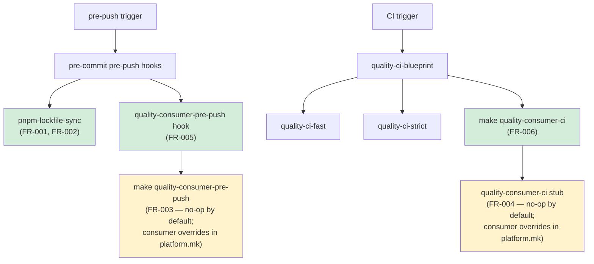

# ADR-20260430-issue-236-237-quality-gate-extensions

## Status
approved

- ADR technical decision sign-off: approved

## Context
Blueprint consumers need two quality-gate improvements:

1. **Lockfile drift gate (Issue #236)**: Blueprint uses `pnpm install --frozen-lockfile` in CI. When a consumer adds or removes a package dependency, the `pnpm-lock.yaml` drifts. There is no local gate that catches this before a push triggers CI. The failure is confusing: CI fails at bootstrap with no prior local signal.

2. **Consumer CI extension points (Issue #237)**: Blueprint defines the quality gate hierarchy (`quality-ci-fast`, `quality-ci-strict`, `quality-ci-blueprint`, pre-push hooks) but provides no upgrade-safe extension point for consumers to plug in their own test tiers. Consumers who add hooks to `.pre-commit-config.yaml` or raw steps to `ci.yml` face merge conflicts on every blueprint upgrade.

## Decision
Add two groups of changes to the blueprint bootstrap templates:

**Group A — pnpm lockfile pre-push hook (Issue #236):**
Add `pnpm-lockfile-sync` to the `.pre-commit-config.yaml` bootstrap template as a `pre-push` stage hook. It runs `pnpm install --frozen-lockfile --prefer-offline` whenever any `package.json` in the workspace changes (pattern: `(^|/)package\.json$`). Uses `--prefer-offline` to avoid network traffic.

**Group B — Consumer quality gate extension stubs (Issue #237):**
Add two no-op `.PHONY` Make targets to `blueprint.generated.mk` (and its template):
- `quality-consumer-pre-push` — no-op by default; consumers override in `platform.mk`
- `quality-consumer-ci` — no-op by default; consumers override in `platform.mk`

Wire `quality-consumer-ci` into the `quality-ci-blueprint` recipe as its final step.

Add a `quality-consumer-pre-push` pre-push hook to the `.pre-commit-config.yaml` bootstrap template that calls `make quality-consumer-pre-push`.

**Group C — AGENTS.md template documentation (Issue #237):**
Update `scripts/templates/consumer/init/AGENTS.md.tmpl` to document both extension targets in the quality gate section with tier placement convention: Tier 1/unit work maps to `quality-consumer-pre-push`; Tier 2/component work maps to `quality-consumer-ci`. This ensures consumers who run `blueprint-init-repo` receive the documentation alongside the stubs.

Consumers override the stubs in `platform.mk` (consumer-owned, never touched by blueprint upgrades):
```makefile
quality-consumer-pre-push:
    @make backend-test-unit
    @make touchpoints-test-unit

quality-consumer-ci:
    @make touchpoints-test-component
```

## Alternatives Considered

**Alternative D (parallel quality-hooks execution):** Parked in a prior work item for different reasons — not relevant here.

**Option B for `quality-consumer-ci` wiring:** Document it as a consumer-positioned step in `ci.yml` only. Rejected because it requires consumers to remember to position the call and does not provide a contract-enforced extension point. Option A (wire into `quality-ci-blueprint`) ensures the extension always runs.

## Consequences

**Positive:**
- Consumers catch lockfile drift locally before CI fails.
- Consumer test tiers are extensible without merge-conflict risk on blueprint upgrade.
- Blueprint tooling can reason about the existence of consumer CI extension points (named targets with consistent convention).

**Negative / Trade-offs:**
- `quality-consumer-pre-push` hook always runs at pre-push (no `files:` filtering), costing a `make` invocation per push even when the stub is a no-op. Cost is negligible (`@true` exits immediately).
- Consumers lose pre-commit `files:` filtering for their custom test tiers. Acceptable trade-off documented in spec.md.

## Diagrams



Caption: Green nodes are new blueprint wiring; yellow nodes are consumer-owned override points in `platform.mk`.
