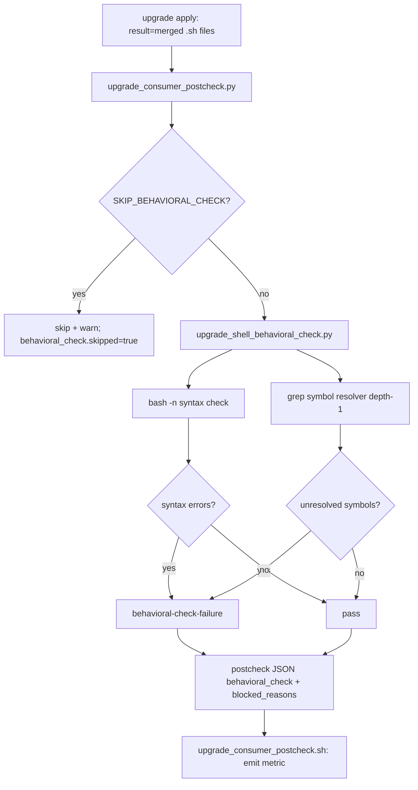
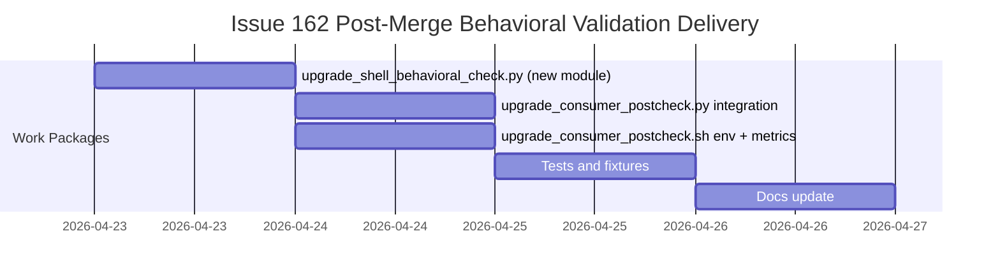

# ADR-issue-162-post-merge-behavioral-validation: Post-merge behavioral validation gate for upgrade shell scripts

## Metadata
- Status: approved
- Date: 2026-04-23
- Owners: sbonoc
- Related spec path: specs/2026-04-23-issue-162-post-merge-behavioral-validation/

## Business Objective and Requirement Summary
- Business objective: Prevent silent `command not found` regressions in consumer repos caused by 3-way merges that drop shell function definitions while retaining their call sites, so that upgrade runs with green reports are also behaviorally correct.
- Functional requirements summary:
  - Run `bash -n` syntax check on every `.sh` file whose upgrade apply result is `merged`.
  - Run a grep-based symbol resolution check (function defs vs call sites, depth-1 source chain) on the same file set.
  - Surface failures with file path, symbol name, and line number before declaring the upgrade complete.
  - Provide a deterministic opt-out flag (`BLUEPRINT_UPGRADE_SKIP_BEHAVIORAL_CHECK=true`) with a mandatory warning.
  - Emit a structured `behavioral_check` section in the postcheck JSON report and a metric for gate failures.
- Non-functional requirements summary:
  - Security: `bash -n` is syntax-only; merged content MUST NOT be executed.
  - Observability: per-file findings in postcheck JSON; metric `blueprint_upgrade_postcheck_behavioral_check_failures_total`.
  - Reliability: gate MUST be idempotent and MUST NOT mutate the working tree.
  - Operability: failure output MUST be actionable (file, symbol, line).

## Decision Drivers
- Driver 1: 3-way merge operates on text, not semantics. A green merge can silently drop a function definition whose call site was added in the same merge, producing a runtime failure invisible in the upgrade report.
- Driver 2: The existing postcheck phase validates merge application but not behavioral correctness of the merged result.
- Driver 3: MVP coverage of the dominant failure pattern (static function defs/calls in a single file or direct source) is sufficient to address the risk; a full shell parser is not required.

## Options Considered
- Option A: New standalone module `scripts/lib/blueprint/upgrade_shell_behavioral_check.py` integrated into `upgrade_consumer_postcheck.py` as a function call; grep/regex heuristic, depth-1 source resolution.
- Option B: Inline all gate logic directly in `upgrade_consumer_postcheck.py`.
- Option C: Full POSIX shell parser (e.g. `shfmt` AST or Python-based parser) for complete semantic analysis.

## Recommended Option
- Selected option: Option A
- Rationale: A standalone module is independently unit-testable without full postcheck orchestration, satisfies SRP, and can be extended without touching the orchestrator. A grep heuristic covers the dominant failure pattern at negligible cost. Option C would introduce a significant parser dependency for marginal incremental coverage given the MVP scope.

## Rejected Options
- Rejected option 1: Option B — inlining bloats `upgrade_consumer_postcheck.py` and couples gate tests to the full postcheck fixture stack.
- Rejected option 2: Option C — full shell parser is disproportionate to MVP scope; the issue explicitly accepts grep-based heuristics. Can be revisited if false negatives accumulate.

## Affected Capabilities and Components
- Capability impact:
  - Consumer upgrade postcheck correctness gate
  - Upgrade CI e2e lane (Phase 2 extension of #169)
- Component impact:
  - `scripts/lib/blueprint/upgrade_shell_behavioral_check.py` (new)
  - `scripts/lib/blueprint/upgrade_consumer_postcheck.py` (extended)
  - `scripts/bin/blueprint/upgrade_consumer_postcheck.sh` (extended)
  - `tests/blueprint/test_upgrade_postcheck.py` (extended)
  - `docs/blueprint/` upgrade postcheck reference docs (updated)

## Architecture Diagram (Mermaid)

## High-Level Work Packages and Timeline (Mermaid Gantt)

## External Dependencies
- Dependency 1: `bash` binary available on PATH in consumer repo environment (already required by existing upgrade tooling).
- Dependency 2: Apply report JSON with `result` field populated by `upgrade_consumer.py` (existing contract).

## Risks and Mitigations
- Risk 1: Grep heuristic has false negatives for dynamic function names or heredoc call sites.
- Mitigation 1: Explicitly scoped to MVP; documented in spec exclusions. Depth-1 source resolution covers the dominant case. Follow-up can deepen coverage if false negatives are observed.
- Risk 2: Gate blocks upgrades for edge-case scripts that legitimately use dynamic dispatch.
- Mitigation 2: `BLUEPRINT_UPGRADE_SKIP_BEHAVIORAL_CHECK=true` opt-out with mandatory warning provides a deterministic escape hatch.

## Validation and Observability Expectations
- Validation requirements:
  - `make quality-sdd-check`
  - `make quality-hooks-run`
  - `pytest tests/blueprint/test_upgrade_postcheck.py`
  - `pytest tests/blueprint/test_upgrade_consumer_wrapper.py`
- Logging/metrics/tracing requirements:
  - `blueprint_upgrade_postcheck_behavioral_check_failures_total` metric emitted by shell wrapper.
  - Per-file findings (file, symbol, line) in postcheck JSON `behavioral_check` section.
  - `log_warn` emitted when gate is skipped via opt-out flag.
