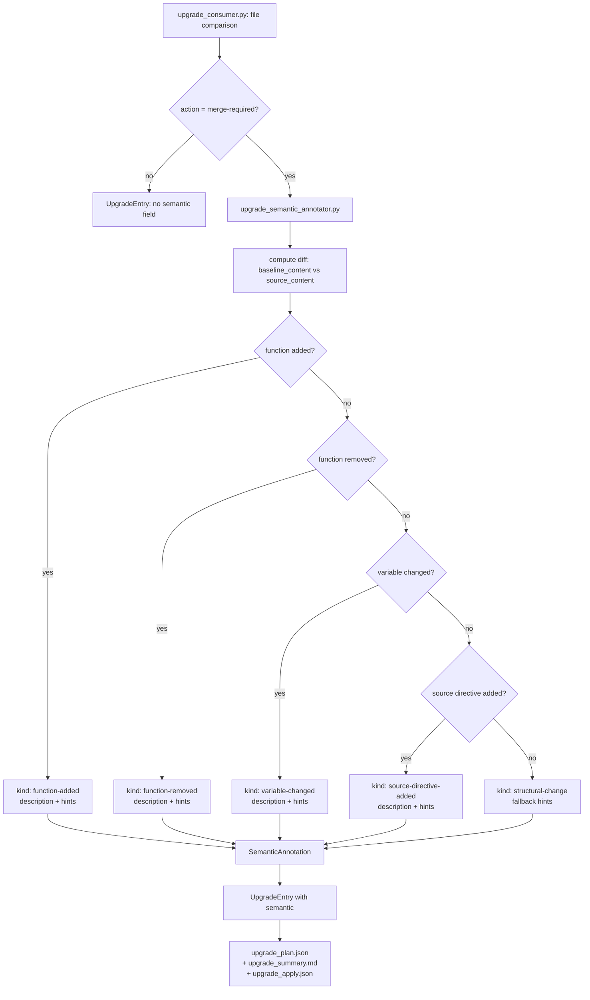
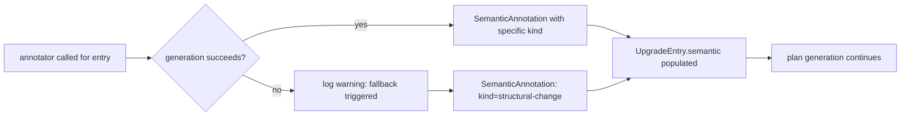
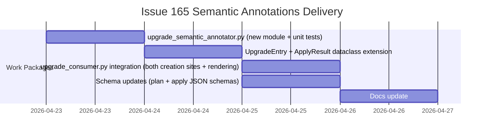

# ADR-issue-165-semantic-annotations: Semantic annotations on merge-required upgrade plan entries

## Metadata
- Status: draft
- Date: 2026-04-23
- Owners: sbonoc
- Related spec path: specs/2026-04-23-issue-165-semantic-annotations/
- ADR product context sign-off: approved
- ADR technical decision sign-off: pending

---

## Product Context Layer
<!-- This section is authored by the Product Owner. -->

### Business Objective and Requirement Summary
- Business objective: Upgrade plan `merge-required` entries must tell consumers not only which file needs a 3-way merge, but what changed semantically and what to verify after applying the merge — closing the consumer information gap that today forces developers to read raw diffs or changelogs to understand what invariants to check.
- Functional requirements summary:
  - Every `merge-required` plan entry must carry a `semantic` annotation with a `kind`, a human-readable `description` of the change, and one or more `verification_hints` the consumer must act on.
  - The annotation must be auto-generated from the baseline-to-source diff using static analysis, with a `structural-change` fallback for complex diffs.
  - The annotation must appear in `upgrade_plan.json`, `upgrade_summary.md`, and `upgrade_apply.json` for `merge-required` result items.
- Non-functional requirements summary:
  - Security: annotation generation is static analysis only — no file content execution.
  - Observability: plan generation logs annotation coverage (auto vs. fallback counts).
  - Reliability: per-entry generation failures fall back gracefully; contract changes are backward-compatible.
  - Operability: annotation readable directly from existing artifacts without new tooling.
- Desired timeline: ship before next release tag (target v1.5.0, 2026-04-23 sprint).

### Decision Drivers
- Driver 1: `merge-required` entries today carry only a file path and a reason string. Consumers must independently locate and read the diff to understand what changed and what to verify — there is no in-plan guidance.
- Driver 2: The post-merge behavioral gate (#162) detects problems after apply, but there is no equivalent signal at plan time telling the consumer what to look for. Annotations bridge this gap: the consumer knows before touching a file what invariants the merge must preserve.
- Driver 3: Blueprint-managed changes follow predictable patterns (function additions, variable updates, source directives) that are reliably detectable with static heuristics, making auto-generation practical without a full shell parser.

---

## Technical Decision Layer
<!-- Agent draft — pending architect review -->
> **Agent draft**: the sections below were generated by the coding assistant from
> codebase analysis. The recommended option and consequences are proposals only.
> This notice is removed when the architect gives `ADR technical decision sign-off`.

### Options Considered
- Option A: New standalone module `scripts/lib/blueprint/upgrade_semantic_annotator.py` with static regex heuristics called from both `merge-required` entry creation sites in `upgrade_consumer.py`; `structural-change` fallback for unmatched patterns.
- Option B: Human-authored annotation metadata files stored alongside blueprint-managed files (e.g. `<file>.semantic.yaml`); loaded and merged into plan entries at generation time.

### Recommended Option
- Selected option: Option A
- Rationale: Option A derives annotations from the actual diff at generation time — zero authoring overhead, always consistent with the change. The dominant patterns in blueprint shell scripts (function additions/removals, variable assignment changes, source directive additions) are reliably detectable via regex with minimal false-negative risk for the MVP scope. A standalone module is independently unit-testable without the full plan generation stack, satisfying SRP and enabling future extension. Option B requires authors to maintain annotation files in sync with every blueprint change, introduces a new file contract with no enforcement mechanism, and produces annotations that can silently diverge from the actual diff.

### Rejected Options
- Rejected option 1: Option B — annotation files drift from actual changes with no automated detection; authoring burden adds friction to every blueprint change; no enforcement without additional linting tooling.

### Affected Capabilities and Components
- Capability impact:
  - Upgrade plan readability and consumer actionability
  - Upgrade apply report annotation coverage (carry-through from plan)
- Component impact:
  - `scripts/lib/blueprint/upgrade_semantic_annotator.py` (new standalone module)
  - `scripts/lib/blueprint/upgrade_consumer.py` — `UpgradeEntry` dataclass extended with `semantic` field; both `merge-required` creation sites updated; `as_dict()` updated; summary markdown renderer updated
  - `scripts/lib/blueprint/upgrade_consumer.py` — `ApplyResult` `as_dict()` updated to carry `semantic`
  - `scripts/lib/blueprint/schemas/upgrade_plan.schema.json` — optional `semantic` property added to entry items
  - `scripts/lib/blueprint/schemas/upgrade_apply.schema.json` — optional `semantic` property added to result items
  - `tests/blueprint/test_upgrade_semantic_annotator.py` (new test module)
  - `tests/blueprint/test_upgrade_consumer.py` — extended with annotation assertions
  - `docs/blueprint/` upgrade reference docs — `semantic` field, `kind` enum, hint format documented

### Architecture Diagrams

**Flowchart: semantic annotation generation within the plan entry creation pipeline.** A flowchart was chosen because the logic is a decision branch within existing procedural script flow, not a request/response sequence or state machine.

**Flowchart: error handling and fallback path during annotation generation.** A separate diagram shows the resilience contract explicitly — generation errors must not abort plan generation.

### High-Level Work Packages and Timeline (Mermaid Gantt)

### External Dependencies
- Dependency 1: `baseline_content` available in `UpgradeEntry` at both `merge-required` creation sites in `upgrade_consumer.py` (already resolved from git before entry creation — lines 394–396 and cached at line 648). No new I/O required.
- Dependency 2: `source_content` available at both creation sites (already read before comparison). No new I/O required.

### Risks and Mitigations
- Risk 1: Regex heuristics produce false negatives for complex diffs (large refactors, heredoc-embedded assignments, dynamically constructed function names) — annotation falls back to `structural-change` silently.
- Mitigation 1: `structural-change` fallback is always actionable ("manually review the diff"). Detection coverage can be extended incrementally without changing the annotation contract or schema. False negatives are documented as accepted MVP scope in spec exclusions.
- Risk 2: Both `merge-required` creation sites in `upgrade_consumer.py` need independent updates; a missed site produces entries without `semantic`.
- Mitigation 2: Unit tests MUST assert `semantic` is non-None on every `merge-required` entry produced by both creation paths (additive file path and 3-way merge path). The test module covers both call sites with dedicated fixtures.

### Validation and Observability Expectations
- Validation requirements:
  - `make quality-sdd-check`
  - `make quality-hooks-run`
  - `pytest tests/blueprint/test_upgrade_semantic_annotator.py` — positive-path fixture for each `kind`; negative-path fixture confirming `structural-change` fallback; error-injection fixture confirming plan generation continues on annotator exception
  - `pytest tests/blueprint/test_upgrade_consumer.py` — assert `semantic` present on `merge-required` entries from both creation sites
- Logging/metrics/tracing requirements:
  - Plan generation logs: `merge-required entries: N, auto-annotated: M, structural-change fallback: P`
  - Warning log per entry where annotation generation raised an exception
  - No new metrics counters or distributed trace spans required
