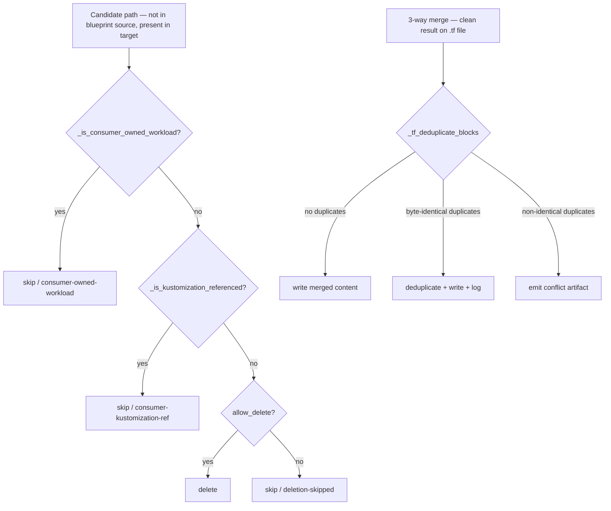

# ADR: Upgrade Apply Correctness — Kustomization-Ref Prune Guard and Terraform Block Deduplication

- **Status:** proposed
- **Date:** 2026-04-27
- **Issues:** #203, #204
- **Work item:** `specs/2026-04-27-issue-203-204-upgrade-apply-correctness/`

## Context

Two correctness bugs were uncovered during the dhe-marketplace v1.6.0→v1.7.0 blueprint upgrade:

**Bug #203 — Prune deletes consumer-renamed seeded files**

When a consumer renames a blueprint-seeded manifest (e.g. `backend-api-deployment.yaml` →
`marketplace-api-deployment.yaml`) and updates their `kustomization.yaml` to reference the
new name, Stage 2 prune treats the renamed file as stale (no match in blueprint source) and
deletes it. The original blueprint-named file is restored. The consumer's `kustomization.yaml`
references a file that no longer exists; `kustomize build` fails.

A path-specific bridge guard (`_is_consumer_owned_workload`) was introduced for `base/apps/`
in issue #207. That guard does not cover overlay trees such as
`infra/gitops/platform/environments/local/` where the same rename pattern occurs.

**Bug #204 — 3-way merge emits duplicate Terraform variable blocks**

`git merge-file` does not detect or deduplicate named content blocks. When the same
`variable "opensearch_enabled" {}` block is present in both the consumer branch and the
incoming blueprint branch at different offsets, the merge emits both copies without conflict
markers, producing syntactically invalid Terraform that fails `terraform validate`.

## Decision

### #203: Generalise the prune guard to kustomization-referenced files

Add `_is_kustomization_referenced(repo_root, relative_path) -> bool` that:

1. Walks all `kustomization.yaml` files under the same overlay directory as `relative_path`
   (i.e. files co-located in any ancestor directory up to the managed-dir root).
2. Parses each with `yaml.safe_load`.
3. Returns `True` if `relative_path`'s basename appears as an entry in `resources:` or
   `patches:` (either direct string or `path:` key in a patch object).

In `_classify_entries`, insert this check immediately after `_is_consumer_owned_workload`:
when the file is absent in the blueprint source, is present in the consumer tree, and
`_is_kustomization_referenced` returns `True`, classify the entry as
`consumer-kustomization-ref` / `skip` / `none` regardless of `allow_delete`.

This check is purely additive — it does not change behavior for files that are not
kustomization-referenced.

### #204: Post-merge Terraform block deduplication

After a successful (zero-conflict) `git merge-file` on a `.tf` file, apply
`_tf_deduplicate_blocks(merged_content)`:

1. Scan for top-level named block declarations using the regex pattern
   `^(\w+)\s+"[^"]+"\s*(?:"[^"]+"\s*)?\{` (covers `variable`, `resource`, `data`,
   `output`, `locals`, `module`).
2. Collect the full block text for each declaration (from `{` to matching `}`).
3. For each block key (type + label(s)):
   - **Byte-identical duplicate**: remove all but the first occurrence; record in
     `ApplyResult.reason` and `deduplication_log`.
   - **Non-identical duplicate**: emit conflict artifact; classify as `conflict`.
4. If no duplicates: write merged content unchanged (zero overhead on the common path).

## Alternatives Considered

**For #203 — bridge guard per directory pattern (rejected)**
Extend `_is_consumer_owned_workload` with additional path prefixes. Rejected: requires
enumerate-and-maintain a growing list of overlay paths; kustomization-ref check is
self-describing (the consumer's own kustomization.yaml declares ownership).

**For #204 — add `terraform validate` to VALIDATION_TARGETS (deferred)**
This would catch the symptom post-merge. Rejected as the primary fix: requires Terraform
on the upgrade runner PATH and is provider-dependent (slow). Remains a valid complementary
gate; filed as a follow-up in the backlog.

## Consequences

- `_classify_entries` signature gains `repo_root: Path` (already available at all call
  sites via the enclosing scope; passed explicitly for testability).
- `_three_way_merge` result is post-processed for `.tf` files: negligible overhead on the
  common (no-duplicate) path.
- Both fixes are additive: no existing test assertions change.
- The `_is_consumer_owned_workload` bridge guard for `base/apps/` remains in place as a
  zero-cost fast path; issue #203 comment updated to reflect the general fix.

_Prune decision tree (top) and Terraform post-merge deduplication path (bottom)._
