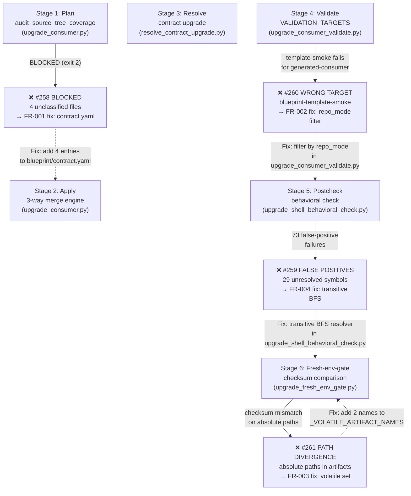
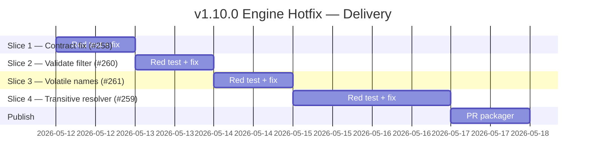

# ADR-issue-258-259-260-261-v110-engine-hotfix: v1.10.0 upgrade engine hotfix — contract coverage, validate filtering, volatile artifacts, transitive behavioral check

## Metadata
- Status: approved
- Date: 2026-05-12
- Owners: Blueprint maintainer
- Related spec path: specs/2026-05-12-issue-258-259-260-261-v110-engine-hotfix/spec.md
- ADR product context sign-off: approved
- ADR technical decision sign-off: approved

---

## Product Context Layer
<!-- This section is authored by the Product Owner. -->

### Business Objective and Requirement Summary
- Business objective: Unblock all consumers currently unable to complete `make blueprint-upgrade-consumer` against v1.10.0 without consumer-side workarounds. Four independent bugs in the upgrade pipeline block every consumer; this ADR records the decisions that fix them.
- Functional requirements summary: (1) Classify 4 unclassified blueprint source files in `blueprint/contract.yaml`. (2) Skip `blueprint-template-smoke` in validate targets for `generated-consumer` repos. (3) Exclude two path-dependent artifacts from fresh-env-gate checksum comparison. (4) Resolve function definitions from the full transitive source chain in the behavioral check.
- Non-functional requirements summary: All fixes MUST be backward-compatible, preserve existing JSON artifact schemas, and be fully testable without a k8s cluster.
- Desired timeline: Next blueprint release following intake sign-off.

### Decision Drivers
- Driver 1: Every consumer upgrading to v1.10.0 is blocked; the workarounds are fragile and must be maintained per-consumer.
- Driver 2: The four bugs share a single shipping milestone (v1.10.0) and are best fixed together to avoid partial-hotfix confusion.

---

## Technical Decision Layer

### Options Considered

**Decision 1 — FR-001: Contract coverage classification**
- Option A (blueprint contract entries): add the 4 files to the correct ownership sections in `blueprint/contract.yaml`.
- Option B (consumer contract workaround as permanent): document the 4 entries as a mandatory consumer-side override; no blueprint change.

**Decision 2 — FR-002: Validate target filtering**
- Option A (repo_mode filter in validate module): apply the same skip already present in `quality-hooks-strict` to `upgrade_consumer_validate.py`.
- Option B (remove blueprint-template-smoke from VALIDATION_TARGETS entirely): unconditionally drop the target; loses template-source-mode coverage.

**Decision 3 — FR-003: Volatile artifact divergence**
- Option A (volatile-set extension): add `upgrade_validate.json` and `required_files_status.json` to `_VOLATILE_ARTIFACT_NAMES`.
- Option B (path normalization in artifact writers): strip absolute paths before writing both artifacts to disk.

**Decision 4 — FR-004: Behavioral check false positives**
- Option A (transitive resolver + bare-command suppression): replace depth-1 source collection with BFS + cycle detection; suppress tokens that are not function definitions anywhere in the transitive chain.
- Option B (contract default exclusion list): ship a default `extra_excluded_tokens` list in `blueprint/contract.yaml` for the 29 known false-positive symbols.

### Recommended Option

- Decision 1: **Option A** — the blueprint contract is the source of truth; Option B permanently externalises a blueprint maintenance obligation to every consumer.
- Decision 2: **Option A** — the skip logic already exists in `quality-hooks-strict`; applying it to the validate module makes the two execution paths consistent; Option B removes a valid check for template-source repos.
- Decision 3: **Option A** — minimal, surgical, zero schema risk; Option B requires modifying three artifact writers and risks introducing subtle field-level schema changes.
- Decision 4: **Option A** — fixes the root cause structurally; Option B requires manual maintenance of the exclusion list for every new transitive symbol added to the blueprint in any future release, creating ongoing drift risk.

### Rejected Options
- Decision 1, Option B: permanently delegates blueprint maintenance to consumers; unacceptable.
- Decision 2, Option B: removes a valid check for template-source repos; narrows regression coverage unnecessarily.
- Decision 3, Option B: higher implementation risk (three artifact writers) for the same behavioral outcome; rejected for this hotfix.
- Decision 4, Option B: patches the symptom, not the cause; will recur silently for any new transitive symbol; rejected.

### Affected Capabilities and Components
- Capability impact: `blueprint-upgrade-consumer` pipeline — all four stages (plan, validate, postcheck, fresh-env-gate) affected; all improve to pass without consumer workarounds.
- Component impact:
  - `blueprint/contract.yaml` (Decision 1)
  - `scripts/lib/blueprint/upgrade_consumer_validate.py` (Decision 2)
  - `scripts/lib/blueprint/upgrade_fresh_env_gate.py` (Decision 3)
  - `scripts/lib/blueprint/upgrade_shell_behavioral_check.py` (Decision 4)

### Architecture Diagrams

**Caption: Upgrade pipeline stage flow showing which bug affects which stage and where each fix is applied. Flowchart chosen because this is a decision/control-flow concern, not a data model or service interaction.**

### High-Level Work Packages and Timeline (Mermaid Gantt)

### External Dependencies
- Dependency 1: Consumer workaround adoption — consumers who have applied the documented workarounds must remove them after adopting the fixed blueprint version; no automated migration is provided.

### Risks and Mitigations
- Risk 1 (FR-004 cycle guard): Circular source chains cause infinite recursion without a visited-set. Mitigation: the BFS maintains a `frozenset` of visited absolute paths; fixture in Slice 4 part C validates the guard explicitly.
- Risk 2 (FR-003 volatile-set approach): `upgrade_validate.json` and `required_files_status.json` are now excluded from fresh-env behavioral comparison. If a behavioral regression ever manifests via path changes in these artifacts, the gate would not catch it. This risk is accepted because the behavioral content is validated by the make targets themselves, not by checksum comparison.

### Validation and Observability Expectations
- Validation requirements: Four pytest regression tests (one per slice), `make infra-validate`, `make quality-hooks-run`.
- Logging/metrics/tracing requirements: No new observability signals. Existing WARNING/ERROR lines in all four affected modules are preserved.
