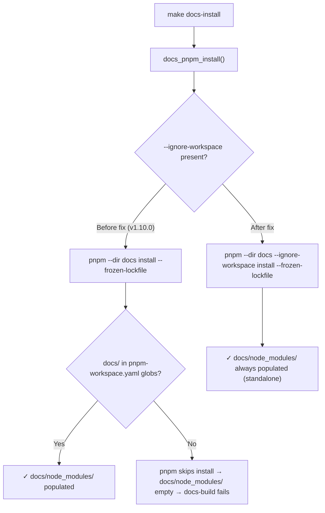

# ADR-issue-272-273-v110-docs-hotfix: v1.10.0 docs hotfix — restore --ignore-workspace and improve pnpm version assertion diagnostics

## Metadata
- Status: approved
- Date: 2026-05-12
- Owners: Blueprint maintainer
- Related spec path: specs/2026-05-12-issue-272-273-v110-docs-hotfix/spec.md
- ADR product context sign-off: approved
- ADR technical decision sign-off: approved

---

## Product Context Layer
<!-- This section is authored by the Product Owner. -->

### Business Objective and Requirement Summary
- Business objective: Unblock consumers upgrading to v1.10.0 who cannot run `make docs-build` because `docs/node_modules/` is silently empty (#272), and provide actionable guidance to consumers who hit the pnpm version mismatch error introduced in v1.10.0 (#273).
- Functional requirements summary: (1) Restore `--ignore-workspace` to three pnpm invocations in `scripts/lib/docs/site.sh`. (2) Rewrite the `_docs_assert_pnpm_version` error message to name all three sources of active pnpm version truth.
- Non-functional requirements summary: Both fixes MUST be backward-compatible, preserve existing log output structure, and be regression-tested without a k8s cluster or pnpm installation.
- Desired timeline: Next blueprint release following intake sign-off.

### Decision Drivers
- Driver 1: Consumers with a root `pnpm-workspace.yaml` that excludes `docs/` are blocked by a silent `docusaurus: not found` error after upgrading to v1.10.0.
- Driver 2: The pnpm version mismatch error names only "the local pnpm installation or the CI action's corepack prepare pin", but omits the most common cause — the root `package.json` `packageManager` field auto-activated by corepack when `pnpm install` is run from repo root.
- Driver 3: Both defects live in the same file and the same blueprint release; shipping together avoids two partial-hotfix PRs.

---

## Technical Decision Layer

### Options Considered

#### Decision 1: Scope of #273 fix (error message improvement vs. automation)

- **Option A — Minimal (selected):** Improve the `log_fatal` message text in `_docs_assert_pnpm_version` to enumerate all three pnpm version sources. No new scripts, no new Make targets.
- **Option B — Broader:** Option A + add a `blueprint-align-pnpm-pins` Make target backed by `scripts/bin/blueprint/align_pnpm_pins.sh` that rewrites all `packageManager` fields in the repo to match the `docs/package.json` pin.

#### Decision 2: #272 fix approach (no alternatives — the regression is unambiguous)

Restore `--ignore-workspace` to the three pnpm invocations and the explanatory comment. The pre-v1.10.0 comment was explicit: "The docs site is intentionally outside the frontend workspace package globs. Force standalone install so CI clean runners do not skip docs dependencies." The flag is correct and must be restored.

### Decision and Rationale

- **Decision 1: Option A selected.**
  - Rationale: This is a hotfix PR. Option A fixes the exact user-visible problem (opaque error with no actionable guidance) with a one-line change. Option B introduces a new automation script in a hotfix context, expanding scope and review surface. The migration script is valuable but belongs in a dedicated follow-on work item where it can be properly scoped, tested, and documented.
  - The error message improvement is sufficient for operators: once they know to check `root package.json#packageManager`, the fix is a straightforward align-and-update across the affected files.

- **Decision 2: Restore `--ignore-workspace` unconditionally.**
  - The `--ignore-workspace` flag is semantically correct regardless of whether `docs/` appears in the consumer's workspace globs. It enforces the contract that the Docusaurus site is a standalone workspace and its install must never be skipped due to workspace configuration. It is safe for consumers whose workspace includes `docs/` — it simply forces standalone resolution, which produces the same result.

### Implementation Notes
- `docs_pnpm_install`: add `--ignore-workspace` between `--dir "$DOCS_SITE_DIR"` and `install`; restore comment.
- `docs_pnpm_build`: add `--ignore-workspace` between `--dir "$DOCS_SITE_DIR"` and `run build`.
- `docs_pnpm_start`: add `--ignore-workspace` between `--dir "$DOCS_SITE_DIR"` and `run start`.
- `_docs_assert_pnpm_version`: replace single-line `log_fatal` with a multi-part message naming all three sources.

### Risks and Mitigations
- Risk: A consumer whose workspace explicitly includes `docs/` might experience behavior change from `--ignore-workspace`. Mitigation: `--ignore-workspace` is additive — it forces standalone resolution, which is always correct for an intentionally self-contained workspace. No regression is possible.
- Risk: Expanded error message verbosity. Mitigation: `log_fatal` exits immediately; verbose text is diagnostic-only and does not affect pipeline artifacts.

---

## Diagrams

### pnpm workspace resolution: before and after #272 fix

---

## Deferred Proposals

- **Proposal: `blueprint-align-pnpm-pins` migration target** — Add a `blueprint-align-pnpm-pins` Make target backed by `scripts/bin/blueprint/align_pnpm_pins.sh` that takes `docs/package.json` as canonical and rewrites all other `packageManager` fields in the repo to match. Parked with `trigger: on-scope: blueprint`.
- **Proposal: Preflight pnpm version drift detection** — Add a `quality-pnpm-version-contract` check (or fold into `infra-validate`) that scans all `package.json` `packageManager` fields in the repo and reports drift before any install runs. Parked with `trigger: on-scope: quality`.
