# ADR: Autonomous Software Factory — Phase 0 Foundations (Meta-ADR)

**Status:** approved
**Date:** 2026-05-28
**Issue:** #337
**Spec:** `specs/2026-05-28-issue-337-factory-phase-0-foundations/`
**ADR technical decision sign-off:** approved

## Context

The STACKIT Autonomous Software Factory initiative (Epic #332) has a Phase 0 / Phase 1 / Phase 3 phasing. Phase 0 ships two siblings that together unblock every Phase 1 ticket: #339 (already merged — cross-ticket design contracts C1–C8) and #337 (this work item — ADRs, CODEOWNERS, instrumentation plan, baseline measurements, triage+decomposition data feed).

Without #337's outputs:

1. Phase 1 implementers (#333, #334, #335, #336) cannot cite written `Status: approved` ADRs for the ten load-bearing decisions (model router policy, persona/skill contract, trigger authorization, sovereignty/ZDR, SoD-at-factory-velocity, reject-rerun cap, per-ticket wall-clock/cost ceiling, reviewer model heterogeneity, triage-size threshold, light-decomposition policy). They either re-derive each decision (drift risk) or block on per-ticket micro-sign-offs (velocity loss).
2. The first factory `agent-ready` label has nowhere to route review for spec sign-off (gate 1) or final merge (gate 2): `.github/CODEOWNERS` currently contains placeholder `@your-org/...` content. This is compliance-critical the moment the factory opens its first Draft PR.
3. There is no instrumentation plan that satisfies #339 Contract C7's durable-bus emission rule — the factory has no agreed source-of-truth event stream, no concrete STACKIT-managed durable-bus platform, and no dashboard subscriber relationship.
4. Phase 1 has no pre-factory baseline to compare against — the four performance metrics (P50 lead time, first-review rejection rate, reviewer wall-time per PR, post-merge defect rate) have no measured starting point.
5. Phase 3 (#338) composition orchestration design has no evidence base — the retrospective triage+decomposition data feed for the last 30 ticket cycles does not exist.

#339 itself deferred two Open Decisions to #337: Q-2 (blueprint-instance CODEOWNERS team slugs) and Q-3 (blueprint-instance dashboard target). Both must be resolved in the same PR cycle as this work item so #339 Contract C6 `### Blueprint instance`, C7 `### Blueprint instance`, and C7 `### Open Decisions` cease to carry deferral placeholders. #339 Contract C8 must additionally enumerate the ten ADRs authored here as `stable` C8 consumer-shipped surface (per FR-017 extensibility tiers).

The decision this meta-ADR records is how to package those five deliverables (ten ADRs + CODEOWNERS + instrumentation plan + baselines + data feed) and the reciprocal #339 design-contracts.md edits into a single Phase 0 sign-off cycle.

## Decision Drivers

- Unblock all four Phase 1 tickets in one sign-off cycle, not ten.
- Make every Phase 0 architectural decision discoverable from one path (`docs/blueprint/architecture/decisions/`) so `SDD-C-003` and ADR-walking tooling find it.
- Make the three instrumentation-and-evidence artifacts discoverable from `docs/blueprint/autonomous-factory/` so they land beside #339's design-contracts.md and inherit the same `docs/blueprint/` rendering pipeline.
- Reciprocally resolve #339 Open Decisions Q-2 and Q-3 in the same PR cycle so the inheritance chain (consumer reads #339 → gets concrete blueprint-instance values) closes immediately.
- Keep CODEOWNERS routing in `.github/CODEOWNERS` (GitHub's canonical location) rather than introducing a parallel routing file — the gate-1 + gate-2 layered structure is the C6 identical rule and applies identically to every consumer instance via their own `.github/CODEOWNERS`.
- Preserve the convention that decisions live as one-decision-per-ADR records by authoring ten separate content ADRs plus this summary meta-ADR (not a single combined ADR), matching the existing `docs/blueprint/architecture/decisions/` shape.
- Reuse the existing `template_sync_allowlist` mechanism + `scripts/lib/docs/sync_blueprint_template_docs.py` for the three new `docs/blueprint/autonomous-factory/` documents (ADRs are not mirrored per existing convention).
- Surface the open numeric values (per-ticket ceiling, triage thresholds, CODEOWNERS team provisioning state, dashboard retention, durable-bus pick, baseline window, data-feed sample size) as structured `[NEEDS CLARIFICATION: ...]` blocks in spec.md so the Draft PR review explicitly resolves each rather than ratifying a guess.

## Options Considered

### Option A: One Phase 0 work item, one signed-off PR — ten content ADRs + this meta-ADR + CODEOWNERS + three autonomous-factory documents + reciprocal #339 edits + bootstrap mirror + `template_sync_allowlist` extension (chosen)

Author all eleven ADRs (one per content decision + this summary) in a single work item. Author the three autonomous-factory documents (instrumentation-plan.md, pre-factory-baselines.md, triage-decomposition-data-feed.md) in the same work item. Populate `.github/CODEOWNERS` with both routing layers. Update #339's design-contracts.md C6/C7 `### Blueprint instance`, C7 `### Open Decisions`, and C8 ten-ADR enumeration. Extend `blueprint/contract.yaml` `template_sync_allowlist` and sync the bootstrap mirror.

**Pros:** one sign-off cycle, one rollback envelope, one bootstrap mirror sync, all four Phase 1 tickets unblocked simultaneously, matches the #339 precedent (eight contracts + one ADR in one PR signed off in 24h), per-artifact revertibility preserved via spec NFR-REL-001.

**Cons:** concentrated review burden. Mitigation: reviewers can read by family — Architecture takes the ten ADRs, Operations takes the instrumentation plan + baselines + CODEOWNERS, Security takes FR-003/FR-004/FR-005 trio, Product takes FR-007 (cost ceiling) and FR-008 (reviewer heterogeneity); independent revertibility makes per-family revert tractable.

### Option B: Ten separate ADR work items, plus three documents as additional standalone work items (rejected)

Each ADR signed off independently; CODEOWNERS, instrumentation plan, baselines, data feed each as their own work item.

**Rejected:** ten sign-off cycles on tightly coupled decisions inflates Phase 0 ceremony beyond proportion to its content. Concrete cost: at current sign-off velocity (~24h per cycle for #339-class work) ten serial cycles is two weeks of blocking time for Phase 1, plus four more cycles for the supporting documents. The ten ADRs are tightly coupled (model router, reviewer heterogeneity, and reject-rerun cap all reference the same lifecycle event stream and LiteLLM gateway; the CODEOWNERS, instrumentation plan, and baselines all resolve #339 Open Decisions in the same PR cycle); separating them does not reduce risk because reviewers would re-read the same context each cycle. The #339 precedent demonstrates a comparable-scope PR signs off in one cycle.

### Option C: Defer FR-014 (baselines) and FR-015 (data feed) to a follow-up work item (rejected)

Ship the ten ADRs + CODEOWNERS + instrumentation plan now; capture baselines and the data feed in a second PR.

**Rejected:** the FR-014 baselines are needed to validate the FR-012 instrumentation plan's guardrail metrics ("≤ pre-factory baseline" is meaningless without a baseline). FR-015 is the evidence input that #338 (Phase 3) design requires; deferring it pushes #338 design to start against assumptions, which is the exact failure mode the autonomous-factory initiative is designed to avoid. The two documents are short (baselines ≤ 100 lines, data feed = a Markdown table); their review burden does not justify a separate sign-off cycle.

### Option D: Embed the ten architectural decisions inside the relevant Phase 1 tickets' own ADRs (rejected)

Let #335 own the model router ADR, #336 own the trigger authorization ADR, etc.

**Rejected:** restates the failure mode this work item is preventing. Phase 1 tickets would each carry "design + implement" scope, doubling their PR size and forcing each Phase 1 ticket to re-derive cross-ticket interface conventions during its own implementation. The Phase 0 / Phase 1 split exists precisely to keep design separate from implementation; this option collapses the split.

## Decision

**Option A** — single Phase 0 work item containing eleven ADRs (ten content + this meta-ADR), three `docs/blueprint/autonomous-factory/` documents, the populated `.github/CODEOWNERS`, the reciprocal #339 design-contracts.md updates (C6/C7 `### Blueprint instance`, C7 `### Open Decisions`, C8 ten-ADR enumeration), the `template_sync_allowlist` extension, the bootstrap mirror sync, and the `.agents/personas/consumer/.gitkeep` placeholder per #339 FR-018.

## Diagram

```mermaid
flowchart TD
    Meta["ADR-issue-337-factory-phase-0-foundations.md (this)"]
    Meta --> A1["FR-001 llm-model-router-policy"]
    Meta --> A2["FR-002 persona-skill-contract"]
    Meta --> A3["FR-003 trigger-authorization-model"]
    Meta --> A4["FR-004 sovereignty-zdr-posture"]
    Meta --> A5["FR-005 separation-of-duties-at-factory-velocity"]
    Meta --> A6["FR-006 reject-rerun-cap"]
    Meta --> A7["FR-007 per-ticket-wall-clock-cost-ceiling"]
    Meta --> A8["FR-008 reviewer-model-heterogeneity"]
    Meta --> A9["FR-009 triage-size-threshold"]
    Meta --> A10["FR-010 light-decomposition-policy"]
    Meta --> CODEOWNERS["FR-011 .github/CODEOWNERS two-layer"]
    Meta --> Instr["FR-012/013 instrumentation-plan.md"]
    Meta --> Base["FR-014 pre-factory-baselines.md"]
    Meta --> Feed["FR-015 triage-decomposition-data-feed.md"]
    Meta --> R339["FR-016/017 reciprocal updates to #339 design-contracts.md (C6/C7/C8)"]
    A1 -- "router rules" --> T335["#335 OpenHands + LiteLLM"]
    A3 -- "trigger workflow" --> T336["#336 Webhooks"]
    A6 -- "rerun counter" --> T336
    A7 -- "pause + label" --> T336
    A5 -- "SoD enforcement" --> T336
    A4 -- "no factory-side egress" --> T334["#334 factory runtime on SKE"]
    A2 -- "persona/skill contract" --> T333["#333 Personas + Skills"]
    A8 -- "reviewer model selection" --> T335
    A9 -- "triage-size skill" --> T333
    A10 -- "decompose-light skill" --> T333
    CODEOWNERS -- "gate-1 + gate-2 routing" --> T336
    Instr -- "durable-bus pick" --> T335
    Instr -- "dashboard target" --> T335
    Feed -- "retrospective evidence" --> T338["#338 Composition (Phase 3)"]
```

Caption: Phase 0 foundations meta-ADR fan-out — eleven ADRs + three autonomous-factory documents + CODEOWNERS + reciprocal #339 edits, with each artifact's downstream Phase 1 (and #338 for the data feed) consumer attribution.

## Consequences

- Phase 1 tickets (#333, #334, #335, #336) acquire a single signed-off source for the ten Phase 0 architectural decisions, the CODEOWNERS routing, and the durable instrumentation plan. They cite Phase 0 ADRs by relative path rather than re-deriving decisions.
- #339 Contract C6 `### Blueprint instance` (Q-2) and C7 `### Blueprint instance` (Q-3) are resolved to concrete values in the same PR cycle; C7 `### Open Decisions` (durable-bus pick) is resolved; C8 enumerates the ten ADRs as `internal` normative references (per the C8 Category (a) inheritance-mechanism preamble) so every consumer-instance factory inherits the architectural baseline via the C7/C8 contract surface and the consumer-overlay parameter mechanism — not via mirroring of the ADR files themselves, which are blueprint-source-only (pruned at consumer init per `blueprint/contract.yaml` `source_artifact_prune_globs_on_init`).
- Open numeric values surface as structured `[NEEDS CLARIFICATION: Q-1 through Q-7]` in spec.md so the Draft PR review explicitly resolves each (concrete cost/wall-clock ceiling, triage-size thresholds, CODEOWNERS team provisioning, dashboard retention, durable-bus platform pick, baseline window, data-feed sample size). The Agent recommendations are concrete and each carries a fallback option for parking edge cases (Q-3 Option C, Q-7 Option A).
- #338 (Phase 3) design begins against real retrospective evidence in the FR-015 data feed rather than against assumption. If fewer than 30 ticket cycles fit the FR-014 measurement window (Q-6 + Q-7), the data feed records sample size transparently and #338 design treats it as directional rather than statistical.
- The `.agents/personas/consumer/.gitkeep` placeholder satisfies the #339 FR-018 namespaced-discovery loader precondition. The blueprint repo does not yet author persona content (owned by #333); the directory simply exists.
- The bootstrap template mirror under `scripts/templates/blueprint/bootstrap/docs/blueprint/autonomous-factory/` carries byte-identical copies of the three new documents, propagating Phase 0 governance content to consumer repos that bootstrap from the blueprint. ADRs are not mirrored per existing convention.
- Each ADR is independently revertible per spec NFR-REL-001. The most concentrated rollback dependency is between the reciprocal #339 design-contracts.md edits (FR-016, FR-017) and their source artifacts (CODEOWNERS, instrumentation plan, the ten ADRs); they MUST be co-reverted to preserve consistency. The meta-ADR itself is revertible without affecting the ten content ADRs.
- Any future change to a Phase 0 decision follows the same SDD/sign-off flow as the original ADR and updates the matching `Referenced by:` lines or `### Blueprint instance` subsection in the same PR.

## References

- Governing spec: `specs/2026-05-28-issue-337-factory-phase-0-foundations/spec.md`
- Ten content ADRs (siblings under `docs/blueprint/architecture/decisions/`):
  - `ADR-issue-337-llm-model-router-policy.md`
  - `ADR-issue-337-persona-skill-contract.md`
  - `ADR-issue-337-trigger-authorization-model.md`
  - `ADR-issue-337-sovereignty-zdr-posture.md`
  - `ADR-issue-337-separation-of-duties-at-factory-velocity.md`
  - `ADR-issue-337-reject-rerun-cap.md`
  - `ADR-issue-337-per-ticket-wall-clock-cost-ceiling.md`
  - `ADR-issue-337-reviewer-model-heterogeneity.md`
  - `ADR-issue-337-triage-size-threshold.md`
  - `ADR-issue-337-light-decomposition-policy.md`
- Three autonomous-factory documents under `docs/blueprint/autonomous-factory/`:
  - `instrumentation-plan.md`
  - `pre-factory-baselines.md`
  - `triage-decomposition-data-feed.md`
- CODEOWNERS: `.github/CODEOWNERS`
- Reciprocally updated: `docs/blueprint/autonomous-factory/design-contracts.md` (C6/C7 `### Blueprint instance`, C7 `### Open Decisions`, C8 ten-ADR enumeration) and its bootstrap mirror
- Epic: #332 — STACKIT Autonomous Software Factory (OpenHands + SDD)
- Phase 0 sibling: #339 — design contracts and conventions
- Phase 1 consumers: #333 (personas), #334 (factory runtime on SKE — Secrets Manager + ESO + egress NetworkPolicy + bot identity), #335 (OpenHands + LiteLLM), #336 (webhooks)
- Phase 3 consumer: #338 (composition orchestration)
- Sign-off policy: `AGENTS.md § Sign-off Phrases (Deterministic)`
