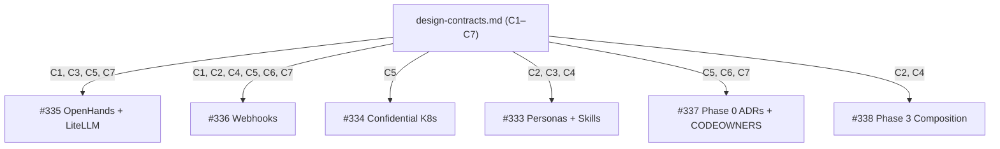

# ADR: Autonomous Software Factory — Centralized Design Contracts

**Status:** proposed
**Date:** 2026-05-28
**Issue:** #339
**Spec:** `specs/2026-05-28-issue-339-factory-design-contracts/`
**ADR technical decision sign-off:** pending

## Context

The autonomous software factory initiative (Epic #332) decomposes into a Phase 0 / Phase 1 / Phase 3 set of tickets. The four Phase 1 tickets (#333 personas, #334 Confidential Kubernetes, #335 OpenHands + LiteLLM, #336 GitHub Actions webhooks) and the Phase 0 sibling #337 (ADRs, CODEOWNERS, instrumentation) all share interface concerns that span more than one ticket: branch names, spec directory layout for decomposed work, persona-to-microagent mapping, integration acceptance criteria format, the factory bot identity used for multi-author SoD detection, the CODEOWNERS team slugs the four spec sign-off roles map to, and the metrics dashboard target plus minimum lifecycle-event schema.

If each Phase 1 ticket is left to invent its own values for these shared concepts, three failure modes are predictable: (1) #335 and #336 disagree on branch and spec paths; (2) #333 persona Definition-of-Done references a bot identity #334 has not provisioned; (3) #337 populates `.github/CODEOWNERS` with team names #336 does not know to add to its `agent-ready` label allowlist. These are integration-time defects, expensive to discover and expensive to unwind because they touch policy artifacts (CODEOWNERS, ADRs) and identity (bot accounts).

This ADR decides how to prevent that drift before Phase 1 implementation begins.

## Decision Drivers

- Eliminate cross-ticket value drift before Phase 1 starts, not at integration time.
- Keep Phase 0 ceremony proportionate — the document should add review surface, not seven independent review surfaces.
- Make every cross-ticket convention discoverable from one path, with explicit downstream-consumer attribution per section.
- Preserve the convention that decisions live in `docs/blueprint/architecture/decisions/` so `SDD-C-003` and tooling that walks the ADR tree still see this decision.
- Allow contracts with deferred values (bot handle, team slugs, dashboard target) to ship without blocking, but force the deferral to be explicit and tied to a closing ticket.

## Options Considered

### Option A: Single design-contracts document, one summary ADR (chosen)
Author `docs/blueprint/autonomous-factory/design-contracts.md` containing the seven contract sections C1–C7. Each section ends with a `Referenced by:` line enumerating dependent tickets. Open values are confined to per-section `### Open Decisions` subsections naming the deferring Phase 1 ticket. One summary ADR (this file) records the meta-decision to centralize.

**Pros:** one place to read; cross-references easy to maintain; per-section blast radius via `Referenced by:` lines; single sign-off cycle; matches the existing one-ADR-per-decision convention by treating "centralize these conventions" as the decision.
**Cons:** any contract amendment touches the same file (cosmetic blast-radius). Mitigated by per-section editability and `Referenced by:` granularity.

### Option B: Seven separate ADRs, one per contract

**Rejected:** seven independent sign-off cycles on tightly coupled values inflates Phase 0 ceremony out of proportion to its content; #337 already produces ten ADRs, so adding seven more is heavy. Cross-references between contracts (C5 ↔ C6, C5 ↔ C7) become harder to keep coherent across seven files.

### Option C: No new ADR — design-contracts.md is itself the architectural record

**Rejected:** breaks the convention `SDD-C-003` enforces (every implementation-ready spec references an approved ADR through `ADR path` and `ADR status` in `spec.md`). Tools and reviewers that walk `docs/blueprint/architecture/decisions/` would not discover this decision.

### Option D: Document the contracts inline in each consuming ticket

**Rejected:** restates the failure mode this ADR is trying to prevent. Inline contracts cannot be the source of truth when multiple tickets reference them.

## Decision

**Option A** — single design-contracts document, one summary ADR. The deliverable lives at `docs/blueprint/autonomous-factory/design-contracts.md`. This ADR records the meta-decision.

## Diagram

Caption: Design-contract C1–C7 dependency edges to Phase 1 tickets — one node per contract, one outbound edge per `Referenced by:` entry.

## Consequences

- Phase 1 tickets (#333, #334, #335, #336) and Phase 0 sibling #337 acquire a single canonical source for the seven cross-cutting interface values.
- Three downstream tickets (#334, #337) inherit non-closure conditions tied to Open Decisions (Q-1 bot handle, Q-2 CODEOWNERS slugs + bounded contexts, Q-3 dashboard platform). Each Open Decision names the deferring ticket and the resolve-by deadline.
- Any future change to contract C1–C7 follows the same SDD/sign-off flow as the original document and updates `Referenced by:` lines in the same PR (per spec NFR-REL-001).
- The autonomous-factory directory under `docs/blueprint/` is new with this work item; later factory-governance documents (Phase 1 ADR consolidations, runbooks) can land beside it without further structural decisions.

## References

- Deliverable: `docs/blueprint/autonomous-factory/design-contracts.md`
- Governing spec: `specs/2026-05-28-issue-339-factory-design-contracts/spec.md`
- Epic: #332 — STACKIT Autonomous Software Factory (OpenHands + SDD)
- Phase 0 sibling: #337 — ADRs, CODEOWNERS, success metrics
- Phase 1 consumers: #333 (personas), #334 (Confidential K8s), #335 (OpenHands + LiteLLM), #336 (webhooks)
- Phase 3 consumer: #338 (composition orchestration)
- Sign-off policy: `AGENTS.md § Sign-off Phrases (Deterministic)`
