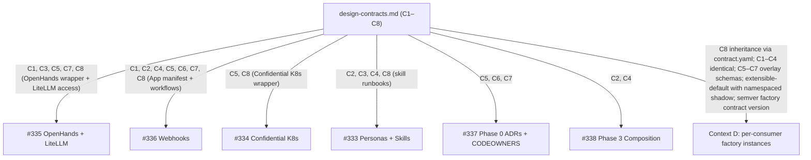

# ADR: Autonomous Software Factory — Centralized Design Contracts

**Status:** proposed
**Date:** 2026-05-28
**Issue:** #339
**Spec:** `specs/2026-05-28-issue-339-factory-design-contracts/`
**ADR technical decision sign-off:** pending

## Context

The autonomous software factory initiative (Epic #332) decomposes into a Phase 0 / Phase 1 / Phase 3 set of tickets. The four Phase 1 tickets (#333 personas, #334 Confidential Kubernetes, #335 OpenHands + LiteLLM, #336 GitHub Actions webhooks) and the Phase 0 sibling #337 (ADRs, CODEOWNERS, instrumentation) all share interface concerns that span more than one ticket: branch names, spec directory layout for decomposed work, persona-to-microagent mapping, integration acceptance criteria format, the factory bot identity used for multi-author SoD detection, the CODEOWNERS team slugs the four spec sign-off roles map to, and the metrics dashboard target plus minimum lifecycle-event schema.

The autonomous factory is not blueprint-only. The blueprint ships the factory as a capability for consumer repos to instantiate per-consumer (each consumer provisions its own Confidential K8s cluster, OpenHands deployment, GitHub App, bot identity, CODEOWNERS, dashboard). LiteLLM is an existing external service consumers configure access to rather than deploy. This means the cross-ticket conventions split into two classes: identical conventions (branch naming, spec dir layout, persona mapping, integration AC format — applied identically by the blueprint repo and every consumer repo) and parameterized contracts (bot identity, CODEOWNERS slugs, metrics dashboard — identical rule but per-instance values). It also introduces a fourth concern: enumerating the consumer-shipped surface (docs/ADRs, Terraform/Helm module wrappers, Make targets + skill runbooks, GitHub App / Actions workflows) that makes per-consumer instantiation possible via the existing blueprint `contract.yaml` inheritance mechanism.

If each Phase 1 ticket is left to invent its own values for these shared concepts, four failure modes are predictable: (1) #335 and #336 disagree on branch and spec paths; (2) #333 persona Definition-of-Done references a bot identity #334 has not provisioned; (3) #337 populates `.github/CODEOWNERS` with team names #336 does not know to add to its `agent-ready` label allowlist; (4) consumer repos either copy the blueprint's literal C5/C6/C7 values (wrong tenancy — every consumer would post as the blueprint's bot) or invent their own conventions (drift). These are integration-time defects, expensive to discover and expensive to unwind because they touch policy artifacts (CODEOWNERS, ADRs), identity (bot accounts), and per-consumer tenancy boundaries.

This ADR decides how to prevent that drift before Phase 1 implementation begins.

## Decision Drivers

- Eliminate cross-ticket value drift before Phase 1 starts, not at integration time.
- Eliminate cross-tenant value bleed: consumer repos must inherit identical conventions but never the blueprint's per-instance values.
- Keep Phase 0 ceremony proportionate — the document should add review surface, not eight independent review surfaces.
- Make every cross-ticket convention discoverable from one path, with explicit downstream-consumer attribution per section.
- Make the consumer-shipped surface enumerable from one place so consumer onboarding has a single inheritance contract.
- Preserve the convention that decisions live in `docs/blueprint/architecture/decisions/` so `SDD-C-003` and tooling that walks the ADR tree still see this decision.
- Allow contracts with deferred values (bot handle, team slugs, dashboard target) to ship without blocking, but force the deferral to be explicit and tied to a closing ticket.
- Reuse the existing blueprint `contract.yaml` inheritance mechanism rather than introducing a parallel consumer-delivery channel.
- Prioritize consumer freedom over centralized audit guarantees on the C8 surface: consumers may shadow blueprint artifacts (default tier `extensible`), reserving `sealed` only for an explicit compliance list (FR-017(b)). Forcing identical inheritance pushes consumers with legitimate domain-specific needs to fork the blueprint, which is a worse outcome than a structured shadow mechanism.
- Provide a stable evolution contract via semver-style versioning (FR-019) so consumers can adopt at their own pace; the supported-major window is owned by a dedicated factory-upgrade-process ticket (Q-5).

## Options Considered

### Option A: Single design-contracts document with parameterized profile + C8 surface enumeration, one summary ADR (chosen)
Author `docs/blueprint/autonomous-factory/design-contracts.md` containing eight contract sections C1–C8. C1–C4 are identical conventions applied by the blueprint repo and every consumer repo. C5–C7 are parameterized: each carries `### Identical rule`, `### Blueprint instance`, and `### Consumer overlay` subsections so the rule, the blueprint's value, and the schema by which consumer repos declare their own values live side by side. C8 enumerates the consumer-shipped surface in four named categories (docs/ADRs; Terraform/Helm module wrappers; Make targets + skill runbooks; GitHub App / Actions workflows), declares LiteLLM external, and additionally carries (a) the orthogonal extensibility-tier dimension (FR-017: `sealed`/`parameterized`/`extensible`, default `extensible`, sealed list pinned to compliance items only); (b) the consumer-extension discovery convention via namespaced subdirectories (FR-018); (c) the semver-style compatibility posture for the factory contract version (FR-019); (d) the `upstream-candidate: true` front-matter convention (FR-020). Each section ends with a `Referenced by:` line. Open values are confined to per-section `### Open Decisions` subsections naming the deferring Phase 1 ticket. One summary ADR (this file) records the meta-decision to centralize.

**Pros:** one place to read; cross-references easy to maintain; per-section blast radius via `Referenced by:` lines; single sign-off cycle; matches the existing one-ADR-per-decision convention by treating "centralize these conventions + enumerate the consumer surface + pin the extensibility/versioning posture" as the decision; the parameterization (rule vs blueprint instance vs consumer overlay) is visible alongside the rule it parameterizes; the consumer-inheritance mechanism reuses existing `contract.yaml` (no new machinery); extensibility and version posture live next to the surface they govern.
**Cons:** any contract amendment touches the same file (cosmetic blast-radius); C5/C6/C7 sections grow longer due to the three required subsections; C8 carries multiple orthogonal dimensions (stability tier, extensibility tier, version range, namespace convention). Mitigated by per-section editability, mandated subsection names (FR-008/009/010/017/018/019/020), and AC-008/AC-010/AC-011/AC-012 enforcement.

### Option B: Eight separate ADRs, one per contract

**Rejected:** eight independent sign-off cycles on tightly coupled values inflates Phase 0 ceremony out of proportion to its content; #337 already produces ten ADRs, so adding eight more is heavy. Cross-references between contracts (C5 ↔ C6, C5 ↔ C7, C5/C6/C7 ↔ C8) become harder to keep coherent across eight files.

### Option C: No new ADR — design-contracts.md is itself the architectural record

**Rejected:** breaks the convention `SDD-C-003` enforces (every implementation-ready spec references an approved ADR through `ADR path` and `ADR status` in `spec.md`). Tools and reviewers that walk `docs/blueprint/architecture/decisions/` would not discover this decision.

### Option D: Document the contracts inline in each consuming ticket

**Rejected:** restates the failure mode this ADR is trying to prevent. Inline contracts cannot be the source of truth when multiple tickets reference them. Compounded by the consumer-shipping framing — inline-per-ticket contracts cannot serve as a single inheritance contract for consumer repos.

### Option E: Two documents — one for blueprint-only conventions, one for consumer-shipped surface

**Rejected:** the parameterized C5/C6/C7 contracts straddle both concerns (the identical rule lives in both worlds, the blueprint instance lives in the first, the consumer overlay lives in the second). Splitting them into two files would force the rule to live in one place and the parameterization to live in another, defeating the visibility benefit. C8 as a single section inside the same document keeps the inheritance contract beside the rules it inherits.

## Decision

**Option A** — single design-contracts document with parameterized profile (C5–C7) and C8 surface enumeration, one summary ADR. The deliverable lives at `docs/blueprint/autonomous-factory/design-contracts.md`. This ADR records the meta-decision.

## Diagram

Caption: Design-contract C1–C8 dependency edges — one node per contract, one outbound edge per `Referenced by:` entry. The Context D edge represents consumer-repo inheritance via the existing blueprint `contract.yaml` mechanism (FR-015); identical conventions C1–C4 apply unchanged, C5–C7 parameterize per-consumer, C8 enumerates the inherited surface.

## Consequences

- Phase 1 tickets (#333, #334, #335, #336) and Phase 0 sibling #337 acquire a single canonical source for the eight cross-cutting interface values.
- Consumer repos that adopt the autonomous factory acquire a single inheritance contract via Contract C8, with C1–C4 applied identically and C5–C7 populated per-consumer via overlay schemas. No new inheritance machinery is introduced; consumers use the existing blueprint `contract.yaml` mechanism.
- Three downstream tickets (#334, #337) inherit non-closure conditions tied to blueprint-instance Open Decisions (Q-1 bot handle, Q-2 CODEOWNERS slugs + bounded contexts, Q-3 dashboard platform). Each Open Decision names the deferring ticket and the resolve-by deadline. None of these defer to a consumer repo.
- One additional Open Decision (Q-4 — LiteLLM access configuration field name and location in `contract.yaml`) is resolved during deliverable authoring in this same work item before SPEC_READY can flip to true; not deferred to a downstream ticket.
- A second additional Open Decision (Q-5 — issue number for the new Phase 1 factory-upgrade-process ticket) is resolved by filing the new GitHub issue in the same session that closes this spec and substituting its assigned number into Contract C8 `Referenced by:` lines for FR-019 and FR-020; not deferred to a downstream ticket.
- The C8 extensibility tier defaults to `extensible` (FR-017); consumers may shadow blueprint personas, skills, and SDD steps via the namespaced subdirectory convention (FR-018). Audit consistency across consumer instances is intentionally scoped to the FR-017(b) sealed list only (bot-identity exact-string rule, four canonical sign-off phrases, multi-author SoD rule, sovereignty/ZDR ADR, reject-rerun cap rule, C7 minimum lifecycle-event field set). Cross-consumer review-output uniformity is explicitly not a goal.
- The factory contract version follows semver (FR-019); breaking changes batch into majors with migration notes. The supported-major window and migration tooling are owned by the new Phase 1 factory-upgrade-process ticket; the first consumer adopter must demonstrate a real upgrade roundtrip per the Epic #332 acceptance criteria amendment that ticket introduces.
- Any future change to contract C1–C8 follows the same SDD/sign-off flow as the original document and updates `Referenced by:` lines in the same PR (per spec NFR-REL-001). C8 surface changes additionally honor the stability tier discipline declared per surface item (FR-015).
- The autonomous-factory directory under `docs/blueprint/` is new with this work item; later factory-governance documents (Phase 1 ADR consolidations, runbooks) can land beside it without further structural decisions, and consumer repos receive them automatically via C8 inheritance.

## References

- Deliverable: `docs/blueprint/autonomous-factory/design-contracts.md`
- Governing spec: `specs/2026-05-28-issue-339-factory-design-contracts/spec.md`
- Epic: #332 — STACKIT Autonomous Software Factory (OpenHands + SDD)
- Phase 0 sibling: #337 — ADRs, CODEOWNERS, success metrics
- Phase 1 consumers (blueprint repo implementers): #333 (personas), #334 (Confidential K8s), #335 (OpenHands + LiteLLM), #336 (webhooks)
- Phase 3 consumer: #338 (composition orchestration)
- Consumer repos (Context D): every blueprint consumer that adopts the autonomous factory inherits C8 surface via the existing blueprint `contract.yaml` mechanism
- Sign-off policy: `AGENTS.md § Sign-off Phrases (Deterministic)`
