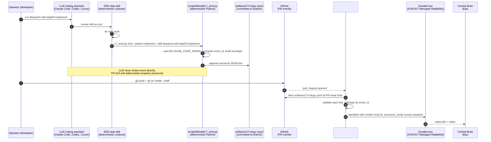

# ADR: Human SDD C7 Emission Symmetry — Third Emitter `local-cli`

**Status:** proposed
**Date:** 2026-05-30
**Issue:** #347
**Spec:** `specs/2026-05-30-issue-347-human-sdd-c7-symmetry/` (FR-001..FR-014, NFR-SEC-001, NFR-OBS-001..NFR-OBS-002)
**Extensibility classification (#339 C8 FR-017):** `sealed`.

## Context

[`design-contracts.md`](../../autonomous-factory/design-contracts.md) § Contract C7 currently emits lifecycle events EXCLUSIVELY when the factory orchestrator (#333) or the webhook handler (#336) drives the work. The local-execution exemption codified in [`ADR-issue-337-c7-emission-mechanism.md`](ADR-issue-337-c7-emission-mechanism.md) § Local execution exemption was justified at the time on two grounds: (a) the durable-bus infrastructure is not present in local Docker Desktop runtimes (SDD-C-014), and (b) local runs are directly observable by the developer without a metrics pipeline.

Both grounds remain factually correct, but their conclusion no longer matches the actual operating reality of the blueprint:

1. The solo-operator topology (project memory `feedback_solo_operator_topology`) means a substantial fraction of real SDD lifecycle activity runs through `make spec-scaffold` + `/blueprint-sdd-stepXX-*` skill invocations on a developer workstation — NOT through the autonomous factory loop.
2. The Central Brain epic ([#343](https://github.com/sbonoc/stackit-platform-blueprint/issues/343)) projects every C7 event into a graph + vector store. Excluding human-driven sessions means its index sees autonomous events only, biasing future retrieval and context-assembly toward bot work patterns.
3. The metrics dashboard (Contract C7 § Blueprint instance) undercounts real SDD throughput, rerun rates, and phase-time distributions.
4. The FR-008 reviewer-model-heterogeneity audit predicate is silent on human-assisted runs — an operator picking a model manually via LiteLLM produces no rotation-violation event even if the heterogeneity rule is breached.

The end state required: human and autonomous SDD sessions both emit C7 events, distinguishable by an `execution_mode` discriminator, ingested through the same pipeline, with the same dedupe and replay guarantees — so the Central Brain, the metrics surface, and the audit predicates see one coherent timeline regardless of who (or what) drove the work.

The architectural challenge is to extend C7 emission to local sessions **without breaking the FR-019 anti-LLM-hallucination property** that the autonomous two-emitter rule was authored to preserve. The persona must not become the emitter just because the runtime moved from a workspace pod to a developer terminal.

## Decision Drivers

- The anti-LLM-hallucination property of FR-019 derives from a structural pattern, not from a network boundary: the LLM never writes the event; a deterministic wrapper (orchestrator #333 in the autonomous case) constructs and emits the envelope around the LLM's phase boundary. The same pattern applies to a deterministic CLI helper that the operator's LLM assistant calls as a tool.
- The local environment does not have credentials for the STACKIT-managed durable bus, and credential distribution to every operator workstation would invert the local-first runtime baseline (SDD-C-014). A sink that travels with the work-item branch (a committed JSONL file) keeps emission local-first AND gives the orchestrator-side ingest pipeline a single well-understood injection point.
- PR open events are the natural "this work is now reviewable" boundary. Ingesting on every commit-to-branch push would produce ingest storms during local rebase / squash sessions; ingesting only at PR-merge would leave the events out of in-flight review tooling. PR `opened` + `synchronize` + `reopened` covers Draft and non-Draft PRs symmetrically.
- The eleven-field sealed minimum schema MUST stay invariant — no nullable types, no emitter-conditional required-set variants — to preserve schema stability for subscribers including [#343](https://github.com/sbonoc/stackit-platform-blueprint/issues/343)'s Central Brain index. The `local-cli` emitter satisfies the eleven fields via the same sentinel-string pattern that webhook-handler emissions use (`persona` ← skill basename, `model` ← best-effort or `unknown` sentinel).
- The operator's coding assistant model is not always programmatically discoverable. Failing emission when model is unknown would block local SDD usage; a sealed `unknown` sentinel keeps emission obligatory while documenting the inferior audit signal.
- The audit predicate FR-008 already tolerates structural variance in the implement-vs-review event pair — it is straightforward to add an `unknown`-model exemption (inconclusive, not failing) without breaking the autonomous predicate.

## Decision

**A third sealed C7 emitter `local-cli` is introduced.** The Contract C7 `emitter` JSON Schema enum widens from `{orchestrator, webhook-handler}` to EXACTLY THREE values `{orchestrator, webhook-handler, local-cli}`. The two-emitter wording in FR-019 widens accordingly to a three-emitter rule. Any value outside this enum MUST be REJECTED by subscribers.

**The skill-as-tool pattern preserves FR-019's anti-LLM-hallucination property.** The operator's LLM assistant (Claude Code, Codex, Cursor, etc.) calls a deterministic SDD step skill as a tool. The skill itself is deterministic shell + Python (`scripts/lib/sdd/c7_emit.py`); it computes the eleven required fields, appends the canonical JSON line to `artifacts/c7/<work-item-slug>.jsonl`, and returns. The LLM NEVER writes the event directly — same structural pattern as the orchestrator wrapping a persona, just relocated from a workspace pod to a developer terminal.

**The committed JSONL sink is the local-first emission surface.** The helper appends one canonical JSON object per line to `artifacts/c7/<work-item-slug>.jsonl` in the work-item working tree. The file is committed to the work-item branch and travels with the PR. A `.gitattributes` rule (`artifacts/c7/*.jsonl  linguist-generated=true  diff=none`) hides the file from GitHub's PR diff renderer to avoid review noise.

**The webhook handler (#336) ingests at PR-event boundaries.** On EXACTLY THREE GitHub events — `pull_request.opened`, `pull_request.synchronize`, `pull_request.reopened` — #336 fetches the JSONL via the GitHub contents API at the PR head SHA, validates each line against the C7 JSON Schema, dedupes by `event_id`, and republishes onto the durable bus with `emitter: local-cli` preserved. PR can be opened as Draft or non-Draft — both trigger ingest.

**Sealed sentinel values preserve the eleven-field schema.** For `emitter: local-cli` events:

- `persona` MUST be the SDD step skill basename (e.g., `blueprint-sdd-step01-intake`, `blueprint-sdd-step05-implement`). The skill is the actor of record for the local execution surface; pinning the basename keeps the field discoverable for cross-referencing with `.agents/skills/`.
- `model` MUST be the best-effort LLM model identifier exposed by the operator's coding assistant (resolved by reading `$CLAUDE_CODE_MODEL`, `$CODEX_MODEL`, `$CURSOR_MODEL` env vars in that priority order), OR the sealed sentinel string `unknown` when no model identifier is resolvable. The field stays `type: string` and required in all eleven-field events; the sentinel value preserves the sealed schema without introducing nullable types.

**Four-input `event_id` derivation.** For `emitter: local-cli` events `event_id = sha256(ticket_id|phase|rerun_round|emitter)`. The webhook-handler five-input variant's `webhook_event_key` discriminator is NOT applied to local-cli emissions, because the JSONL append-only file is the single source of truth and EXACTLY ONE C7 event per skill execution per `(ticket_id, phase, rerun_round)` tuple is enforced by the helper.

**`execution_mode` extension discriminator.** Every C7 event from any emitter MUST carry the extension field `execution_mode` (string enum, two values): `autonomous` when `emitter ∈ {orchestrator, webhook-handler}`, `human-assisted` when `emitter: local-cli`. The field is carried under `additionalProperties: true` and is NOT added to the eleven-field required minimum — subscribers (Grafana dashboard, Central Brain) consume it as a facet but the audit-predicate set MUST NOT depend on it (autonomous-vs-human classification is derivable from `emitter` alone).

**Default-on emission with sealed opt-out.** Emission is default-on. The sealed opt-out surface is the environment variable `BLUEPRINT_SDD_C7_EMIT=0`. The opt-out is itself audited: the first SDD step executed under opt-out for a given work-item slug MUST emit EXACTLY ONE `c7-emission-opted-out` extension event with reason carried in `additionalProperties.opt_out_reason`; subsequent steps under the same opt-out scope MUST NOT re-emit.

**FR-008 audit `unknown`-model exemption.** The reviewer-model-heterogeneity predicate (defined in [`ADR-issue-337-reviewer-model-heterogeneity.md`](ADR-issue-337-reviewer-model-heterogeneity.md)) MUST run against `local-cli`-emitted events. When both the `phase: implement` event and the paired `phase: agent-pr-review` event carry `model: unknown`, the predicate MUST mark the pair as **inconclusive** (logged at info, not fail-loud) rather than emit a `rotation-violation` rejection. The exemption is documented as an explicit failure mode in the audit's runbook so SREs reading the metrics dashboard know to interpret `inconclusive` differently from `compliant`.

**Helper failure does NOT block SDD execution.** Helper crashes (disk full, malformed input, sink path not writable) MUST log to stderr and return success to the calling skill. The SDD step's pass/fail signal is determined by its own work product (the artifact diff, the spec validation, the PR push), NOT by C7 emission success. This preserves the local-first developer experience: a transient helper failure cannot block a contributor from progressing through the SDD lifecycle.

**The orchestrator (#333) is unchanged by this ADR.** The autonomous emission path was already symmetric with this design; the orchestrator's wrapping-the-persona pattern is the template that the `local-cli` surface mirrors.

## Options Considered

### Option A — Third sealed emitter `local-cli` with deterministic CLI helper (chosen)

The decision above. The operator's LLM calls the SDD step skill as a tool; the skill calls the deterministic helper; the helper appends to a committed JSONL sink; #336 ingests on PR events.

**Pros:** preserves FR-019 anti-LLM-hallucination property by extension, not by exception; preserves the sealed eleven-field schema via sentinel values matching the webhook-handler pattern; local-first compatible (no bus credentials on operator workstations); single ingest point makes validation + dedupe testable; PR-event triggers cover Draft + non-Draft symmetrically.

**Cons:** committed JSONL adds files to PR diffs (mitigated by `.gitattributes` diff=none); best-effort model ID degrades audit signal (mitigated by `unknown`-model exemption); requires uniform addendum across all 7 step skills (mitigated by identical text + addendum compatibility checker).

### Option B — Direct push from local helper to the durable bus (rejected)

The helper publishes events directly to the STACKIT Managed RabbitMQ stream queue over the network.

**Rejected:** requires bus credentials on every operator workstation (a credential-distribution flow that local-first runtime baseline SDD-C-014 explicitly discourages); loses the git-history audit trail; cannot work offline; widens the bus-credentials blast radius from two pods on the SKE control plane to every operator's laptop.

### Option C — Skill writes JSONL directly without a deterministic helper (rejected)

Each step skill runbook contains inline event-construction logic (read env vars, compute event_id, write the line).

**Rejected:** every skill becomes a copy-pasted emission surface — schema-change cost balloons from one helper to seven skills, and the LLM editing the skill could subtly drift the format. The deterministic helper centralises the emission surface to one well-tested file.

### Option D — LLM persona writes the JSONL line itself (rejected)

The operator's LLM assistant appends the JSONL line at step boundary, instructed by the skill runbook.

**Rejected:** identical to the rejected sidecar / persona-emission options in [`ADR-issue-337-c7-emission-mechanism.md`](ADR-issue-337-c7-emission-mechanism.md) — places the LLM in the critical path for emission completeness. A persona that forgets the line silently drops the event; a persona that hallucinates wrong fields writes a malformed event. The skill-as-tool indirection (Option A) is exactly what FR-019 codifies for the autonomous path.

### Option E — Emit on every commit-to-branch push, not on PR events (rejected)

#336 fetches and ingests the JSONL on every `push` to a non-default branch.

**Rejected:** ingest storms during local rebase / squash / amend sessions (a single squash that rewrites 10 commits triggers 10 ingest cycles). PR open is the natural "this work is now reviewable" boundary; PR `synchronize` covers force-pushes to the PR head; PR `reopened` covers Draft↔Ready transitions. Three event types cover the practical lifecycle without amplification.

## Consequences

- #339 design-contracts.md amendment (one PR cycle with this ADR): widens FR-019 to three emitters; widens the JSON Schema `emitter.enum` to include `local-cli`; extends the `persona` and `model` field descriptions to enumerate the `local-cli` sentinel rules; documents `execution_mode` in the extension-field vocabulary; documents the four-input `event_id` derivation for `local-cli`. Bootstrap mirror re-synced.
- #336 (webhook handler) scope grows by three new event-type handlers (`pull_request.opened`, `pull_request.synchronize`, `pull_request.reopened`) that fetch `artifacts/c7/*.jsonl` from the PR head SHA, validate against the schema, dedupe by `event_id`, and republish onto the durable bus. No new credential surface — the existing GitHub App installation token authenticates the contents API fetch.
- Every `.agents/skills/blueprint-sdd-step*/SKILL.md` (seven skills) gains a uniform "## C7 Emission" section instructing the skill to invoke `scripts/bin/sdd/c7_emit.py emit --phase <enum> --skill <basename> [--outcome <enum>]` at step boundary. The section text is identical across all seven skills modulo the per-skill `phase` enum value.
- A new helper module `scripts/lib/sdd/c7_emit.py` + CLI entrypoint `scripts/bin/sdd/c7_emit.py` are added with pytest unit + contract tests. A pre-commit hook schema-validates `artifacts/c7/<slug>.jsonl` on every commit so malformed events are rejected before push.
- `.gitattributes` gains the rule `artifacts/c7/*.jsonl  linguist-generated=true  diff=none` so the JSONL sink does not pollute PR diff views.
- `blueprint/contract.yaml` gains a `spec.spec_driven_development_contract.c7_emission` block declaring the `BLUEPRINT_SDD_C7_EMIT` env var, default value, and opt-out audit rule.
- `docs/blueprint/governance/sdd_execution_guide.md` (and its bootstrap mirror) document the new env var, the JSONL sink path, and the operator-facing behavior of the opt-out audit event.
- [`ADR-issue-337-c7-emission-mechanism.md`](ADR-issue-337-c7-emission-mechanism.md) is annotated with a one-line "Extended by ADR-issue-347-human-sdd-c7-symmetry.md" pointer at the top of its § Local execution exemption section so future readers find this ADR from the autonomous-side baseline.
- Consumer instances inherit the three-emitter rule identically (sealed under #339 C8 FR-017). Consumer factory deployments MUST surface the `local-cli` emission path in their own copies of the SDD step skills; consumers MUST NOT route human-driven C7 emission through any other path.
- The Central Brain index ([#343](https://github.com/sbonoc/stackit-platform-blueprint/issues/343)) starts receiving `human-assisted` events from the first new work item authored after #347 merges — no backfill of historical PRs is performed (out-of-scope per spec § Explicit Exclusions).

## Diagram

Caption: The skill-as-tool pattern keeps the LLM out of the critical emission path. The committed JSONL sink doubles as a git-history audit trail; #336 is the single ingest + dedupe surface for the local-cli emitter.

## References

- Spec: `specs/2026-05-30-issue-347-human-sdd-c7-symmetry/spec.md` § FR-001..FR-014, NFR-SEC-001..NFR-SEC-002, NFR-OBS-001..NFR-OBS-002, NFR-REL-001, NFR-OPS-001
- Design contracts: `docs/blueprint/autonomous-factory/design-contracts.md` § Contract C7 (eleven-field lifecycle event schema, emission-mechanism rule, emission-transport rule, idempotency rule)
- Architectural baseline being extended: [`ADR-issue-337-c7-emission-mechanism.md`](ADR-issue-337-c7-emission-mechanism.md) (the sealed two-emitter rule that becomes the sealed three-emitter rule here), [`ADR-issue-337-reviewer-model-heterogeneity.md`](ADR-issue-337-reviewer-model-heterogeneity.md) (FR-008 audit predicate gains the `unknown`-model exemption documented here)
- Parent epic: [#332](https://github.com/sbonoc/stackit-platform-blueprint/issues/332) (STACKIT Autonomous Software Factory)
- Downstream observer: [#343](https://github.com/sbonoc/stackit-platform-blueprint/issues/343) (Central Brain index — starts receiving `human-assisted` events on first new work item post-merge)
- Phase 1 implementers touched: #336 (webhook handler — three new PR-event handlers + JSONL ingest); all `.agents/skills/blueprint-sdd-step*/SKILL.md` runbooks (uniform addendum); new `scripts/lib/sdd/c7_emit.py` + `scripts/bin/sdd/c7_emit.py`
