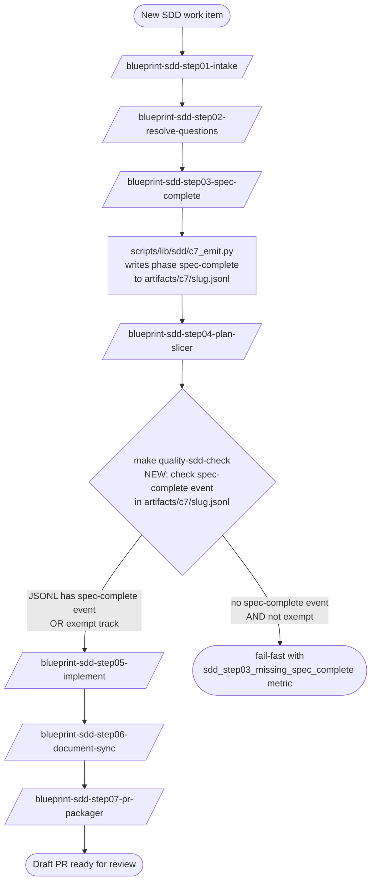

# ADR: Close the SDD step03 + step05 Spec-to-Implementation Drift Loop

**Status:** proposed
**Date:** 2026-05-31
**Issue:** #352
**Spec:** `specs/2026-05-31-issue-352-sdd-step03-step05-drift-loop/` (FR-001..FR-011, NFR-OBS-001, NFR-REL-001, NFR-OPS-001)
**Extensibility classification (#339 C8 FR-017):** `sealed` (governance-control surface; consumer overrides MUST NOT relax the gate)
**ADR technical decision sign-off:** pending

> _Agent draft — Architect / CTO to confirm, adjust, or override at step03._

## Context

Issue #352 documents six structural gaps that, in combination, let spec-to-implementation drift survive every automated SDD gate and surface only at manual browser exercise. The gaps form a closed loop:

1. **Step03 is labelled "accelerator"** (AGENTS.md `§ Cross-Skill Notes`) so a contributor can move from step02 straight to step05 without ever recording the spec-complete sign-offs — any quality bar added inside step03 is unenforceable.
2. **Step03 ACs are too loose** — they identify *which* test covers a criterion but not *what* the test MUST assert.
3. **Step05 has no spec-value regression mandate** — coarse "does the form submit" tests pass even when a select renders the wrong enumerated values.
4. **Step05 has no union-type guidance** — fields declared `EXACTLY ONE OF: a | b | c` in spec.md are routinely typed as `string` in implementation, disengaging the fastest line of defence.
5. **Step05 has no SSOT-constant rule** — enumerated values are hand-copied across composables, templates, and mocks; the copies drift silently.
6. **Step05 has no mandatory rendered-output coverage** — a Vue select that compiles and passes unit tests can still render with wrong/missing options in the running app.

Removing any single change leaves a bypass or blind spot. The user (sole maintainer; `feedback_solo_operator_topology`) elected to bundle the six in one work item under the closed-loop framing.

The architectural challenge is to add machine enforcement for change 1 (mandatory step03) without breaking the existing bypass track (AGENTS.md `§ Lightweight SDD Bypass Track`), and to extend the step05 SKILL.md guardrails to all stacks declared in `Implementation Stack Profile` (not just the Vue + Python lanes the issue cites verbatim).

## Decision Drivers

- The closest-fit enforcement signal already exists: `scripts/lib/sdd/c7_emit.py` emits a `phase: "spec-complete"` event when step03 runs, and `artifacts/c7/<slug>.jsonl` is committed to the work-item branch (per ADR-issue-347-human-sdd-c7-symmetry). Reading this file is a single-pass JSON parse with no new dependencies.
- The bypass track was designed for *artifact reduction*, not for *sign-off skipping* — AGENTS.md `§ Sign-off Policy` already requires Architecture + Security + Operations approvals regardless of track. Closing the manual-edit loophole only enforces what AGENTS.md already mandates de jure; the cost to bug-fix/refactor/chore-with-specs is one extra `/blueprint-sdd-step03-spec-complete` invocation, not new authoring overhead.
- `upgrade` (blueprint upgrade pipeline) and `chore-with-no-specs` (passive-pass in `check_sdd_assets.py`) have no human in the loop and no spec to gate; mandating step03 for them would break automated runs without adding value.
- Vue Vitest Browser Mode is already mandated for component-level rendering coverage (existing Guardrail #14). Treating it as sufficient for FR-008 by default — and escalating to Playwright only when the critical path crosses route boundaries — keeps the cost proportional to the feature surface and avoids pushing past the `e2e ≤ 10%` pyramid ratio for small UI changes.
- The stack-agnostic phrasing of FR-005..FR-009 with a per-profile examples table (FR-010) mirrors the existing pattern in step05 SKILL.md `## Stack-specific test isolation`: one normative rule, multiple stack-native idioms.

## Decision

**The six gaps are addressed as a single closed-loop work item with the following load-bearing decisions:**

### D-1 — Step03 promoted to a mandatory gate via the C7 audit trail

AGENTS.md `§ Mandatory Workflow` adds a normative clause classifying `blueprint-sdd-step03-spec-complete` as a mandatory gate for every work item whose `SPEC_READY_EXCEPTION` is one of `{none, bug-fix, refactor, chore, authorized-deviation}`. `make quality-sdd-check` MUST reject any work item with `SPEC_READY: true` when `artifacts/c7/<slug>.jsonl` does NOT contain a `spec-complete` event whose `ticket_id` matches the work item.

**Two exempt tracks** are documented in AGENTS.md and honoured by the check:

- `SPEC_READY_EXCEPTION: upgrade` — the blueprint-upgrade pipeline is driven by the `blueprint-upgrade-*` make-target family; there is no human invocation of step03 in this path. Gating it would break automated runs.
- Work items with no `specs/` subdirectory — already a passive-pass in `check_sdd_assets.py`; no spec exists to gate.

A `c7-emission-opted-out` event MUST NOT satisfy the gate. The `BLUEPRINT_SDD_C7_EMIT=0` opt-out audit surface (ADR-issue-347) records the operator's intent to skip emission, but the spec-to-implementation drift loop demands the actual spec-complete sign-off — opt-out and exemption are orthogonal.

### D-2 — Enforcement implemented in `check_sdd_assets.py`, not a new make target

The existing `make quality-sdd-check` already loads each work-item `spec.md` and walks the readiness gate. The new `_check_step03_complete_event` function fits there with no new entry point. Rejected alternative: a separate dedicated pre-implementation make target — would duplicate validator wiring and split the failure surface across two gates.

### D-3 — Step03 SKILL.md AC authoring rule

The skill runbook gains a normative section requiring every AC to name both the test ID AND the specific assertion the test MUST verify, in the canonical form:

```
AC-NNN [description] — verified by T-N, which MUST assert <exact condition>.
```

Label-only ACs (`T-N verifies pre-population`, `T-N covers the happy path`) MUST be rejected at the spec-complete gate. The rejection is enforced by the human Architect at sign-off time — the spec text is the contract; no machine regex is added (rationale below).

### D-4 — Step05 SKILL.md gains four new normative guardrails (covering FR-005..FR-008)

The Guardrails section gains numbered entries for:

- Spec-value regression tests (FR-005)
- Union types for spec-enumerated fields (FR-006)
- Single source of truth for enum constants (FR-007)
- Mandatory automated rendered-output coverage for critical user journeys (FR-008)

Each entry follows the existing Guardrail style (numbered, MUST-phrased, stack-cross-referenced where applicable). FR-009 (Vitest Browser Mode satisfaction + Playwright escalation) is woven into the FR-008 guardrail body to keep the rule and its satisfaction path co-located.

### D-5 — Per-profile examples table (FR-010)

Step05 SKILL.md gains a `## Per-profile union-type and SSOT-constant idioms` section with one row per declared backend/frontend profile:

| Profile | Union/enum type idiom | SSOT constant idiom |
|---|---|---|
| TypeScript (`vue_router_pinia_onyx`) | `'a' \| 'b' \| 'c'` | `as const` array exported from a domain module |
| Python (`python_plus_fastapi_pydantic_v2`) | `Literal["a","b","c"]` | module-level `tuple[str, ...]` or `Enum` |
| Kotlin (Ktor) | `enum class` or `sealed class` | `companion object` set/list |
| Go (Gin) | `const` block with typed alias | package-level `var Allowed = []string{...}` |

### D-6 — Forward-only application (FR-011)

The new gates apply only to work items whose spec-scaffold timestamp is on or after the merge date of this work item. Existing in-flight or merged work items are NOT retroactively blocked. Implementation: `check_sdd_assets.py` compares the spec directory name's leading `YYYY-MM-DD` prefix against a hard-coded merge-date constant in the same script (the value is set as the final pre-merge commit and recorded in `pr_context.md`).

### D-7 — AC authoring rule is human-enforced, not machine-enforced (deliberate scope choice)

FR-004 mandates the AC authoring convention but does NOT mandate a regex check in `check_sdd_assets.py`. Reason: the assertion text is natural-language English; a regex would either accept too much (every AC ending with `which MUST assert ...` passes regardless of meaningfulness) or reject too much (forcing a brittle micro-format). The Architect sign-off at step03 is the right place for this judgment call — the SKILL.md text gives them the criterion to apply. Re-evaluate if real-world adoption shows the convention is being ignored.

## Options Considered

### Option A — Single closed-loop work item (chosen)

Bundle all six gaps in one spec/PR. The closed-loop framing matches the issue body; one ADR captures the joint design; one round of step01–step07 covers the change set.

**Pros:** matches the issue framing; no intermediate merged state where the loop is half-open; single audit trail; light authoring overhead (≈5 file changes).

**Cons:** one PR is larger than six small PRs; revert surface is broader.

### Option B — Six sequential work items under an epic (rejected)

One ticket per gap. Cleaner per-PR diff; finer-grained rollback.

**Rejected:** every intermediate merged state leaves the loop open (e.g., mandatory step03 lands first; spec-value regression mandate lands six PRs later — work items merged in between exhibit the very drift the loop is designed to prevent). Also contradicts the user's stated decomposition preference (`feedback_decomposition_preference`: slice large tickets *inside* one work item; do not split into many tickets unless the change is genuinely independent).

### Option C — Enforce FR-002 via a separate pre-implementation make target (rejected)

Add a new dedicated make target that step05 calls in its step 0, mirroring its Guardrail #1 ("Implementation MUST NOT start before SPEC_READY: true").

**Rejected:** the existing `make quality-sdd-check` already walks every work item and validates the readiness gate. Adding a second target splits the failure surface (one rule could pass while the other fails depending on which target a contributor runs first) and duplicates fixture wiring. The simpler design extends the single existing validator.

### Option D — Mandatory step03 for ALL tracks including upgrade (rejected)

Force `blueprint-upgrade-*` make-target family runs to emit a `spec-complete` event.

**Rejected:** the upgrade pipeline is automation-driven; no human Architect/Security/Operations sign-off occurs because no architectural decision is being made — the pipeline replays committed blueprint changes against the consumer's pinned ref. Forcing the gate would break every automated upgrade run with no quality benefit.

### Option E — Machine-enforce the AC assertion-description regex (rejected for now)

Add a regex check in `check_sdd_assets.py` that rejects ACs lacking `which MUST assert ...`.

**Rejected:** false-positive risk (legitimate ACs phrased slightly differently get rejected) and false-negative risk (`which MUST assert <vague nonsense>` passes the regex but fails the intent). The Architect sign-off is the right enforcement layer for a natural-language convention. Revisit if real-world adoption is poor.

## Consequences

- AGENTS.md `§ Mandatory Workflow` gains a new normative clause (≈5 lines) classifying step03 as a mandatory gate, listing the exempt tracks, and pointing to FR-002 enforcement.
- `scripts/bin/quality/check_sdd_assets.py` gains one new check function and a small set of pytest cases. No new external dependencies.
- `.agents/skills/blueprint-sdd-step01-intake/SKILL.md` gains shift-left guidance (FR-012) requiring ACs to be authored in the canonical `verified by T-N, which MUST assert <exact condition>` form from the first draft. Both scaffold templates (`.spec-kit/templates/blueprint/spec.md`, `.spec-kit/templates/consumer/spec.md`) replace the legacy `AC-001 MUST be objectively testable.` placeholder with a canonical-form example so the scaffold itself teaches the pattern.
- `.agents/skills/blueprint-sdd-step03-spec-complete/SKILL.md` gains an AC authoring section and a corresponding spec-complete gate checklist item. Step03 remains the rejection gate; step01 + scaffold templates are the shift-left teaching layer.
- `.agents/skills/blueprint-sdd-step05-implement/SKILL.md` gains four new numbered guardrails (FR-005..FR-008), a per-profile examples table (FR-010), and the FR-009 escalation rule woven into the FR-008 guardrail body.
- The `Per-profile union-type and SSOT-constant idioms` table is the canonical reference for stack-native idioms; future stack additions update the table in the same commit that introduces the new profile.
- Generated consumer repos inherit the new SKILL.md text via standard skill-runbook propagation; their own `make quality-sdd-check` inherits FR-002 enforcement when they next pull a blueprint upgrade.
- The Central Brain index ([#343](https://github.com/sbonoc/stackit-platform-blueprint/issues/343)) gains a new audit signal: any work item that merges with `SPEC_READY: true` and no matching `spec-complete` event is a violation surface visible in the graph. (Out-of-scope for this work item — informational only.)
- Backlog entries previously flagged as `on-scope: quality` (`normative-keyword-allowlist-enforcement`, `scaffold-token-gate`, `app-onboarding-impact-gate`) remain parked; this work item does not promote any of them.

## Diagram



Caption: The new gate sits between step04 and step05, reading the JSONL audit trail that step03 already writes. Exempt tracks (`upgrade`, chore-no-specs) short-circuit the check without writing to the JSONL.

## References

- Spec: `specs/2026-05-31-issue-352-sdd-step03-step05-drift-loop/spec.md` § FR-001..FR-012, NFR-OBS-001, NFR-REL-001, NFR-OPS-001
- Issue: [#352](https://github.com/sbonoc/stackit-platform-blueprint/issues/352) (six-gap closed-loop framing)
- Related governance: AGENTS.md `§ Mandatory Workflow`, `§ SDD Readiness Gate (Mandatory Before Implementation)`, `§ Sign-off Policy`, `§ Lightweight SDD Bypass Track`, `§ Cross-Cutting Guardrails (Must Be Captured in Discover + Specify)`
- Audit-trail dependency: [ADR-issue-347-human-sdd-c7-symmetry.md](ADR-issue-347-human-sdd-c7-symmetry.md) (defines the JSONL sink format consumed by FR-002)
- Stack-specific test isolation pattern this work item extends: `.agents/skills/blueprint-sdd-step05-implement/SKILL.md` § Stack-specific test isolation
- Existing pyramid ratio constraint reconciled with FR-008: AGENTS.md § Testing and Quality Ratios (`unit > 60%, integration ≤ 30%, e2e ≤ 10%`)
