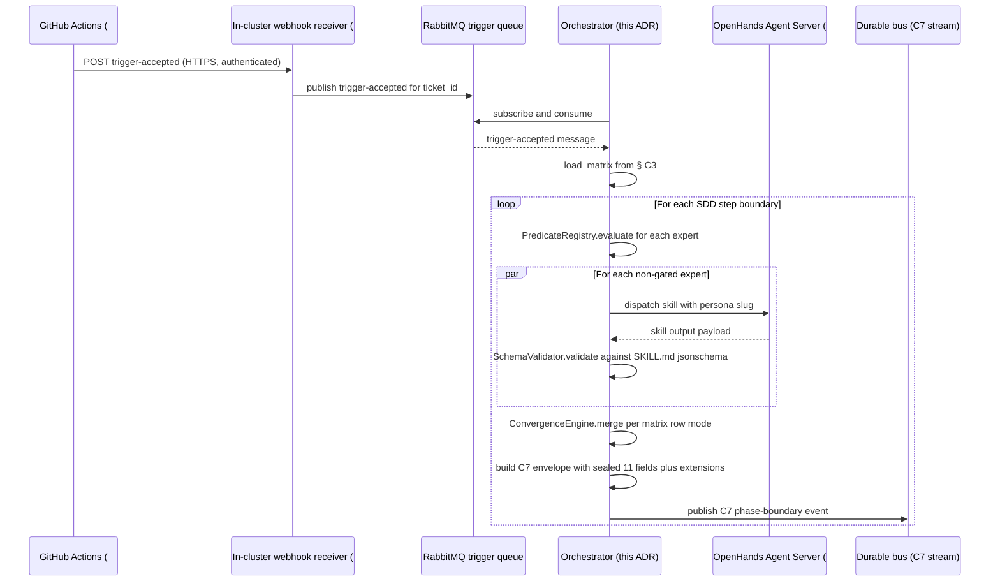
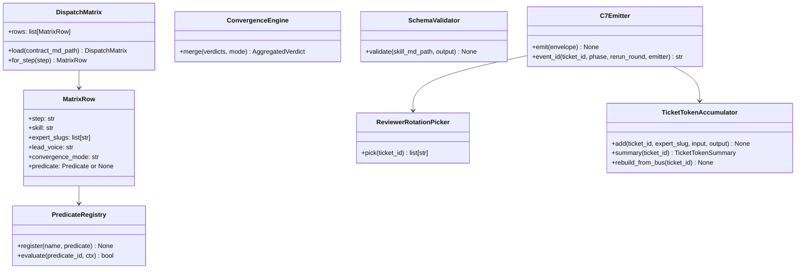

# ADR: Orchestrator Service (Child B of #333)

**Status:** approved
**Date:** 2026-06-18
**Approved:** 2026-06-18
**ADR technical decision sign-off:** approved (sbonoc, PR #372 sign-off comment 2026-06-18)
**Issue:** #361 (Child B of #333, Phase 1 of Epic #332)
**Spec:** `specs/2026-06-18-issue-361-orchestrator-service/`
**Parent ADRs:**
- [`ADR-issue-337-c7-emission-mechanism.md`](ADR-issue-337-c7-emission-mechanism.md) — sealed three-emitter rule; orchestrator is one of three emitters.
- [`ADR-issue-337-persona-skill-contract.md`](ADR-issue-337-persona-skill-contract.md) — orchestrator owns skill composition / dispatch (clause 3); personas/skills MUST NOT.
- [`ADR-issue-337-reviewer-model-heterogeneity.md`](ADR-issue-337-reviewer-model-heterogeneity.md) — reviewer-rotation picker is an orchestrator responsibility.
- [`ADR-issue-337-light-decomposition-policy.md`](ADR-issue-337-light-decomposition-policy.md) — basis for the 5-child decomposition declared in this ADR (fan-out 5 hits but does not exceed the policy cap).
- [`ADR-issue-364-expert-persona-model.md`](ADR-issue-364-expert-persona-model.md) — three-layer model; dispatch matrix loader; convergence modes; `expert_verdicts[]`.
- [`ADR-issue-368-factory-cost-telemetry-routing-fixture.md`](ADR-issue-368-factory-cost-telemetry-routing-fixture.md) — additive extension fields the orchestrator emits.
- [`ADR-issue-347-human-sdd-c7-symmetry.md`](ADR-issue-347-human-sdd-c7-symmetry.md) — third emitter `local-cli`; preserves orchestrator's emitter role.
**Extensibility classification:** `sealed` — the orchestrator service contract (dispatch loader, convergence engine, schema validator, C7 emitter, reviewer-rotation picker) is single-instance per factory deployment; consumer overlays parameterize the Helm chart values, not the service code.

## Context

`#333` (autonomous factory persona roster + orchestrator) split at SDD intake on 2026-06-02 into:
- Child A `#360` — governance docs only: 10 personas + 10 new skill `SKILL.md` runbooks + jsonschema blocks. CLOSED 2026-06-03 in PR #362; superseded by the expert-persona model in PR #365 (`#364`).
- Child B `#361` — orchestrator service (this ADR's scope).

Between split and now, two structural amendments landed:
- ADR-issue-364 (PR #365) replaced the stage-persona model with the three-layer model (SDD step / skill / expert persona); the C3 dispatch matrix became single-sourced in `docs/blueprint/autonomous-factory/design-contracts.md`; the additive `outcome_details.expert_verdicts[]` field landed on C7.
- ADR-issue-368 (PR #371) standardized the additive C7 extension fields `outcome_details.token_usage`, `outcome_details.merger_overhead`, `outcome_details.routing_keys` (now covering all phases, not only `phase: agent-pr-review`), and `outcome_details.ticket_token_summary`.

The orchestrator MUST consume both amendments at first ship.

In parallel, `#369` (UX/UI expert persona — 9th panel slot) was filed and parked in `AGENTS.backlog.md` pending `#361`'s conditional-dispatch machinery. At this intake, the user decided to pull `#369` into `#361` scope so the mechanism and its first consumer land together.

The stated blockers `#335` (OpenHands Agent Server + LiteLLM gateway) and `#336` (RabbitMQ trigger queue + webhook handler) are still OPEN.

## Decision Drivers

- **Three-layer model fidelity.** The orchestrator MUST treat SDD steps as the sealed actor of record (`persona` field on orchestrator-emitted C7 events carries the **draft-producing skill basename**, NOT a stage-persona basename); expert verdicts are carried on the additive `outcome_details.expert_verdicts[]` array.
- **Sealed-emitter discipline.** Per ADR-issue-337-c7-emission-mechanism § FR-019, only the orchestrator (phase-boundary events) and the `#336` webhook handler (GitHub-observable events) and `local-cli` (`#347`) MAY emit C7 events. The orchestrator MUST NOT delegate emission to personas, skills, OpenHands sessions, or workspace pods.
- **Schema-of-record validation.** The orchestrator is the SOLE guarantee that personas/skills cannot drift the C7 emission shape. It MUST validate every skill execution output against the YAML jsonschema in that skill's `## Required Output Schema` fenced block BEFORE emitting. Validation failure MUST suppress emission and surface through the `#336` reject-rerun cap path.
- **Light-decomposition at intake.** Per `feedback_decomposition_preference` and the `#333` → `#360` + `#361` split precedent, `#361` is decomposed into 5 children at this intake along layer/feature/governance-docs boundaries (pure core / emission + bus / runtime clients / deployment surface / usability-pragmatist expert + `#369` closure) so review surfaces and unblock chains do not collide and so the architecture-sign-off exception on the 9-vs-8 expert ceiling stays scoped to a single PR.
- **`#369` closure with conditional dispatch.** Per user decision at this intake (amended 2026-06-18 to split deployment from governance-docs), the FR-012 conditional-dispatch *mechanism* lands in `#361.1` (predicate-registry on the pure-Python dispatch core) and its first consumer (`usability-pragmatist` PERSONA.md + C3 matrix wiring + `has-user-facing-flow` gate) lands in `#361.5` as a governance-docs child parallel to the `#360` precedent. The two ship in lock-step (the matrix wiring is inert until the predicate-registry mechanism exists) but on separate PRs so the architecture-sign-off exception on the 9-vs-8 expert ceiling stays scoped to a single PR with no Helm/ESO/NetworkPolicy distractions.
- **Two human gates only.** Per `feedback_autonomy_posture`, the orchestrator runs autonomously between (1) the spec gate (human Product/Architecture/Security/Operations sign-off) and (2) the bounded-context human merge gate. No intermediate human-in-the-loop step is introduced.

## Decision

The orchestrator is shipped across 5 child work items decomposed from `#361` at intake. Each child is a separate GitHub issue that cites this parent spec path and its boundary type per `docs/blueprint/autonomous-factory/design-contracts.md` § Contract C2 (decomposed-children layout) and § Contract C4 (Integration AC).

| Child | Boundary type | Scope summary | Blocked by | Owning team |
|---|---|---|---|---|
All 5 children carry the canonical boundary type `architectural-layer` per ADR-issue-337-light-decomposition-policy "Allowed boundary types" (single-axis decomposition required; the ADR's named layer values `domain / application / infrastructure / interface` cover all 5):

| Child | Boundary type + value | Scope summary | Blocked by | Owning team |
|---|---|---|---|---|
| `#361.1` | `architectural-layer: domain/application` (pure-Python core, no I/O) | Dispatch matrix loader (reads § C3); convergence engine (three modes from ADR-issue-364 § 4 / § 5); schema validator (parses `## Required Output Schema` jsonschema blocks from `#360`); conditional-dispatch predicate registry (mechanism only) | — (unblocked; `#360` closed) | `@sbonoc/factory-context-factory` |
| `#361.2` | `architectural-layer: infrastructure — emission and bus integration` | C7 event envelope construction with deterministic `event_id = sha256(ticket_id\|phase\|rerun_round\|emitter)`; RabbitMQ durable-bus publisher; reviewer-rotation picker that queries the bus for prior `phase: implement` event and applies `model_family(s)` normalization; per-ticket token accumulator (NFR-REL-001 bus-rebuild on restart); `outcome_details.expert_verdicts[]` / `routing_keys` / `token_usage` / `merger_overhead` / `ticket_token_summary` extension-field population | `#361.1` | `@sbonoc/factory-context-factory` |
| `#361.3` | `architectural-layer: infrastructure — external-runtime clients and service entrypoint` | RabbitMQ trigger subscriber against `#336`'s work queue; OpenHands Agent Server HTTP client against `#335`'s API; work loop from `trigger-accepted` to step08 close | `#361.2`, **`#335` spec-complete**, **`#336` spec-complete** | `@sbonoc/factory-context-factory` |
| `#361.4` | `architectural-layer: infrastructure — deployment surface` | Helm chart under `scripts/templates/infra/orchestrator/`; egress `NetworkPolicy`; ESO volume-mounted credentials; `ServiceAccount` wired to factory bot identity; Contract C8 § Category (b) row for the orchestrator chart | `#361.1`, `#361.2`, **`#334` spec-complete (bot identity + ESO)** | `@sbonoc/factory-context-factory` + `@sbonoc/factory-security` + `@sbonoc/factory-operations` |
| `#361.5` | `architectural-layer: interface — expert-panel persona contract` | `usability-pragmatist` PERSONA.md at `.agents/personas/usability-pragmatist/PERSONA.md` (6-section template per ADR-issue-364 § 3) — this PERSONA.md IS the interface contract between the SDD step (sealed actor of record per ADR-issue-364 § 2) and the standing review-lens layer; C3 matrix wiring at step01/04/05/08 gated by FR-012 `has-user-facing-flow` predicate; `AGENTS.backlog.md` `#369` entry marked `(incorporated: issue-361.5)`; architecture-sign-off exception to the ADR-issue-364 expert-ceiling-of-8 authored as an ADR amendment per parent spec § Notes for Child Intake (EXACTLY ONE OF: a `Status: amended` note on ADR-issue-364 with an Amendments section, OR a new narrowly-scoped `ADR-issue-361.5-usability-pragmatist-ceiling-exception.md`); the PERSONA.md front-matter cites the chosen ADR by path | `#361.1` (predicate-registry mechanism) | `@sbonoc/factory-context-factory` + `@sbonoc/factory-architecture` + `@sbonoc/factory-product` |

The parent `#361` issue body MUST carry an `## Integration Acceptance Criteria` section with the 5 cross-child checkboxes enumerated in this work item's `spec.md` AC-005 through AC-009.

## Alternatives Considered

**Alt 1 — Single spec, single PR (no decomposition).** Rejected. The scope spans pure-Python algorithms, RabbitMQ + HTTP runtime clients, a Helm chart with NetworkPolicy + ESO, AND the `#369` closure. A single PR exceeds reviewer capacity for any one bounded-context team and forces serialization on `#335` / `#336` spec-complete for surfaces that could otherwise ship in parallel.

**Alt 2 — Defer all `#361` intake until `#335` / `#336` are spec-complete.** Rejected. The pure-core dispatch matrix loader, convergence engine, schema validator, predicate-registry mechanism, deployment surface, and usability-pragmatist governance-docs are all independent of the server-side contracts; deferring locks idle reviewer capacity. The 5-child split lets `#361.1`, `#361.2`, `#361.4`, and `#361.5` proceed immediately while `#361.3` waits.

**Alt 3 — Keep `#369` separate from `#361`.** Rejected. The FR-012 conditional-dispatch mechanism has no other shipped consumer at v1; landing the mechanism in `#361` and the first consumer in `#369` doubles the integration-test surface across two PRs for no architectural benefit. Pulling `#369` into `#361.5` (a sibling child) lands mechanism (`#361.1`) and first consumer (`#361.5`) in the same epic.

**Alt 4 — Bundle usability-pragmatist governance-docs into the deployment-surface child `#361.4`.** Rejected. PERSONA.md authoring is governance-docs work analogous to `#360` (Architecture + Product reviewers); Helm/ESO/NetworkPolicy is infrastructure work (Security + Operations reviewers). Bundling forces reviewers to context-switch between PERSONA.md content review and Kubernetes manifest review on the same PR, and conflates the architecture-sign-off exception on the 9-vs-8 expert ceiling with unrelated deployment-surface sign-off decisions. Splitting into `#361.5` keeps the sign-off scope and reviewer surface clean (fan-out 5 hits but does not exceed the ADR-issue-337-light-decomposition-policy cap).

**Alt 5 — Multi-replica orchestrator at v1.** Rejected. The per-ticket token accumulator is the single contended structure; multi-replica requires a shared lock service that has no current adopter. Single-replica with bus-rebuild-on-restart satisfies NFR-REL-001 and leaves a clean refactor path.

## Consequences

- The parent `#361` issue closes only when all 5 child PRs merge AND every cross-child integration checkbox is ticked by a human bounded-context reviewer (per Contract C4).
- `ADR-issue-339-factory-design-contracts.md` § Contract C8 § Category (b) gains EXACTLY ONE row in `#361.4` for the orchestrator Helm chart (stability `stable`, owning ticket `#361.4`).
- The `usability-pragmatist` expert added in `#361.5` brings the standing expert roster to 9, requiring an architecture-sign-off exception to the ADR-issue-364 expert ceiling of 8. The FR-012 conditional-dispatch gate (authored in `#361.1`, consumed in `#361.5`) is the safety property the exception is conditioned on.
- `AGENTS.backlog.md` entry for `#369` is marked incorporated when `#361.5` merges.
- Two deferred backlog proposals remain in effect post-merge: embedding-based finding dedup (ADR-issue-364 § 11) and per-expert prompt-cache discipline (ADR-issue-368 follow-on). Both trigger on `on-scope: factory` once telemetry baselines are established.

## Diagrams

### Sequence — work-item dispatch (Context A + B + C)

Per #336 the trigger pipeline is two-hop: GitHub Actions reusable workflows POST to an in-cluster Python webhook-receiver service (the only component that can reach the SKE-internal RabbitMQ — direct publish from GitHub-hosted runners would require public RabbitMQ exposure, rejected by NFR-SEC-001 + the #334 egress NetworkPolicy). The receiver fronts the queue; the orchestrator subscribes downstream and is agnostic to the publisher topology.

### Class — Context A + B module structure

