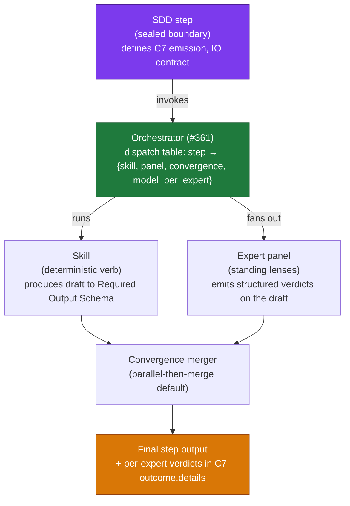
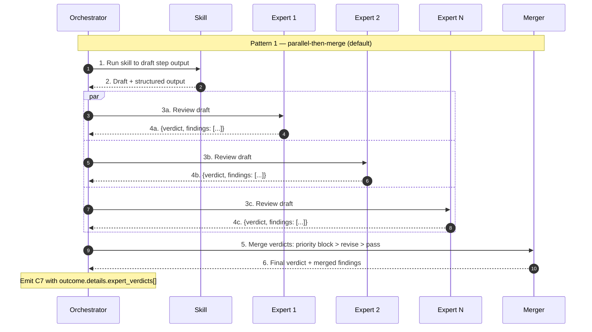

# ADR-issue-364 — Factory Expert Persona Model (panel of standing experts, dispatched per SDD step)

- Status: proposed
- Date: 2026-06-02
- Deciders: bonos (solo operator)
- Work item: issue #364 — `feature/2026-06-02-issue-364-factory-expert-persona-panel`

This ADR **supersedes ADR-issue-360-factory-personas-skills-roster.md** in full, and **amends** three #337 ADRs:

- `ADR-issue-337-persona-skill-contract.md` — amends clause 3 (composition): the **orchestrator** is the sole dispatcher of skills; **expert personas** also MUST NOT directive-invoke skills.
- `ADR-issue-337-c7-emission-mechanism.md` — amends the `outcome.details` shape to permit an additive optional `expert_verdicts: Array<{ expert_slug, verdict, findings_count }>`; the eleven required fields, the sealed three-emitter rule, and the `event_id` derivation are unchanged.
- `ADR-issue-337-reviewer-model-heterogeneity.md` — amends the heterogeneity rule from "implement-vs-review model split" to **per-expert model assignment**; the FR-008 audit invariant becomes a panel-disjointness rule (formalized in #336's spec amendment landed alongside this ADR).

## 1. Context

The factory roster authored under #360 / PR #362 modelled personas as **pipeline-stage owners** (one persona per SDD step). Reviewing the authored persona files surfaced that they read like skill runbooks — `Skills Invoked` sequences, `Activation Triggers`, `Definition of Done` checklists — duplicating verbs the skills layer already owns. The persona layer did not earn its keep over the skill layer.

Pivot: personas as **cross-cutting standing experts** with a worldview, default heuristics, and push-back triggers. Each SDD step dispatches a **panel** of relevant experts whose verdicts layer onto the skill's draft output. Skills do execution; experts add judgment.

This ADR formalizes the three-layer separation (SDD step / skill / expert persona), pins the 8-expert roster, defines the SDD-step × expert dispatch matrix anchor location, pins the convergence mechanics, and pins the always-respond verdict contract.

## 2. Three-layer architecture



**Layer separation rules:**

- **SDD step layer**: sealed. Changes require a separate ADR. Defines the lifecycle phases (`intake`, `spec`, `plan`, `implement`, `review`, `package`, `agent-pr-review`) and the C7 emission boundary.
- **Skill layer**: extensible. Each skill is a procedural verb invoked at one or more SDD steps; produces structured output to a `## Required Output Schema`. Skills MUST NOT directive-invoke other skills (carried forward from `ADR-issue-337-persona-skill-contract.md` clause 3).
- **Expert persona layer**: extensible. Each expert is a `PERSONA.md` file holding a worldview, default heuristics, and push-back triggers. Experts MUST NOT directive-invoke skills. Experts MUST NOT cite each other in their persona files (compositional independence — the matrix in C3 is the sole binding mechanism).
- **Orchestrator** (#361): binds steps to skills and experts via a single dispatch table `step → {skill, expert_panel, convergence_mode, model_per_expert}`. The orchestrator is the only component that "knows" the matrix at runtime.

## 3. Expert roster (8, sized for distinguishable postures)

| # | Slug | Worldview tagline | Lens not held by others |
|---|---|---|---|
| 1 | `product-pragmatist` | Outcome over output; scope is a contract | Defends the *why*; rejects gold-plating |
| 2 | `boundary-hawk` | Coupling is the first sin | Catches leaky abstractions and bounded-context drift |
| 3 | `security-paranoid` | Assume the adversary; trust nothing | Threat model + blast radius |
| 4 | `data-privacy` | Data is a liability | Minimization, residency, lawful basis, retention, subject rights (distinct from `security-paranoid`'s attack-surface focus) |
| 5 | `test-quality-sceptic` | What does this test actually prove? | Mocked-vs-real; empty-result assertions; coverage theatre |
| 6 | `operability-sre` | 3am readiness; graceful degradation | Observability, reversibility, runbook surface |
| 7 | `documentation-discipline` | Future-you needs the why | Docs/code drift; rationale capture; ADR currency |
| 8 | `performance-cost-aware` | Every loop, retry, and token costs | Hot-path scrutiny; N+1; unbounded retries; LLM token budget |

**Roster ceiling: 8.** Any 9th expert MUST demonstrate distinct push-back triggers the existing 8 do not cover, OR MUST replace an underperforming existing expert (retired after 30 days of no distinct findings produced). Roles named by **worldview**, not by **job title** — there is no `tech-lead`, `po-analyst`, `qa-engineer`, `compliance-officer` persona; those are roles, not lenses.

**File shape (FR-001):** each expert ships as `.agents/personas/<slug>/PERSONA.md` with sections, in order: `# <Expert Title>`, `## Worldview`, `## Default Heuristics`, `## Push-back Triggers`, `## What I Notice That Others Miss`, `## Quality Bar`, `## Communication Style`. None of `## Skills Invoked`, `## Activation Triggers`, `## Definition of Done`, `## Collaboration & Handoffs`, `## Strict Guardrails`, `## SDD Cycle Stakes`, `## Required Inputs`, `## Role Objective` MAY appear.

## 4. SDD-step × expert dispatch matrix (single source: design-contracts § C3)

The authoritative matrix is in `../../autonomous-factory/design-contracts.md` § C3. This ADR references it; **does NOT duplicate it** (per FR-002). The matrix table header MUST be exactly:

```
| SDD step | Skill | Experts consulted | Lead voice | Convergence mode |
```

so silent drift between the C3 table and any consumer (orchestrator dispatch table, audit dashboard, persona-impact analyser) is grep-detectable.

The matrix at the time of this ADR (informative — for sign-off readers; authoritative form lives in C3):

| SDD step | Skill | Experts consulted | Lead voice | Convergence mode |
|---|---|---|---|---|
| step01 | `blueprint-sdd-step01-intake` | **all 8** | `product-pragmatist` | parallel-then-merge |
| step02 | `blueprint-sdd-step02-resolve-questions` | **dynamically scoped per question** (orchestrator selects experts whose worldview matches the question domain; floor = `product-pragmatist` for any question lacking domain signal); lead = the original questioner (if a bot persona) or `product-pragmatist` (if a human reviewer) | dynamic | parallel-then-merge |
| step03 | `blueprint-sdd-step03-spec-complete` | `documentation-discipline` only | `documentation-discipline` | sequential-lens (panel-of-1 — convergence is trivial) |
| step04 | `blueprint-sdd-step04-plan-slicer` | `test-quality-sceptic`, `boundary-hawk`, `operability-sre`, `performance-cost-aware` | `test-quality-sceptic` | parallel-then-merge |
| step05 | `blueprint-sdd-step05-implement` | `test-quality-sceptic`, `security-paranoid`, `data-privacy`, `boundary-hawk`, `performance-cost-aware` | `test-quality-sceptic` | sequential-lens |
| step06 | `blueprint-sdd-step06-document-sync` | `documentation-discipline`, `boundary-hawk`, `product-pragmatist` | `documentation-discipline` | parallel-then-merge |
| step07 | `blueprint-sdd-step07-pr-packager` | `documentation-discipline`, `operability-sre`, `test-quality-sceptic`, `boundary-hawk` | `documentation-discipline` | parallel-then-merge |
| step08 | `blueprint-sdd-step08-agent-pr-review` | **all 8** | rotating per round (heterogeneity-aware) | parallel-then-merge (structured-disagreement on block conflicts) |

**Dispatch principle:** experts cluster where artifacts are **born or substantially mutated** (step01, step02, step05, step08), not where sign-offs are recorded (step03). Catching a design flaw at step01 is 10–100× cheaper than catching it at step08.

**Per-step dispatch sizes:** 8 / dynamic / 1 / 4 / 5 / 3 / 4 / 8. Total expert-step instantiations: 33 + step02 average (assume ~3) ≈ 36. Step03 is intentionally minimal — the four human sign-offs (Product / Architecture / Security / Operations) already covered the architectural lensing; `documentation-discipline` is a token-cheap "did we record cleanly" sanity check that keeps always-respond audit symmetry alive at every step.

**Step02 dynamic-scope contract** (consumed by #361 orchestrator):
- Input: the open-question text + the artifact section it targets (e.g., `spec.md § NFR-003`, `architecture.md § Bounded Contexts`).
- Selection rule: orchestrator routes the question to the expert(s) whose `Push-back Triggers` section in their `PERSONA.md` matches keywords / domains in the question. Multiple matches → multiple experts. Zero matches → floor = `product-pragmatist`.
- Lead voice: the original questioner if the question was raised by a bot persona at step08 (recorded in `outcome.details.expert_verdicts[].expert_slug`); otherwise `product-pragmatist`.
- Implementation of the routing logic is owned by #361; this ADR specifies only the contract.

Tunable per-step over time without amending this ADR — the matrix in C3 is authoritative and the only place it lives.

## 5. Convergence patterns (FR-003)

Three patterns; default = (1).



**Pattern 1 — parallel-then-merge** (default). Experts review the skill's draft in parallel; merger applies priority `block > revise > pass` and dedupes findings (string-equality dedup at MVP; embedding-dedup is a #361 follow-up).

**Pattern 2 — sequential-lens** (`step05` only). Experts apply in order: `test-quality-sceptic` → `security-paranoid` → `data-privacy` → `performance-cost-aware` → `boundary-hawk`. Each round receives the prior round's revised draft. Used where a later lens must observe the effect of an earlier lens (e.g., a security fix may introduce a performance regression).

**Pattern 3 — structured-disagreement** (`step08` only, on conflicting `block` verdicts). When two experts emit `block` with mutually exclusive demands (revealed by the merger detecting contradictory finding categories), the orchestrator surfaces the disagreement to the human at the **existing two gates** (spec sign-off, PR merge). **No new gate** is introduced. (Step03 is excluded — its panel size of 1 makes block-conflict mechanically impossible; any disagreement at the spec-sign-off gate is reasoned out between human approvers, not bot experts.)

## 6. Always-respond verdict contract (FR-004)

Every dispatched expert MUST return a verdict object conforming to:

```json
{
  "$schema": "http://json-schema.org/draft-07/schema#",
  "title": "ExpertVerdict",
  "type": "object",
  "additionalProperties": false,
  "required": ["expert_slug", "verdict", "findings"],
  "properties": {
    "expert_slug": {
      "type": "string",
      "enum": [
        "product-pragmatist",
        "boundary-hawk",
        "security-paranoid",
        "data-privacy",
        "test-quality-sceptic",
        "operability-sre",
        "documentation-discipline",
        "performance-cost-aware"
      ]
    },
    "verdict": {
      "type": "string",
      "enum": ["pass", "revise", "block"]
    },
    "findings": {
      "type": "array",
      "items": {
        "type": "object",
        "additionalProperties": false,
        "required": ["category", "summary"],
        "properties": {
          "category": {
            "type": "string",
            "description": "Short tag for grouping/dedup (e.g., missing-observability, leaky-abstraction, retention-overshoot)"
          },
          "summary": {
            "type": "string",
            "description": "One-sentence finding statement"
          },
          "evidence_ref": {
            "type": "string",
            "description": "Optional file path:line or artifact reference grounding the finding"
          },
          "severity": {
            "type": "string",
            "enum": ["info", "low", "medium", "high", "critical"]
          }
        }
      }
    }
  }
}
```

**Empty-findings sentinel:** when the expert has no concern, `findings` MUST be the empty array `[]` and `verdict` MUST be `pass`. Silent omission of a verdict from a dispatched expert MUST cause the orchestrator to fail the step and emit C7 `outcome: rejected` with `rejection_reason: missing-expert-verdict`. This makes "expert was skipped wrongly" structurally distinguishable from "expert ran and had nothing to say" in the audit log.

## 7. Supersession + amendment (FR-005)

- `ADR-issue-360-factory-personas-skills-roster.md`: `Status: superseded by ADR-issue-364-expert-persona-model.md`. First paragraph rewritten to point readers here. The salvageable artifacts (skill runbooks minus persona-coupling; C7 schema fixes; CLAUDE.md step08 row) carry forward via this ADR's outputs.
- `ADR-issue-337-persona-skill-contract.md`: `Amended by ADR-issue-364-expert-persona-model.md` (clause 3 composition rule extended to expert personas).
- `ADR-issue-337-c7-emission-mechanism.md`: `Amended by ADR-issue-364-expert-persona-model.md` (additive optional `outcome.details.expert_verdicts[]`).
- `ADR-issue-337-reviewer-model-heterogeneity.md`: `Amended by ADR-issue-364-expert-persona-model.md` (per-expert model assignment; FR-008 audit invariant becomes panel-disjointness).

Unchanged: `ADR-issue-337-triage-size-threshold.md`, `ADR-issue-337-light-decomposition-policy.md`, `ADR-issue-337-trigger-authorization-model.md`.

## 8. Skill runbook adjustments (FR-006)

The 10 skill runbooks shipped by #360 / PR #362 are re-homed onto this branch with:

- **`Actor` section**: cite the orchestrator + the expert panel via the matrix. MUST NOT name a stage-persona (no "po-analyst persona", "tech-lead persona", etc.). AC-004 grep enforces this.
- **`Composition` section**: cite the orchestrator's dispatch table as the binding mechanism. Skills still MUST NOT directive-invoke other skills.
- **`blueprint-sdd-step08-agent-pr-review/SKILL.md` only**: `## Inputs` adds a panel-input parameter (`expert_slugs: Array<string>`) and `## Required Output Schema` adds a per-expert verdict array conforming to the schema in §6.

The other nine skill runbooks (triage-size, decompose-light, spec-author, plan-slicer, implement, document-sync, pr-package, agent-stop-cleanup, traceability-keeper) require only the `Actor` and `Composition` text fixes — no schema changes.

### 8.1 Persona vs `AGENTS.md` precedence

`AGENTS.md` was authored for a singular agent and contains two distinct flavors of instruction. The expert-panel model requires they be treated differently when a persona is dispatched:

- **Procedural / governance rules** (SDD lifecycle, sign-off policy, quality-hooks usage, contract precedence, branch naming, validation bundles, DoD, MUST-NOT-self-approve, etc.): apply **uniformly to every dispatched expert without exception**. These are *how to act*, not *who you are*. Boundary Hawk and Documentation Discipline both follow the sign-off policy verbatim.
- **Identity / worldview content** (currently scoped under `AGENTS.md § Role and Philosophy`): does **NOT** apply to dispatched experts. Each persona's `PERSONA.md § Worldview` is the **sole identity source** for that expert during dispatch. The operator-default identity in `AGENTS.md` applies only when no persona is loaded (e.g., during `blueprint-consumer-ops`, `blueprint-consumer-upgrade`, ad-hoc operator sessions).

This separation prevents the panel's 8 worldviews from collapsing toward a shared "Architect + Principal Engineer" identity floor inherited from `AGENTS.md`. Without this precedence rule, every dispatched expert would inherit the operator-default worldview underneath its own, weakening the per-expert distinctiveness the panel exists to provide (e.g., Data Privacy's data-as-liability framing would dilute into "well-designed data handling"; Security Paranoid's threat-actor lens would soften into "secure-by-default conventions").

**Enforcement:** the precedence is declared in `AGENTS.md § Role and Philosophy` (scoping note added in this work item). Any future `AGENTS.md` edit that introduces new identity content MUST flag it and either (a) exempt dispatched experts explicitly, or (b) add the equivalent guidance as a per-persona heuristic in each affected `PERSONA.md`. There is no scripted check for this today; the discipline relies on ADR review.

## 9. C7 amendment shape (FR-007)

The `outcome.details` object on every C7 event MAY contain an additive optional `expert_verdicts: Array<ExpertVerdictSummary>` where `ExpertVerdictSummary` is:

```json
{
  "type": "object",
  "additionalProperties": false,
  "required": ["expert_slug", "verdict", "findings_count"],
  "properties": {
    "expert_slug": { "type": "string" },
    "verdict": { "type": "string", "enum": ["pass", "revise", "block"] },
    "findings_count": { "type": "integer", "minimum": 0 }
  }
}
```

The full per-finding payload (`category`, `summary`, `evidence_ref`, `severity`) lives in workspace artifacts (referenced by the C7 event's existing `evidence_uri`), not inside the event itself, to keep events compact. Audit consumers can join the summary with the full payload via `(ticket_id, phase, rerun_round)`.

Existing eleven required fields, sealed three-emitter rule, phase-enum-keyed audit predicates, and `event_id = sha256(ticket_id|phase|rerun_round|emitter)` derivation are unchanged.

## 10. SoD posture (NFR-SEC-001)

Expert verdicts are **bot-authored**. They MUST NOT count toward the four canonical human sign-off phrases (`SPEC_PRODUCT_READY: approved`, `ARCHITECTURE_SIGNOFF: approved`, `SECURITY_SIGNOFF: approved`, `OPERATIONS_SIGNOFF: approved`). The two human gates (spec sign-off at step03; PR merge at step08) remain the **sole sources** of human approval. Any future proposal to auto-promote expert verdicts to sign-offs MUST be filed as a separate ADR with explicit security review; this is out of scope here.

The `agent-stop` GitHub label semantics from `ADR-issue-337-trigger-authorization-model.md` are unchanged: it is a human-applied abort signal, never emitted by personas, skills, or the orchestrator.

## 11. Future work (explicit; out of scope here)

- **Compliance / regulatory-audit expert** as 9th panel member: held until a clear regulatory-audit work surface (separate from data-privacy and security) emerges. Adding it now would muddy the data-privacy posture without distinct push-back triggers.
- **Expert-panel consultation for human-driven local SDD sessions** (`local-cli` emitter from #347): solo operators driving SDD locally continue without panel dispatch. A future opt-in local invocation (no make target proposed today) is held as a separate ticket if user demand emerges.
- **Per-expert prompt-cache discipline** (separate prompt caches per expert worldview to prevent contamination): surfaces during #361 orchestrator implementation if cache contamination shows up in observability.
- **Embedding-based finding-text dedup** for the convergence merger: MVP uses string-equality dedup; upgrade if naive dedup proves insufficient. #361 follow-up.
- **Expert-verdict-to-skill-output feedback loop** (skill regenerates when ≥2 experts block): held until parallel-then-merge proves insufficient in practice.

## 12. Consequences

**Positive:**

- Personas earn their keep over skills — judgment and lens separation is clean.
- Per-expert audit attribution becomes queryable in C7 logs ("show me every block by Boundary Hawk in last 30 days").
- Per-expert model assignment enables cost-tier control (Haiku for high-volume low-stakes; Opus for high-stakes).
- Three-layer separation makes the orchestrator dispatch table (#361) the single point of binding — easier to evolve.
- Solo-operator topology preserved: local-CLI session remains panel-free; bot runs use full panel.

**Negative:**

- Higher LLM call volume per step (1 skill + N expert reviews vs 1 stage-persona) — mitigated by matrix-capped panel sizes; step01 and step08 are the two all-8 fan-outs (artifact-authoring + full-PR-review judgment surfaces); step03 is minimised to 1 expert; total expert-step instantiations per work item ≈ 36.
- Convergence merger is new code surface (in #361). Naive dedup may miss semantic duplicates.
- 8-expert ceiling is now AT the limit on day one — discipline required to reject below-distinction proposals.
- Higher spec-authoring complexity in this ticket so #361 inherits an implementation-ready contract.

**Neutral:**

- The C7 schema becomes slightly larger (additive optional field). Existing consumers unaffected.
- AGENTS.md persona section retitled and rewritten — readers of the prior section will need to re-read once.

## 13. Implementation pointers

- Persona files: `.agents/personas/<slug>/PERSONA.md` (8 files, FR-001).
- Skill files: `.agents/skills/blueprint-*/SKILL.md` (10 files, FR-006).
- Matrix authoritative source: `docs/blueprint/autonomous-factory/design-contracts.md` § C3 (FR-002).
- Verdict schema: §6 above (FR-004); orchestrator (#361) validates against this schema before merger.
- C7 amendment: `ADR-issue-337-c7-emission-mechanism.md` (additive field clause appended) (FR-007).
- Cross-ticket amendments: posted in step06 of this ticket per FR-008; URLs captured in `pr_context.md` (AC-005).
