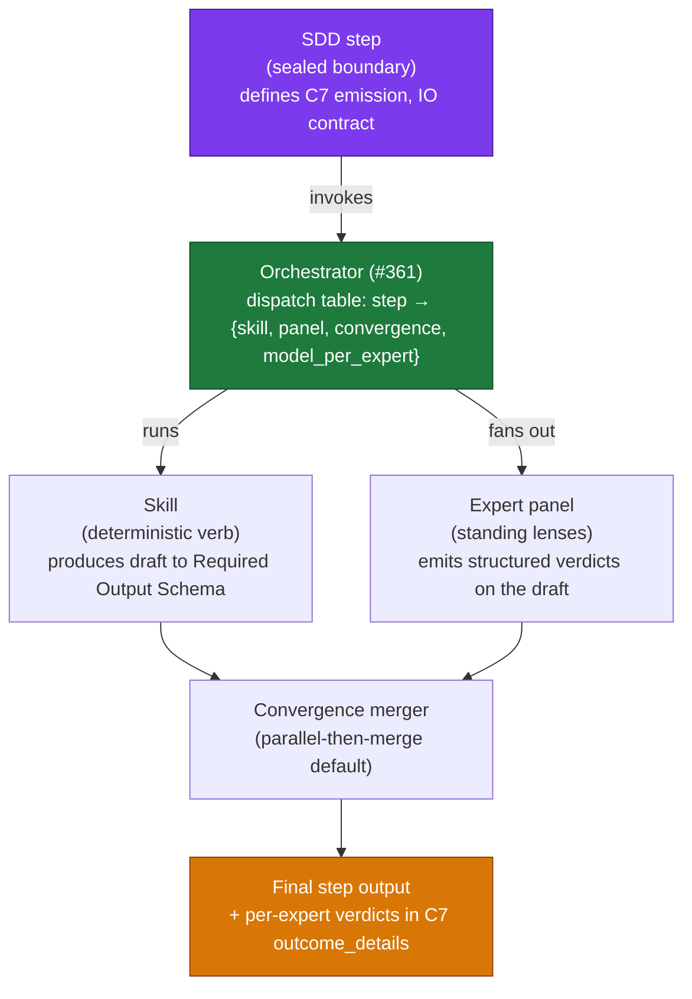
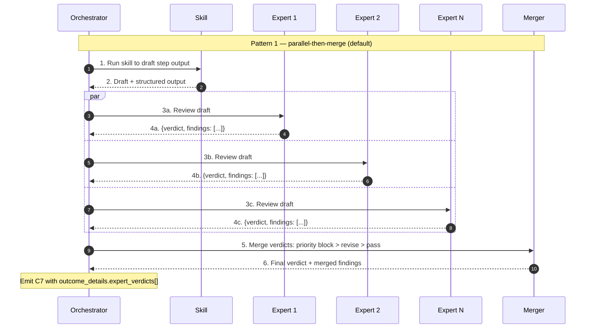

# ADR-issue-364 — Factory Expert Persona Model (panel of standing experts, dispatched per SDD step)

- Status: accepted
- Date: 2026-06-02
- Deciders: bonos (solo operator)
- Work item: issue #364 — `feature/2026-06-02-issue-364-factory-expert-persona-panel`

This ADR **supersedes ADR-issue-360-factory-personas-skills-roster.md** in full, and **amends** three #337 ADRs:

- `ADR-issue-337-persona-skill-contract.md` — amends clause 3 (composition): the **orchestrator** is the sole dispatcher of skills; **expert personas** also MUST NOT directive-invoke skills.
- `ADR-issue-337-c7-emission-mechanism.md` — amends the `outcome_details` shape to permit an additive optional `expert_verdicts: Array<{ expert_slug, verdict, findings_count }>`; the eleven required fields, the sealed three-emitter rule, and the `event_id` derivation are unchanged.
- `ADR-issue-337-reviewer-model-heterogeneity.md` — amends the heterogeneity rule from "implement-vs-review model split" to **per-expert model assignment**; the FR-008 audit invariant becomes a panel-disjointness rule (formalized in #336's spec amendment landed alongside this ADR).

## 1. Context

The factory roster authored under #360 / PR #362 modelled personas as **pipeline-stage owners** (one persona per SDD step). Reviewing the authored persona files surfaced that they read like skill runbooks — `Skills Invoked` sequences, `Activation Triggers`, `Definition of Done` checklists — duplicating verbs the skills layer already owns. The persona layer did not earn its keep over the skill layer.

Pivot: personas as **cross-cutting standing experts** with a worldview, default heuristics, and push-back triggers. Each SDD step dispatches a **panel** of relevant experts whose verdicts layer onto the skill's draft output. Skills do execution; experts add judgment.

This ADR formalizes the three-layer separation (SDD step / skill / expert persona), pins the 8-expert roster, defines the SDD-step × expert dispatch matrix anchor location, pins the convergence mechanics, and pins the always-respond verdict contract.

## 2. Three-layer architecture



**Layer separation rules:**

- **SDD step layer**: sealed. Changes require a separate ADR. Defines the lifecycle phases (`intake`, `spec`, `plan`, `implement`, `review`, `package`, `agent-pr-review`) and the C7 emission boundary.
- **Skill layer**: extensible. Each skill is a procedural verb invoked at one or more SDD steps; produces structured output to a `## Required Output Schema`. Skills MUST NOT directive-invoke other skills (carried forward from `ADR-issue-337-persona-skill-contract.md` clause 3).
- **Expert persona layer**: extensible. Each expert is a `PERSONA.md` file holding a worldview, default heuristics, and push-back triggers. Experts MUST NOT directive-invoke skills. Experts MUST NOT cite each other in their persona files (compositional independence — the matrix in C3 is the sole binding mechanism).
- **Orchestrator** (#361): binds steps to skills and experts via a single dispatch table `step → {skill, expert_panel, convergence_mode, model_per_expert}`. The orchestrator is the only component that "knows" the matrix at runtime.

## 3. Expert roster (8, sized for distinguishable postures)

| # | Slug | Worldview tagline | Lens not held by others |
|---|---|---|---|
| 1 | `product-pragmatist` | Outcome over output; scope is a contract | Defends the *why*; rejects gold-plating |
| 2 | `boundary-hawk` | Coupling is the first sin | Catches leaky abstractions and bounded-context drift |
| 3 | `security-paranoid` | Assume the adversary; trust nothing | Threat model + blast radius |
| 4 | `data-privacy` | Data is a liability | Minimization, residency, lawful basis, retention, subject rights (distinct from `security-paranoid`'s attack-surface focus) |
| 5 | `test-quality-sceptic` | What does this test actually prove? | Mocked-vs-real; empty-result assertions; coverage theatre |
| 6 | `operability-sre` | 3am readiness; graceful degradation | Observability, reversibility, runbook surface |
| 7 | `documentation-discipline` | Future-you needs the why | Docs/code drift; rationale capture; ADR currency |
| 8 | `performance-cost-aware` | Every loop, retry, and token costs | Hot-path scrutiny; N+1; unbounded retries; LLM token budget |

**Roster ceiling: 8.** Any 9th expert MUST demonstrate distinct push-back triggers the existing 8 do not cover, OR MUST replace an underperforming existing expert (retired after 30 days of no distinct findings produced). Roles named by **worldview**, not by **job title** — there is no `tech-lead`, `po-analyst`, `qa-engineer`, `compliance-officer` persona; those are roles, not lenses.

**File shape (FR-001):** each expert ships as `.agents/personas/<slug>/PERSONA.md` with sections, in order: `# <Expert Title>`, `## Worldview`, `## Default Heuristics`, `## Push-back Triggers`, `## What I Notice That Others Miss`, `## Quality Bar`, `## Communication Style`. None of `## Skills Invoked`, `## Activation Triggers`, `## Definition of Done`, `## Collaboration & Handoffs`, `## Strict Guardrails`, `## SDD Cycle Stakes`, `## Required Inputs`, `## Role Objective` MAY appear.

## 4. SDD-step × expert dispatch matrix (single source: design-contracts § C3)

The authoritative matrix is in `../../autonomous-factory/design-contracts.md` § C3. This ADR references it; **does NOT duplicate it** (per FR-002). The matrix table header MUST be exactly:

```
| SDD step | Skill | Experts consulted | Lead voice | Convergence mode |
```

so silent drift between the C3 table and any consumer (orchestrator dispatch table, audit dashboard, persona-impact analyser) is grep-detectable.

The matrix at the time of this ADR (informative — for sign-off readers; authoritative form lives in C3):

| SDD step | Skill | Experts consulted | Lead voice | Convergence mode |
|---|---|---|---|---|
| step01 | `blueprint-sdd-step01-intake` | **all 8** | `product-pragmatist` | parallel-then-merge |
| step02 | `blueprint-sdd-step02-resolve-questions` | **dynamically scoped per question** (orchestrator selects experts whose worldview matches the question domain; floor = `product-pragmatist` for any question lacking domain signal); lead = the original questioner (if a bot persona) or `product-pragmatist` (if a human reviewer) | dynamic | parallel-then-merge |
| step03 | `blueprint-sdd-step03-spec-complete` | `documentation-discipline` only | `documentation-discipline` | sequential-lens (panel-of-1 — convergence is trivial) |
| step04 | `blueprint-sdd-step04-plan-slicer` | `test-quality-sceptic`, `boundary-hawk`, `operability-sre`, `performance-cost-aware` | `test-quality-sceptic` | parallel-then-merge |
| step05 | `blueprint-sdd-step05-implement` | `test-quality-sceptic`, `security-paranoid`, `data-privacy`, `boundary-hawk`, `performance-cost-aware` | `test-quality-sceptic` | sequential-lens |
| step06 | `blueprint-sdd-step06-document-sync` | `documentation-discipline`, `boundary-hawk`, `product-pragmatist` | `documentation-discipline` | parallel-then-merge |
| step07 | `blueprint-sdd-step07-pr-packager` | `documentation-discipline`, `operability-sre`, `test-quality-sceptic`, `boundary-hawk` | `documentation-discipline` | parallel-then-merge |
| step08 | `blueprint-sdd-step08-agent-pr-review` | **all 8** | rotating per round (heterogeneity-aware) | parallel-then-merge (structured-disagreement on block conflicts) |

**Dispatch principle:** experts cluster where artifacts are **born or substantially mutated** (step01, step02, step05, step08), not where sign-offs are recorded (step03). Catching a design flaw at step01 is 10–100× cheaper than catching it at step08.

**Per-step dispatch sizes:** 8 / dynamic / 1 / 4 / 5 / 3 / 4 / 8. Total expert-step instantiations: 33 + step02 average (assume ~3) ≈ 36. Step03 is intentionally minimal — the four human sign-offs (Product / Architecture / Security / Operations) already covered the architectural lensing; `documentation-discipline` is a token-cheap "did we record cleanly" sanity check that keeps always-respond audit symmetry alive at every step.

**Step02 dynamic-scope contract** (consumed by #361 orchestrator):
- Input: the open-question text + the artifact section it targets (e.g., `spec.md § NFR-003`, `architecture.md § Bounded Contexts`).
- Selection rule: orchestrator routes the question to the expert(s) whose `## Push-back Triggers` section in their `PERSONA.md` shares ≥ 1 **content bigram** with the normalized question text per the algorithm defined in § 4.2 (normalize → trigger-phrase extraction → bigram extraction → stopword filter → content-bigram overlap match). The earlier "keywords / domains" framing is superseded; substring and unigram matching are both forbidden under § 4.2 because they re-introduce the false-positive class (every short question dispatching every expert with a shared stopword pair) that the bigram + stopword algorithm exists to eliminate. Multiple matches → multiple experts. Zero matches → floor = `product-pragmatist` (per § 4.2 step 6).
- Lead voice: the original questioner if the question was raised by a bot persona at step08 (recorded in `outcome_details.expert_verdicts[].expert_slug`); otherwise `product-pragmatist`.
- Implementation of the routing logic is owned by #361; this ADR specifies only the contract.

Tunable per-step over time without amending this ADR — the matrix in C3 is authoritative and the only place it lives.

### 4.1 Dispatch-table schema (orchestrator contract for #361)

The orchestrator MUST consume a dispatch table whose rows conform to the following JSON Schema. This is the runtime contract the #361 orchestrator builds against; the C3 matrix is the human-readable single source from which this table is derived.

```json
{
  "$schema": "http://json-schema.org/draft-07/schema#",
  "title": "DispatchTableRow",
  "type": "object",
  "additionalProperties": false,
  "required": ["step", "skill", "expert_panel", "convergence_mode", "model_per_expert"],
  "properties": {
    "step": {
      "type": "string",
      "enum": ["step01", "step02", "step03", "step04", "step05", "step06", "step07", "step08"]
    },
    "skill": {
      "type": "string",
      "description": "Skill directory basename under .agents/skills/ (e.g., blueprint-sdd-step01-intake)"
    },
    "expert_panel": {
      "type": "array",
      "items": {
        "type": "string",
        "enum": [
          "product-pragmatist",
          "boundary-hawk",
          "security-paranoid",
          "data-privacy",
          "test-quality-sceptic",
          "operability-sre",
          "documentation-discipline",
          "performance-cost-aware"
        ]
      },
      "uniqueItems": true,
      "description": "Static panel; step02 SHALL emit an empty array and rely on the dynamic-scope contract in §4.2 to populate at runtime."
    },
    "convergence_mode": {
      "type": "string",
      "enum": ["parallel-then-merge", "sequential-lens", "structured-disagreement"]
    },
    "model_per_expert": {
      "type": "object",
      "additionalProperties": {
        "type": "string",
        "description": "LiteLLM routing key (e.g., anthropic/claude-haiku-4-5, anthropic/claude-sonnet-4-6, anthropic/claude-opus-4-7)"
      },
      "description": "Map of expert_slug -> LiteLLM routing key. Default baseline in §4.3. Missing key falls back to baseline."
    },
    "lead_voice": {
      "type": ["string", "null"],
      "description": "Static lead for parallel-then-merge; null for step02 (computed at dispatch per §4.2) and step08 (rotates per §4.4)."
    }
  }
}
```

### 4.2 Step02 routing algorithm (dynamic panel)

Implementation contract for #361. The orchestrator MUST:

1. **Normalize** the question text into a single matchable string `Q`: lowercase the text, strip punctuation but preserve inter-word whitespace, collapse runs of whitespace to single spaces.
2. **Load** the `## Push-back Triggers` section of each `.agents/personas/<slug>/PERSONA.md`. Extract trigger phrases (one per markdown list item; the substring up to the first em-dash, colon, or period). Apply the same lowercase + collapse-whitespace normalization to each trigger phrase, producing `T_e = {t_e_1, t_e_2, ...}` per expert `e`.
3. **Bigram extraction.** Tokenize `Q` and each `t ∈ T_e` on whitespace into word-token sequences. Produce the **contiguous bigram set** `B(s) = {(w_i, w_{i+1}) : i = 0..len(s)-2}` for each normalized string `s` (i.e., every adjacent ordered word pair). A single-word string produces an empty bigram set and is treated as a no-match candidate (see step 6 floor).
4. **Stopword filter (content-bigram restriction).** Define `STOPWORDS = { "a", "an", "and", "are", "as", "at", "be", "been", "but", "by", "can", "could", "did", "do", "does", "for", "from", "had", "has", "have", "how", "in", "is", "it", "its", "of", "on", "or", "should", "the", "this", "that", "these", "those", "to", "was", "were", "what", "when", "where", "which", "who", "whom", "whose", "why", "will", "with", "would" }`. A bigram `(w_i, w_{i+1})` qualifies as a **content bigram** iff at least one of `w_i` or `w_{i+1}` is NOT in `STOPWORDS`. The content-bigram set is `B_c(s) = { (w_i, w_{i+1}) ∈ B(s) : w_i ∉ STOPWORDS ∨ w_{i+1} ∉ STOPWORDS }`. Apply this filter to both `Q` and each trigger phrase. The stopword filter exists because trigger phrases written in English contain common function-word bigrams (e.g., `(is, the)`, `(of, the)`) that overlap with virtually every question — without the filter, a question like `"what is the lawful basis?"` would dispatch every expert whose trigger phrases contain `(is, the)`, inflating the dynamic panel and defeating the dispatch principle. The set is intentionally small (only the most frequent English closed-class words) so admin-overhead is minimal; future ADRs MAY extend it via amendment.
5. **Match (content-bigram overlap)**: for each expert `e`, count matches as the size of the **intersection** between `B_c(Q)` and the union of `B_c(t)` for each `t ∈ T_e` — i.e., the number of distinct content bigrams that appear contiguously in both the question and at least one trigger phrase. This routes the documented `data-privacy` case correctly: the question `"what is the lawful basis?"` produces content bigrams `{(the, lawful), (lawful, basis)}` (stopword pairs `(what, is)` and `(is, the)` are dropped) and the trigger phrase `"personal data collected without stated lawful basis for the specific purpose and the specific data category"` produces content bigrams that include `(lawful, basis)` — the intersection is non-empty, so `data-privacy` matches. The `documentation-discipline` trigger phrase `"public contract changed without a corresponding ADR amendment, status flip, or supersession ledger entry"` produces content bigrams that share NO content bigrams with the question, so `documentation-discipline` does NOT match. Bag-of-tokens (unigram) matching remains forbidden because it loses phrase boundaries.
6. **Floor**: if zero experts match (empty content-bigram overlap for every expert, e.g., a one-word question or a question whose adjacent content-word pairs do not appear in any trigger phrase), dispatch `product-pragmatist` only.
7. **Multi-match**: every expert with ≥ 1 content-bigram match is dispatched.
8. **Lead voice**: if the question was raised by a bot persona at step08, the lead is that originating `expert_slug` (recorded in the prior step's `outcome_details.expert_verdicts[]`); otherwise the lead is `product-pragmatist`.

The match algorithm is intentionally simple (deterministic contiguous bigram overlap, no embedding model) so its behaviour is reproducible in the audit log. Upgrade to embedding-match is a #361 follow-up if the bigram-overlap rule proves insufficient on real step02 traffic (tracked under follow-up #368).

### 4.3 Per-expert model tier baseline (default contract for #335)

Default `model_per_expert` baseline absent any per-step override. #335 ships the LiteLLM routing keys; this ADR pins the **tier assignment** so heterogeneity (per amended `ADR-issue-337-reviewer-model-heterogeneity.md`) is meaningful from day one:

| Expert | Default tier | Rationale |
|---|---|---|
| `product-pragmatist` | Opus | Lead voice at step01 (most upstream, highest propagation cost if wrong); scope misalignment caught at intake is 10-100× cheaper than at step08; inferring unstated business constraints from sparse input requires deep judgment under ambiguity |
| `boundary-hawk` | Opus | Multi-hop architectural reasoning across files (coupling chain: X→Y→Z); bounded-context drift is subtle and late-expensive — same stakes tier as `security-paranoid` |
| `security-paranoid` | Opus | Threat-modelling + adversarial reasoning — high-stakes; cost justified |
| `data-privacy` | Opus | Multi-hop data-flow reasoning under regulatory ambiguity (lawful basis, retention paths, cross-field combination effects, jurisdiction tracing); consequence of a missed violation equals security — regulatory enforcement + subject rights breach |
| `test-quality-sceptic` | Sonnet | Fixture-vs-assertion reasoning — moderate; high volume across steps |
| `operability-sre` | Sonnet | Runbook + observability reasoning — moderate |
| `documentation-discipline` | Sonnet | Lead voice at step06 (semantic doc authoring, not just structural presence); Haiku is a permitted down-tier override at step01 and step08 where the check is structural-only |
| `performance-cost-aware` | Sonnet | Hot-path + N+1 + retry-bound reasoning — moderate |

Tier rationale notes:

- `product-pragmatist` is at Opus because it is the lead voice at step01 — the most upstream point in the SDD lifecycle where a missed scope misalignment propagates through all downstream expert work. The reasoning task (inferring unstated business constraints, judging scope proportionality against a vaguely-stated outcome, arbitrating priority conflicts at step02) requires deep judgment under ambiguity, not structured checklist verification.
- `boundary-hawk` is at Opus because detecting leaky abstractions and bounded-context drift requires multi-hop semantic reasoning chains across multiple files simultaneously — structurally identical to `security-paranoid`'s threat-model chains, and equally late-expensive when missed. `boundary-hawk` appears in 6 of 8 SDD steps; systematic under-tiering would affect the majority of expert review cycles.
- `documentation-discipline` is at Sonnet (not Haiku) because it is the **lead voice at step06** — the document-sync step whose entire purpose is producing semantically accurate documentation after implementation. Haiku misses subtle semantic drift (description correct before the refactor, wrong in a non-obvious way after). Haiku is a permitted down-tier **override** at step01 and step08 where documentation-discipline performs structural-presence checks rather than semantic authoring.
- `data-privacy` is at Opus because privacy analysis is multi-hop reasoning under regulatory ambiguity — not a checklist. To catch a violation the expert must trace data origin, flow, retention path, cross-field combination effects, and applicable jurisdiction before concluding whether a lawful basis holds. A missed violation carries the same consequence tier as a missed security flaw (enforcement action, subject rights breach, regulatory fine). The step05 Haiku-or-Sonnet override that appeared in earlier drafts of this ADR is removed: if the baseline was already right, no override would be needed.

The Opus tier covers **the four experts whose errors are most expensive to catch late**: product scope (step01 lead), architecture boundaries, security, and privacy/data-flow reasoning. The Sonnet tier covers pattern-based reasoning (test quality, operability, docs authoring, performance patterns) where the judgment ceiling is lower and the volume is high.

**Named per-step override (MUST be applied; not optional):**

| Expert | Step | Override tier | Reason |
|---|---|---|---|
| `documentation-discipline` | step01, step03, step08 | Haiku | Structural-presence check only at those steps (spec-section completeness at step03; heading/ADR-currency checks at step01/step08); no semantic authoring role |

All other per-step deviations from the baseline table are **optional** cost-tier adjustments shipped with #335. The MUST override above is normative and MUST be reflected in the orchestrator's dispatch configuration.

The panel-disjointness audit invariant (from amended `ADR-issue-337-reviewer-model-heterogeneity.md`) MUST be satisfied: within a single step's panel, the set of LiteLLM routing keys actually used MUST contain at least 2 distinct **model families** for any panel of size ≥ 2 (i.e., the panel MUST NOT collapse to a single shared family across all experts) for the same `(ticket_id, phase, rerun_round)` tuple. The audit operates at the family layer (not at string-equality) to remain robust against LiteLLM routing-prefix vs minimum-schema `model` aliasing — both are normalized via `model_family(s)` defined in `../../autonomous-factory/design-contracts.md` § C7 extension-field vocabulary (`outcome_details.routing_keys` row). Pairwise uniqueness across all experts is NOT required (and is infeasible for the all-8 panels at step01 and step08 when only three model families — Haiku, Sonnet, Opus — are routable); duplication within a panel is permitted as long as the panel as a whole carries ≥ 2 distinct families. Step03's panel-of-1 is exempt (the invariant only binds panels of size ≥ 2). The Sonnet/Opus tier mix (4 Sonnet, 4 Opus baseline — with documentation-discipline overriding to Haiku at step01/step08) satisfies this automatically for the all-8 panels.

The full FR-008 cross-step audit (pairing `phase: implement` with `phase: agent-pr-review` on the same `ticket_id`) is also re-expressed at the family layer: the predicate asserts BOTH (a) `model_family(implement.model)` is NOT the sole family in `{model_family(k) : k ∈ agent-pr-review.outcome_details.routing_keys}` (i.e., the panel carries ≥ 1 routing key from a different family than implement), AND (b) the agent-pr-review routing-key set contains ≥ 2 distinct families. With implement = `claude-sonnet-4-6` and the baseline panel `{claude-opus-4-7, claude-sonnet-4-6, claude-haiku-4-5}`, both legs hold (Opus is a different family than Sonnet; the set carries 3 distinct families). The pre-amendment string-equality predicate ("implement.model differs from agent-pr-review.model") is superseded — that comparison was unsatisfiable under the panel model where the aggregate `model` field on agent-pr-review only carries the lead voice's routing key, not the panel set.

### 4.4 Step08 lead-rotation algorithm

For step08 (panel of all 8, convergence mode `parallel-then-merge` with structured-disagreement fallback), the **lead voice** for each rerun round MUST rotate deterministically. Algorithm:

1. List the 8 expert slugs in matrix order: `product-pragmatist, boundary-hawk, security-paranoid, data-privacy, test-quality-sceptic, operability-sre, documentation-discipline, performance-cost-aware`.
2. `lead_index = rerun_round mod 8`. Round 0 (first dispatch) → `product-pragmatist`; round 1 → `boundary-hawk`; … round 7 → `performance-cost-aware`; round 8 wraps to `product-pragmatist`.
3. The lead voice is the slug at `lead_index`. The lead's verdict and findings are presented **first** in the merged step08 output and are the authored voice in any human-facing summary; this does not change the verdict-priority rule (`block > revise > pass`) — all 8 verdicts remain present in `outcome_details.expert_verdicts[]`.
4. `rerun_round` is derived from C7's existing `rerun_round` counter on the prior step08 emission for the same `ticket_id`. First dispatch is `rerun_round = 0`.

Rationale: deterministic rotation satisfies the heterogeneity-aware demand (no single expert dominates the agent-PR-review voice across reruns) without requiring the orchestrator to track lead-rotation state outside C7.

### 4.5 Lead-voice semantics (universal)

The `lead_voice` is **draft author** of the merged step output, not a tie-breaker or verdict-promoter:

- The lead expert authors the prose framing of any human-facing artifact produced by the step (e.g., the step08 review-comment markdown).
- All experts' verdicts and findings remain present in `outcome_details.expert_verdicts[]` with equal weight.
- The verdict-merge rule (`block > revise > pass`) is independent of lead voice: a `block` from a non-lead expert still blocks the step.
- Tie-breaking among `block` verdicts with conflicting demands is handled by structured-disagreement (§ 5), not by lead voice.
- Lead voice has zero effect on C7 emission semantics — `persona` in C7 is the skill basename, not the lead slug (per FR-010).

## 5. Convergence patterns (FR-003)

Three patterns; default = (1).



**Pattern 1 — parallel-then-merge** (default). Experts review the skill's draft in parallel; merger applies the merge semantics in § 5.1.

**Pattern 2 — sequential-lens** (`step05` only). Experts apply in order: `test-quality-sceptic` → `security-paranoid` → `data-privacy` → `performance-cost-aware` → `boundary-hawk`. Each round receives the prior round's revised draft. Used where a later lens must observe the effect of an earlier lens (e.g., a security fix may introduce a performance regression). Sequential rounds still emit one verdict per expert per round; the merge semantics in § 5.1 apply to the final round's collected verdicts. (Step03 carries the `sequential-lens` label in the C3 matrix but is a degenerate panel-of-1 case where convergence is trivially satisfied — the label is a header-shape choice for matrix uniformity, not a second site of sequential application; the merge semantics still apply trivially to the single verdict.)

**Pattern 3 — structured-disagreement** (`step08` only, on conflicting `block` verdicts). Detection and surfacing per § 5.2. Step03 is excluded — its panel size of 1 makes block-conflict mechanically impossible; any disagreement at the spec-sign-off gate is reasoned out between human approvers, not bot experts.

### 5.1 Merge semantics

The merger MUST execute the following steps in order:

1. **Verdict priority** — final step verdict = `block` if any expert returned `block`; else `revise` if any returned `revise`; else `pass`. Priority is total: `block > revise > pass`.
2. **Finding aggregation** — concatenate all `findings[]` from all experts, preserving each finding's `expert_slug` provenance (added at merge time by the orchestrator from the verdict envelope).
3. **Finding dedup (MVP — string-equality)** — two findings are duplicates iff their `(category, summary)` tuples match byte-for-byte. The kept finding MUST be the lower-`expert_slug`-sort-order one; the dropped finding's `expert_slug` is appended to the kept finding's `co_reporters: Array<expert_slug>` field. (No embedding-similarity dedup at MVP; flagged in § 11 Future Work.)
4. **Severity escalation** — when duplicates collapse, the kept finding's `severity` MUST be the maximum across all collapsed copies (`critical > high > medium > low > info`).
5. **Stable ordering** — emitted findings MUST be sorted by `(severity descending, category ascending, expert_slug ascending)` so audit consumers see a deterministic ordering for the same input panel.
6. **Conflict tagging** — see § 5.2.

The merger is pure (no side effects on inputs). It MUST be deterministic for a fixed verdict-set input so reruns produce identical output absent expert-reasoning drift.

### 5.2 Structured-disagreement detection (step08 only)

Disagreement is detected at the merge boundary, not at the expert boundary. The orchestrator MUST flag structured-disagreement when **all** of the following hold on a single step08 dispatch:

- ≥ 2 experts returned `block`.
- The blocking experts' findings collide on at least one **shared finding category** (e.g., two `block` verdicts both list a `category: rollback-strategy` finding) AND the colliding findings' `summary` fields disagree (one demands "ship behind feature flag", the other demands "ship without flag to reduce surface").

When detected, the orchestrator MUST:

1. Append a `conflict_summary` block to the merged step08 output naming the colliding `expert_slug` pair(s) and the colliding `category`.
2. Surface the disagreement at the **PR merge gate** (one of the two existing human gates) via a PR comment using the gate phrase `EXPERT_CONFLICT: surfaced` so the human approver knows their judgment is the disambiguator. (Spec sign-off — the other existing human gate — is at step03 where the panel size of 1 makes this case unreachable.)
3. **No new gate** is introduced. Resolution mechanic: the human approver writes a PR comment containing the phrase `EXPERT_CONFLICT: resolved` plus a reasoned note; the orchestrator treats that phrase as the disambiguator and the step08 rerun proceeds with the human-chosen direction.

Conflict-detection logic ships in #361; this ADR pins the contract.

## 6. Always-respond verdict contract (FR-004)

Every dispatched expert MUST return a verdict object conforming to:

```json
{
  "$schema": "http://json-schema.org/draft-07/schema#",
  "title": "ExpertVerdict",
  "type": "object",
  "additionalProperties": false,
  "required": ["expert_slug", "verdict", "findings"],
  "properties": {
    "expert_slug": {
      "type": "string",
      "enum": [
        "product-pragmatist",
        "boundary-hawk",
        "security-paranoid",
        "data-privacy",
        "test-quality-sceptic",
        "operability-sre",
        "documentation-discipline",
        "performance-cost-aware"
      ]
    },
    "verdict": {
      "type": "string",
      "enum": ["pass", "revise", "block"]
    },
    "findings": {
      "type": "array",
      "items": {
        "type": "object",
        "additionalProperties": false,
        "required": ["category", "summary"],
        "properties": {
          "category": {
            "type": "string",
            "description": "Short tag for grouping/dedup (e.g., missing-observability, leaky-abstraction, retention-overshoot)"
          },
          "summary": {
            "type": "string",
            "description": "One-sentence finding statement"
          },
          "evidence_ref": {
            "type": "string",
            "description": "Optional file path:line or artifact reference grounding the finding"
          },
          "severity": {
            "type": "string",
            "enum": ["info", "low", "medium", "high", "critical"]
          }
        }
      }
    }
  }
}
```

**Empty-findings sentinel:** when the expert has no concern, `findings` MUST be the empty array `[]` and `verdict` MUST be `pass`. Silent omission of a verdict from a dispatched expert MUST cause the orchestrator to fail the step and emit C7 `outcome: rejected` with `rejection_reason: missing-expert-verdict`. This makes "expert was skipped wrongly" structurally distinguishable from "expert ran and had nothing to say" in the audit log.

### 6.1 Verdict failure modes (orchestrator handling)

For every dispatched expert, the orchestrator MUST classify the verdict outcome into exactly one of the following cases and act accordingly:

| Case | Detection | Action |
|---|---|---|
| **Valid verdict** | Response parses against schema in § 6; `verdict` ∈ {`pass`, `revise`, `block`}; `findings[]` schema-valid | Pass to merger |
| **Schema-malformed** | Response parses as JSON but fails JSON Schema validation against § 6 | Retry once with a schema-reminder injection; on second failure, treat as `missing-expert-verdict` |
| **Unparseable** | Response is not valid JSON (e.g., truncated, prose-only) | Retry once with format-reminder injection; on second failure, treat as `missing-expert-verdict` |
| **Timeout** | Expert call exceeds the per-step expert-call timeout (default = 120s; tunable per #335) | Retry once; on second timeout, treat as `missing-expert-verdict` |
| **Provider error** | LiteLLM returns non-200 (rate limit, 5xx, auth) | Retry per LiteLLM retry policy from #335; on exhaustion, treat as `missing-expert-verdict` |
| **Silent omission** | Expert was dispatched but no response arrived (orchestrator bug) | Treat as `missing-expert-verdict` immediately |

`missing-expert-verdict` outcomes MUST cause the orchestrator to:

1. Emit C7 with `outcome: rejected` and the sibling extension field `rejection_reason: missing-expert-verdict` (per the C7 extension vocabulary pinned in `../../autonomous-factory/design-contracts.md` § C7).
2. Include in `outcome_details.expert_verdicts[]` a stub `ExpertVerdictSummary` row `{expert_slug, verdict: "block", findings_count: 0}` — schema-valid against § 9's `additionalProperties: false` constraint. The "panel-incomplete" classification is carried on the event's sibling fields (`rejection_reason: missing-expert-verdict` from step 1 above) rather than inlined into the summary row. The full per-finding payload — including a single synthetic finding with `category: panel-incomplete` and `severity: critical` — MUST be written to the workspace artifact referenced by the sibling extension field `evidence_uri` (also pinned in `../../autonomous-factory/design-contracts.md` § C7), so audit consumers can distinguish "expert produced empty findings (pass)" from "expert produced nothing (panel-incomplete)" by joining the compact summary (`verdict: block`, `findings_count: 0`) against the rejection reason and the artifact payload.
3. **Not** auto-retry the whole step — the rerun is the human's decision after seeing the rejected C7 event.

The intent: dispatch-time failures are never silently swallowed; the audit trail always shows whether the panel completed.

## 7. Supersession + amendment (FR-005)

- `ADR-issue-360-factory-personas-skills-roster.md`: `Status: superseded by ADR-issue-364-expert-persona-model.md`. First paragraph rewritten to point readers here. The salvageable artifacts (skill runbooks minus persona-coupling; C7 schema fixes) carry forward via this ADR's outputs.
- `ADR-issue-337-persona-skill-contract.md`: `Amended by ADR-issue-364-expert-persona-model.md` (clause 3 composition rule extended to expert personas; identity-source rule added per § 8.1 — `PERSONA.md § Worldview` is the sole identity source for a dispatched expert, with `AGENTS.md § Role and Philosophy` scoped to operator-default mode).
- `ADR-issue-337-c7-emission-mechanism.md`: `Amended by ADR-issue-364-expert-persona-model.md` (additive optional `outcome_details.expert_verdicts[]`; AND the `persona` field description for `emitter: orchestrator` events plus surrounding emission-mechanism prose realigned from *persona invocation* / *persona file basename* wording to *skill invocation* / *SDD step skill basename* wording, since the expert-panel dispatch model no longer has a 1:1 persona-per-phase relation — eleven-field minimum schema, `event_id` derivation, and sealed three-emitter rule remain unchanged).
- `ADR-issue-337-reviewer-model-heterogeneity.md`: `Amended by ADR-issue-364-expert-persona-model.md` (per-expert model assignment; FR-008 audit invariant becomes panel-disjointness).

Non-ADR governance file also amended by this work item (listed here so the FR-005 amendment ledger is complete):

- `AGENTS.md § Role and Philosophy`: retitled and scoped to **operator-default mode**; a *Persona precedence* paragraph is added that defers identity to the loaded `PERSONA.md § Worldview` during dispatch while keeping all procedural / governance rules (SDD lifecycle, sign-off policy, quality-hooks usage, contract precedence, branch naming, validation bundles) applicable to every dispatched expert. See § 8.1 for the rationale.

Unchanged: `ADR-issue-337-triage-size-threshold.md`, `ADR-issue-337-light-decomposition-policy.md`, `ADR-issue-337-trigger-authorization-model.md`.

## 8. Skill runbook adjustments (FR-006)

The 10 skill runbooks shipped by #360 / PR #362 are re-homed onto this branch with:

- **`Actor` section**: cite the orchestrator + the expert panel via the matrix. MUST NOT name a stage-persona (no "po-analyst persona", "tech-lead persona", etc.). AC-004 grep enforces this.
- **`Composition` section**: cite the orchestrator's dispatch table as the binding mechanism. Skills still MUST NOT directive-invoke other skills.
- **`blueprint-sdd-step08-agent-pr-review/SKILL.md` only**: `## Inputs` adds a panel-input parameter (`expert_slugs: Array<string>`) and `## Required Output Schema` adds a per-expert verdict array conforming to the schema in §6.

The other nine skill runbooks (triage-size, decompose-light, spec-author, plan-slicer, implement, document-sync, pr-package, agent-stop-cleanup, traceability-keeper) require only the `Actor` and `Composition` text fixes — no schema changes.

### 8.1 Persona vs `AGENTS.md` precedence

`AGENTS.md` was authored for a singular agent and contains two distinct flavors of instruction. The expert-panel model requires they be treated differently when a persona is dispatched:

- **Procedural / governance rules** (SDD lifecycle, sign-off policy, quality-hooks usage, contract precedence, branch naming, validation bundles, DoD, MUST-NOT-self-approve, etc.): apply **uniformly to every dispatched expert without exception**. These are *how to act*, not *who you are*. Boundary Hawk and Documentation Discipline both follow the sign-off policy verbatim.
- **Identity / worldview content** (currently scoped under `AGENTS.md § Role and Philosophy`): does **NOT** apply to dispatched experts. Each persona's `PERSONA.md § Worldview` is the **sole identity source** for that expert during dispatch. The operator-default identity in `AGENTS.md` applies only when no persona is loaded (e.g., during `blueprint-consumer-ops`, `blueprint-consumer-upgrade`, ad-hoc operator sessions).

This separation prevents the panel's 8 worldviews from collapsing toward a shared "Architect + Principal Engineer" identity floor inherited from `AGENTS.md`. Without this precedence rule, every dispatched expert would inherit the operator-default worldview underneath its own, weakening the per-expert distinctiveness the panel exists to provide (e.g., Data Privacy's data-as-liability framing would dilute into "well-designed data handling"; Security Paranoid's threat-actor lens would soften into "secure-by-default conventions").

**Enforcement:** the precedence is declared in `AGENTS.md § Role and Philosophy` (scoping note added in this work item). Any future `AGENTS.md` edit that introduces new identity content MUST flag it and either (a) exempt dispatched experts explicitly, or (b) add the equivalent guidance as a per-persona heuristic in each affected `PERSONA.md`. There is no scripted check for this today; the discipline relies on ADR review.

## 9. C7 amendment shape (FR-007)

C7 events MAY carry an additive optional **sibling top-level object** `outcome_details` (sibling of the sealed-string `outcome` field per `../../autonomous-factory/design-contracts.md` § C7 extension-field vocabulary). The `outcome_details` object MAY contain an additive optional `expert_verdicts: Array<ExpertVerdictSummary>` where `ExpertVerdictSummary` is:

```json
{
  "type": "object",
  "additionalProperties": false,
  "required": ["expert_slug", "verdict", "findings_count"],
  "properties": {
    "expert_slug": { "type": "string" },
    "verdict": { "type": "string", "enum": ["pass", "revise", "block"] },
    "findings_count": { "type": "integer", "minimum": 0 }
  }
}
```

The full per-finding payload (`category`, `summary`, `evidence_ref`, `severity`) lives in workspace artifacts (referenced by the C7 event's sibling extension field `evidence_uri` — see design-contracts § C7), not inside the event itself, to keep events compact. Audit consumers can join the summary with the full payload via `(ticket_id, phase, rerun_round)` and resolve the URI when the full findings are needed.

Existing eleven required fields, sealed three-emitter rule, phase-enum-keyed audit predicates, and `event_id = sha256(ticket_id|phase|rerun_round|emitter)` derivation are unchanged.

## 10. SoD posture (NFR-SEC-001)

Expert verdicts are **bot-authored**. They MUST NOT count toward the four canonical human sign-off phrases (`SPEC_PRODUCT_READY: approved`, `ARCHITECTURE_SIGNOFF: approved`, `SECURITY_SIGNOFF: approved`, `OPERATIONS_SIGNOFF: approved`). The two human gates (spec sign-off at step03; PR merge at step08) remain the **sole sources** of human approval. Any future proposal to auto-promote expert verdicts to sign-offs MUST be filed as a separate ADR with explicit security review; this is out of scope here.

The `agent-stop` GitHub label semantics from `ADR-issue-337-trigger-authorization-model.md` are unchanged: it is a human-applied abort signal, never emitted by personas, skills, or the orchestrator.

## 11. Future work (explicit; out of scope here)

- **Compliance / regulatory-audit expert** as 9th panel member: held until a clear regulatory-audit work surface (separate from data-privacy and security) emerges. Adding it now would muddy the data-privacy posture without distinct push-back triggers. **Decision recorded (2026-06-02):** also rejected the alternative shape of *absorbing* the compliance lens into Data Privacy under this work item. Rationale: (a) Data Privacy is sharply scoped as data-as-liability (minimization, residency, lawful basis, retention, subject rights) and absorbing ISO 27001 / C5 / SOC 2 control-matrix concerns would blur its dynamic step02 trigger surface; (b) the bulk of compliance push-backs already shadow four existing experts — Security Paranoid (controls), Operability/SRE (incident response, change management), Documentation Discipline (audit trail / evidence currency), and Data Privacy (subject obligations); (c) stretching one persona's scope to dodge the 8-expert ceiling is functionally the same drift the ceiling exists to prevent. Future sessions: do not re-litigate the merge; if a real compliance gap surfaces, either sharpen one of the four cross-cutting experts in a separate ticket or earn the 9th slot via the distinct-triggers bar above.
- **Expert-panel consultation for human-driven local SDD sessions** (`local-cli` emitter from #347): solo operators driving SDD locally continue without panel dispatch. A future opt-in local invocation (no make target proposed today) is held as a separate ticket if user demand emerges.
- **Per-expert prompt-cache discipline** (separate prompt caches per expert worldview to prevent contamination): surfaces during #361 orchestrator implementation if cache contamination shows up in observability.
- **Embedding-based finding-text dedup** for the convergence merger: MVP uses string-equality dedup; upgrade if naive dedup proves insufficient. #361 follow-up.
- **Expert-verdict-to-skill-output feedback loop** (skill regenerates when ≥2 experts block): held until parallel-then-merge proves insufficient in practice.

## 12. Consequences

**Positive:**

- Personas earn their keep over skills — judgment and lens separation is clean.
- Per-expert audit attribution becomes queryable in C7 logs ("show me every block by Boundary Hawk in last 30 days").
- Per-expert model assignment enables cost-tier control (Haiku for high-volume low-stakes; Opus for high-stakes).
- Three-layer separation makes the orchestrator dispatch table (#361) the single point of binding — easier to evolve.
- Solo-operator topology preserved: local-CLI session remains panel-free; bot runs use full panel.

**Negative:**

- Higher LLM call volume per step (1 skill + N expert reviews vs 1 stage-persona) — mitigated by matrix-capped panel sizes; step01 and step08 are the two all-8 fan-outs (artifact-authoring + full-PR-review judgment surfaces); step03 is minimised to 1 expert; total expert-step instantiations per work item ≈ 36.
- Convergence merger is new code surface (in #361). Naive dedup may miss semantic duplicates.
- 8-expert ceiling is now AT the limit on day one — discipline required to reject below-distinction proposals.
- Higher spec-authoring complexity in this ticket so #361 inherits an implementation-ready contract.

**Neutral:**

- The C7 schema becomes slightly larger (additive optional field). Existing consumers unaffected.
- AGENTS.md persona section retitled and rewritten — readers of the prior section will need to re-read once.

## 13. Implementation pointers

- Persona files: `.agents/personas/<slug>/PERSONA.md` (8 files, FR-001).
- Skill files: `.agents/skills/blueprint-*/SKILL.md` (10 files, FR-006).
- Matrix authoritative source: `docs/blueprint/autonomous-factory/design-contracts.md` § C3 (FR-002).
- Verdict schema: §6 above (FR-004); orchestrator (#361) validates against this schema before merger.
- C7 amendment: `ADR-issue-337-c7-emission-mechanism.md` (additive field clause appended) (FR-007).
- Cross-ticket amendments: posted in step06 of this ticket per FR-008; URLs captured in `pr_context.md` (AC-005).
