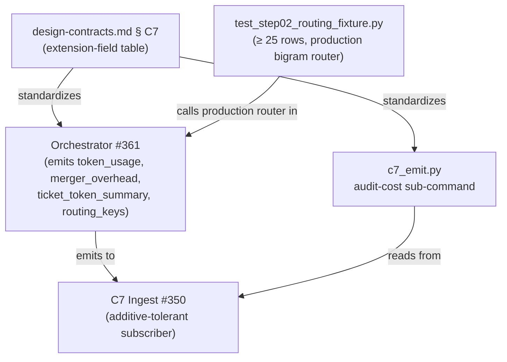

# ADR-issue-368 — Factory Cost Telemetry + Step02 Routing-Quality Fixture

- Status: proposed
- Date: 2026-06-17
- Deciders: bonos (solo operator)
- Work item: issue #368 — `feature/2026-06-17-issue-368-factory-cost-telemetry-routing-fixture`

## 1. Context

PR #365 (issue #364) landed the expert-persona panel model with ~36 expert-step instantiations per ticket. Two operational risks were surfaced during PR review and explicitly held out of #364's scope:

1. **Token-budget reality.** Step01 and step08 fan out to all 8 experts; 4 are Opus-tier (ADR-issue-364 § 4.3). Without a per-ticket cost measurement plan, the first autonomous run is the first cost signal.
2. **Step02 routing quality.** The bigram-overlap algorithm (ADR-issue-364 § 4.2) was chosen for determinism. Concrete question shapes (e.g., "should the rate limiter live in the gateway?") may not content-bigram-match the relevant experts' trigger phrases. Embedding-match is a flagged follow-up if substring proves insufficient.

This ADR records the decisions for the two deliverables that address these risks before the first autonomous run.

## 2. Decision — Deliverable A: Cost Telemetry via C7 Extension Fields

**Chosen approach:** Extend the existing `outcome_details` C7 extension pattern with three new standardized fields (additive, `additionalProperties: true` permits this without breaking the sealed 11-field minimum schema):

| Extension field | Scope | Shape |
|---|---|---|
| `outcome_details.token_usage` | all panel-dispatched C7 events | map of `expert_slug → {input_tokens, output_tokens}` |
| `outcome_details.merger_overhead` | all panel-dispatched C7 events | `{findings_before_dedup, findings_after_dedup, severity_escalation_events}` |
| `outcome_details.ticket_token_summary` | step08 close-out event only | `{total_input_tokens, total_output_tokens, total_expert_step_instantiations}` |

The existing `outcome_details.routing_keys` field scope is simultaneously widened from `phase: agent-pr-review` only to all panel-dispatched phases, making per-phase model assignment auditable across the full SDD lifecycle.

**Rejected alternatives:**
- One C7 event per expert invocation: multiplies event volume by ~36×; breaks the sealed three-emitter rule's phase-boundary anchor (one C7 per skill execution). Rejected.
- Query-time join for the ticket roll-up: pushes join complexity to dashboard consumers; violates NFR-OBS-001 (single-event queryability). Rejected.

**Sentinel convention:** If LiteLLM returns no `usage` block for a dispatched expert, the orchestrator records `input_tokens: -1, output_tokens: -1` for that expert. The step08 roll-up accumulator treats `-1` values as `0` (conservative undercount). Phase emission MUST NOT fail on missing usage metadata.

**Cost-ceiling audit predicate:** A named Python constant (placeholder: $5 USD / 500K input tokens) is shipped in `c7_emit.py` as a configuration constant with a calibration comment. A new `audit-cost --ticket <id>` CLI sub-command reads the step08 `ticket_token_summary` event, compares against the ceiling, and exits non-zero on breach with `rejection_reason: cost-ceiling-exceeded`. The ceiling is intentionally a constant, not a schema field — updating it post-first-run is a one-liner chore commit, not an ADR amendment.

## 3. Decision — Deliverable B: Step02 Routing-Quality Fixture

**Chosen approach:** A pytest module `tests/blueprint/orchestrator/test_step02_routing_fixture.py` (committed under #361's test tree) carrying ≥ 25 hand-curated `(question_text, expected_expert_set)` pairs. The fixture imports and calls the production bigram-routing function from #361 directly — no mock. This makes the fixture an integration test of the production algorithm, not an isolated unit test.

**Question-shape categories covered:**

| Category | Min rows | Representative expert(s) |
|---|---|---|
| Auth-flow shape | 5 | `security-paranoid`, `data-privacy` |
| Data-flow choices | 5 | `data-privacy`, `boundary-hawk` |
| Observability surface | 4 | `operability-sre` |
| Performance vs. cost trade-offs | 5 | `performance-cost-aware` |
| Rollback design | 6 | `operability-sre`, `boundary-hawk` |

**Embedding-upgrade trigger:** The module exposes `EMBEDDING_UPGRADE_THRESHOLD = 0.20` and a module-level docstring describing the trigger. A summary assertion `fraction_failing < EMBEDDING_UPGRADE_THRESHOLD` fires in the test run. When this assertion fails in a CI run, the follow-up to implement embedding-match routing (ADR-issue-364 § 4.2) is unblocked. This threshold was chosen per the issue text: "≥ 20% of fixture rows fail under substring" — now formalized as the bigram-algorithm variant.

**Rejected alternative:** Writing the fixture against a mock routing function: this defeats the purpose — the fixture is evidence about the production algorithm's behaviour, not about a mock's behaviour. The production import is required.

## 4. Design-Contracts Amendment

`docs/blueprint/autonomous-factory/design-contracts.md` § C7 extension-field vocabulary gains three rows and a corrected routing-keys scope description. These are additive changes: pre-#368 subscribers MUST tolerate events that include the new fields; post-#368 subscribers MUST NOT reject events that omit them.

Caption: Amendment dependency graph — design-contracts is the normative source; orchestrator emits; audit CLI reads; routing fixture exercises the production router.

## 5. Consequences

**Positive:**
- First autonomous run produces queryable per-ticket cost telemetry from a single step08 event.
- Routing-quality signal is available from day one; the embedding-upgrade decision is evidence-based, not speculative.
- Cost-ceiling predicate is CI-executable from day one (using a placeholder ceiling); calibration is a one-liner after first run.

**Negative / watch:**
- Step08 accumulator requires the orchestrator to retain per-ticket state across all prior phase events. Bounded per-ticket; cleared on completion. Acceptable scope addition to #361.
- Placeholder ceiling ($5 / 500K tokens) will trigger on the first run if actual cost is higher. Mitigation: calibration is immediate and is explicitly scheduled as a chore follow-up.

## 6. Referenced by

- `docs/blueprint/autonomous-factory/design-contracts.md` § C7 (extension-field vocabulary)
- `ADR-issue-364-expert-persona-model.md` § 4.2 (substring → embedding decision, follow-up trigger)
- `ADR-issue-364-expert-persona-model.md` § 4.3 (per-expert tier baseline; Opus-tier cost justification)
- Issue #361 (orchestrator runtime — implementation target)
