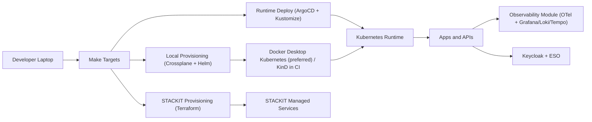

# System Overview

```mermaid
flowchart LR
  Dev["Developer Laptop"] --> Make["Make Targets"]
  Make --> LocalProv["Local Provisioning (Crossplane + Helm)"]
  Make --> StackitProv["STACKIT Provisioning (Terraform)"]
  Make --> GitOps["Runtime Deploy (ArgoCD + Kustomize)"]
  LocalProv --> LocalK8s["Docker Desktop Kubernetes (preferred) / KinD in CI"]
  StackitProv --> Stackit["STACKIT Managed Services"]
  GitOps --> K8s["Kubernetes Runtime"]
  LocalK8s --> K8s
  K8s --> Apps["Apps and APIs"]
  Apps --> Obs["Observability Module (OTel + Grafana/Loki/Tempo)"]
  Apps --> Sec["Keycloak + ESO"]
```
