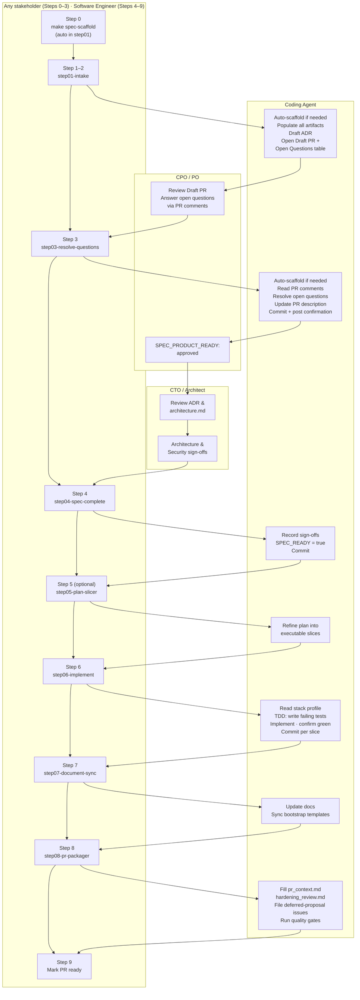
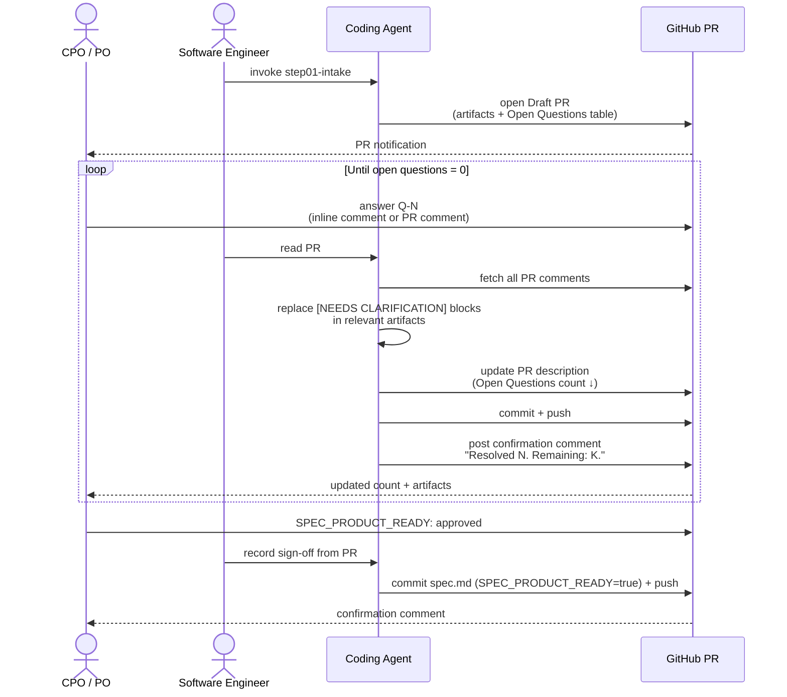

# SDD Execution Guide

This page is the practical, step-by-step walkthrough of how the
[SDD lifecycle](spec_driven_development.md) executes in this repository:
what command starts each step, what artifacts are produced, when commits
and PRs are created, and what checks run.

For normative rules, artifact contracts, guardrails, and sign-off policy,
see [Spec-Driven Development Operating Model](spec_driven_development.md).

---

## One PR per work item

A single Draft PR is opened at the intake gate (Step 2) and remains open
for the entire lifecycle. Every subsequent commit — sign-off resolutions,
implementation slices, docs, publish artifacts — is pushed to the same
branch and accumulates in the same PR. The PR transitions from Draft to
Ready only when the work is fully implemented, verified, and published.
It is never closed early and a second PR is never opened for the same
work item.

---

## Lifecycle overview

### Work item state machine

The work item moves through a defined set of states. Gates (SPEC_PRODUCT_READY,
SPEC_READY) are explicit transitions that require sign-off before proceeding.
The resolution loop in `DraftPROpen` repeats until all open questions reach zero.

```mermaid
stateDiagram-v2
    direction TB

    [*] --> Scaffolded : make spec-scaffold
    Scaffolded --> ArtifactsPopulated : step01&#8209;intake\n(Discover → Plan, all artifacts)
    ArtifactsPopulated --> DraftPROpen : commit · open Draft PR\n(Open Questions table)
    DraftPROpen --> DraftPROpen : step03&#8209;resolve&#8209;questions\nrepeat until open = 0
    DraftPROpen --> SpecProductReady : SPEC_PRODUCT_READY approved\n(CPO / PO)
    SpecProductReady --> SpecReady : step04&#8209;spec&#8209;complete\nArchitecture · Security · Ops sign&#8209;offs
    SpecReady --> Implementing : step05&#8209;plan&#8209;slicer (optional)\nstep06&#8209;implement
    Implementing --> Implementing : slice loop — red → green → commit
    Implementing --> Documented : step07&#8209;document&#8209;sync
    Documented --> Published : step08&#8209;pr&#8209;packager
    Published --> [*] : PR marked ready → CI → merge
```



### Actor responsibilities per step

Each column shows what a role does at each step. Arrows represent
handoffs between roles.



### Open question resolution loop (Step 3)

Shows the message flow between roles during the resolution loop.
The PO only needs GitHub — no local tooling required.



---

## Skill map

| Skill | Steps covered | Invoked by |
|---|---|---|
| `blueprint-sdd-step01-intake` | 0 (auto-scaffold) + 1–2 | Any stakeholder |
| `blueprint-sdd-step03-resolve-questions` | 0 (auto-scaffold, safety) + 3 | Any stakeholder |
| `blueprint-sdd-step04-spec-complete` | 4 | Software Engineer · CTO / Architect |
| `blueprint-sdd-step05-plan-slicer` | 5 (optional) | Software Engineer |
| `blueprint-sdd-step06-implement` | 6 | Software Engineer |
| `blueprint-sdd-step07-document-sync` | 7 | Software Engineer |
| `blueprint-sdd-step08-pr-packager` | 8–9 | Software Engineer |
| `blueprint-sdd-traceability-keeper` | Cross-cutting | Software Engineer |

Step 0 (scaffold) is normally run by `step01-intake` automatically; it can
also be run manually with `make spec-scaffold SPEC_SLUG=<slug>`.
Skills retired: `blueprint-sdd-intake-decompose`, `blueprint-sdd-po-spec`,
`blueprint-sdd-clarification-gate` (absorbed into `step01-intake` and
`step03-resolve-questions`).

---

## Step 0 — Scaffold

**Normally handled automatically by `step01-intake`.**
Run manually only when explicitly needed before invoking the skill:

```bash
make spec-scaffold SPEC_SLUG=<work-item-slug>
```

**What happens:**

- Creates `specs/YYYY-MM-DD-<slug>/` with all required stub artifacts.
- Checks out a dedicated branch `codex/YYYY-MM-DD-<slug>` automatically.
  Skip with `SPEC_NO_BRANCH=true` only when explicitly asked.

**Artifacts created (stubs, populated in Step 1):**

| File | Purpose |
|---|---|
| `spec.md` | Requirements, sign-offs, readiness gate fields |
| `architecture.md` | High-level bounded context exploration workspace |
| `plan.md` | Delivery slices and validation strategy |
| `tasks.md` | Gate checks, implementation tasks, publish tasks |
| `traceability.md` | REQ/NFR/AC → code → test → doc matrix |
| `graph.json` | Machine-readable traceability graph (nodes + edges) |
| `context_pack.md` | Execution handoff snapshot for coding agents |
| `evidence_manifest.json` | Deterministic file checksum evidence record |
| `pr_context.md` | Reviewer-facing summary (completed at Step 8) |
| `hardening_review.md` | Security/quality findings (completed at Step 8) |

**Git:** no commit yet.
**Checks:** none.

---

## Step 1 — Populate artifacts (Discover → Plan)

**Skill:** `blueprint-sdd-step01-intake`
**Invoked by:** Any stakeholder — CPO / PO / CTO / Architect / Software Engineer.

The skill auto-runs the scaffold if it has not already been done, then
executes the four pre-implementation phases in a single pass. Every artifact
must contain real content before the Draft PR opens. Stub placeholders are not
acceptable in the Draft PR.

### Discover

Scope boundaries, constraints, NFRs, and cross-cutting guardrails are
written into `spec.md`. Requirements (`REQ-###`), non-functional
requirements (`NFR-###`), and acceptance criteria (`AC-###`) are defined
using `MUST` / `MUST NOT` / `SHALL` / `EXACTLY ONE OF` only.

### High-Level Architecture

Bounded contexts, module boundaries, and integration edges are captured
in `architecture.md`. Where the core decision is clear, the ADR is
drafted now at `Status: proposed`. Open questions do not block ADR
creation unless they affect the central decision itself.

- Blueprint maintainer track: `docs/blueprint/architecture/decisions/ADR-<slug>.md`
- Generated-consumer track: `docs/platform/architecture/decisions/ADR-<slug>.md`

### Specify

Applicable `SDD-C-###` control IDs from `.spec-kit/control-catalog.md`
are declared. The `Implementation Stack Profile` section is fully
populated with stack, test automation, managed-service, and local-first
fields.

### Plan

`plan.md` is written with sequenced delivery slices (red→green TDD,
docs, runbook). `tasks.md` is populated with all task rows (all
unchecked). `graph.json` nodes and edges are generated for every
REQ/NFR/AC. `traceability.md` maps every requirement to design element,
implementation path, test evidence, documentation evidence, and
operational evidence.

### Handling open questions

Any input that cannot be resolved by the agent is recorded as a
structured block directly in the relevant artifact — not left as an
empty placeholder:

```
> **[NEEDS CLARIFICATION]** *Concise statement of what needs to be decided.*
>
> **Options:**
> - **A)** Description — tradeoffs (agent recommendation)
> - **B)** Description — tradeoffs
>
> **Agent recommendation:** Option A because [rationale].
```

The same block format is used in `spec.md`, `architecture.md`,
`plan.md`, and ADRs. Open questions do not block artifact population —
all sections that can be filled with real content are filled. The
`[NEEDS CLARIFICATION]` token is tracked by `quality-sdd-check` and
must reach `0` before `SPEC_READY: true`.

**Git:** no commit during this step — artifact population flows directly into Step 2.
**Checks:** `make quality-sdd-check` (language policy, open-marker counts,
readiness gate fields, control ID presence).

---

## Step 2 — Open Draft PR (Intake gate)

**Skill:** `blueprint-sdd-step01-intake` (continues from Step 1)

Once all artifacts are substantively populated, commit everything and
open the Draft PR. This is the single PR for the entire work item.

```bash
git add specs/YYYY-MM-DD-<slug>/ docs/.../ADR-<slug>.md
git commit -m "feat(<slug>): SDD intake — spec, architecture, plan ready for PO review"
git push -u origin codex/YYYY-MM-DD-<slug>
gh pr create --draft --title "feat(<slug>): ..." --body "..."
```

### PR description structure at intake

The PR description is a **live status document** for the reviewer, not
static boilerplate. At intake it contains:

1. A one-paragraph summary of the work item and its objective.
2. A reference to the originating issue.
3. An **Open Questions** section listing every unresolved
   `[NEEDS CLARIFICATION]` item across all artifacts, so the reviewer
   can see and answer them without opening individual files:

```markdown
## Open Questions (N remaining)

| # | Question | Artifact | Agent recommendation |
|---|---|---|---|
| Q-1 | Brief statement of what needs to be decided | `spec.md` § NFR-003 | Option A: ... |
| Q-2 | Brief statement of what needs to be decided | `architecture.md` § Bounded Contexts | Option B: ... |

Answer by leaving a PR comment or inline comment on the relevant file.
The agent will update the artifacts and this table after each round.

## Sign-off

To grant Product sign-off, leave a PR comment with:
`SPEC_PRODUCT_READY: approved`
```

4. A note that `pr_context.md` (the full reviewer package) will be
   completed at Step 8 before the PR is marked ready.

The **Open Questions** section is updated by the agent after each
resolution round (Step 3) and disappears entirely once all markers are
resolved.

**Git:** commit + push + Draft PR opened.
**Checks:** `make quality-sdd-check` must pass before opening the PR.

---

## Step 3 — Open question resolution loop

**Skill:** `blueprint-sdd-step03-resolve-questions`
**Invoked by:** Any stakeholder — CPO / PO / CTO / Architect / Software Engineer.

The skill auto-runs the scaffold as a safety check if the spec directory is
missing, then proceeds with resolution. The PO and other reviewers examine the
Draft PR on GitHub. This is the canonical review mechanism and works regardless
of whether reviewers have Claude Code.

### How reviewers answer open questions

Reviewers leave answers as PR comments — inline on the relevant artifact
section or as general PR comments referencing the question. No special
format is required: plain language answers are sufficient.

For Product sign-off, the following deterministic phrase is recognized
by the agent and recorded in `spec.md`:

```
SPEC_PRODUCT_READY: approved
```

### How the agent integrates answers

The Software Engineer invokes the agent with:

> *"Read the PR comments on #N and resolve the open questions in the artifacts."*

The agent:

1. Reads all PR comments and inline review comments.
2. Replaces each resolved `[NEEDS CLARIFICATION]` block with the
   decision and its rationale in the relevant artifact.
3. Records any sign-off phrases in `spec.md`.
4. Updates the **Open Questions** table in the PR description to remove
   resolved items and reflect the remaining count. The section is
   removed entirely when the count reaches zero.
5. Commits the updated artifacts and pushes to the same branch
   (same PR auto-updates).
6. Posts a follow-up PR comment:
   *"Resolved N open questions. Updated: `spec.md`, `architecture.md`.
   Commit abc1234. Remaining open: K."*

The loop repeats until all `[NEEDS CLARIFICATION]` markers are resolved
and `SPEC_PRODUCT_READY: true` is recorded.

**Git:** one commit per resolution round, pushed to the existing branch (same PR).
**Checks:** `make quality-sdd-check` after each round to confirm marker count drops.

---

## Step 4 — Remaining sign-offs → `SPEC_READY: true`

**Skill:** `blueprint-sdd-step04-spec-complete`

The CTO / Architect reviews `architecture.md` and the ADR, then grants
Architecture and Security sign-offs — via PR review, PR comments, or
conversation. The Software Engineer grants the Operations sign-off.
Once all four sign-offs are recorded in `spec.md` and all zero-count
fields are confirmed:

- `SPEC_READY: false → true`
- ADR status: `proposed → approved`

```bash
git add specs/YYYY-MM-DD-<slug>/spec.md docs/.../ADR-<slug>.md
git commit -m "feat(<slug>): all sign-offs collected — SPEC_READY"
git push
```

**Git:** commit + push (same PR).
**Checks:** `make quality-sdd-check` must pass with `SPEC_READY: true`.

---

## Step 5 — Refine implementation plan (optional)

**Skill:** `blueprint-sdd-step05-plan-slicer`

For straightforward work items the plan in `plan.md` from Step 1 is
sufficient — skip directly to Step 6. For complex work items with
multiple interdependent slices or parallel ownership, this step refines
the plan into a dependency-ordered, owner-assigned execution sequence
before any code is written.

**Git:** commit + push if plan is updated (same PR), otherwise skipped.
**Checks:** none beyond the existing `plan.md` content.

---

## Step 6 — Implement

**Skill:** `blueprint-sdd-step06-implement`

Code is written in TDD slices following the sequence in `plan.md`. All
commits go to the same branch and appear in the same Draft PR.

The skill reads the `Implementation Stack Profile` in `spec.md` first and
derives the correct test commands for the declared backend, frontend, and test
automation profiles. Canonical Make targets are used wherever they exist;
the raw test runner is a fallback for new apps not yet wired to Make.

### Slice 1 — Failing tests (red)

Write all new tests first. Confirm each fails with the expected error
before writing any implementation.

### Slice 2 — Implementation (green)

Write the implementation. Confirm all new tests pass and the full suite
has no regressions.

### Additional slices

Schema updates, skill runbook changes, configuration updates — per the
plan. Mark each task `[x]` in `tasks.md` as it completes.

**Git:** one commit per logical slice, pushed to the same branch.
**Checks per slice (stack-agnostic Make targets):**

```bash
make backend-test-unit          # backend unit tests
make touchpoints-test-unit      # frontend/touchpoints unit tests
make test-unit-all              # full unit suite — no regressions
make test-smoke-all-local       # HTTP route / filter / query scope only
```

---

## Step 7 — Document + Operate

**Skill:** `blueprint-sdd-step07-document-sync`

### Document

- Update `docs/` files to describe the new or changed behavior.
- Run the docs sync script to propagate changes to bootstrap templates:

```bash
python3 scripts/lib/docs/sync_blueprint_template_docs.py
```

- Update skill runbooks in `.agents/skills/*/SKILL.md` when
  operator-facing guidance changes.

### Operate

- Add or update runbooks, diagnostics guidance, and rollback steps in
  the relevant `docs/` or `SKILL.md` files.

**Git:** commit + push (same PR).
**Checks:**

```bash
make quality-docs-check-changed
```

---

## Step 8 — Publish

**Skill:** `blueprint-sdd-step08-pr-packager`

Fill the remaining artifacts, file a GitHub issue for each deferred proposal,
mark all tasks complete, and pass the final validation gate.

**Artifacts completed:**

| File | Content |
|---|---|
| `hardening_review.md` | Repo-wide findings fixed, observability/diagnostics changes, quality compliance notes, proposals-only section |
| `pr_context.md` | Summary, full REQ/NFR/AC coverage, key reviewer files, exact validation commands + results, risk + rollback, deferred proposals with issue URLs |
| `tasks.md` | All task boxes marked `[x]` |
| `AGENTS.backlog.md` | New entry per deferred proposal, with GitHub issue link |

**Deferred proposal lifecycle:** For each entry in the proposals-only section of
`hardening_review.md`, the agent files a GitHub issue and records the issue URL
in `pr_context.md` and `AGENTS.backlog.md`. This turns buried PR review notes
into traceable backlog items that are either picked up in a future work item or
explicitly closed with a rejection rationale.

**Git:** final commit + push (same PR).
**Checks (all must pass):**

```bash
make quality-hooks-fast        # SDD check + docs drift + infra contract tests + shell source graph
make quality-hardening-review  # hardening_review.md completeness
# quality-spec-pr-ready is embedded inside quality-hooks-fast:
#   - tasks.md fully checked
#   - pr_context.md fields non-empty
```

---

## Step 9 — Mark PR ready + CI

**Skill:** `blueprint-sdd-step08-pr-packager` (continues from Step 8)

The single Draft PR is marked ready for final review. No new PR is
opened. By this point the **Open Questions** section in the PR
description is gone (all markers resolved) and the description reflects
the final `pr_context.md` summary.

```bash
gh pr ready <number>
gh pr comment <number> --body "@codex review this PR"
```

**CI checks triggered:**

| Check | What it runs |
|---|---|
| `blueprint-quality` | Full quality gate: SDD check, docs sync drift, infra contract tests, test pyramid, pre-commit hooks |
| `generated-consumer-smoke` | End-to-end smoke on a generated-consumer repo applying the blueprint |
| `upgrade-e2e-validation` | Upgrade pipeline validation (skipped on non-upgrade-scope PRs) |

All must be green (or legitimately skipped) before merge.

---

## Summary

| Step | Key artifacts | Skill | Who invokes | Git operation | Checks |
|---|---|---|---|---|---|
| 0 Scaffold | Stub files in `specs/YYYY-MM-DD-<slug>/` | auto in `step01-intake` | Any stakeholder | New branch, no commit | None |
| 1 Populate artifacts | `spec.md`, `architecture.md`, ADR, `plan.md`, `tasks.md`, `graph.json`, `traceability.md` — real content | `step01-intake` | Any stakeholder | None | `quality-sdd-check` |
| 2 Draft PR | All populated artifacts committed | `step01-intake` | Any stakeholder | Commit + push + **Draft PR opened** | `quality-sdd-check` |
| 3 Resolve open questions | Artifacts updated; Open Questions table updated; sign-off recorded | `step03-resolve-questions` | Any stakeholder | Commit + push per round (same PR) | `quality-sdd-check` |
| 4 SPEC_READY | `spec.md` (`SPEC_READY=true`), ADR (`approved`) | `step04-spec-complete` | Software Engineer · CTO / Architect | Commit + push (same PR) | `quality-sdd-check` |
| 5 Refine plan | `plan.md` updated (optional) | `step05-plan-slicer` | Software Engineer | Commit + push if changed (same PR) | None |
| 6 Implement | Code, tests, schemas; `tasks.md` updated | `step06-implement` | Software Engineer | Per-slice commits + push (same PR) | Stack-agnostic Make targets |
| 7 Document / Operate | `docs/`, `SKILL.md`, bootstrap template sync | `step07-document-sync` | Software Engineer | Commit + push (same PR) | `quality-docs-check-changed` |
| 8 Publish | `pr_context.md`, `hardening_review.md`, `tasks.md`, deferred-proposal issues | `step08-pr-packager` | Software Engineer | Final commit + push (same PR) | `quality-hooks-fast`, `quality-hardening-review` |
| 9 PR ready | — | `step08-pr-packager` | Software Engineer | **Draft → Ready** (same PR) | CI: `blueprint-quality`, `generated-consumer-smoke`, `upgrade-e2e-validation` |

---

## Related

- [SDD Operating Model](spec_driven_development.md) — normative rules,
  artifact contracts, guardrails, sign-off policy, and normative language rules
- [Assistant Compatibility](assistant_compatibility.md) — how non-Codex
  assistants (including Claude Code) apply this lifecycle
