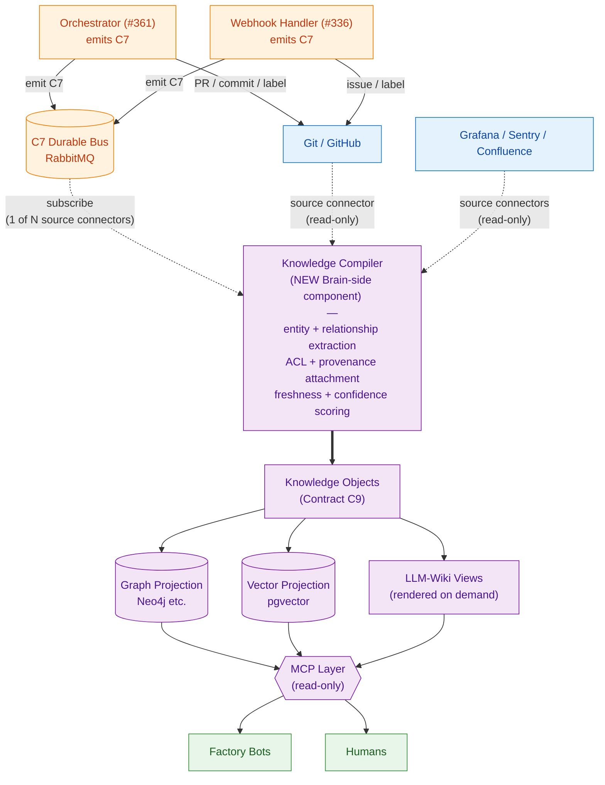
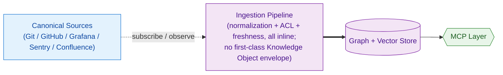

# Strategic decision — reframe Epic #343 as Enterprise Knowledge Fabric

> **Status: parked future work item.** This document captures the strategic decision and architectural evaluation recorded 2026-06-22. The actual reframing is the FIRST work item to be filed under a promoted Epic #343 — NOT before. Pre-conditions: (1) Epic #332 100% stable, and (2) Epic #343 promoted from Draft to active backlog. The corresponding backlog entry lives in `AGENTS.backlog.md` under `### P1 — Next Up`.
>
> **Why this doc exists.** A user-supplied "Enterprise Knowledge Fabric Amendment Brief" (dated 2026-06-22) proposed evolving Epic #343 from "graph + vector knowledge layer" into "Enterprise Knowledge Fabric." This document is the project's DERIVATIVE strategic decision based on that brief — not the brief itself. The brief is the user's input; the decision recorded here is the project's response after a 4-axis evaluation against the existing repository state (ADRs, contracts C1–C8, the Central Brain epic body, anti-dual-write constraints).
>
> **Repo-tracked durable artifact contract.** Backlog entries that point to substantive architectural decisions MUST be backed by a repo-tracked artifact (this document is the first instance of the pattern; future strategic redirections targeting unpromoted/Draft epics should live under `docs/blueprint/proposals/`). Pointers to agent-local memory alone are insufficient because memory is per-user, per-machine, and time-bounded. Codex P2 PR #377 review surfaced this gap and motivated this document's creation.

## Strategic decision (locked 2026-06-22)

When Epic #343 is eventually promoted, its FIRST work item MUST be an SDD intake titled **"Epic #343 reframing: introduce Knowledge Objects (Contract C9), Knowledge Compiler component, LLM-Wiki projection pattern, and federation principle."**

Scope rules for that future intake:
- Preserve all Epic #343 Phase 0 locked decisions (truth model, storage, ingestion topology, ACL posture, schema versioning, freshness SLOs)
- Preserve all C1–C8 contracts (no amendments to existing contracts; new C9 is additive only)
- Preserve the sealed three-emitter rule (`ADR-issue-337-c7-emission-mechanism`): orchestrator + webhook-handler + local-cli — the Knowledge Compiler is NOT a fourth emitter
- Preserve the anti-dual-write rule from Epic #343's body: zero `Factory → Brain store` write arrows; the Compiler runs Brain-side and writes Knowledge Objects to the Brain store, never to the C7 bus
- Do NOT redesign the factory; do NOT replace existing contracts; do NOT create a parallel governance system (these scope rules are sourced from the original brief's § Instructions to the Reviewing Agent and remain authoritative)

The reframing introduces exactly **four** net-new concepts (everything else in the original brief is either already present in the repo under different names OR is a derivative/projection of these four):

1. **Knowledge Objects** — canonical machine-readable envelope produced by the Knowledge Compiler from canonical sources, carrying provenance + governance + relationships metadata. Becomes the ingestion contract for the Central Brain.
2. **Knowledge Compiler** — net-new architectural component (Brain-side, downstream of canonical sources) that performs entity + relationship extraction, ownership resolution, provenance + ACL + freshness + confidence attachment, and Knowledge Object generation. Subscribes to the C7 durable bus as one of N source connectors; never emits C7 events.
3. **LLM-Wiki** — generated semantic views (service pages, team pages, capability pages, ADR summaries, dependency maps, incident histories, knowledge timelines) rendered from Knowledge Objects on demand. NOT a first-class component (see § 4-axis evaluation, Axis 1).
4. **Federation principle** — "domains own knowledge; enterprise discovers knowledge." Every Knowledge Object carries `owner_team` + `bounded_context`. Phase 1 logical seam (per-team namespaces in a single store). Phase 5+ physical sharding if scale demands.

## 4-axis evaluation (the load-bearing analysis)

### Axis 1 — LLM-Wiki: first-class component OR projection pattern?

**Decision: projection pattern. NOT first-class component.**

The brief itself calls LLM-Wiki "generated semantic views" and explicitly notes "LLM-Wiki is NOT authoritative." Those are projection properties. Treating LLM-Wiki as first-class would imply its own lifecycle, deployment, ownership boundary, contract surface, and failure mode distinct from "the graph projection went stale" — none of which hold. The genuinely first-class new concept is the Knowledge Compiler; LLM-Wiki is a consumer of the Compiler's output, rendered by a markdown renderer + LLM at query time.

### Axis 2 — Knowledge Objects: new Contract C9 OR extension of C2/C7?

**Decision: new Contract C9 — Knowledge Projection Contract. Do NOT bolt onto C2 or C7.**

C2 ("Spec Directory Layout") is a file-system convention for SDD artifacts. C7 ("Metrics Dashboard + Event Schema") is the lifecycle event envelope. Knowledge Objects are neither — they're a derived envelope produced by the Compiler AFTER canonical write, with their own governance metadata (ACL scope, confidence, freshness).

Three reasons C9 is the right home:

1. **Different production point.** C2 artifacts and C7 events are produced by humans/orchestrator AT git/bus write time. Knowledge Objects are produced by the Compiler AFTER canonical write, downstream. Conflating production points breaks the anti-dual-write rule the Central Brain epic was built on.
2. **Different governance posture.** C2/C7 are normative (must-emit, must-conform). Knowledge Objects MAY be missing (e.g., for an artifact the Compiler hasn't processed yet) — they're a publication contract, not a write-time contract.
3. **Future-proofing C2/C7.** Extending C2 with `acl_scope` / `confidence` / `freshness` would pollute the spec-on-disk schema with concerns no human spec author should think about. Extending C7 would require the orchestrator to compute `confidence` at emission time — which it can't, because confidence is a Compiler-derived property of the resulting Knowledge Object.

The brief's proposed Contract C9 fields (artifact_id, artifact_kind, owner_team, bounded_context, schema_version, source_uri, source_commit, confidence, freshness, acl_scope) map cleanly to a new contract row, not to either existing one.

### Axis 3 — Central Brain: graph/vector with richer ingestion OR full Knowledge Fabric?

**Decision: full Knowledge Fabric. But the architectural delta is smaller than the brief implies.**

Epic #343's locked Phase 0 decisions already commit to: index/projection only, separate dedicated ingestion pipeline with a normalization layer (assigns `owner_team`, `freshness_tier`, schema version), per-source SLO with staleness metadata on every query result, per-team ACL by default + per-skill cross-team allowlist, anti-dual-write enforced by the diagram shape (zero Factory → Store arrows).

**That normalization layer IS the Knowledge Compiler under a different name.** That metadata-on-every-query IS ACL + provenance + freshness. The brief's net-new contributions are:

1. **Naming** these as first-class concepts (Knowledge Object, Knowledge Compiler, LLM-Wiki) rather than implementation details of the ingestion pipeline
2. **Federation principle** — explicit "domains own knowledge; enterprise discovers knowledge." This IS new; current #343 assumes a single STACKIT-hosted instance.
3. **Cross-domain reasoning vs. retrieval framing** — explicit acknowledgment that graph + vector solve retrieval but not memory/reasoning/governance.

The federation principle is the only genuinely architectural change. Everything else is the same architecture with sharper vocabulary. That's good — it means the Brain epic doesn't need rework, just renaming and the addition of the federation seam.

### Axis 4 — Conflicts with existing ADRs / #332 / #343 / contract.yaml / C1–C8 / anti-dual-write?

**Decision: zero hard conflicts. Three soft tensions to flag in the future amendment work (see § Soft tensions below).**

Verified by direct scan of all 90+ ADRs in `docs/blueprint/architecture/decisions/`, the C1–C8 contract surface in `docs/blueprint/autonomous-factory/design-contracts.md`, the Epic #343 issue body, and the anti-dual-write text in #343's body.

## Recommended architecture

**Edge semantics.** Solid arrows are CANONICAL WRITES (factory side writes to git + bus). Dotted arrows are SUBSCRIBE / OBSERVE (Brain side reads from canonical sources via source connectors; never writes back to git or bus). The thick arrow (`COMP ==> KO`) is the load-bearing edge: it identifies Knowledge Objects as the Compiler's primary output and the ingestion contract for everything downstream.

**Federation seam.** Every Knowledge Object carries `owner_team` + `bounded_context`. At MVP they're labels in a single STACKIT-managed store. Phase 5+, they become physical sharding boundaries if scale demands.

**Key invariants preserved:**
- Zero `Factory → Brain` write arrows (sealed-emitter rule + anti-dual-write)
- LLM-Wiki is rendered, not stored as truth
- Compiler reads C7 events as one of N source connectors (no factory awareness of Brain)
- SDD governance unchanged

## Alternative architecture (rejected; retained for trade-off context)

**"Just richer ingestion" — keep Epic #343 as graph + vector + thicker normalization layer; skip Knowledge Objects as a first-class envelope.**

| Dimension | Recommended (Knowledge Fabric) | Alternative (Richer Ingestion) |
|---|---|---|
| Scope | New C9 contract, new Compiler component, federation seam | No new contract, no new component, single store assumed |
| Time to first value | Slower (Compiler must exist before any KO ships) | Faster (incremental on existing #343 phases) |
| Cross-domain reasoning | First-class via KO `relationships[]` | Possible but implicit in graph edges |
| Federation path | Built in via KO `owner_team`/`bounded_context` | Requires retrofit later — likely a rewrite |
| LLM-Wiki rendering | Direct (renders from KOs) | Requires post-hoc query + assembly per view |
| Risk of "just storage and retrieval" | Low — KOs force explicit governance semantics | High — the brief's exact concern |
| Consumer publication contract | Clean (consumers publish KOs, not raw artifacts) | Murky (consumers publish raw artifacts → central normalization → drift risk) |

The Alternative is cheaper short-term and architecturally weaker long-term. It's the right choice ONLY if federation will never matter — opposite of where STACKIT (multi-team, multi-repo platform) is going.

## Three soft tensions to flag in the future amendment work

### Tension 1 — Federation vs. STACKIT-managed single store

Epic #343 Phase 0 locks "STACKIT-managed preference (Neo4j w/ vector index OR pgvector + Apache AGE on STACKIT Postgres); SKE-hosted fallback acceptable" — i.e., a single store. Federation implies N domain stores + a federation layer. The future amendment MUST either:
- Keep STACKIT-managed single store as Phase 1 + add federation as Phase 5+ (incremental)
- Or revisit the store decision

Recommended path: the first. Federation can be a logical seam (per-team namespace in a single store) initially and a physical seam later.

### Tension 2 — LLM-Wiki feedback loop into SDD

The brief says: "Any accepted modification must flow back through normal SDD governance." Correct in principle, but introduces a new flow (user reads LLM-Wiki page → notices error → opens spec amendment) that doesn't exist today. The future amendment intake MUST author an explicit ADR on how LLM-Wiki feedback enters the SDD lane.

### Tension 3 — Sealed-emitter rule + Knowledge Compiler

The Compiler writes to the Brain store, not to the C7 bus. That's consistent with the sealed three-emitter rule (orchestrator + webhook-handler + local-cli). The future amendment's ADR MUST be explicit: Knowledge Compiler emits to the Brain store; it MUST NOT emit C7 events. Keeps both the sealed-emitter rule and the anti-dual-write rule intact.

## C7 → Knowledge Object field mappings (forward-compatibility audit)

The C7 amendments PR #372 made are forward-compatible with Knowledge Objects. The Compiler consumes them unchanged. Mapping table:

| C7 field (post-PR-#372) | Knowledge Object field | Mapping |
|---|---|---|
| `event_id` | `provenance.source_commit` (one of several inputs) | direct |
| `evidence_uri` | `provenance.source_uri` | direct |
| `owner_team` | `owner_team` | direct |
| `timestamp` | input to `governance.freshness` | Compiler derives |
| `touches_services[]` | `relationships[]` | Compiler unpacks (one relationship row per service) |
| `expert_slug_blueprint` / `expert_slug_extension` | `relationships[]` | Compiler unpacks (one relationship row per expert slug) |
| `rejection_reason` | input to negative-knowledge / quality signals | Compiler produces a quality-event KO |

The C7 schema does NOT need to change to support Knowledge Objects. The Compiler reads C7 events as one of N source connectors and produces KOs.

## Locked invariants to preserve (DO NOT change in the reframing)

- Git as source of truth; no knowledge database becomes authoritative
- Anti-dual-write: zero `Factory → Brain` write arrows
- Sealed three-emitter rule (orchestrator + webhook-handler + local-cli); Compiler is NOT a fourth emitter
- Per-team ACL by default (resolved from C5 bot identity); per-skill allowlist for cross-team reads
- Schema semver-versioned; staleness metadata on every query result
- All Epic #343 Phase 0 decisions (separate dedicated ingestion pipeline, event-driven subscribers, STACKIT-managed preference)

## Concrete next-step instructions for the future intake author

1. Confirm Epic #343 is being promoted from Draft to active backlog (or the user explicitly authorizes the reframing intake before promotion).
2. Read this document end-to-end before drafting the intake.
3. `make spec-scaffold SPEC_SLUG=YYYY-MM-DD-epic-343-knowledge-fabric-reframing`.
4. Author the spec with FRs that introduce exactly four concepts: Knowledge Objects (C9), Knowledge Compiler, LLM-Wiki, federation principle. Do NOT re-litigate Phase 0 decisions already locked in `#343`'s issue body.
5. Author the Contract C9 amendment to `design-contracts.md` — additive only (does NOT amend C2 or C7).
6. Author ADRs for the three soft tensions in this document (federation phasing, LLM-Wiki feedback loop, Compiler emission boundary).
7. Update existing `### after: epic-343-promote` backlog entries (in `AGENTS.backlog.md`) to cite the reframing as a prerequisite for the Brain-perspective C7 shape review + the legacy-payload normalization work parked there.

## Provenance

- **Source brief:** "Enterprise Knowledge Fabric Amendment Brief" — supplied by the user (sbonoc) on 2026-06-22. This document is the project's derivative strategic decision; the brief itself is NOT committed to this repo (the user retains the source artifact externally).
- **Strategic decision recorded by:** Claude (Opus 4.7) under user (sbonoc) authorization, 2026-06-22. Reviewed by user before file creation.
- **Motivated by Codex P2 review on PR #377:** Codex pointed out that the parked backlog entry referenced only agent-local memory and was not self-contained for future operators. This proposal doc closes that gap.
- **Related backlog entry:** `AGENTS.backlog.md` § P1 — Next Up → `FUTURE (Factory — Epic #343 reframing, blocked_by: Epic #332 100% stable + Epic #343 promotion)`.
