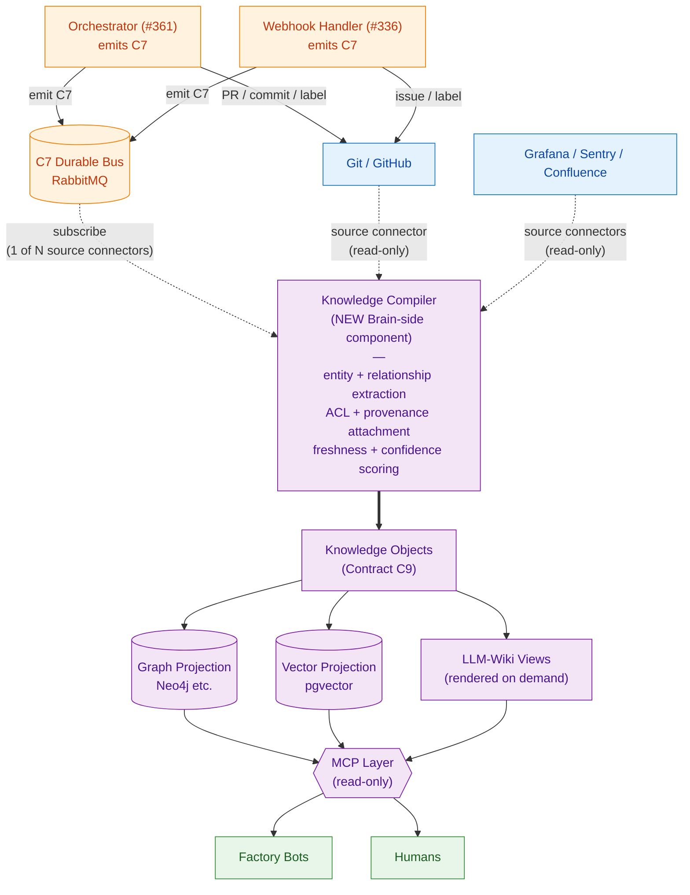
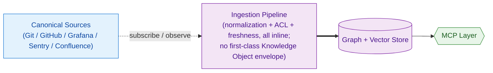

> **Status: `strawman-for-evaluation`, not a ratified decision.** This document captures a strategic DIRECTION proposed 2026-06-22 based on a user-supplied brief, plus same-day adversarial revisions in the addendum at the bottom. It is NOT a ratified architectural decision and MUST NOT be treated as one. Three of the v1 body's load-bearing decisions (Knowledge Compiler as a singular component, federation as a Phase-1 seam, MCP as a singular access layer) and one premise (that we have evidence "memory and reasoning" are factory bottlenecks) are demoted to hypotheses to validate via the evidence-gate work parked under `AGENTS.backlog.md § on-scope: quality`. Read the **§ Addendum (2026-06-22, same day) — Adversarial revisions** at the bottom before relying on any architectural claim in the body above it.

# Strategic decision — reframe Epic #343 as Enterprise Knowledge Fabric

> **Status: parked future work item.** This document captures the strategic decision and architectural evaluation recorded 2026-06-22. The actual reframing is the FIRST work item to be filed under a promoted Epic #343 — NOT before. Pre-conditions: (1) Epic #332 100% stable, and (2) Epic #343 promoted from Draft to active backlog. The corresponding backlog entry lives in `AGENTS.backlog.md` under `### P1 — Next Up`.
>
> **Why this doc exists.** A user-supplied "Enterprise Knowledge Fabric Amendment Brief" (dated 2026-06-22) proposed evolving Epic #343 from "graph + vector knowledge layer" into "Enterprise Knowledge Fabric." This document is the project's DERIVATIVE strategic decision based on that brief — not the brief itself. The brief is the user's input; the decision recorded here is the project's response after a 4-axis evaluation against the existing repository state (ADRs, contracts C1–C8, the Central Brain epic body, anti-dual-write constraints).
>
> **Repo-tracked durable artifact contract.** Backlog entries that point to substantive architectural decisions MUST be backed by a repo-tracked artifact (this document is the first instance of the pattern; future strategic redirections targeting unpromoted/Draft epics should live under `docs/blueprint/proposals/`). Pointers to agent-local memory alone are insufficient because memory is per-user, per-machine, and time-bounded. Codex P2 PR #377 review surfaced this gap and motivated this document's creation.

## Strategic decision (locked 2026-06-22)

When Epic #343 is eventually promoted, its FIRST work item MUST be an SDD intake titled **"Epic #343 reframing: introduce Knowledge Objects (Contract C9), Knowledge Compiler component, LLM-Wiki projection pattern, and federation principle."**

Scope rules for that future intake:
- Preserve all Epic #343 Phase 0 locked decisions (truth model, storage, ingestion topology, ACL posture, schema versioning, freshness SLOs)
- Preserve all C1–C8 contracts (no amendments to existing contracts; new C9 is additive only)
- Preserve the sealed three-emitter rule (`ADR-issue-337-c7-emission-mechanism`): orchestrator + webhook-handler + local-cli — the Knowledge Compiler is NOT a fourth emitter
- Preserve the anti-dual-write rule from Epic #343's body: zero `Factory → Brain store` write arrows; the Compiler runs Brain-side and writes Knowledge Objects to the Brain store, never to the C7 bus
- Do NOT redesign the factory; do NOT replace existing contracts; do NOT create a parallel governance system (these scope rules are sourced from the original brief's § Instructions to the Reviewing Agent and remain authoritative)

The reframing introduces exactly **four** net-new concepts (everything else in the original brief is either already present in the repo under different names OR is a derivative/projection of these four):

1. **Knowledge Objects** — canonical machine-readable envelope produced by the Knowledge Compiler from canonical sources, carrying provenance + governance + relationships metadata. Becomes the ingestion contract for the Central Brain.
2. **Knowledge Compiler** — net-new architectural component (Brain-side, downstream of canonical sources) that performs entity + relationship extraction, ownership resolution, provenance + ACL + freshness + confidence attachment, and Knowledge Object generation. Subscribes to the C7 durable bus as one of N source connectors; never emits C7 events.
3. **LLM-Wiki** — generated semantic views (service pages, team pages, capability pages, ADR summaries, dependency maps, incident histories, knowledge timelines) rendered from Knowledge Objects on demand. NOT a first-class component (see § 4-axis evaluation, Axis 1).
4. **Federation principle** — "domains own knowledge; enterprise discovers knowledge." Every Knowledge Object carries `owner_team` + `bounded_context`. Phase 1 logical seam (per-team namespaces in a single store). Phase 5+ physical sharding if scale demands.

## 4-axis evaluation (the load-bearing analysis)

### Axis 1 — LLM-Wiki: first-class component OR projection pattern?

**Decision: projection pattern. NOT first-class component.**

The brief itself calls LLM-Wiki "generated semantic views" and explicitly notes "LLM-Wiki is NOT authoritative." Those are projection properties. Treating LLM-Wiki as first-class would imply its own lifecycle, deployment, ownership boundary, contract surface, and failure mode distinct from "the graph projection went stale" — none of which hold. The genuinely first-class new concept is the Knowledge Compiler; LLM-Wiki is a consumer of the Compiler's output, rendered by a markdown renderer + LLM at query time.

### Axis 2 — Knowledge Objects: new Contract C9 OR extension of C2/C7?

**Decision: new Contract C9 — Knowledge Projection Contract. Do NOT bolt onto C2 or C7.**

C2 ("Spec Directory Layout") is a file-system convention for SDD artifacts. C7 ("Metrics Dashboard + Event Schema") is the lifecycle event envelope. Knowledge Objects are neither — they're a derived envelope produced by the Compiler AFTER canonical write, with their own governance metadata (ACL scope, confidence, freshness).

Three reasons C9 is the right home:

1. **Different production point.** C2 artifacts and C7 events are produced by humans/orchestrator AT git/bus write time. Knowledge Objects are produced by the Compiler AFTER canonical write, downstream. Conflating production points breaks the anti-dual-write rule the Central Brain epic was built on.
2. **Different governance posture.** C2/C7 are normative (must-emit, must-conform). Knowledge Objects MAY be missing (e.g., for an artifact the Compiler hasn't processed yet) — they're a publication contract, not a write-time contract.
3. **Future-proofing C2/C7.** Extending C2 with `acl_scope` / `confidence` / `freshness` would pollute the spec-on-disk schema with concerns no human spec author should think about. Extending C7 would require the orchestrator to compute `confidence` at emission time — which it can't, because confidence is a Compiler-derived property of the resulting Knowledge Object.

The brief's proposed Contract C9 fields (artifact_id, artifact_kind, owner_team, bounded_context, schema_version, source_uri, source_commit, confidence, freshness, acl_scope) map cleanly to a new contract row, not to either existing one.

### Axis 3 — Central Brain: graph/vector with richer ingestion OR full Knowledge Fabric?

**Decision: full Knowledge Fabric. But the architectural delta is smaller than the brief implies.**

Epic #343's locked Phase 0 decisions already commit to: index/projection only, separate dedicated ingestion pipeline with a normalization layer (assigns `owner_team`, `freshness_tier`, schema version), per-source SLO with staleness metadata on every query result, per-team ACL by default + per-skill cross-team allowlist, anti-dual-write enforced by the diagram shape (zero Factory → Store arrows).

**That normalization layer IS the Knowledge Compiler under a different name.** That metadata-on-every-query IS ACL + provenance + freshness. The brief's net-new contributions are:

1. **Naming** these as first-class concepts (Knowledge Object, Knowledge Compiler, LLM-Wiki) rather than implementation details of the ingestion pipeline
2. **Federation principle** — explicit "domains own knowledge; enterprise discovers knowledge." This IS new; current #343 assumes a single STACKIT-hosted instance.
3. **Cross-domain reasoning vs. retrieval framing** — explicit acknowledgment that graph + vector solve retrieval but not memory/reasoning/governance.

The federation principle is the only genuinely architectural change. Everything else is the same architecture with sharper vocabulary. That's good — it means the Brain epic doesn't need rework, just renaming and the addition of the federation seam.

### Axis 4 — Conflicts with existing ADRs / #332 / #343 / contract.yaml / C1–C8 / anti-dual-write?

**Decision: zero hard conflicts. Three soft tensions to flag in the future amendment work (see § Soft tensions below).**

Verified by direct scan of all 90+ ADRs in `docs/blueprint/architecture/decisions/`, the C1–C8 contract surface in `docs/blueprint/autonomous-factory/design-contracts.md`, the Epic #343 issue body, and the anti-dual-write text in #343's body.

## Recommended architecture

**Edge semantics.** Solid arrows are CANONICAL WRITES (factory side writes to git + bus). Dotted arrows are SUBSCRIBE / OBSERVE (Brain side reads from canonical sources via source connectors; never writes back to git or bus). The thick arrow (`COMP ==> KO`) is the load-bearing edge: it identifies Knowledge Objects as the Compiler's primary output and the ingestion contract for everything downstream.

**Federation seam.** Every Knowledge Object carries `owner_team` + `bounded_context`. At MVP they're labels in a single STACKIT-managed store. Phase 5+, they become physical sharding boundaries if scale demands.

**Key invariants preserved:**
- Zero `Factory → Brain` write arrows (sealed-emitter rule + anti-dual-write)
- LLM-Wiki is rendered, not stored as truth
- Compiler reads C7 events as one of N source connectors (no factory awareness of Brain)
- SDD governance unchanged

## Alternative architecture (rejected; retained for trade-off context)

**"Just richer ingestion" — keep Epic #343 as graph + vector + thicker normalization layer; skip Knowledge Objects as a first-class envelope.**

| Dimension | Recommended (Knowledge Fabric) | Alternative (Richer Ingestion) |
|---|---|---|
| Scope | New C9 contract, new Compiler component, federation seam | No new contract, no new component, single store assumed |
| Time to first value | Slower (Compiler must exist before any KO ships) | Faster (incremental on existing #343 phases) |
| Cross-domain reasoning | First-class via KO `relationships[]` | Possible but implicit in graph edges |
| Federation path | Built in via KO `owner_team`/`bounded_context` | Requires retrofit later — likely a rewrite |
| LLM-Wiki rendering | Direct (renders from KOs) | Requires post-hoc query + assembly per view |
| Risk of "just storage and retrieval" | Low — KOs force explicit governance semantics | High — the brief's exact concern |
| Consumer publication contract | Clean (consumers publish KOs, not raw artifacts) | Murky (consumers publish raw artifacts → central normalization → drift risk) |

The Alternative is cheaper short-term and architecturally weaker long-term. It's the right choice ONLY if federation will never matter — opposite of where STACKIT (multi-team, multi-repo platform) is going.

## Three soft tensions to flag in the future amendment work

### Tension 1 — Federation vs. STACKIT-managed single store

Epic #343 Phase 0 locks "STACKIT-managed preference (Neo4j w/ vector index OR pgvector + Apache AGE on STACKIT Postgres); SKE-hosted fallback acceptable" — i.e., a single store. Federation implies N domain stores + a federation layer. The future amendment MUST either:
- Keep STACKIT-managed single store as Phase 1 + add federation as Phase 5+ (incremental)
- Or revisit the store decision

Recommended path: the first. Federation can be a logical seam (per-team namespace in a single store) initially and a physical seam later.

### Tension 2 — LLM-Wiki feedback loop into SDD

The brief says: "Any accepted modification must flow back through normal SDD governance." Correct in principle, but introduces a new flow (user reads LLM-Wiki page → notices error → opens spec amendment) that doesn't exist today. The future amendment intake MUST author an explicit ADR on how LLM-Wiki feedback enters the SDD lane.

### Tension 3 — Sealed-emitter rule + Knowledge Compiler

The Compiler writes to the Brain store, not to the C7 bus. That's consistent with the sealed three-emitter rule (orchestrator + webhook-handler + local-cli). The future amendment's ADR MUST be explicit: Knowledge Compiler emits to the Brain store; it MUST NOT emit C7 events. Keeps both the sealed-emitter rule and the anti-dual-write rule intact.

## C7 → Knowledge Object field mappings (forward-compatibility audit)

The C7 amendments PR #372 made are forward-compatible with Knowledge Objects. The Compiler consumes them unchanged. Mapping table:

| C7 field (post-PR-#372) | Knowledge Object field | Mapping |
|---|---|---|
| `event_id` | `provenance.source_commit` (one of several inputs) | direct |
| `evidence_uri` | `provenance.source_uri` | direct |
| `owner_team` | `owner_team` | direct |
| `timestamp` | input to `governance.freshness` | Compiler derives |
| `touches_services[]` | `relationships[]` | Compiler unpacks (one relationship row per service) |
| `expert_slug_blueprint` / `expert_slug_extension` | `relationships[]` | Compiler unpacks (one relationship row per expert slug) |
| `rejection_reason` | input to negative-knowledge / quality signals | Compiler produces a quality-event KO |

The C7 schema does NOT need to change to support Knowledge Objects. The Compiler reads C7 events as one of N source connectors and produces KOs.

## Locked invariants to preserve (DO NOT change in the reframing)

- Git as source of truth; no knowledge database becomes authoritative
- Anti-dual-write: zero `Factory → Brain` write arrows
- Sealed three-emitter rule (orchestrator + webhook-handler + local-cli); Compiler is NOT a fourth emitter
- Per-team ACL by default (resolved from C5 bot identity); per-skill allowlist for cross-team reads
- Schema semver-versioned; staleness metadata on every query result
- All Epic #343 Phase 0 decisions (separate dedicated ingestion pipeline, event-driven subscribers, STACKIT-managed preference)

## Concrete next-step instructions for the future intake author

1. Confirm Epic #343 is being promoted from Draft to active backlog (or the user explicitly authorizes the reframing intake before promotion).
2. Read this document end-to-end before drafting the intake.
3. `make spec-scaffold SPEC_SLUG=epic-343-knowledge-fabric-reframing` (the make target prepends the current date itself per `make help spec-scaffold` — pass the slug WITHOUT a date prefix to avoid the `specs/<date>-<date>-...` duplication that a literal date prefix would produce; use the optional `SPEC_DATE=<YYYY-MM-DD>` env var only if a non-default date is needed).
4. Author the spec with FRs that introduce exactly four concepts: Knowledge Objects (C9), Knowledge Compiler, LLM-Wiki, federation principle. Do NOT re-litigate Phase 0 decisions already locked in `#343`'s issue body.
5. Author the Contract C9 amendment to `design-contracts.md` — additive only (does NOT amend C2 or C7).
6. Author ADRs for the three soft tensions in this document (federation phasing, LLM-Wiki feedback loop, Compiler emission boundary).
7. Update existing `### after: epic-343-promote` backlog entries (in `AGENTS.backlog.md`) to cite the reframing as a prerequisite for the Brain-perspective C7 shape review + the legacy-payload normalization work parked there.

## Provenance

- **Source brief:** "Enterprise Knowledge Fabric Amendment Brief" — supplied by the user (sbonoc) on 2026-06-22. This document is the project's derivative strategic decision; the brief itself is NOT committed to this repo (the user retains the source artifact externally).
- **Strategic decision recorded by:** Claude (Opus 4.7) under user (sbonoc) authorization, 2026-06-22. Reviewed by user before file creation.
- **Motivated by Codex P2 review on PR #377:** Codex pointed out that the parked backlog entry referenced only agent-local memory and was not self-contained for future operators. This proposal doc closes that gap.
- **Related backlog entry:** `AGENTS.backlog.md` § P1 — Next Up → `FUTURE (Factory — Epic #343 reframing, blocked_by: Epic #332 100% stable + Epic #343 promotion)`.

---

## Addendum (2026-06-22, same day) — Adversarial revisions

Same day as the v1 body above was authored, an adversarial review surfaced that the v1 architecture is **structurally sound but architecturally over-committed for its evidence base**. Three load-bearing v1 decisions (Knowledge Compiler as a singular first-class component, federation as a Phase-1 seam, MCP as a singular access layer) and one premise (we have evidence that "memory and reasoning" are factory bottlenecks) are demoted from "decided" to "hypothesis to validate via Phase-0 evidence gate." One v1 decision (LLM-Wiki as projection pattern) survives the challenge unchanged. One entirely new direction (bifurcated architecture: SDD specs ARE Knowledge Objects, no separate envelope needed for human-curated sources) is added.

The v1 body above is RETAINED VERBATIM for audit / decision-trail fidelity. The revisions below SUPERSEDE the v1 body for any future intake author — read this addendum FIRST when picking up the reframing work.

### Six revisions vs. v1

#### Revision 1 — Drop "Knowledge Compiler" as a singular first-class component; bifurcate by source-type

**v1 framing:** one "Knowledge Compiler" Brain-side component that does entity extraction + relationship extraction + ownership resolution + provenance + ACL + freshness + confidence scoring for ALL sources uniformly.

**Why this fails adversarial review:** the framing bundles wildly different concerns (LLM-based extraction vs. deterministic policy lookup) that run on wildly different infrastructure. It also commits to "confidence scoring" as a first-class concept before we know whether calibrated confidence is achievable on our actual artifact stream — every KG paper that promises this either hand-tunes a brittle heuristic, generates uncorrelated LLM numbers, or requires labeled training data we don't have.

**v2 direction:** split into TWO components by source-type. Human-curated sources (SDD specs, ADRs, traceability matrices, evidence manifests) flow through an **SDD Indexer** — a tiny Python helper that parses existing front-matter + cross-references; NO extraction, NO confidence scoring, runs on git push hooks. Machine-generated sources (C7 events, GitHub events, Grafana incidents, Sentry incidents, Confluence) flow through a **Telemetry Compiler** — built on LlamaIndex or equivalent open-source ingestion framework; DOES do extraction, ACL attachment, freshness calculation; this is where the original "Compiler" concept earns its keep because the source lacks human curation.

Bifurcation cost: the graph schema isn't perfectly uniform across sources (SDD-sourced nodes have different metadata than C7-sourced nodes). Some cross-source query patterns become awkward. **Accepted cost** — the alternative (force uniform schema by adding extraction friction over already-validated sources) is worse: it introduces hallucination risk, freshness lag, provenance dilution, and re-validation theater on artifacts humans already signed off.

#### Revision 2 — Drop "Contract C9 — Knowledge Projection Contract" as a single contract; split it

**v1 framing:** new Contract C9 — Knowledge Projection Contract that all sources project through.

**Why this fails adversarial review:** see Revision 1. C9 inherits the same one-size-fits-all problem.

**v2 direction:** split into TWO contracts.
- **Tiny C2 extension** for human-curated sources — add `acl_scope` (default `owner_team`) and optionally `confidence` (default `human-curated: 1.0`) to SDD front-matter. Maybe 3 new optional fields. C2 stays the contract; the front-matter just gets richer.
- **New C9 — Telemetry & External-Source Projection Contract** — only required for telemetry/external-source projections. Carries the original v1 C9 fields (artifact_id, artifact_kind, owner_team, bounded_context, schema_version, source_uri, source_commit, confidence, freshness, acl_scope) but ONLY for sources that lack human curation.

#### Revision 3 — SDD specs ARE the Knowledge Objects (no new envelope for human-curated sources)

**v1 framing:** every important artifact is transformed into a separate Knowledge Object envelope.

**Why this fails adversarial review:** SDD specs are the only artifact in this system that has been read, edited, debated, and signed off by humans through the SDD HITL gate (draft PR review → merge). Every downstream transformation introduces hallucination risk, freshness lag, provenance dilution, and re-validation theater. The benefit a separate envelope gains (machine-friendly schema for cross-source unification) is REAL for telemetry/external sources but NOT real for SDD specs, which already have a curated home with strong front-matter.

**v2 direction:** for SDD specs / ADRs / traceability matrices / evidence manifests, the artifact IS the Knowledge Object. SDD Indexer (per Revision 1) parses what's already there into graph-loadable form. Once a spec is merged through SDD review, it's authoritative; the Brain consumes it as-is. The "C9 as ingestion contract" framing folds into a small C2 front-matter extension (per Revision 2). For telemetry/external sources, the separate KO envelope earns its keep — they have no human-curation gate, so the new C9 contract + the Telemetry Compiler do the curation work.

#### Revision 4 — Demote LLM-Wiki to Phase 5+ exploratory (not in MVP)

**v1 framing:** LLM-Wiki listed in the recommended architecture as a primary view layer rendered from Knowledge Objects, with examples (service pages, team pages, capability pages, etc.).

**Why this fails adversarial review:** all of v1's example pages already exist in some form (GitHub repo tree, CODEOWNERS, Grafana dashboards, ADR directory, Mermaid diagrams in specs, Sentry incident history, git log). LLM-Wiki re-renders them through a generative layer that adds hallucination risk + freshness lag in exchange for unclear benefit. Worse, v1's own "LLM-Wiki is NOT authoritative" rule defeats most LLM-Wiki use cases — if a reader has to verify against canonical sources anyway, the rendered view is negative value. Every "smart docs portal" effort I've observed (Confluence, custom Backstage wikis, internal portals) hits the same wall: nobody uses it because they don't trust it.

**v2 direction:** drop LLM-Wiki from the MVP architecture entirely. Hold as Phase 5+ exploratory work, picked up ONLY IF at least one human user complains that graph traversal + vector search are insufficient. If that complaint never materializes, LLM-Wiki was never needed and the architecture stays smaller forever.

#### Revision 5 — Demote federation to Phase 5+ (single-tenant MVP)

**v1 framing:** every KO carries `owner_team` + `bounded_context` as a Phase-1 federation seam; Phase-5+ promotion to physical sharding.

**Why this fails adversarial review:** STACKIT has ~1 multi-team customer of this system today. Federation is solving an N=many problem at N=1. Additionally, `bounded_context` is NEW load-bearing metadata that requires per-artifact judgment — recall how long the #361.5 decomposition argued over whether the boundary type was `bounded-context: expert-panel` or `architectural-layer: interface`. That argument scales O(N²) across teams. The "logical-then-physical federation" pattern is a well-known lie: once teams know their namespace exists, they accrete team-local extensions and resist later moves, turning the Phase-5 transition into a 6-month migration project even though it was "just labels."

**v2 direction:** build single-tenant, single-namespace MVP. Add the federation seam only when N≥2 real consumers create a real ownership conflict. `owner_team` stays (it's already in C5/C6/C7 — free copying). `bounded_context` does NOT become a Knowledge Object required field.

#### Revision 6 — Replace "MCP Layer" with "Access Layer (multi-protocol)"

**v1 framing:** MCP Layer as the singular access surface for Factory Bots + Humans.

**Why this fails adversarial review:** MCP is ~14 months old, immature, and primarily targets the Claude/Anthropic ecosystem. Pinning the Brain's long-term access surface to MCP couples our sovereignty-required platform to one vendor's protocol evolution. Additionally, MCP doesn't help human users (who need a web UI), and the factory agents already speak OpenHands' tool-use protocol. MCP is one implementation option, not an architecture.

**v2 direction:** replace "MCP Layer" with "Access Layer" — likely 2–3 protocols in practice (HTTP/GraphQL for human-facing surfaces + tool-use protocol for agents + raw graph/vector query for power users). MCP becomes one implementation candidate alongside others; the choice is made at intake time based on what the agent runtime (OpenHands) supports natively.

### Phase 0 evidence gate (BEFORE Epic #343 is promoted to active backlog)

The reframing intake MUST NOT be the first work item under a promoted Epic #343. Instead, an evidence gate runs first, composed of TWO independent strands:

**Strand A — Factory-observability signals (owned by issue #378 under Epic #332, NOT this gate).** The three instrumentation tasks were decoupled from this gate on 2026-06-22 because they produce signal useful regardless of whether the Brain ever ships. Issue #378 ships them under Epic #332 as factory observability; this evidence gate then CONSUMES the signal output as one of its inputs.

- **Signal 1 — Re-litigation proxy.** For each new SDD spec, run the spec's bigram set against bigrams in every prior merged spec/ADR (algorithm already documented in `ADR-issue-364` § 4.2 for the dispatch matrix). Report overlap %. Backfill against last 6 months of merged specs. **Promotion criterion:** ≥ 30% of new specs have ≥ 30% overlap with prior decisions.
- **Signal 2 — Cross-reference distance.** For each merged PR, count the average directory traversals required to reach related decisions via repo grep. **Promotion criterion:** average > 4 directories AND human navigation friction is reported anecdotally.
- **Signal 3 — "Didn't know that existed" rate.** Step03 sign-off survey adds one yes/no question: *"While drafting, did you find a prior decision you weren't aware of that changed your approach?"* **Promotion criterion:** YES rate > 30% over 4 weeks of merged specs.

Per-signal "useful regardless of Brain" reasoning is documented in #378's body — that issue ships and emits to Grafana + JSONL audit logs independently of any Brain commitment.

**Strand B — Brain-specific spikes (owned by THIS gate).** Two 1-week spikes that only make sense once the Brain is being seriously considered:

- **Backstage 1-week spike** — feed our actual SDD artifacts + C7 events + service catalog into a self-hosted Backstage instance on STACKIT SKE. Evaluate: service catalog fitness, TechDocs ingest, plugin maturity, integration cost. **Promotion criterion:** ≥ 70% feature parity with the v1 vision is achievable in ≤ 2 weeks of integration work.
- **Spec-as-KO vs. separate-KO 1-week spike** — implement BOTH approaches against a fixed set of 5 real merged specs. Compare query patterns, freshness behavior, schema friction, the "no second HITL gate" property, AND the cross-source query friction the bifurcation introduces (Addendum R3 accepts this cost as a known trade-off; the spike measures whether it lands closer to 5% friction or 40% friction). **Promotion criterion:** the bifurcated direction is empirically cleaner end-to-end, NOT just on aesthetics.

**Calendar checkpoint — 2026-09-22 (90 days after this addendum was authored 2026-06-22).** Force a real decision on whatever evidence is available by that date. If ≥ 2 of 3 Strand-A signals from #378 + both Strand-B spikes pass criteria, Epic #343 is promoted and the v2 reframing intake is filed. If criteria not met, EXPLICITLY hold (Brain stays Draft; revisit at the next calendar checkpoint 2026-12-22 OR sooner if conditions change). Without the calendar checkpoint this gate becomes infinite ("we don't have enough data yet"); with one, indecision is itself a decision recorded on a fixed date.

**Date-bearing decision tracker: issue #379** (`decision(epic-343-evidence-gate): 2026-09-22 calendar-checkpoint decision — promote Epic #343 or explicit hold`) is the load-bearing mechanism for the calendar checkpoint above. The backlog entry under `### on-scope: quality` is INFORMATIONAL — date-based triggers do NOT exist in the `AGENTS.backlog.md` trigger vocabulary (`after: <slug>`, `on-scope: <tag>`, `triage: next-session` per `docs/blueprint/governance/sdd_execution_guide.md`), so a pure-backlog date claim would surface only when a `quality`-scoped intake happens to land — NOT guaranteed near 2026-09-22 (per Codex P2 review on PR #377 round 3). Issue #379 carries the pre-flight checklist, the criteria checkboxes, and the explicit-hold-with-successor-tracker fallback.

### Concrete vendors / open-source components (sovereignty-respecting)

After retracting the v1 build-vs-buy framing (which reached for proprietary alternatives like Sourcegraph Cody Enterprise + Glean that fail the sovereignty test), the actual reachable open-source stack is:

| Concern | Component | License / Sovereignty |
|---|---|---|
| Service catalog + TechDocs + human-facing surface | **Backstage** (CNCF-incubated) | Apache 2.0, self-hostable on STACKIT SKE |
| Graph storage | **Apache AGE on STACKIT-managed Postgres** | Apache 2.0, already in #343 Phase 0 candidate list |
| Vector storage | **pgvector on STACKIT-managed Postgres** | PostgreSQL License, already in #343 Phase 0 candidate list |
| Ingestion pipeline (telemetry sources only) | **LlamaIndex** | MIT, self-hostable, integrates with multiple LLMs |
| LLM-workflow observability | **LangFuse** | MIT, self-hostable on STACKIT SKE |
| Agent-facing access | **MCP server** (one of multiple Access Layer protocols) | Open spec, multiple implementations |
| Human-facing access | **Backstage UI + GraphQL plugin** | Apache 2.0 |

This stack reduces the custom-code surface to: (a) SDD Indexer (tiny Python helper), (b) Telemetry source connectors (one per source), (c) Backstage plugin for STACKIT-specific surfaces. Approximate MVP scope: **2–3 months for one engineer**, NOT 12 months for a team.

### What this addendum does NOT do

- **Does NOT remove the v1 body.** v1 stays for audit / decision-trail fidelity.
- **Does NOT lock the v2 direction either.** v2 is still under evidence gate. The Phase-0 spike results may further revise.
- **Does NOT amend the related backlog entry to v2 vocabulary.** That happens at Phase-0 completion, in the v2 reframing intake's own PR.
- **Does NOT commit to Backstage adoption.** Backstage is one option that scored well in adversarial evaluation; the 1-week spike is the decision point.

### Provenance for this addendum

- **Adversarial review surfaced by:** user (sbonoc) explicitly requesting Claude (Opus 4.7) to "adopt an adversarial view" on the v1 body, 2026-06-22 same-day session.
- **Six revisions ratified by:** user (sbonoc) responses to Question A (instrumentation), Question B (open-source vendor list), Question C (spec-as-KO is the right unit). Same-day session.
- **No external brief amendment.** The user-supplied source brief is unchanged; the v2 direction is the project's own evolution of v1 after deeper challenge.
