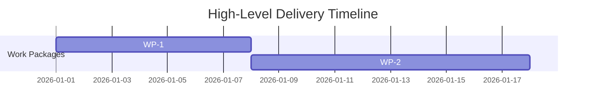

# ADR-0000: Decision Title

## Metadata
- Status: proposed
- Date: YYYY-MM-DD
- Owners:
- Related spec path:

## Business Objective and Requirement Summary
- Business objective:
- Functional requirements summary:
- Non-functional requirements summary:
- Desired timeline:

## Decision Drivers
- Driver 1:
- Driver 2:

## Options Considered
- Option A:
- Option B:

## Recommended Option
- Selected option:
- Rationale:

## Rejected Options
- Rejected option 1:
- Rejection rationale:

## Affected Capabilities and Components
- Capability impact:
- Component impact:

## Architecture Diagram (Mermaid)

## High-Level Work Packages and Timeline (Mermaid Gantt)

## External Dependencies
- Dependency 1:
- Dependency 2:

## Risks and Mitigations
- Risk 1:
- Mitigation 1:

## Validation and Observability Expectations
- Validation requirements:
- Logging/metrics/tracing requirements:
