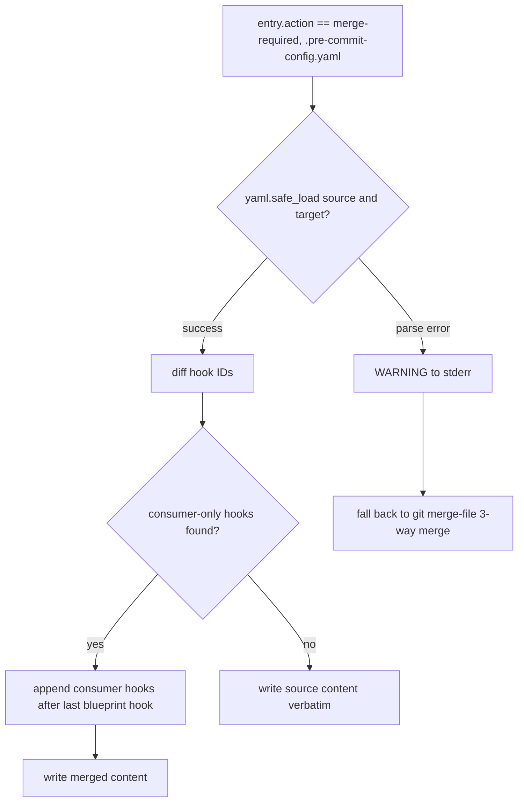

# ADR: YAML-aware hook-preserving merge for `.pre-commit-config.yaml` during blueprint upgrade

- **Status:** proposed
- **Deciders:** bonos
- **Date:** 2026-07-08
- **Issue:** https://github.com/sbonoc/stackit-platform-blueprint/issues/346

## Context and Problem Statement

`make blueprint-upgrade-consumer` silently drops consumer-added pre-commit hooks.

`.pre-commit-config.yaml` is classified as `required-file` in `blueprint/contract.yaml`, so the upgrade engine owns the file. When the consumer has added hooks (e.g. `touchpoints-test-unit-pre-push`, `backend-test-unit-pre-push`) and the blueprint source also changed the file for a new release, the upgrade triage recommends `take_source` for `required-file` ownership. The consumer hooks vanish with no warning.

Concrete incident: `sbonoc/dhe-marketplace` consumer commit `16ac360` added `touchpoints-test-unit-pre-push`. Blueprint upgrade commit `f3661e6` overwrote the file. The Vitest pre-push gate was silently gone; a DSL regression slipped to CI (PR #78).

The 3-way `git merge-file` merge is structurally unaware of YAML hook semantics. When both sides changed, it may produce conflicts that the triage engine resolves by taking the source (blueprint) side, discarding consumer additions.

## Decision

Implement a **YAML-aware hook-id preserving merge** in `upgrade_consumer.py` for `.pre-commit-config.yaml`.

The merge function:
1. Parses both source (blueprint) and target (consumer) files with `yaml.safe_load`.
2. Identifies consumer-only hook entries: hooks whose `id` is present in the target but absent from the source.
3. Appends the consumer-only hook blocks verbatim after the last blueprint hook in the merged output.
4. Falls back to the existing `_three_way_merge` on YAML parse failure, emitting a WARNING.

The function is called by `_apply_entries` before the existing `_three_way_merge` path whenever the path is `.pre-commit-config.yaml`.

## Consequences

**Positive:**
- Consumer hooks survive blueprint upgrades automatically.
- Operator has audit trail via `upgrade_summary.md` listing preserved hook IDs.
- No manual re-addition of hooks after each upgrade (eliminates the workaround).
- Blueprint safety hooks (e.g. `quality-c7-jsonl-validate`, `pnpm-lockfile-sync`) still propagate to consumers as before.

**Negative:**
- YAML round-trip normalises whitespace and discards inline comments within hook blocks. This is acceptable because hook semantics are fully key:value; comments within a hook block have no operational meaning.
- Adds YAML-parsing logic to the upgrade engine; increases surface area. Mitigated by targeted scope (`.pre-commit-config.yaml` only), robust fallback (FR-004), and test coverage (8 ACs with fixtures).

**Neutral:**
- `upgrade_preflight.json` action stays `merge-required` (unchanged from the existing 3-way path).
- `quality-validate-bootstrap-template-drift` is unaffected because it guards the blueprint source repo's internal mirror, not consumer repos.

## Alternatives Considered

- **Option B: `consumer_seeded_paths`** — move `.pre-commit-config.yaml` out of `required_files`. Rejected: new blueprint safety hooks would never reach consumers.
- **Option C: extension block reservation** — reserved `# --- consumer hooks ---` markers. Rejected: requires consumer migration step; doesn't protect existing out-of-block hooks.
