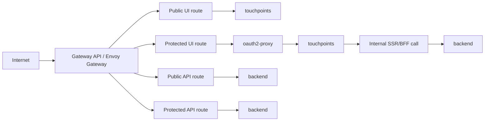

# Endpoint Exposure Model

This guide explains how to expose mixed public and protected UI/API surfaces on top of the shared Gateway API baseline.

## Policy Matrix
| Route class | Example host | Client style | Edge pattern | Current blueprint baseline |
| --- | --- | --- | --- | --- |
| Public touchpoint | `www.<base-domain>` | Browser | Gateway -> touchpoints | Supported as a consumer-owned route attachment |
| Protected touchpoint | `app.<base-domain>` | Browser | Gateway -> `oauth2-proxy` -> touchpoints | Supported via `identity-aware-proxy` |
| Public API | `public-api.<base-domain>` | Browser/app/client | Gateway -> backend | Supported as a consumer-owned route attachment |
| Protected API | `api.<base-domain>` | SPA/direct API client | Gateway -> backend with JWT validation, then backend authz | Supported through consumer-owned `HTTPRoute` + JWT `SecurityPolicy` in app namespaces |
| Internal API | no public host | SSR/BFF only | Internal service-to-service call | Recommended when possible |

## Ownership
- `public-endpoints` owns the shared edge baseline: Envoy Gateway controller install, `GatewayClass`, shared `Gateway`, the `network` namespace used for route attachment, and the dedicated `platform-edge-*` Argo CD project that keeps shared-edge resources isolated from app-route policy resources.
- `identity-aware-proxy` owns interactive browser authentication: `oauth2-proxy`, Keycloak OIDC wiring, and the protected browser `HTTPRoute`.
- Application delivery owns direct public/API route attachments and protected API JWT resources in app namespaces through the main `platform-*` Argo CD project.
- Backend services still own application authorization. Passing edge auth is not enough on its own.

## Recommended Topology

## Working Rules
- Do not force every host through `identity-aware-proxy`. Keep anonymous routes anonymous when that is the intended product behavior.
- Prefer host-based separation over mixing browser-cookie and bearer-token flows on the same public route.
- Keep SSR/BFF backend calls internal when possible instead of exposing an unnecessary public API hop.
- Treat JWT validation for direct API clients as a separate route concern from browser login. The current blueprint baseline establishes the shared gateway, protected browser route, and the Argo CD project boundary that keeps protected API JWT policy in app namespaces.
- Keep shared-edge resources and app-route policy resources separate: `GatewayClass`/`Gateway` stay in the edge project, while protected API `HTTPRoute`/`SecurityPolicy` resources stay in app namespaces. Review [Protected API Routes](protected_api_routes.md) for the concrete pattern.
