# Architecture

## Context
- Work item: 2026-04-24-issue-179-180-181-185-186-187-upgrade-correctness
- Owner: sbonoc
- Date: 2026-04-24

## Stack and Execution Model
- Backend stack profile: python_scripts (CLI scripts; no FastAPI/Pydantic runtime)
- Frontend stack profile: none
- Test automation profile: pytest (`tests/blueprint/` suite)
- Agent execution model: specialized-subagents-isolated-worktrees

## Problem Statement
- What needs to change and why: Five components in the blueprint upgrade tooling contain behavioral correctness bugs that cause: (1) stale conflict counts blocking consumer postchecks after manual resolution, (2) false-positive unresolved-symbol findings on valid shell patterns and missing exclusion tokens, (3) silent omission of uncovered blueprint source files from upgrade plans, (4) a fresh-environment gate that reports CI equivalence without actually comparing file outputs, and (5) generated CI workflows that omit an explicit `permissions:` block, creating potential GITHUB_TOKEN over-privilege.
- Scope boundaries: Corrections to five existing Python/shell files only. No new make targets, no new runtime services, no API or event contract changes, no consumer-facing interface changes.
- Out of scope: Consumer-extensible exclusion set for behavioral check (#184), model-inversion of the upgrade planner (#185 long-term), stale reconcile report detection (#183), prune-glob enforcement (#189).

## Bounded Contexts and Responsibilities

- **Upgrade Reconcile Report** (`scripts/lib/blueprint/upgrade_reconcile_report.py`): owns the authoritative classification of upgrade conflict state. After this fix, it derives conflict status from active working-tree markers rather than plan-entry or apply-result metadata alone.

- **Upgrade Shell Behavioral Check** (`scripts/lib/blueprint/upgrade_shell_behavioral_check.py`): owns post-merge shell correctness validation. After this fix, it correctly skips case-label alternation and array-literal lines, and its exclusion set covers all blueprint-guaranteed runtime functions and common OS tools.

- **Upgrade Consumer Planner** (`scripts/lib/blueprint/upgrade_consumer.py`): owns the upgrade plan computation. After this fix, it audits the full blueprint source tree and surfaces uncovered files rather than silently skipping them.

- **Upgrade Fresh-Env Gate** (`scripts/bin/blueprint/upgrade_fresh_env_gate.sh`): owns CI-equivalence verification for the upgrade flow. After this fix, it compares file-level checksums of upgrade artifacts between the clean worktree and working tree, not just exit codes.

- **CI Workflow Renderer** (`scripts/lib/quality/render_ci_workflow.py`): owns the template for generated consumer `ci.yml` files. After this fix, it emits an explicit `permissions:` block enforcing least-privilege GITHUB_TOKEN posture.

## High-Level Component Design
- Domain layer: upgrade plan data model (plan entries, apply results, conflict resolution state), shell token analysis model (call sites, exclusion sets, array/case context), CI workflow YAML data model.
- Application layer: `build_upgrade_reconcile_report`, `_find_unresolved_call_sites`, `_collect_candidate_paths` + new completeness audit function, fresh-env gate divergence comparison logic, `_render_ci`.
- Infrastructure adapters: working-tree file scanner for active merge markers, checksum computation across two directory roots, source tree walker for uncovered-file detection.
- Presentation/API/workflow boundaries: no new boundaries; existing upgrade flow gate JSON artifact schemas extended with `divergences` and `uncovered_source_files_count` fields.

## Integration and Dependency Edges
- Upstream dependencies: `blueprint/contract.yaml` (provides `required_files`, `init_managed`, `conditional_scaffold_paths`, `blueprint_managed_roots`, `source_only`); existing upgrade artifacts (`artifacts/blueprint/upgrade_plan.json`, `fresh_env_gate.json`, reconcile report JSON).
- Downstream dependencies: `make blueprint-upgrade-consumer-postcheck` (reads reconcile report and behavioral check output); `make blueprint-upgrade-fresh-env-gate` (reads `fresh_env_gate.json`); `make blueprint-upgrade-consumer-validate` (reads plan report JSON for `uncovered_source_files_count`); consumer `ci.yml` (rendered from updated template).
- Data/API/event contracts touched: `fresh_env_gate.json` schema gains `divergences` array; plan report JSON gains `uncovered_source_files_count` field. Both are additive extensions — no breaking changes.

## Non-Functional Architecture Notes
- Security: #187 fix directly reduces GITHUB_TOKEN attack surface in generated workflows. No new secrets or privileged operations introduced in any fix.
- Observability: gate artifacts (`fresh_env_gate.json`, plan report JSON, reconcile report JSON) gain structured fields for divergence counts and uncovered file counts; all gate failures emit human-readable stderr diagnostics.
- Reliability and rollback: all fixes are corrections to deterministic script logic; rollback is `git revert` of the fix commit. No database migrations or runtime state changes.
- Monitoring/alerting: no new dashboards or alerts; the upgrade CI e2e job (introduced in #169) will automatically exercise all corrected gates on each blueprint release.

## Risks and Tradeoffs
- Risk 1: The uncovered-source-files audit in the upgrade planner (FR-009/FR-010/FR-011) may surface previously unknown coverage gaps in the current blueprint source tree and cause the validate gate to fail immediately after the fix ships. Mitigation: run the audit against the current source tree before merging and add any legitimately uncovered files to `required_files` or `source_only` as part of this work item.
- Risk 2: Extending `_EXCLUDED_TOKENS` (#181) may suppress genuine unresolved-symbol findings if a blueprint function name is reused elsewhere. Mitigation: the added tokens are all blueprint-infrastructure names guaranteed to be in scope via the bootstrap chain; any consumer script using the same identifier as a local variable would also be in scope.
- Tradeoff 1: Bundling five independent fixes into one PR increases review surface but avoids five separate branch/PR lifecycle costs. The fixes touch disjoint files and can be reviewed independently within the single PR.

## Architecture Diagram (Mermaid)

```mermaid
flowchart TD
  subgraph "Upgrade Gate Chain (corrected)"
    A[upgrade_consumer.py<br/>planner] -->|plan report JSON<br/>+ uncovered_source_files_count| B[upgrade_consumer_validate<br/>validate gate]
    B -->|gate pass| C[upgrade_consumer apply]
    C -->|apply results| D[upgrade_reconcile_report.py<br/>conflict state = active markers only]
    D -->|reconcile report JSON| E[upgrade_shell_behavioral_check.py<br/>false-positive-free]
    E -->|behavioral_check.json| F[upgrade_consumer_postcheck<br/>postcheck gate]
    C -->|clean worktree run| G[upgrade_fresh_env_gate.sh<br/>file-level divergence check]
    G -->|fresh_env_gate.json<br/>divergences array| F
  end
  subgraph "CI Renderer (corrected)"
    H[render_ci_workflow.py] -->|ci.yml with<br/>permissions: contents: read| I[consumer .github/workflows/ci.yml]
  end
```

