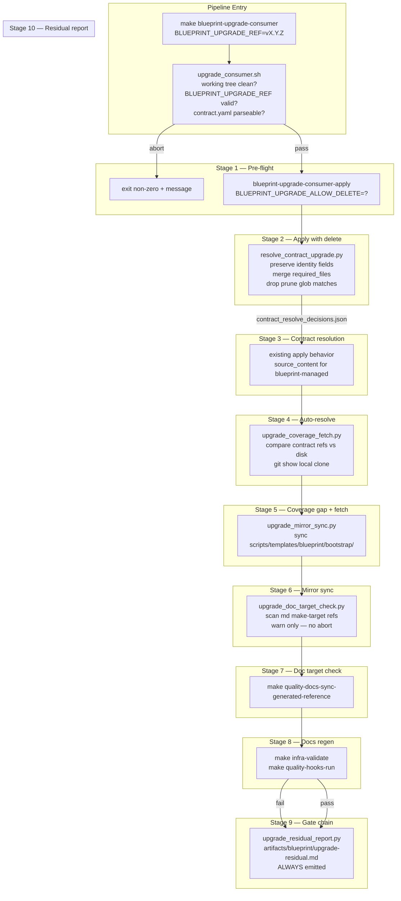

# Architecture

## Context
- Work item: 2026-04-25-scripted-upgrade-pipeline
- Owner: sbonoc
- Date: 2026-04-25

## Stack and Execution Model
- Backend stack profile: python_scripting_plus_bash (Python stdlib + bash; no web framework)
- Frontend stack profile: none
- Test automation profile: pytest (existing `tests/blueprint/` suite; new unit + integration fixtures)
- Agent execution model: specialized-subagents-isolated-worktrees

## Problem Statement
- What needs to change and why: The `blueprint-consumer-upgrade` skill is an AI-agent runbook with ~30 open-interpretation decision points. During a real v1.0.0→v1.6.0 upgrade (sbonoc/dhe-marketplace#40), ten distinct failure modes (F-001–F-010) required unguided agent judgment that must instead be scripted. The upgrade pipeline must be replaced by a single deterministic make target (`make blueprint-upgrade-consumer`) that chains 10 scripted stages and produces a residual report covering only items requiring human decision.
- Scope boundaries: Python orchestrator scripts, a Bash entry wrapper, Makefile target wiring, unit/integration test fixtures, and SKILL.md reduction. All new logic reads consumer configuration at runtime from `blueprint/contract.yaml`; no consumer-specific hardcoding is permitted.
- Out of scope: SDD lifecycle skills (step01–step07); platform CI workflow (`.github/workflows/ci.yml`); consumer application code; incremental tag-to-tag upgrade mode (Issue #168); `BLUEPRINT_UPGRADE_DRY_RUN=true` (Issue #167).

## Bounded Contexts and Responsibilities

### Stage 1 — Pre-flight validation
- Owned by: `scripts/lib/blueprint/upgrade_preflight.py` (logic); called by `scripts/bin/blueprint/upgrade_consumer.sh` (entry wrapper exits non-zero on failure).
- Verifies clean working tree, resolved `BLUEPRINT_UPGRADE_REF`, and parseable `blueprint/contract.yaml` with `repo_mode: generated-consumer`.
- Aborts with non-zero exit and human-readable message on any violation (FR-001–FR-003).
- Design rationale: pre-flight logic is in a Python module (not bash) so FR-001–FR-003 are unit-testable via pytest without a bash test runner.

### Stage 2 — Apply with delete
- Owned by: existing `blueprint-upgrade-consumer-apply` make target (unchanged)
- Invoked by the pipeline entry with `BLUEPRINT_UPGRADE_ALLOW_DELETE` set to the pipeline default (Q-2 pending) or the caller-supplied override.

### Stage 3 — Contract file resolution
- Owned by: `scripts/lib/blueprint/resolve_contract_upgrade.py` (new)
- Implements deterministic merge rules for `blueprint/contract.yaml` conflicts (FR-005–FR-008):
  - Preserves consumer identity fields (`name`, `repo_mode`, `description`).
  - Merges `required_files` additively, dropping consumer-added entries whose files no longer exist.
  - Drops `source_artifact_prune_globs_on_init` entries that match existing consumer paths.
  - Emits `artifacts/blueprint/contract_resolve_decisions.json`.

### Stage 4 — Auto-resolve non-contract conflicts
- Owned by: existing apply-step behavior (takes `source_content` for blueprint-managed files; no new code).

### Stage 5 — Coverage gap detection and file fetch
- Owned by: `scripts/lib/blueprint/upgrade_coverage_fetch.py` (new)
- Compares contract-referenced file lists against disk; fetches absent files from the already-cloned source via local git (no HTTP) (FR-009–FR-010).

### Stage 6 — Bootstrap template mirror sync
- Owned by: `scripts/lib/blueprint/upgrade_mirror_sync.py` (new)
- For every path mutated by Stages 2–5, checks whether `scripts/templates/blueprint/bootstrap/<path>` exists and overwrites the mirror (FR-011).

### Stage 7 — Make target validation for new/changed docs
- Owned by: `scripts/lib/blueprint/upgrade_doc_target_check.py` (new)
- Scans markdown files created/modified by Stages 2–6 for `make <target>` references; verifies each target appears in a `.PHONY` declaration across all `.mk` files; emits structured warnings (FR-012). Does NOT abort the pipeline.

### Stage 8 — Generated reference docs regeneration
- Owned by: `make quality-docs-sync-generated-reference` (existing, invoked once; FR-013).

### Stage 9 — Gate chain
- Owned by: `make infra-validate` → `make quality-hooks-run` in sequence (FR-014).

### Stage 10 — Residual report
- Owned by: `scripts/lib/blueprint/upgrade_residual_report.py` (new)
- Emits `artifacts/blueprint/upgrade-residual.md` always, even on partial failure (FR-015–FR-019).
- Every item includes a prescribed action (no free-form notes).

## High-Level Component Design

### Domain layer
- `resolve_contract_upgrade.py` — pure Python; reads conflict JSON + contract YAML; emits decision JSON + resolved YAML; testable in isolation with fixture conflict inputs.
- `upgrade_coverage_fetch.py` — reads contract YAML; compares against `os.scandir` results; shells out to `git show` against local clone for missing files.
- `upgrade_mirror_sync.py` — reads stage-tracked modified-path list; copies files if mirror path exists.
- `upgrade_doc_target_check.py` — scans markdown AST for fenced code blocks; greps `.mk` files for `.PHONY` declarations.
- `upgrade_residual_report.py` — aggregates JSON reports from Stages 3, 5, 7 + reconcile report consumer-owned list + pyramid gap scan; renders Markdown.

### Application layer
- `scripts/bin/blueprint/upgrade_consumer.sh` (entry wrapper) — orchestrates all 10 stages; emits stage-labeled progress lines (NFR-OBS-001); captures per-stage exit codes; guarantees residual report even on failure.

### Infrastructure adapters
- Existing `blueprint-upgrade-consumer-apply` (Stage 2) — invoked by wrapper with env vars.
- `make quality-docs-sync-generated-reference` (Stage 8) — invoked by wrapper.
- `make infra-validate` and `make quality-hooks-run` (Stage 9) — invoked by wrapper.

### Presentation/API/workflow boundaries
- New `blueprint-upgrade-consumer` Makefile target — sole consumer entry point.
- Existing individual targets remain unchanged and independently callable (FR-019).

## Integration and Dependency Edges
- Upstream dependencies:
  - `blueprint/contract.yaml` — source of consumer identity fields, `required_files`, prune globs, and allowlist paths read at runtime by Stages 1, 3, 5, 6, 7.
  - Upgrade engine conflict JSON (`artifacts/blueprint/upgrade_apply.json`) — consumed by Stage 3 resolver.
  - Local `BLUEPRINT_UPGRADE_SOURCE` git clone — consumed by Stage 5 for file fetch via `git show`.
  - Reconcile report JSON (`artifacts/blueprint/upgrade_reconcile_report.json`) — consumed by Stage 10 for consumer-owned file list.
- Downstream dependencies:
  - `artifacts/blueprint/contract_resolve_decisions.json` — produced by Stage 3; consumed by Stage 10 residual report.
  - `artifacts/blueprint/upgrade-residual.md` — produced by Stage 10; consumed by operator.
  - `scripts/templates/blueprint/bootstrap/` mirrors — updated by Stage 6.
- Data/API/event contracts touched: none (no HTTP API or event bus); new env var `BLUEPRINT_UPGRADE_ALLOW_DELETE` documented in `make help` and `SKILL.md`; new artifact files added (see spec.md § Contract Changes).

## Non-Functional Architecture Notes
- Security: No external HTTP fetches at any stage (NFR-SEC-001). All file retrieval uses `git show` against the already-cloned local `BLUEPRINT_UPGRADE_SOURCE` repository. No secrets or credentials are added.
- Observability: Pipeline emits a structured stage-labeled progress line to stdout before and after each stage (NFR-OBS-001); per-stage JSON artifacts record decision details for programmatic parsing; residual report always produced.
- Reliability and rollback: Pre-flight gate (Stage 1) ensures working tree is clean before any mutation, making git-level rollback (`git checkout .`) always available (NFR-REL-001 — idempotency). Running the pipeline twice on a clean working tree after a successful first run produces no file changes and exits 0.
- Monitoring/alerting: No runtime alerting; gate chain exit codes propagate through make target chain; residual report records final gate status.

## Risks and Tradeoffs
- Risk 1: Contract resolver (Stage 3) must handle all known conflict JSON shapes produced by the upgrade engine. Mitigation: fixture-driven unit tests against representative conflict JSON samples (AC-002).
- Risk 2: File fetch (Stage 5) depends on the already-cloned `BLUEPRINT_UPGRADE_SOURCE` repository being present and at the correct ref. Mitigation: Stage 1 pre-flight validates `BLUEPRINT_UPGRADE_REF` resolves in `BLUEPRINT_UPGRADE_SOURCE` before any mutation begins.
- Tradeoff 1: Making delete the pipeline default (Q-2 Option A, agent recommendation) trades user surprise risk for deterministic outcomes (no orphan files after upgrade). The non-destructive mode remains available via `BLUEPRINT_UPGRADE_ALLOW_DELETE=false` override.
- Tradeoff 2: Stage 7 (make target validation) emits warnings rather than aborting — trading strict gate enforcement for pipeline completion, so operators receive the full residual report rather than a mid-pipeline abort on a docs-only gap.

## Architecture Diagram (Mermaid)

*Caption: Full pipeline control flow from entry make target through 10 scripted stages. Stage 10 is always executed, even when earlier stages fail, so the operator always receives a complete residual report.*
