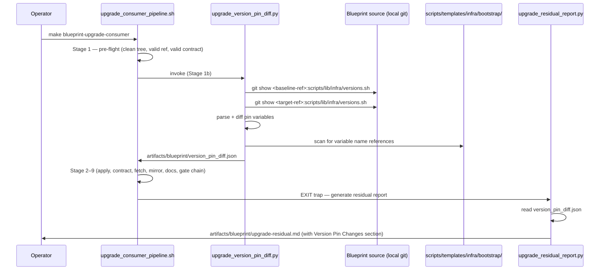
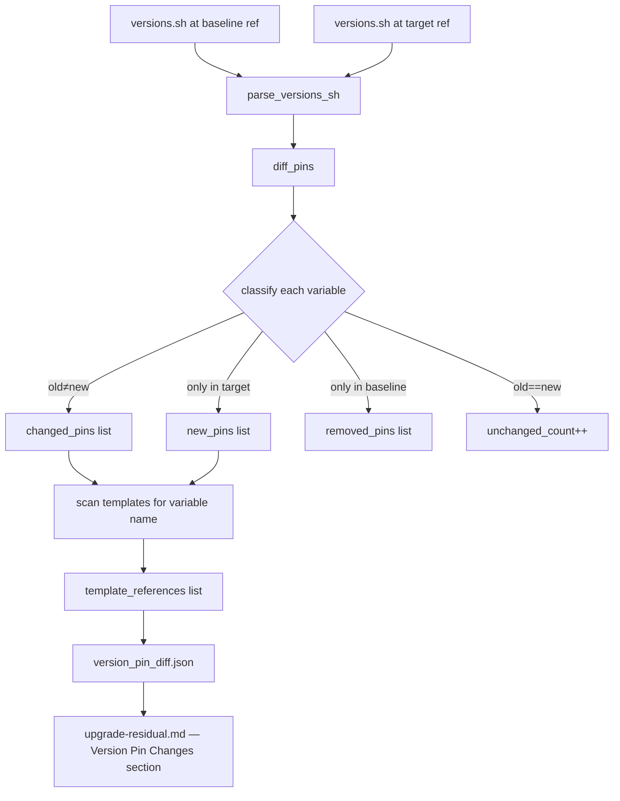

# Architecture

## Context
- Work item: 2026-04-26-issue-164-upgrade-version-pin-report
- Owner: Blueprint maintainer
- Date: 2026-04-26

## Stack and Execution Model
- Backend stack profile: python_scripting_plus_bash (Python stdlib + subprocess)
- Frontend stack profile: none
- Test automation profile: pytest
- Agent execution model: specialized-subagents-isolated-worktrees

## Problem Statement
- What needs to change and why: The 10-stage deterministic upgrade pipeline (`make blueprint-upgrade-consumer`) applies blueprint changes and runs gate checks, but does not surface version pin changes in `scripts/lib/infra/versions.sh` between the baseline and target blueprint tags. Consumers discover version-driven template drift reactively — only after running `make infra-bootstrap` and then `make infra-validate`. A proactive diff, emitted before mutations begin and reported in the residual summary, eliminates this discovery latency.
- Scope boundaries: `scripts/lib/blueprint/upgrade_version_pin_diff.py` (new), `scripts/bin/blueprint/upgrade_consumer_pipeline.sh` (invocation wiring), `scripts/lib/blueprint/upgrade_residual_report.py` (new residual section), `.agents/skills/blueprint-consumer-upgrade/SKILL.md` (operator guidance). All changes are blueprint-managed; no consumer-owned paths are modified.
- Out of scope: Automated template sync, value-based template scanning, version pin sources beyond `versions.sh`.

## Bounded Contexts and Responsibilities
- **Version pin diff context** (`upgrade_version_pin_diff.py`): reads `scripts/lib/infra/versions.sh` from both blueprint refs via local git, parses and classifies all pin variables, scans consumer bootstrap templates for variable references, emits `artifacts/blueprint/version_pin_diff.json`.
- **Pipeline orchestration context** (`upgrade_consumer_pipeline.sh`): invokes the version pin diff script between Stage 1 (pre-flight) and Stage 2 (apply); continues pipeline regardless of outcome.
- **Residual report context** (`upgrade_residual_report.py`): reads `version_pin_diff.json` and emits a new "Version Pin Changes" section alongside the existing sections (consumer-owned files, dropped entries, missing targets, prune-glob violations, test pyramid gaps).
- **Operator guidance context** (`blueprint-consumer-upgrade/SKILL.md`): documents the new residual report section and the expected post-pipeline `infra-bootstrap` sync workflow.

## High-Level Component Design
- Domain layer: Pin variable comparison logic (`PinDiff` dataclass; `parse_versions_sh`, `diff_pins` functions) — pure Python with no I/O.
- Application layer: `upgrade_version_pin_diff.py` orchestrates git reads, invokes domain logic, scans templates, serialises JSON artifact.
- Infrastructure adapters: `subprocess.run(["git", "show", ...])` to read `versions.sh` from refs; `Path.rglob("*")` + `Path.read_text()` to scan `scripts/templates/infra/bootstrap/` in consumer working tree.
- Presentation/workflow boundary: `upgrade_consumer_pipeline.sh` calls the script; `upgrade_residual_report.py` reads the artifact and renders the Markdown section.

## Integration and Dependency Edges
- Upstream dependencies: `BLUEPRINT_UPGRADE_SOURCE` (already-cloned blueprint source path), `BLUEPRINT_UPGRADE_REF` (target tag), `blueprint/contract.yaml` `template_version` field (baseline ref) — all resolved by existing pipeline Stage 1.
- Downstream dependencies: `upgrade_residual_report.py` (Stage 10) reads `artifacts/blueprint/version_pin_diff.json`.
- Data/API/event contracts touched: new JSON artifact schema `version_pin_diff.json`; no existing artifact schemas modified.

## Non-Functional Architecture Notes
- Security: `versions.sh` contains only tool and Helm chart version strings — no secrets exposure risk. Grep over consumer template files is read-only. Artifact is written to the existing `artifacts/blueprint/` directory already gitignored.
- Observability: script logs via the existing pipeline `log_info`/`log_warning`/`log_error` helpers; all errors surfaced in the residual report with a manual fallback command.
- Reliability and rollback: script is non-blocking — any failure is logged and the pipeline continues. The residual report notes the failure and provides a manual `git diff` fallback. Rollback: remove the new invocation line from `upgrade_consumer_pipeline.sh` and the new section from `upgrade_residual_report.py`; no state is modified by this feature.
- Monitoring/alerting: no monitoring integration required — this is a local CLI tool with no persistent runtime components.

## Diagrams

### Pipeline Stage Sequence

*The version pin diff runs after pre-flight and before any file mutations. Its JSON artifact flows into the residual report via the existing EXIT-trap Stage 10 pattern.*

### Data Flow — version_pin_diff.json Schema

*Each changed/new pin is enriched with the list of consumer bootstrap template files that reference the variable name, enabling targeted manual sync guidance.*

## Risks and Tradeoffs
- **Risk 1 — baseline ref not available in cloned source**: If the `blueprint/contract.yaml` `template_version` field is stale or missing, the baseline ref lookup may fail. Mitigation: script exits zero with an `error` field in the JSON; residual report emits the manual fallback `git diff` command.
- **Risk 2 — variable-name grep misses value-based references**: Templates that hardcode version values (e.g., `image: postgres:15.5.38`) are not matched by variable-name grep. Mitigation: explicitly documented exclusion in `spec.md`; value-based matching deferred as a follow-up.
- **Tradeoff — OPTION_A vs OPTION_B**: Running the diff before mutations (OPTION_A) adds a pipeline step but keeps analysis logic separate from the report generator. OPTION_B would be simpler but couples analysis into the report generator and prevents the diff artifact from being referenced by future stages.
