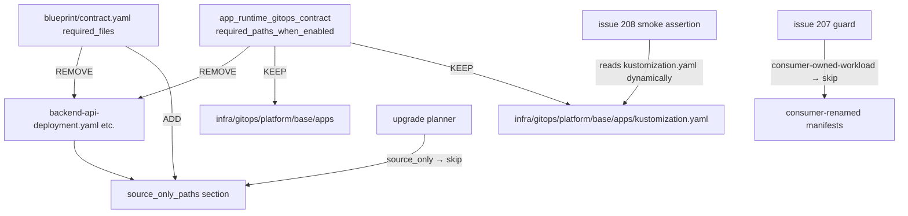

# Architecture

## Context
- Work item: 2026-04-26-issue-206-contract-consumer-owned-workloads
- Owner: bonos
- Date: 2026-04-26

## Stack and Execution Model
- Backend stack profile: python_plus_fastapi_pydantic_v2
- Frontend stack profile: vue_router_pinia_onyx
- Test automation profile: pytest_vitest_playwright_pact
- Agent execution model: specialized-subagents-isolated-worktrees

## Problem Statement
- What needs to change and why: `blueprint/contract.yaml` lists four blueprint-seed workload manifest names (`backend-api-deployment.yaml`, `backend-api-service.yaml`, `touchpoints-web-deployment.yaml`, `touchpoints-web-service.yaml`) in two places: the global `required_files` section and `app_runtime_gitops_contract.required_paths_when_enabled`. Both lists are sync-candidates during `blueprint-upgrade` (the entire `blueprint/contract.yaml` is a `required_file` and gets overwritten). Consumers who rename their workload manifests must re-patch their `blueprint/contract.yaml` after every blueprint upgrade — a recurring manual tax that leaks blueprint implementation details into the consumer's upgrade workflow.
- Scope boundaries: `blueprint/contract.yaml` — specifically the four hardcoded manifest paths in `required_files` and `app_runtime_gitops_contract.required_paths_when_enabled`. The `source_only_paths` mechanism in the same file is the migration target. No changes to the upgrade planner code beyond what was already done in issues #207 and #208.
- Out of scope: General consumer ownership claim mechanism for arbitrary paths (out of scope until a broader contract schema redesign); changes to init-time scaffolding logic beyond what the classification reclassification naturally enables; changes to the upgrade planner algorithm.

## Bounded Contexts and Responsibilities
- Context A — Blueprint template source (`blueprint/contract.yaml` as shipped in the template): owns the contract that defines upgrade planner behavior. The template source's `required_files` is authoritative for template-source CI coverage checks. The template source retains the 4 seed files in the repo (for `blueprint-init-repo`), but their ownership classification changes.
- Context B — Generated-consumer repo (`blueprint/contract.yaml` as synced to consumer): after upgrade, the consumer's contract no longer lists the 4 manifest paths as required. Consumer workload manifests are free to be named anything. The upgrade planner (with issue #207 guard) skips non-kustomization YAML in `base/apps/`.

## High-Level Component Design
- Domain layer: `blueprint/contract.yaml` — the canonical ownership contract. Two lists change:
  1. `required_files`: remove the 4 manifest paths; add them to `source_only_paths` so they remain tracked for template-source CI but are not sync-candidates for generated-consumer repos.
  2. `app_runtime_gitops_contract.required_paths_when_enabled`: remove the 4 manifest paths; keep only `infra/gitops/platform/base/apps` (directory presence) and `infra/gitops/platform/base/apps/kustomization.yaml` (required for smoke assertion to work, per issue #208).
- Application layer: The upgrade planner code is unchanged. The `source_only` classification means the upgrade planner skips the 4 seed files when encountered in the source (they are not synced to consumer repos on upgrade). Issue #207's `_is_consumer_owned_workload()` guard covers consumer-renamed files absent from source.
- Infrastructure adapters: `init_repo_contract.py` reads `required_paths_when_enabled` at init-time. After removing the 4 paths, the init process will no longer assert they exist during `blueprint-init-repo` validation. The seed files are still provided by the template source and copied during init via the bootstrap script's `ensure_infra_template_file` mechanism (not via `required_paths_when_enabled`).
- Presentation/API/workflow boundaries: none changed.

## Integration and Dependency Edges
- Upstream dependencies: `blueprint/contract.yaml` schema — `source_only_paths` field already exists and is used for other paths. No new schema field required.
- Downstream dependencies: upgrade planner (`upgrade_consumer.py`) — the `source_only` classification already implements skip; no code change needed. `init_repo_contract.py` reads `required_paths_when_enabled` — the 4 paths being removed means init no longer checks for them at preflight.
- Data/API/event contracts touched: `blueprint/contract.yaml` YAML structure changes (two list modifications). Generated-consumer repos that sync this file on upgrade will receive the updated contract automatically.

## Non-Functional Architecture Notes
- Security: No credential handling. No filesystem write side-effects beyond the contract YAML modification.
- Observability: Consumers running `blueprint-upgrade` will see plan output showing the 4 manifest paths classified as `source-only / skip` (instead of potential create/update actions). This is a visible and expected behavioral change.
- Reliability and rollback: The change is to a config file, not code. Rolling back means reverting the two list modifications in `blueprint/contract.yaml`. Consumer repos that already upgraded will have the updated contract — they can also revert by re-adding the 4 paths manually.
- Monitoring/alerting: No metrics changed.

## Risks and Tradeoffs
- Risk 1: Consumers who relied on the upgrade planner to re-create the 4 seed manifest files (e.g., after accidentally deleting them) will no longer get auto-recovery. Mitigation: the init process still provides these files; consumers can recover by running `make blueprint-init-repo` in a safe mode or manually re-creating them.
- Tradeoff 1: Moving the 4 paths to `source_only_paths` means they are permanently excluded from upgrade sync. If blueprint makes meaningful changes to the seed manifest content in a future release, consumers will not receive those changes automatically. This is the intentional tradeoff: consumer workload manifests are domain-owned; blueprint only seeds them on init.
